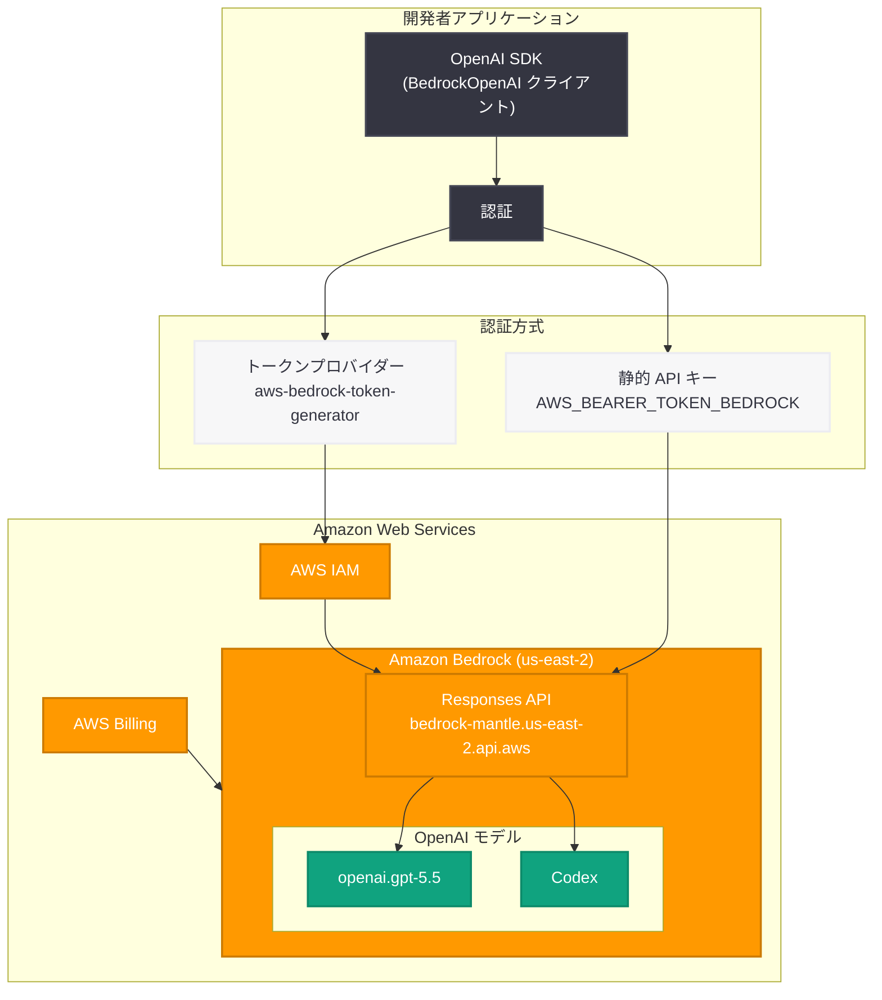

# OpenAI フロンティアモデルと Codex が Amazon Bedrock で利用可能に

## メタデータ

| 項目 | 内容 |
|------|------|
| 発表日 | 2026-06-01 (Changelog) / 2026-06-02 (Blog) |
| ソース | OpenAI API Changelog / OpenAI News |
| カテゴリ | API 更新 / クラウドパートナーシップ |
| 公式リンク | [openai.com/index/openai-frontier-models-and-codex-are-now-available-on-aws](https://openai.com/index/openai-frontier-models-and-codex-are-now-available-on-aws/) / [Amazon Bedrock ガイド](https://developers.openai.com/api/docs/guides/amazon-bedrock) |

## 概要

2026 年 6 月 1 日、OpenAI は API Changelog にて、フロンティアモデル (GPT-5.5 を含む) および Codex が Amazon Bedrock 上で正式に利用可能になったことを発表した。翌 6 月 2 日にはブログ記事で詳細が公開されている。

本発表は、OpenAI のマルチクラウド戦略における重要な進展であり、AWS ネイティブの課金体系、IAM によるアクセス制御、リージョンコンプライアンスといった AWS エコシステムの利点を活かしながら、OpenAI の最先端モデルを利用できることを意味する。開発者は新たに提供される `BedrockOpenAI` クライアントを使用し、Responses API 経由で `openai.gpt-5.5` モデルにアクセスできる。

## 主な内容

### 利用可能なモデル

Amazon Bedrock で提供される OpenAI モデルには `openai.` プレフィックスが付与される。

| モデル ID | 説明 |
|-----------|------|
| `openai.gpt-5.5` | OpenAI 最新フラッグシップモデル |
| GPT-5.4 (Changelog にて言及) | 高性能推論モデル |

### API エンドポイント

Bedrock 経由での OpenAI モデルへのアクセスには、専用の Responses API エンドポイントが使用される。

```
https://bedrock-mantle.{region}.api.aws/openai/v1/responses
```

初期リリース時点では `us-east-2` リージョンで利用可能である。

### 認証方式

Bedrock 統合では 2 つの認証方式がサポートされている。

1. **静的 API キー方式:** 環境変数 `AWS_BEARER_TOKEN_BEDROCK` に API キーを設定
2. **リフレッシュ可能なトークンプロバイダー方式:** AWS 認証情報チェーンを利用した動的トークン取得

### サポートされる機能

| サポート対象 | 未サポート (初期リリース時点) |
|-------------|--------------------------|
| テキスト生成 | 音声入力 |
| 画像入力 | WebSocket 接続 |
| ファイル入力 | ホスト型 Web 検索 |
| 構造化出力 (Structured Outputs) | ホスト型ファイル検索 |
| 関数呼び出し (Function Calling) | Computer Use |
| ストリーミング | Shell ツール |
| 推論努力度の指定 (Reasoning Effort) | 画像生成ツール |
| プロンプトキャッシング | リモート MCP サーバー |
| カスタムツール | サービスティア (オンデマンドのみ) |
| クライアントサイド tool_search | |

## 技術的な詳細

### 必要なパッケージ

#### Python

```bash
pip install aws-bedrock-token-generator
```

#### JavaScript / TypeScript

```bash
npm install @aws/bedrock-token-generator
```

### コードサンプル: Python 基本的な使用方法

```python
from openai import BedrockOpenAI

client = BedrockOpenAI(aws_region="us-east-2")

response = client.responses.create(
    model="openai.gpt-5.5",
    input="Write a haiku about cloud infrastructure.",
)

print(response.output_text)
```

### コードサンプル: Python トークンプロバイダー方式

```python
from aws_bedrock_token_generator import provide_token
from openai import BedrockOpenAI

client = BedrockOpenAI(
    aws_region="us-east-2",
    bedrock_token_provider=provide_token,
)

response = client.responses.create(
    model="openai.gpt-5.5",
    input="Explain the benefits of serverless architecture.",
)

print(response.output_text)
```

### コードサンプル: JavaScript / TypeScript

```javascript
import { BedrockOpenAI } from "openai";

const client = new BedrockOpenAI({ awsRegion: "us-east-2" });

const response = await client.responses.create({
    model: "openai.gpt-5.5",
    input: "Write a haiku about cloud infrastructure.",
});

console.log(response.output_text);
```

### 直接 API との使い分け

| 観点 | Amazon Bedrock 経由 | OpenAI 直接 API |
|------|-------------------|----------------|
| 課金 | AWS 一括請求 (リージョナルプレミアムあり) | OpenAI 直接課金 |
| アクセス制御 | AWS IAM ネイティブ | OpenAI API キー |
| コンプライアンス | AWS リージョン準拠 | OpenAI リージョン |
| 機能カバレッジ | 主要機能 (一部制限あり) | 全機能利用可能 |
| 最新機能 | 順次追加 | 即時利用可能 |

## アーキテクチャ



## 開発者への影響

### AWS ネイティブ環境での OpenAI モデル利用

AWS を主要クラウドとして利用する開発者にとって、本統合は以下の利点を提供する。

- **統一課金:** AWS の既存請求体系に OpenAI モデル利用料が統合され、経理処理が簡素化される
- **IAM ベースのアクセス制御:** AWS IAM ポリシーによる細粒度のアクセス制御が可能となり、チームやサービスごとのモデル利用権限を既存の仕組みで管理できる
- **リージョンコンプライアンス:** データが特定の AWS リージョン内で処理されるため、データレジデンシー要件を満たしやすくなる

### SDK の変更点

既存の OpenAI SDK ユーザーは、クライアントの初期化部分のみを変更すれば Bedrock 経由に切り替えられる。

- **Python:** `OpenAI()` を `BedrockOpenAI(aws_region="us-east-2")` に置き換え
- **JavaScript:** `new OpenAI()` を `new BedrockOpenAI({ awsRegion: "us-east-2" })` に置き換え

API のインターフェース (Responses API) は共通であるため、ビジネスロジックの変更は不要である。

### 制限事項への留意

初期リリースでは一部の高度な機能 (Computer Use、Shell ツール、リモート MCP サーバーなど) が未サポートであるため、これらの機能を必要とするユースケースでは引き続き OpenAI 直接 API を使用する必要がある。機能は今後順次追加される見込みである。

### 料金に関する注意事項

AWS Bedrock 経由の利用料金は OpenAI 直接 API とは異なる場合があり、リージョナルプレミアムが適用される可能性がある。本番環境への導入前に AWS の料金体系を確認することが推奨される。

## 関連リンク

- [OpenAI フロンティアモデルと Codex が AWS で利用可能に (公式ブログ)](https://openai.com/index/openai-frontier-models-and-codex-are-now-available-on-aws/)
- [Amazon Bedrock 統合ガイド (開発者ドキュメント)](https://developers.openai.com/api/docs/guides/amazon-bedrock)
- [OpenAI API Changelog](https://platform.openai.com/docs/changelog)
- [Amazon Bedrock 公式ドキュメント](https://docs.aws.amazon.com/bedrock/)

### 関連レポート

- [OpenAI が Amazon Bedrock 向けステートフルランタイム環境を発表](2026-05-19-openai-stateful-runtime-agents-bedrock.md) -- Bedrock 上でのエージェント実行環境
- [OpenAI GPT-5.5 と Codex が Databricks 上で利用可能に](2026-05-01-gpt-5-5-codex-on-databricks.md) -- Databricks プラットフォームでの統合
- [GPT-5.5 と Codex on Databricks (エンタープライズ)](2026-05-15-databricks-gpt-5-5-enterprise.md) -- Databricks エンタープライズ統合

## まとめ

OpenAI フロンティアモデル (GPT-5.5) と Codex の Amazon Bedrock 対応は、OpenAI のマルチクラウド戦略における大きな前進である。`BedrockOpenAI` クライアントと Responses API による統合は、既存の OpenAI SDK のインターフェースを維持しつつ、AWS ネイティブの認証・課金・コンプライアンス機能を活用できる設計となっている。

初期リリースではテキスト生成、画像入力、構造化出力、関数呼び出し、ストリーミング、プロンプトキャッシングなど主要機能がサポートされており、多くのユースケースで直接 API の代替として利用可能である。一方で、Computer Use やリモート MCP サーバーなどの高度な機能は今後の追加を待つ必要がある。

AWS を主要インフラとして利用する企業にとって、本統合は OpenAI モデルの導入障壁を大幅に下げるものであり、既存の AWS ガバナンスフレームワーク内で最先端の AI 機能を活用できる道を開くものである。
