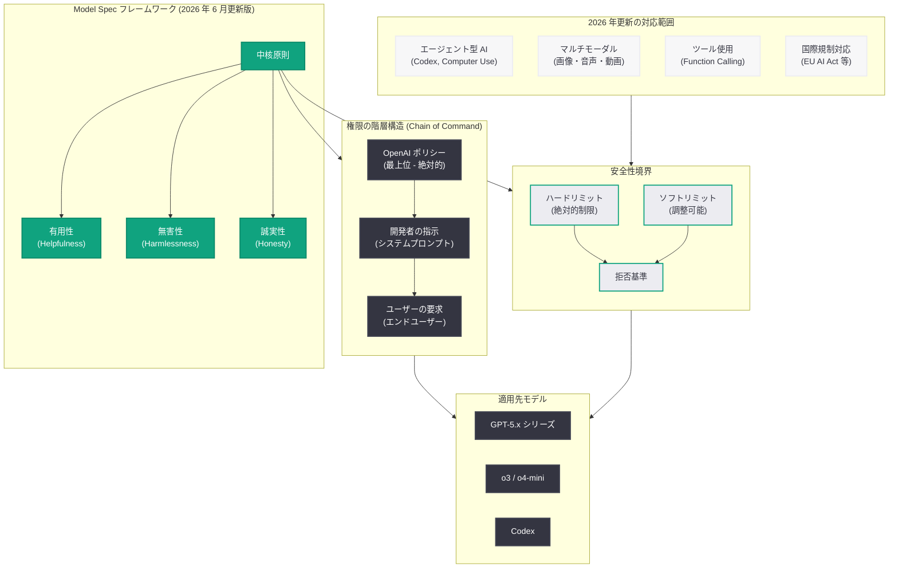

# 最新 Model Spec の公開: AI モデルの行動規範フレームワークを更新

## メタデータ

| 項目 | 内容 |
|------|------|
| 発表日 | 2026-06-01 |
| ソース | OpenAI News (Safety) |
| カテゴリ | 安全性 / モデル仕様 |
| 公式リンク | [openai.com/index/sharing-the-latest-model-spec](https://openai.com/index/sharing-the-latest-model-spec/) |

> **注:** 本レポートは OpenAI サイトマップ情報 (公開日: 2026-06-01T16:32:44.148Z、カテゴリ: Safety)、URL スラッグ、および OpenAI Model Spec に関する過去の公開情報に基づいて作成しています。記事本文へのアクセスは Cloudflare の保護により制限されたため、最新の Model Spec の正確な内容については公式リンクを参照してください。

## 概要

OpenAI は 2026 年 6 月 1 日、AI モデルの行動規範を定義する公開フレームワーク「Model Spec」の最新版を公開した。Model Spec は、OpenAI が開発するすべての AI モデルがどのように振る舞うべきかを規定する包括的なドキュメントであり、有用性 (Helpfulness)、無害性 (Harmlessness)、誠実性 (Honesty) を中核原則として、モデルの応答基準、安全性境界、権限の階層構造を体系的に定めたものである。

今回の更新は、2024 年初頭に初版が公開されて以降、GPT-5.x シリーズの登場、エージェント型 AI システム (Codex、Computer Use) の実用化、EU AI Act をはじめとする国際規制の進展などの環境変化を反映した大規模な改訂と位置付けられる。同時期に発表された「Trustworthy Third-Party Evaluations」(5 月 29 日) および「Frontier Governance Framework」(5 月 28 日) と合わせて、OpenAI の 2026 年中期における包括的な安全性・ガバナンス方針の刷新を構成している。

## 主な内容

### Model Spec の基本構造

Model Spec は、AI モデルの行動を規定する以下の要素で構成されている。

- **中核原則 (Core Principles):** 有用性、無害性、誠実性の 3 つの基本原則
- **ルールとデフォルト (Rules and Defaults):** モデル出力に適用される具体的な行動規則と初期設定
- **権限の階層構造 (Chain of Command):** OpenAI、開発者、ユーザーの 3 層による優先順位の定義
- **安全性境界 (Safety Boundaries):** モデルが絶対に超えてはならないハードリミットの設定
- **拒否基準 (Refusal Criteria):** モデルが要求を拒否すべき状況とその判断基準

### 今回の更新で想定される主要な変更点

#### 1. エージェント型 AI システムへの対応

2025 年後半から 2026 年にかけて、Codex や Computer Use などのエージェント型 AI システムが実用段階に入った。これらのシステムは従来のチャット型 AI と異なり、自律的にコードを実行し、外部システムと連携し、複数ステップのタスクを遂行する。最新の Model Spec では、エージェント型 AI の行動原則として以下が規定されていると考えられる。

- 自律的な行動における安全性の確保
- ユーザーの明示的な承認なしに不可逆な操作を行わないこと
- 実行環境に対する最小権限の原則の適用
- エラー発生時の安全な停止と報告

#### 2. GPT-5.x シリーズの能力に対応した安全性境界の改訂

GPT-5.x シリーズの高度な推論能力と知識を踏まえ、安全性境界が再定義されている可能性がある。

- 高度な科学技術知識の提供範囲の再設定
- 推論チェーンの透明性に関する新たな基準
- マルチステップ推論における安全性チェックポイント

#### 3. 開発者・ユーザー権限フレームワークの明確化

API を通じたモデルの利用が多様化する中、開発者とユーザーの権限分界がより詳細に規定されていると想定される。

- 開発者がカスタマイズ可能な行動パラメータの範囲
- ユーザーの自律性を尊重しつつ安全性を確保する条件
- システムプロンプトによる行動制御の許容範囲と限界

#### 4. マルチモーダル入出力への対応

画像、音声、動画などの複数のモダリティに対応するモデルの行動規範が追加されていると考えられる。

- 画像生成における安全性基準
- 音声入出力の適切な利用範囲
- モダリティ間での安全性基準の一貫性

#### 5. ツール使用・関数呼び出しに関する新ガイダンス

Function Calling やツール統合が標準的な機能となった現在、これらの機能に関する行動規範が拡充されていると想定される。

- 外部 API 呼び出しにおけるデータプライバシーの保護
- ツール使用時の副作用に関する事前通知
- 連鎖的なツール呼び出しにおけるリスク管理

#### 6. 国際規制への対応

EU AI Act をはじめとする各国の AI 規制に対応した記述が追加されている可能性がある。

- リスク分類に基づく行動基準の差異化
- 透明性要件への対応
- 記録保持と監査可能性の確保

## 技術的な詳細

### Model Spec のアーキテクチャ概念図

### Model Spec の適用プロセス

Model Spec は以下のプロセスを通じて AI モデルに適用される。

1. **トレーニング段階:** RLHF (人間のフィードバックによる強化学習) および Constitutional AI の手法を用いて、Model Spec の原則をモデルの重みに反映
2. **推論時の制御:** システムプロンプトおよび安全フィルターを通じて、Model Spec の基準に基づいた出力制御を実施
3. **継続的な評価:** Red Teaming やベンチマークテストにより、Model Spec への準拠度を定期的に測定
4. **フィードバックによる改善:** 外部の研究者、開発者、ユーザーからのフィードバックを収集し、Model Spec 自体を反復的に改善

### 関連する安全性フレームワークとの連携

今回の Model Spec 更新は、OpenAI の安全性戦略全体の中で以下のように位置付けられる。

| フレームワーク | 発表日 | 役割 |
|---------------|--------|------|
| Frontier Governance Framework | 2026-05-28 | フロンティアモデルのガバナンス方針 |
| Trustworthy Third-Party Evaluations | 2026-05-29 | 第三者による信頼性評価の枠組み |
| **Model Spec (最新版)** | **2026-06-01** | **モデルの行動規範の定義** |

この 3 つのドキュメントは相互に補完する関係にあり、Frontier Governance Framework が組織レベルのガバナンスを、Trustworthy Third-Party Evaluations が外部検証の仕組みを、そして Model Spec がモデルレベルの行動基準をそれぞれ定義している。

## 開発者への影響

最新の Model Spec の公開は、OpenAI の API を利用する開発者に以下の影響をもたらす。

- **エージェント型アプリケーション開発の指針:** Codex や Assistants API を用いたエージェント型アプリケーションの設計において、モデルの自律的行動の範囲と制限が明確化され、より予測可能な開発が可能になる
- **マルチモーダル機能の活用範囲の明確化:** 画像生成、音声処理、動画分析などのマルチモーダル機能を利用する際の安全性基準が明示され、開発者はユースケースに応じた適切な実装判断が可能になる
- **ツール統合における安全設計の参考:** Function Calling やプラグイン連携を実装する際の安全設計について、Model Spec が参考フレームワークとなる
- **コンプライアンス対応の強化:** EU AI Act などの国際規制への対応が Model Spec に反映されていることで、開発者は規制要件への準拠を確認しやすくなる
- **カスタマイズの境界の再認識:** 開発者がシステムプロンプトやパラメータを通じて許容されるカスタマイズの範囲が、新たな機能や規制に応じて更新されている可能性がある

## 関連リンク

- [Sharing the Latest Model Spec - OpenAI](https://openai.com/index/sharing-the-latest-model-spec/)
- [OpenAI Model Spec (公式ドキュメント)](https://model-spec.openai.com/)
- [OpenAI Safety](https://openai.com/safety)
- [Frontier Governance Framework - OpenAI](https://openai.com/index/openai-frontier-governance-framework/)
- [Trustworthy Third-Party Evaluations - OpenAI](https://openai.com/index/trustworthy-third-party-evaluations-foundations/)
- [OpenAI Platform ドキュメント](https://platform.openai.com/docs)

## まとめ

OpenAI は 2026 年 6 月 1 日、AI モデルの行動規範を定義するフレームワーク「Model Spec」の最新版を公開した。この更新は、エージェント型 AI システムの実用化、GPT-5.x シリーズの高度な能力、マルチモーダル対応の拡充、国際規制の進展といった 2024 年の初版公開以降の大きな環境変化を反映したものである。Model Spec は有用性、無害性、誠実性を中核原則とし、OpenAI、開発者、ユーザーの 3 層の権限階層を通じて安全性とユーザーの自律性のバランスを取る設計となっている。同時期に発表された Frontier Governance Framework および Trustworthy Third-Party Evaluations と合わせて、OpenAI の包括的な安全性・ガバナンス戦略の基盤を形成しており、開発者にとってはエージェント型アプリケーション設計、マルチモーダル機能活用、国際規制対応における重要な参照ドキュメントとなる。
