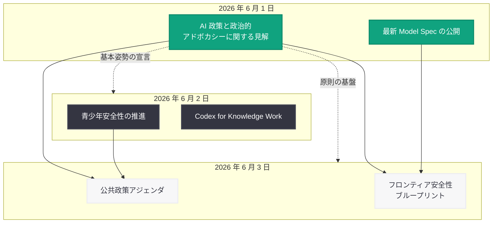

# OpenAI、AI 政策と政治的アドボカシーに関する見解を公開 -- 外部の政治団体からの独立性と透明性を明確化

## メタデータ

| 項目 | 内容 |
|------|------|
| 発表日 | 2026-06-01 |
| ソース | OpenAI News/Blog |
| カテゴリ | ガバナンス (Global Affairs) |
| 公式リンク | [openai.com/index/our-views-on-ai-policy-and-political-advocacy](https://openai.com/index/our-views-on-ai-policy-and-political-advocacy) |

> **注:** 本レポートは OpenAI の公開情報、同日以降に発表された一連の政策関連文書、および公式リンクの記事概要に基づいて作成しています。記事本文への直接アクセスは制限されたため、詳細については公式リンクを参照してください。

## 概要

OpenAI は 2026 年 6 月 1 日、AI 政策と政治的アドボカシーに関する同社の見解を表明する声明を公開した。本声明は、OpenAI が AI 政策に対してどのようなアプローチを取るか、透明性の確保、思慮深い規制と AI 安全性への支持、そして外部の政治団体が同社を代弁することはないという立場を明確にしたものである。

本声明は、同日公開された Model Spec の更新、翌 6 月 2 日の青少年安全性に関する発表と Codex for Knowledge Work の公開、6 月 3 日の公共政策アジェンダとフロンティア安全性ブループリントに先立つ、OpenAI の 2026 年 6 月政策提言シリーズの冒頭に位置付けられる宣言である。AI 開発企業として急速に影響力を拡大する中、政策活動における独立性と原則を対外的に宣言する意図が読み取れる。

## 主な内容

### AI 政策へのアプローチ

OpenAI は AI 政策への関与において、以下の基本姿勢を示している。

**基本原則:**

- **エビデンスベースの政策提言:** 技術的知見と実証的データに基づいた政策提言を行う
- **建設的な対話の重視:** 政府、規制当局、市民社会、学術界との建設的な対話を通じて政策形成に貢献する
- **イノベーションと安全性の両立:** AI のイノベーションを促進しつつ、社会全体の安全性を確保するバランスの取れた政策を支持する
- **グローバルな視点:** 一国の政策にとどまらず、国際的に整合性のある AI ガバナンスの構築を目指す

OpenAI は、AI 技術の開発者として政策議論に参加する責任があると認識しており、その関与は技術的専門性に基づくものであって、特定の政治的立場に基づくものではないことを強調している。

### 政治的アドボカシーの原則

OpenAI は政治的アドボカシーに関して、明確な原則を掲げている。

| 原則 | 内容 |
|------|------|
| 非党派性 | 特定の政党や政治勢力に偏らない立場を維持 |
| 課題中心 | 党派的議論ではなく、AI の安全性とイノベーションという課題に焦点 |
| 独立性 | 外部の政治団体やロビイストが OpenAI を代弁することはない |
| 自社発信 | 政策に関する見解は OpenAI 自身が直接発信する |
| 社員の自由 | 社員個人の政治的見解や活動は尊重するが、会社としての立場とは区別 |

**政治献金・PAC に関する立場:**

OpenAI は企業として特定の候補者や政治キャンペーンへの資金提供を行わない姿勢を示しているものと考えられる。これは、AI 政策の議論が党派性に取り込まれることを回避し、技術的・社会的な課題として議論されるべきであるという同社の基本認識に基づいている。

### 透明性への取り組み

OpenAI は政策活動における透明性について、以下の取り組みを明示している。

**透明性確保の具体的方策:**

- **政策見解の公開:** AI 政策に関する OpenAI の立場を公式ブログや文書を通じて公開する
- **ロビイング活動の開示:** 政府機関との接触やロビイング活動について、法的要件に準拠した開示を行う
- **政策提言の根拠の明示:** 政策提言を行う際は、その根拠となるデータや技術的知見を可能な限り公開する
- **ステークホルダーとの対話:** 政策形成プロセスにおいて、多様なステークホルダーとの対話を通じた合意形成を重視する
- **定期的な情報発信:** 政策活動の状況について、定期的に公式チャネルを通じて情報を発信する

この透明性への取り組みは、AI 企業の政策活動に対する社会的関心の高まりと、テック企業による政治的影響力の行使に対する批判的な視線を意識したものと考えられる。

### 規制に対する支持

OpenAI は「思慮深い規制」(thoughtful regulation) を支持する立場を明確にしている。

**支持する規制の方向性:**

- **リスクベースのアプローチ:** AI システムの能力とリスクレベルに応じた段階的な規制を支持
- **安全性評価の制度化:** フロンティアモデルの展開前における安全性評価の標準化と義務化
- **連邦レベルの統一基準:** 州ごとの規制のパッチワークではなく、統一的な連邦基準の策定を提案
- **国際的な相互運用性:** 各国の規制枠組みが相互に認識可能で、企業活動を過度に阻害しない設計
- **イノベーション促進型規制:** 安全性を確保しつつも、過度にイノベーションを制約しない規制設計

**支持しない規制の方向性:**

- 技術の仕組みを理解しないまま包括的に禁止するアプローチ
- 大企業のみが遵守可能な過度に高コストな規制
- AI 研究の公開や学術的自由を制限する規制
- 国際的な整合性を無視した孤立的な規制

### 外部政治団体からの独立性

本声明の核心的なメッセージの一つとして、OpenAI は外部の政治団体が同社を代弁することはないと明確に宣言している。

**独立性の具体的内容:**

- **代弁の否定:** いかなる外部の政治団体、業界団体、ロビイング組織も、OpenAI の見解を代弁する権限を持たない
- **自社による発信:** AI 政策に関する OpenAI の公式見解は、OpenAI 自身の公式チャネルを通じてのみ発信される
- **連合活動の透明性:** 業界連合や共同提言に参加する場合は、OpenAI の参加と立場を明確に公開する
- **個人と企業の区別:** OpenAI の役員や社員が個人の立場で行う政治的発言は、会社の公式見解とは区別される

この宣言の背景には、AI 業界における政治的影響力の急速な拡大と、様々な利害関係者が AI 企業の名前を借りて政策議論を行おうとする動きへの牽制がある。OpenAI は自社のブランドと立場が政治的に利用されることを防ぎ、政策に関する発信は自社で直接管理する姿勢を示している。

## 2026 年 6 月の政策提言シリーズにおける位置付け

### 時系列と相互関係

本声明は、OpenAI が 6 月初旬に集中的に展開した政策提言シリーズの「序章」として機能している。具体的な政策提言 (公共政策アジェンダ、フロンティア安全性ブループリント) に先立ち、まず OpenAI が政策活動においてどのような姿勢で臨むかという「前提条件」を明確にした形である。

| 日付 | 文書 | 役割 |
|------|------|------|
| 6 月 1 日 | **AI 政策と政治的アドボカシーに関する見解** | **政策活動の姿勢・原則を宣言** |
| 6 月 1 日 | 最新 Model Spec | モデルの行動規範を技術的に更新 |
| 6 月 2 日 | 青少年安全性の推進 | 具体的な安全施策の発表 |
| 6 月 2 日 | Codex for Knowledge Work | 製品・技術面のアップデート |
| 6 月 3 日 | 公共政策アジェンダ | 包括的な政策提言 (4 本柱) |
| 6 月 3 日 | フロンティア安全性ブループリント | 連邦レベルの制度設計提案 |

この構成は、原則の宣言 → 技術的基盤の更新 → 具体的施策の提示 → 包括的提言という論理的な階層構造を形成しており、OpenAI の政策コミュニケーション戦略の緻密さを示している。

## 業界への影響

### AI 企業の政策活動に対する新たな基準

OpenAI の本声明は、AI 業界における政策活動のあり方に以下の影響を与える可能性がある。

- **透明性基準の引き上げ:** OpenAI が政策活動の透明性を公にコミットしたことで、他の AI 企業にも同様の情報開示が期待される圧力が生まれる
- **非党派性の規範形成:** AI 政策を党派的議論から切り離す方向性が業界の規範として確立される可能性がある
- **独立性宣言の連鎖:** 他の AI 企業も同様に外部団体からの独立性を宣言する動きが広がる可能性がある
- **自社発信の重要性:** 政策見解の第三者経由での発信ではなく、企業自身による直接的なコミュニケーションが業界標準となる傾向

### 政策議論への影響

- **企業の声の正当化:** AI 企業が政策議論に参加すること自体の正当性を、透明性と独立性の確保を条件として主張する論理を提示
- **ロビイング批判への予防線:** テック企業のロビイング活動に対する社会的批判に対し、透明性と原則を明示することで先手を打つ効果
- **規制議論の枠組み設定:** 「思慮深い規制」の支持を表明することで、全面的な規制反対ではなく建設的な規制議論への参加者としてのポジショニングを確立

### 他のステークホルダーへの示唆

| ステークホルダー | 影響 |
|----------------|------|
| 競合 AI 企業 | 自社の政策活動方針の公開が暗に求められる |
| 政府・規制当局 | OpenAI との直接対話チャネルが明確化される |
| 市民社会団体 | AI 企業の政策活動を監視する際の基準が提供される |
| 投資家 | 政治リスクの低減と企業の独立性確保が確認される |
| メディア | OpenAI の政策見解の帰属先が明確化される |

## 関連リンク

- [Our Views on AI Policy and Political Advocacy (公式)](https://openai.com/index/our-views-on-ai-policy-and-political-advocacy)
- [Sharing the Latest Model Spec (2026-06-01)](https://openai.com/index/sharing-the-latest-model-spec/)
- [Advancing Youth Safety (2026-06-02)](https://openai.com/index/advancing-youth-safety)
- [Codex for Knowledge Work (2026-06-02)](https://openai.com/index/codex-for-knowledge-work)
- [Public Policy Agenda (2026-06-03)](https://openai.com/index/public-policy-agenda)
- [A Blueprint for Democratic Governance of Frontier AI (2026-06-03)](https://openai.com/index/frontier-safety-blueprint)
- [OpenAI News](https://openai.com/news)

## まとめ

OpenAI は 2026 年 6 月 1 日に公開した本声明において、AI 政策と政治的アドボカシーに関する基本原則を明確に宣言した。核心的なメッセージは 4 点に集約される。第一に、OpenAI は AI 政策にエビデンスベースで非党派的に関与する。第二に、政策活動における透明性を確保し、見解の根拠を公開する。第三に、思慮深い規制と AI 安全性を支持し、イノベーションとのバランスを追求する。第四に、外部のいかなる政治団体も OpenAI を代弁する権限を持たず、公式見解は自社の公式チャネルを通じてのみ発信される。

本声明は、6 月 1 日から 3 日にかけて展開された OpenAI の包括的政策提言シリーズの冒頭に位置し、後続の Model Spec 更新、青少年安全性施策、公共政策アジェンダ、フロンティア安全性ブループリントの基盤となる「原則宣言」として機能している。AI 企業の社会的影響力が増大する中、政策活動における独立性と透明性を対外的に宣言したことは、業界全体のガバナンス基準の形成に寄与する可能性がある。
