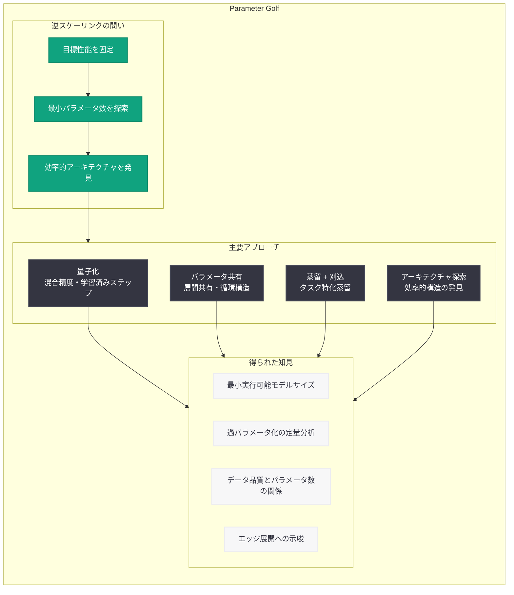

# Parameter Golf が教えてくれたこと

> **注:** 本レポートは OpenAI サイトマップ情報 (公開日: 2026-06-01T16:30:42.672Z、カテゴリ: Research)、URL スラッグに基づいて作成しています。記事本文へのアクセスは Cloudflare の保護により制限されたため、研究の正確な詳細については公式リンクを参照してください。

## メタデータ

| 項目 | 内容 |
|------|------|
| 発表日 | 2026-06-01 |
| ソース | OpenAI Research |
| カテゴリ | 研究成果 / モデル効率化 |
| 公式リンク | https://openai.com/index/what-parameter-golf-taught-us/ |

## 概要

OpenAI は「Parameter Golf」と題した研究成果を公開した。Parameter Golf とは、ニューラルネットワークにおける「コードゴルフ」の概念を応用した最適化チャレンジであり、目標性能を可能な限り少ないパラメータ数で達成することを競う取り組みである。従来のスケーリング則 (パラメータを増やせば性能が向上する) の逆方向からのアプローチとして、「最小限のパラメータで何が達成できるか」という問いに挑む研究である。

この研究は、モデル圧縮、効率化、およびニューラルネットワークのスケーリングに関する理解を深めるものであり、エッジデバイスへの展開やモデル蒸留の技術的基盤を提供する。1,000 人以上の参加者と 2,000 件以上の提出を通じて、AI 支援研究の可能性についても実践的な知見が蓄積された。

## 主な内容

### Parameter Golf の基本概念

Parameter Golf (パラメータゴルフ) は、ゴルフで少ない打数を目指すように、ニューラルネットワークのパラメータ数を最小限に抑えながら目標性能を達成することを競う最適化チャレンジである。これは従来の「bigger is better」というスケーリングの常識を逆転させ、「必要最小限は何か」を探求するアプローチである。

主な着眼点は以下の通り.

- **最小パラメータ数の探求**: 各タスクにおいて、実用的な性能を達成するために実際に必要なパラメータ数の下限を調査
- **過パラメータ化の理解**: 現代の大規模モデルがどの程度過剰にパラメータ化されているかの定量的分析
- **効率的学習の原理**: 少ないパラメータでも高性能を達成するための条件やメカニズムの解明

### スケーリング則の逆方向からの知見

OpenAI は Kaplan et al. のスケーリング則研究や Chinchilla 型分析で知られるが、Parameter Golf はその逆方向からのアプローチである。

- **従来のスケーリング則**: パラメータ数、データ量、計算量を増やすことで性能がどのように向上するかを分析
- **Parameter Golf の問い**: 目標性能を固定した場合、パラメータ数をどこまで削減できるか

この逆方向の視点により、モデルの各層や各コンポーネントが実際にどの程度の「情報容量」を必要としているかが明らかになる。

### AI 支援研究の実践

Parameter Golf では参加者に AI ツール (コーディングエージェントや AI アシスタント) の使用が許可されており、AI 支援による機械学習研究の有効性についても重要な知見が得られた。

- AI ツールを活用した参加者は探索空間のナビゲーションにおいて優位性を示した
- 人間と AI の協働パターンとして、AI を研究パートナーとして対話的に活用する手法が有効であった
- 制約の存在が創造的な解決策の模索を促進した

### アーキテクチャ効率に関する発見

パラメータ制約下では、アーキテクチャの選択が性能に決定的な影響を与える。

- **パラメータ共有**: 層間でパラメータを再利用する循環構造により実効パラメータ数を削減
- **条件付き計算**: 入力に応じて活性化パスを動的に選択し、少ないパラメータで多様なパターンに対応
- **周波数領域表現**: パラメータを周波数空間で表現し、低周波成分のみを保持する圧縮手法
- **ハイパーネットワーク**: 小さなネットワークが主モデルのパラメータを生成する階層構造

## 技術的な詳細

### Parameter Golf の評価フレームワーク



### モデル効率化の主要技術

| 手法 | 概要 | 期待される圧縮率 | 適用領域 |
|------|------|-----------------|---------|
| 混合精度量子化 | 層ごとに異なるビット幅を適用 | 8-16x | 推論最適化 |
| 構造化刈込 | 重要度の低いパラメータを体系的に除去 | 4-10x | モデル軽量化 |
| 知識蒸留 | 大モデルの知識を小モデルに転移 | 10-50x | エッジ展開 |
| パラメータ共有 | 層間で重みを再利用 | 4-8x | メモリ削減 |
| 低ランク近似 | 重み行列を低ランクで近似 | 2-8x | 計算効率化 |

### スコアリング概念

Parameter Golf のスコアリングでは、パラメータ効率が重視される.

```
Golf Score = Task Accuracy / log2(Parameter Count)
```

この指標により、パラメータ数を増やして精度を向上させる単純なアプローチではなく、効率的なパラメータ利用が評価される設計となっている。

### 事前学習データ品質とパラメータ数の関係

Parameter Golf の知見として、事前学習データの品質が最小必要パラメータ数に大きく影響する点が示唆される.

- 高品質データで学習されたモデルは、より少ないパラメータで同等の性能を達成可能
- データキュレーションへの投資は、パラメータ効率の改善に直結する
- タスク特化型のデータ選択により、汎用モデル対比で大幅なパラメータ削減が実現可能

## 開発者への影響

- **エッジデバイス展開の加速**: Parameter Golf の知見により、モバイルデバイスや IoT デバイス向けの超軽量モデル設計が実用化に近づく
- **推論コストの最適化**: 必要最小限のパラメータ数を理解することで、クラウド推論のコストを大幅に削減できる可能性がある
- **モデル蒸留の改善**: 蒸留先の最適なモデルサイズの選定に、Parameter Golf の知見が直接活用可能
- **アーキテクチャ設計の指針**: パラメータ効率の高いアーキテクチャパターンが明確化され、モデル設計時の判断材料となる
- **AI 支援開発ワークフロー**: コーディングエージェントを研究プロセスに統合するベストプラクティスが実証された
- **オンデバイス AI の可能性拡大**: 極小パラメータモデルの実用性が示されたことで、プライバシー保護型のオンデバイス推論の選択肢が広がる

## 関連リンク

- [What Parameter Golf Taught Us (公式記事)](https://openai.com/index/what-parameter-golf-taught-us/)
- [OpenAI Research](https://openai.com/research)
- [Scaling Laws for Neural Language Models (Kaplan et al.)](https://arxiv.org/abs/2001.08361)
- [OpenAI 公式ドキュメント](https://platform.openai.com/docs)

## まとめ

Parameter Golf は、ニューラルネットワークのスケーリング則を逆方向から探求する独創的な取り組みである。「パラメータを増やせば性能が上がる」という従来の知見に対し、「必要最小限のパラメータ数は何か」という問いを立てることで、モデル効率化に関する新たな知見を多数得ている。

主要なポイントは以下の通り.

1. **最小パラメータ数の定量化**: 特定のタスクに対して実際に必要なパラメータ数の下限が明らかになった
2. **アーキテクチャ選択の重要性**: パラメータ制約下ではアーキテクチャの設計が性能を決定的に左右する
3. **データ品質の影響**: 高品質な事前学習データが最小必要パラメータ数を削減する
4. **AI 支援研究の有効性**: コーディングエージェントを活用した研究ワークフローが効率的な探索を可能にする
5. **実用的応用**: エッジ展開、コスト削減、モデル蒸留への直接的な示唆を提供する

本研究は、モデルの大規模化一辺倒ではない、効率性を重視した AI 開発の方向性を示す重要な成果である。
