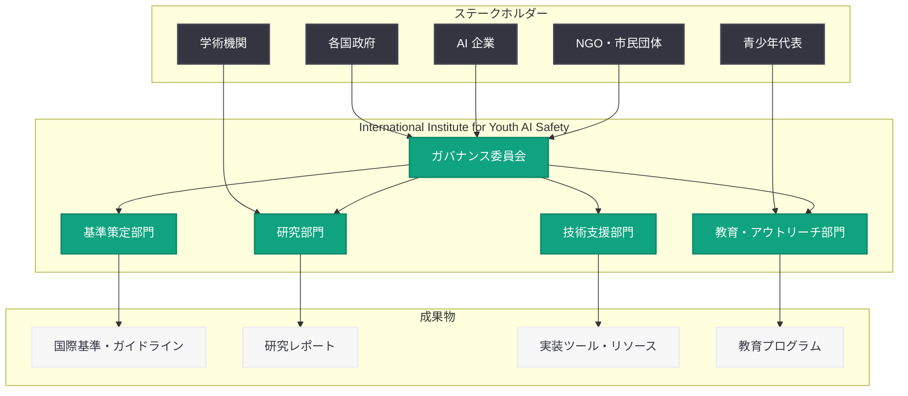

# OpenAI、青少年 AI 安全のための国際機関設立を提案: グローバルリーダーシップによる若者の保護と機会創出

## メタデータ

| 項目 | 内容 |
|------|------|
| 発表日 | 2026-06-02 |
| ソース | OpenAI News/Blog |
| カテゴリ | 安全性 (Global Affairs) |
| 公式リンク | [Advancing youth safety and opportunity through global leadership](https://openai.com/index/advancing-youth-safety-and-opportunity-through-global-leadership) |

> **注記:** 本レポートは、OpenAI の公開情報、2026 年を通じて展開された一連の青少年安全施策、および関連する政策文書に基づいて作成されている。記事全文はアクセス制限により直接取得できなかったため、公開概要と文脈情報を基に構成している。正確な詳細については公式ページを参照されたい。

## 概要

OpenAI は 2026 年 6 月 2 日、青少年の AI 安全に関するグローバルな行動を呼びかける声明を発表し、若者のためのセーフガード、基準、機会を強化するための国際機関 (International Institute) の設立を提案した。本提案は、AI 技術の急速な普及に伴い、世界中の青少年が AI と接する機会が飛躍的に増加している現状を踏まえ、国際的に協調した保護の枠組みと、AI を通じた教育・成長機会の提供を同時に実現しようとする包括的な構想である。

OpenAI は 2026 年前半を通じて日本市場向けティーン安全ブループリント、グローバルな Child Safety Blueprint、EMEA 向け助成プログラム、専門人材の採用と、段階的に青少年安全施策を拡充してきた。本提案はこれらの取り組みの集大成として、国際レベルでの制度化を目指すものであり、翌日 (6 月 3 日) に発表された公共政策アジェンダにおける「青少年保護」の柱とも直接的に連携している。

## 主な内容

### 国際機関 (International Institute) の提案

OpenAI が提案する国際機関は、AI と青少年の関わりに特化した初のグローバルな専門機関として構想されている。

**提案される機関の役割:**

| 機能 | 目的 | 期待される成果 |
|------|------|---------------|
| 基準策定 | 青少年 AI 安全の国際基準を開発 | 各国で採用可能な統一フレームワーク |
| 研究推進 | AI が青少年に与える影響の学術研究 | エビデンスに基づく政策立案 |
| ベストプラクティス共有 | 各国の取り組みの知見交換 | 効果的な保護措置の普及 |
| 技術支援 | 途上国を含む各国への実装支援 | グローバルな保護水準の底上げ |
| モニタリング | 世界的な青少年 AI 利用状況の監視 | リスクの早期検知と対応 |

**想定される組織構造:**

### 青少年のためのセーフガード強化

本提案は、既存の企業レベルの保護措置を国際的な制度として確立することを目指している。

**多層的セーフガードの国際標準化:**

- **年齢確認メカニズム:** プライバシーを尊重しつつ実効性のある年齢確認手法の国際基準化。各国の法制度の違いを踏まえた柔軟なフレームワークの策定
- **コンテンツ安全性基準:** AI が生成するコンテンツの年齢適切性に関する国際的な評価基準の確立。文化的差異を考慮した多元的なアプローチ
- **データ保護の国際枠組み:** 未成年者の個人データの収集・利用・保持に関するグローバルな最低基準の策定
- **有害コンテンツ対策:** CSAM (児童性的虐待素材) をはじめとする有害コンテンツの検知・除去に関する技術基準と情報共有の制度化
- **プラットフォーム間連携:** 複数の AI サービスにわたる青少年保護の一貫性を確保するための相互運用性基準

### グローバル基準の策定

国際機関が策定を目指す基準は、以下の領域にわたる。

**基準策定の優先領域:**

1. **年齢に応じた AI インタラクション設計:** 発達段階ごとに適切な AI の機能・応答の範囲を定義する基準
2. **透明性と説明責任:** AI サービスが青少年ユーザーに対して行う処理の透明性に関する開示基準
3. **保護者の関与:** 保護者が子どもの AI 利用を適切に監督・管理するための機能要件の標準化
4. **インシデント報告:** AI に起因する青少年への被害事例の国際的な報告・共有の仕組み
5. **定期的な影響評価:** AI サービスが青少年のウェルビーイングに与える影響の継続的な評価方法

**国際的な基準策定プロセスの特徴:**

- マルチステークホルダーアプローチ: 政府、企業、市民社会、学術機関、青少年自身の参画
- エビデンスベース: 学術研究と実証データに基づく基準策定
- 文化的多様性への配慮: 画一的な基準ではなく、各国の文化・法制度に適応可能なフレームワーク
- 定期的な見直し: AI 技術の急速な進化に対応するための定期的な基準更新サイクル

### 教育と成長の機会

本提案は保護だけでなく、AI を通じた青少年の積極的な成長機会の創出も重要な柱として位置付けている。

**機会創出の枠組み:**

- **AI リテラシー教育:** 各国の教育カリキュラムに AI リテラシーを組み込むための国際的なガイドラインと教材の開発
- **クリエイティブな活用支援:** 青少年が AI を創造的なツールとして活用するための安全な環境の整備
- **STEM 教育との連携:** AI を活用した科学・技術・工学・数学教育の充実
- **デジタルシチズンシップ:** AI 時代に求められる批判的思考力、情報リテラシー、倫理的判断力の育成
- **起業・イノベーション支援:** 若者が AI を活用して社会課題を解決するためのプログラム

**保護と機会のバランス:**

過度な制限は青少年が AI の恩恵を享受する機会を奪う一方、不十分な保護は深刻な被害をもたらしうる。国際機関は、このバランスを各国の状況に応じて最適化するための知見とツールを提供する役割を担う。

### OpenAI の青少年安全施策との連続性

本提案は、OpenAI が 2026 年を通じて展開してきた一連の青少年安全施策の延長線上に位置づけられる。

**施策の進化過程:**

| フェーズ | 期間 | 施策 | スコープ |
|---------|------|------|---------|
| 第 1 段階 | 2026 年 3 月 | Japan Teen Safety Blueprint | 地域特化型 (日本) |
| 第 2 段階 | 2026 年 4 月 | Child Safety Blueprint | グローバル・企業レベル |
| 第 2 段階 | 2026 年 4 月 | EMEA Youth Wellbeing Grant | 地域支援 (欧州・中東・アフリカ) |
| 第 3 段階 | 2026 年 5 月 | Porterfield 採用 | 組織能力の強化 |
| 第 3 段階 | 2026 年 5 月 | ChatGPT センシティブコンテキスト安全更新 | プロダクト実装 |
| 第 4 段階 | 2026 年 6 月 | 国際機関設立提案 (本件) | 国際制度化 |

この進化は、OpenAI の青少年安全戦略が「地域別の試行 → グローバルフレームワーク → 人材・プロダクト強化 → 国際制度化」という明確な段階を経て拡大していることを示している。

## 政策的・技術的セーフガードの文脈

### 既存の国際的取り組みとの関係

本提案は、既に存在する国際的な子ども保護の枠組みと相互補完的な関係にある。

| 既存枠組み | 焦点 | 本提案との関係 |
|-----------|------|---------------|
| 国連子どもの権利条約 | 子どもの権利の包括的保護 | デジタル時代の権利保護を具体化 |
| EU AI Act | AI の包括的規制 | 青少年特有のリスクに特化 |
| UK Age Appropriate Design Code | オンラインサービスの年齢適切設計 | AI 固有の課題に対応を拡張 |
| OECD AI 原則 | 信頼できる AI の国際原則 | 青少年の視点を重点的に反映 |
| 各国 AI Safety Institute | AI 安全性の国内評価 | 青少年安全の専門機能を補完 |

### 技術的セーフガードの国際展開

OpenAI が自社プロダクトで実装してきた技術的セーフガードを、国際基準として標準化する方向性が示されている。

**標準化が想定される技術領域:**

- **年齢推定・確認技術:** AI ベースの年齢推定やデジタル ID との連携の技術基準
- **コンテンツフィルタリング:** 年齢層別のコンテンツ制御に関するアルゴリズム基準
- **行動分析による保護:** 利用パターンから脆弱なユーザーを検知するシステムの基準
- **セーフティ API:** 開発者がセーフガードを実装するための標準化されたインターフェース
- **監査・コンプライアンスツール:** 基準遵守を検証するための技術的手法

## 開発者・プラットフォームへの影響

国際機関の設立と基準策定が実現した場合、AI 開発者とプラットフォーム事業者に以下の影響が想定される。

- **統一基準によるコンプライアンス効率化:** 各国ごとに異なる青少年保護要件への個別対応から、国際基準への準拠による一括対応への移行が可能になる
- **セーフガード実装の標準化:** 年齢確認、コンテンツフィルタリング、保護者管理などの機能について、共通の実装基準が提供される
- **認証制度の可能性:** 国際基準に準拠していることを示す認証制度の導入により、ユーザーの信頼獲得が容易になる
- **中小開発者への支援:** 大企業と同等のセーフガードを低コストで実装するためのオープンソースツールやガイダンスの提供
- **API レベルでの安全機能:** OpenAI の gpt-oss-safeguard (2026 年 3 月公開) のような開発者向けセーフティツールの国際展開
- **コンプライアンス報告の義務化:** 定期的な安全性レポートの提出や第三者監査への対応が求められる可能性

## 関連リンク

- [Advancing youth safety and opportunity through global leadership (本件)](https://openai.com/index/advancing-youth-safety-and-opportunity-through-global-leadership)
- [OpenAI Public Policy Agenda (2026-06-03)](https://openai.com/index/public-policy-agenda)
- [ChatGPT Sensitive Context Safety Updates (2026-05-14)](https://openai.com/index/chatgpt-sensitive-context-safety)
- [OpenAI Hires Porterfield for Youth Safety (2026-05-11)](https://openai.com/index/openai-hires-porterfield-youth-safety)
- [EMEA Youth and Wellbeing Grant (2026-04-12)](https://openai.com/index/emea-youth-wellbeing-grant)
- [Child Safety Blueprint (2026-04-08)](https://openai.com/index/introducing-child-safety-blueprint)
- [Japan Teen Safety Blueprint (2026-03-17)](https://openai.com/index/japan-teen-safety-blueprint)
- [Teen Safety Policies / gpt-oss-safeguard (2026-03-24)](https://openai.com/index/teen-safety-policies-gpt-oss-safeguard)
- [OpenAI Safety](https://openai.com/safety)

## まとめ

OpenAI が 2026 年 6 月 2 日に発表した「Advancing youth safety and opportunity through global leadership」は、青少年の AI 安全に関する国際機関の設立を提案する画期的な政策文書である。本提案は、保護 (セーフガード) と機会 (教育・成長) の両面を同時に追求し、国際的に協調した枠組みの中で実現することを目指している。

2026 年前半を通じて、OpenAI は日本市場向けのティーン安全ブループリント (3 月)、グローバルな Child Safety Blueprint (4 月)、EMEA 向け助成 (4 月)、専門人材の採用 (5 月)、プロダクトレベルの安全機能実装 (5 月) と段階的に施策を拡充してきた。本提案はこれらの取り組みを国際制度として確立しようとする第 4 段階であり、OpenAI の青少年安全戦略が企業レベルから国際レベルへと発展したことを示している。

翌日の公共政策アジェンダ発表と合わせ、OpenAI は AI ガバナンスにおける青少年保護を最重要課題の一つとして位置付けており、国際社会に対して具体的な行動を呼びかけている。AI 技術が若い世代の日常生活に深く浸透する中、保護と機会のバランスを国際的に確保する仕組みの構築は、今後の AI 政策において中心的な議題となるだろう。
