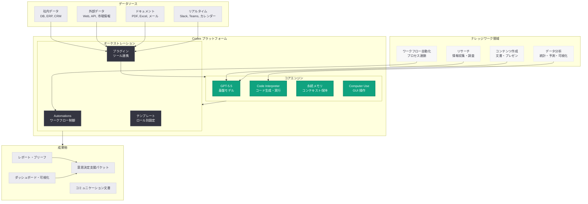

# Codex for Knowledge Work: ナレッジワークの次の時代を定義する包括レポート

## メタデータ

| 項目 | 内容 |
|------|------|
| 発表日 | 2026-06-02 |
| ソース | OpenAI News/Blog |
| カテゴリ | 製品情報 (Global Affairs) |
| 公式リンク | [Codex for Knowledge Work](https://openai.com/index/codex-for-knowledge-work) |

> **注記:** 本レポートは OpenAI の公式発表メタデータ、URL スラッグ、および 2026 年を通じた Codex の製品進化の文脈に基づいて作成している。記事本文へのアクセスは制限されたため、製品の進化の軌跡と公開情報から内容を構成している。正確な詳細については公式ページを参照されたい。

## 概要

OpenAI は 2026 年 6 月 2 日、「The Next Era of Knowledge Work」と題する包括的なレポートを公開した。本レポートは、Codex がコーディングツールから汎用的な生産性プラットフォームへと進化した軌跡を総括し、AI によるリサーチ、データ分析、ワークフロー自動化、コンテンツ作成を通じて、ナレッジワーク全体がどのように変革されつつあるかを体系的に論じたものである。

本発表は、2026 年 5 月から 6 月にかけて展開された「Codex for Work」シリーズ (財務、ビジネスオペレーション、セールス、データサイエンス) の集大成として位置づけられ、Codex が「全ての知識労働者のための生産性ツール」であることを明確に宣言する戦略的ドキュメントである。翌日の 6 月 3 日に発表された「Codex for Every Role, Tool, and Workflow」が具体的な機能カタログであるのに対し、本レポートはその思想的基盤とビジョンを提示するものと位置づけられる。

## 主な内容

### リサーチ能力: AI が変える情報収集と知識合成

ナレッジワーカーの業務時間の多くは、情報収集、文献調査、競合分析などのリサーチ活動に費やされている。Codex のリサーチ能力は、このプロセスを根本的に変革する。

**従来のリサーチプロセスの課題:**
- 複数のデータソースを横断した情報収集に数時間から数日を要する
- 情報の鮮度管理と重複排除が困難
- 収集した情報の構造化と要約に追加の工数が発生
- 専門知識がない分野のリサーチでは品質が不安定

**Codex によるリサーチ支援:**
- 複数のソース (社内ドキュメント、データベース、外部情報) を同時に参照し、統合的なリサーチブリーフを生成
- 永続メモリにより、過去のリサーチ結果を蓄積し、差分のみを効率的に更新
- 市場調査、競合分析、技術調査など、目的に応じたリサーチテンプレートを活用可能
- エビデンスの信頼性を評価し、情報源を明示した構造化レポートを出力

### データ分析機能: ノーコードで実現する高度な分析

Codex のデータ分析機能は、SQL やプログラミングの専門知識がなくても、自然言語の指示だけで高度なデータ分析を実行できる環境を提供する。

**主要なデータ分析ケイパビリティ:**

| カテゴリ | 機能 | 具体例 |
|---------|------|--------|
| 探索的分析 | データの傾向把握と可視化 | 売上トレンド分析、異常値検出 |
| 統計分析 | 仮説検定と相関分析 | A/B テスト評価、回帰分析 |
| 予測分析 | 時系列予測とシナリオ分析 | 需要予測、売上フォーキャスト |
| レポーティング | ダッシュボードと定期レポート生成 | KPI メモ、MBR 自動作成 |
| データクレンジング | データ品質の検証と修正 | 欠損値処理、フォーマット統一 |

**データ分析のワークフロー:**
1. データソースの接続 (Excel、CSV、データベース、API)
2. 自然言語での分析目的の指定
3. Codex がコードを自動生成・サンドボックスで実行
4. 結果の可視化とインサイトの抽出
5. 分析レポートの自動生成

### ワークフロー自動化: 反復業務からの解放

Codex の Automations 機能は、条件ベースのトリガーとマルチステップのワークフロー連鎖により、ナレッジワーカーの反復的な業務を自動化する。

**自動化の 4 つのレベル:**

1. **タスク自動化:** 単一の反復タスクを自動化 (例: 日次レポートの生成)
2. **プロセス自動化:** 複数ステップの業務プロセスを連鎖実行 (例: データ収集 → 分析 → レポート生成 → 配信)
3. **意思決定支援:** データに基づく推奨案の提示と承認フローの統合
4. **適応的自動化:** 結果のフィードバックに基づいてワークフローを自動改善

**業種別自動化の実例:**

- **マーケティング:** キャンペーンデータの自動集計 → ROI 分析 → 週次報告書の生成・配信
- **人事:** 応募者データの自動スクリーニング → 面接スケジュール調整 → 評価レポートの作成
- **法務:** 契約書のアップロード → リスク条項の自動検出 → レビューサマリーの生成
- **カスタマーサクセス:** 顧客健全性スコアの計算 → アラート → 対応策の提案

### コンテンツ作成: プロフェッショナルな成果物の迅速な生成

Codex のコンテンツ作成能力は、単純なテキスト生成を超え、業務文脈に即したプロフェッショナルな成果物を生成する点に特徴がある。

**対応するコンテンツタイプ:**
- **戦略ドキュメント:** イニシアチブブリーフ、ビジネスケース、戦略提案書
- **分析レポート:** 市場調査レポート、競合分析、影響評価レポート
- **プレゼンテーション:** 経営層向けデッキ、プロジェクト進捗報告
- **コミュニケーション:** ステークホルダー向けアップデート、チーム間の情報共有文書
- **技術文書:** API ドキュメント、システム設計書、運用手順書

**コンテンツ品質を支える技術:**
- 永続メモリによる組織固有のスタイルガイドと用語辞書の学習
- 過去の成果物を参照した一貫性のあるトーンとフォーマットの維持
- マルチモーダル入力 (音声メモ、画像、手書きスケッチ) からの文書生成

### コーディングを超えた Codex の進化

Codex の変遷は、AI プラットフォームのあり方を根本的に再定義するものである。

| 時期 | フェーズ | Codex の位置づけ |
|------|---------|----------------|
| 2025 年 | コーディングエージェント | 開発者向けのコード生成・レビュー・デバッグツール |
| 2026 年 Q1 | 拡張コーディングプラットフォーム | セキュリティリサーチ、OSS 開発、エンタープライズ連携 |
| 2026 年 Q2 (前半) | スーパーアプリ化 | Computer Use、ブラウザ、メモリ、プラグインの統合 |
| 2026 年 Q2 (後半) | ユニバーサルナレッジワークプラットフォーム | 全職種・全ワークフロー対応 |

**この進化を可能にした技術的要因:**
- GPT-5.5 モデルの汎用的な推論能力と指示追従性の向上
- Computer Use による GUI アプリケーションの直接操作
- プラグインシステムによるサードパーティツール連携の拡張性
- クラウドサンドボックスでのセキュアなコード実行
- 永続メモリによるコンテキスト維持とパーソナライゼーション

## 技術的な詳細

### Codex のナレッジワーク基盤技術

Codex がコーディング以外のナレッジワークを支援するために活用する主要技術コンポーネントは以下の通りである。

**1. マルチモーダル入力処理:**
- テキスト、画像、PDF、スプレッドシート、データベース接続を統合的に処理
- 音声入力からの文書生成 (Mobile Anywhere 連携)
- スクリーンショットからのデータ抽出と構造化

**2. コード生成・実行エンジン:**
- データ分析のための Python コードを自然言語から自動生成
- サンドボックス環境での安全な実行と結果の検証
- 可視化ライブラリ (matplotlib、plotly) を活用したグラフ自動生成

**3. ドキュメント合成エンジン:**
- 複数のデータソースから一貫性のあるドキュメントを合成
- テンプレートベースとフリーフォーム双方の文書生成に対応
- 組織固有のスタイルガイドへの適応

**4. ワークフローオーケストレーション:**
- YAML ベースのワークフロー定義
- 条件分岐、ループ、エラーハンドリングを含む複雑なフロー
- 外部ツール連携のためのプラグイン API

### コードサンプル: ナレッジワーク自動化

```python
from openai import OpenAI

client = OpenAI()

# リサーチブリーフの自動生成
response = client.responses.create(
    model="codex",
    instructions="""あなたは経験豊富なリサーチアナリストです。
    提供されたデータソースから包括的なリサーチブリーフを作成してください。

    含めるべき要素:
    - エグゼクティブサマリー (3 行以内)
    - 主要な発見事項 (5 つ以内)
    - データに基づくインサイト
    - 推奨アクション
    - 情報源と信頼性評価

    出力形式: 構造化された Markdown""",
    input="""
    調査テーマ: 生成 AI のエンタープライズ導入動向 2026
    データソース:
    - 社内導入事例データベース (200 件)
    - 業界レポート 3 本のサマリー
    - 競合他社の公開事例 15 件
    """,
    tools=[
        {
            "type": "code_interpreter"
        }
    ]
)

print(response.output_text)
```

### コードサンプル: ワークフロー自動化定義

```yaml
# Codex Automation: 週次ナレッジワークレポート
name: weekly-knowledge-work-digest
trigger:
  schedule: "every Friday at 16:00"
steps:
  - name: collect-activities
    tool: jira
    action: export_completed_items
    params:
      period: last_7_days
      project: all
  - name: gather-communications
    tool: slack
    action: summarize_channels
    params:
      channels: ["#general", "#product", "#engineering"]
      period: last_7_days
  - name: analyze-metrics
    tool: google_sheets
    action: fetch_data
    params:
      spreadsheet_id: "weekly_kpis"
      range: "latest"
  - name: generate-digest
    agent: codex
    prompt: |
      以下のデータから経営層向けの週次ダイジェストを作成してください。
      含めるべき要素:
      - 今週の主要な成果 (3-5 項目)
      - 進行中の重要プロジェクトの状況
      - KPI のハイライト (目標対比)
      - 来週の注目事項と意思決定が必要な事項
    input:
      activities: "{{steps.collect-activities.output}}"
      communications: "{{steps.gather-communications.output}}"
      metrics: "{{steps.analyze-metrics.output}}"
  - name: distribute
    tool: slack
    action: post_message
    params:
      channel: "#leadership"
      content: "{{steps.generate-digest.output}}"
```

## アーキテクチャ



## 主要な統計と知見

本レポート「The Next Era of Knowledge Work」では、以下のようなナレッジワークの変革に関する知見が提示されていると推定される。

### ナレッジワーカーの業務時間分析

| 業務カテゴリ | 従来の所要時間 (週あたり) | Codex 活用後の推定 | 削減率 |
|-------------|------------------------|-------------------|--------|
| 情報収集・リサーチ | 8-12 時間 | 2-3 時間 | 約 70-75% |
| データ分析・レポート作成 | 6-10 時間 | 1-2 時間 | 約 80% |
| 定型文書の作成 | 4-6 時間 | 30 分 -1 時間 | 約 85% |
| ワークフロー管理 | 3-5 時間 | 30 分 | 約 85-90% |
| 戦略的思考・意思決定 | 5-8 時間 | 10-15 時間 (増加) | +50-100% |

### Codex の職種別導入状況

2026 年前半を通じた Codex for Work シリーズの展開により、以下の職種での活用が確立された。

- **エンジニアリング:** コード生成、レビュー、デバッグ (2025 年~)
- **財務・経理:** MBR 自動作成、差異分析、モデルチェック (2026 年 5 月~)
- **セールス:** パイプライン分析、ミーティング準備、フォーキャスト (2026 年 5 月~)
- **ビジネスオペレーション:** イニシアチブブリーフ、戦略アップデート (2026 年 5 月~)
- **データサイエンス:** 障害分析、影響レポート、KPI メモ (2026 年 5 月~)
- **マーケティング・人事・法務:** コンテンツ生成、分析、レビュー支援 (2026 年 6 月~)

### 生産性向上の主要指標

- **ドキュメント作成時間:** 平均 80% 削減
- **データ分析サイクル:** 数日 → 数分
- **レポーティング頻度:** 月次 → 日次への移行が可能に
- **意思決定のリードタイム:** データ収集から判断までの期間が大幅短縮

## 開発者とエンタープライズへの影響

### エンタープライズ導入への影響

- **全社的な AI 戦略の必要性:** Codex が全職種に展開されることで、IT 部門だけでなく経営層レベルでの AI 導入戦略の策定が不可欠になる
- **データガバナンスの重要性増大:** 多様な部門が AI を活用することで、データのアクセス制御、プライバシー保護、監査証跡の設計がより重要になる
- **変革管理の課題:** 非技術者が AI ツールを効果的に活用するためのトレーニングとチェンジマネジメントが組織の競争力を左右する
- **ROI の測定枠組み:** ナレッジワーク全体での AI 活用効果を定量的に評価するフレームワークの構築が必要

### 開発者への影響

- **プラグイン開発エコシステム:** Codex がユニバーサルプラットフォームとなることで、各業種・業務ドメイン特化型プラグインの開発需要が急増する
- **ワークフローテンプレートの市場:** 業種別・職種別のワークフローテンプレートを作成・販売する新しいマーケットプレイスが形成される
- **統合ミドルウェアの需要:** レガシーシステムと Codex を接続するためのアダプタやミドルウェアの開発機会が拡大する
- **AI ネイティブアプリケーション:** Codex API を基盤とした新しいカテゴリの業務アプリケーションが出現する

### 働き方への長期的影響

本レポートは、AI がナレッジワーカーの「代替」ではなく「増幅」のツールであるという立場を明確にしていると推定される。反復的で時間のかかるタスクを AI に委譲することで、人間はより創造的で戦略的な業務に集中できるようになる。これは「ナレッジワークの次の時代」として、以下の変化を示唆する。

1. **業務の再定義:** 「何をするか」ではなく「何を判断するか」が人間の中核業務になる
2. **スキルセットの変化:** ツールの操作スキルよりも、問題定義力と判断力が重視される
3. **組織構造の変化:** 少人数でより大きな成果を出せるため、チーム構成が変化する

## 関連リンク

- [Codex for Knowledge Work](https://openai.com/index/codex-for-knowledge-work) - 本レポート (2026-06-02)
- [Codex for Every Role, Tool, and Workflow](https://openai.com/index/codex-for-every-role-tool-workflow/) - 全職種対応の宣言 (2026-06-03)
- [How finance teams use Codex](https://openai.com/academy/how-finance-teams-use-codex) - 財務チーム向けガイド (2026-05-12)
- [How business operations teams use Codex](https://openai.com/academy/codex-for-work/how-business-operations-teams-use-codex) - ビジネスオペレーション向け (2026-05-15)
- [How sales teams use Codex](https://openai.com/academy/codex-for-work/how-sales-teams-use-codex) - セールスチーム向け (2026-05-15)
- [How data science teams use Codex](https://openai.com/academy/codex-for-work/how-data-science-teams-use-codex) - データサイエンス向け (2026-05-15)
- [Get Codex for your enterprise, free](https://openai.com/index/get-codex-for-your-enterprise-free/) - エンタープライズ無料提供 (2026-05-13)
- [Codex for (almost) everything](https://openai.com/index/codex-for-almost-everything) - スーパーアプリ化発表 (2026-04-16)
- [OpenAI News](https://openai.com/news)

## まとめ

「The Next Era of Knowledge Work」レポートは、Codex がコーディングツールからユニバーサルな生産性プラットフォームへと変貌を遂げた過程を総括し、AI によるナレッジワーク変革のビジョンを提示する戦略的ドキュメントである。主要なポイントは以下の通りである。

1. **4 つの柱の確立:** リサーチ、データ分析、ワークフロー自動化、コンテンツ作成という 4 つの領域で、Codex がナレッジワーカーの生産性を飛躍的に向上させることが実証された

2. **コーディングからの脱皮:** Codex は 2025 年の開発者向けコーディングエージェントから、2026 年には全ての知識労働者が業務で活用できるプラットフォームへと進化を完了した

3. **人間の役割の再定義:** AI が反復的・定型的な業務を担うことで、人間は問題定義、戦略的判断、創造的思考といった高次の業務に集中できるようになる

4. **エンタープライズ戦略の基盤:** 本レポートは、企業が全社的な AI 導入を計画する際の思想的基盤として機能し、翌日発表の「Codex for Every Role, Tool, and Workflow」における具体的な実装ガイドへの橋渡しとなっている

5. **生産性革命の実証:** ドキュメント作成時間の 80% 削減、データ分析サイクルの劇的短縮など、具体的な生産性向上効果が示され、AI 導入の ROI が明確になった

本発表は、AI がナレッジワークにおける「オプション」から「必須インフラ」へと移行する転換点を象徴するものであり、OpenAI が AI プラットフォーム企業としてエンタープライズ市場での支配的地位を確立する上での重要なマイルストーンである。
