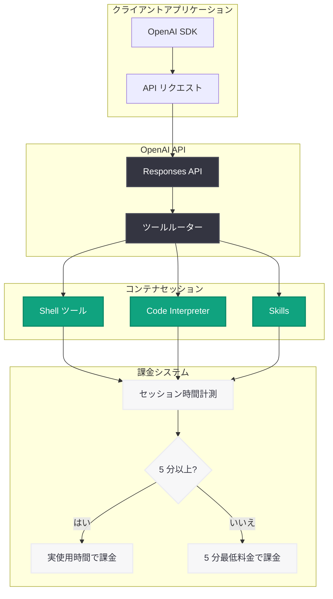

# コンテナセッション課金モデルの更新 - 分単位課金と 5 分最低課金の導入

## メタデータ

| 項目 | 内容 |
|------|------|
| 発表日 | 2026-06-02 |
| ソース | OpenAI API Changelog |
| カテゴリ | API 更新 / 料金 |
| 公式リンク | https://developers.openai.com/api/docs/changelog |

## 概要

OpenAI は 2026 年 6 月 2 日、コンテナセッションの課金モデルを更新した。従来は実際の使用時間に関わらず 20 分のセッション料金が一律で請求されていたが、今回の変更により、対象となるコンテナセッションは分単位で課金され、最低課金時間は 5 分となった。分あたりの料金自体に変更はない。

この更新により、短時間のセッションを多用する開発者にとって大幅なコスト削減が期待できる。例えば、6 分間のセッションは従来の 20 分分ではなく 6 分分の料金のみが請求される。

## 主な内容

### 課金モデルの変更点

**変更前:** コンテナセッションは使用時間に関わらず、20 分のフルセッション料金が請求されていた。5 分しか使用しなくても 20 分分の料金が発生していた。

**変更後:** 対象となるコンテナセッションは分単位で課金され、最低課金時間は 5 分に設定された。分あたりの単価は変更なし。

### 現行の料金体系

コンテナセッション (Hosted Shell および Code Interpreter) は 4 つのメモリティアで提供されている。

| メモリ | 分あたり料金 |
|--------|-------------|
| 1 GB | $0.03 |
| 4 GB | $0.12 |
| 16 GB | $0.48 |
| 64 GB | $1.92 |

- GB はバイナリギガバイト (ギビバイト) を指し、1 GB = 2^30 バイト
- ビルトインツールで使用されたトークンは、選択したモデルのトークン単価で別途課金

### コスト比較: 変更前 vs 変更後

以下は 4 GB メモリティア ($0.12/分) を例にしたコスト比較である。

| セッション時間 | 変更前 (20 分固定) | 変更後 (分単位、5 分最低) | 削減額 | 削減率 |
|---------------|-------------------|--------------------------|--------|--------|
| 5 分 | $2.40 | $0.60 | $1.80 | 75% |
| 8 分 | $2.40 | $0.96 | $1.44 | 60% |
| 12 分 | $2.40 | $1.44 | $0.96 | 40% |
| 15 分 | $2.40 | $1.80 | $0.60 | 25% |
| 20 分 | $2.40 | $2.40 | $0.00 | 0% |

短いセッションほど大きなコスト削減効果がある。5 分のセッションでは最大 75% のコスト削減が実現する。

## 技術的な詳細

### 対象サービス

この課金変更は以下のコンテナセッションに適用される。

- **Shell ツール:** ホストされたコンテナ内でシェルコマンドを実行する環境
- **Code Interpreter:** コード実行用のサンドボックス環境
- **Skills:** バージョン管理されたスキルバンドルをホストされたシェル環境でアップロード・再利用する機能

### コードサンプル

Shell ツールを使用したコンテナセッションの利用例:

```python
from openai import OpenAI

client = OpenAI()

# Shell ツールを使用した Responses API 呼び出し
response = client.responses.create(
    model="gpt-4.1",
    tools=[
        {
            "type": "container",
            "container": {
                "environment": "shell",
                "memory_gb": 4,  # 4 GB メモリティア ($0.12/分)
            }
        }
    ],
    input="プロジェクトの依存関係をインストールしてテストを実行してください"
)

print(response.output_text)

# セッションは使用した分数のみ課金される (最低 5 分)
# 例: 7 分で完了 → $0.12 × 7 = $0.84
# 変更前: $0.12 × 20 = $2.40
```

Code Interpreter を使用した例:

```python
from openai import OpenAI

client = OpenAI()

# Code Interpreter でデータ分析を実行
response = client.responses.create(
    model="gpt-4.1",
    tools=[
        {
            "type": "container",
            "container": {
                "environment": "code_interpreter",
                "memory_gb": 1,  # 1 GB メモリティア ($0.03/分)
            }
        }
    ],
    input="添付した CSV ファイルの売上データを分析してグラフを作成してください"
)

# 短時間のデータ分析タスクのコスト効率が大幅に向上
# 5 分で完了した場合: $0.03 × 5 = $0.15 (変更前: $0.03 × 20 = $0.60)
```

## アーキテクチャ



## 開発者への影響

### コスト削減効果

- **短時間タスクの大幅なコスト削減:** 5 分以下のセッションで最大 75% のコスト削減。AI エージェントが短いシェルコマンドを実行するユースケースで特に効果的
- **従量課金の粒度向上:** 実際の使用量に応じた課金となり、予算管理がしやすくなる
- **バッチ処理の最適化:** 複数の短いセッションに分割する戦略が経済的に合理的になった

### ユースケース別の影響

| ユースケース | 典型的なセッション時間 | コスト影響 |
|-------------|---------------------|-----------|
| 単純なシェルコマンド実行 | 5-7 分 | 大幅削減 (65-75%) |
| コードレビュー・テスト実行 | 8-12 分 | 中程度削減 (40-60%) |
| データ分析・可視化 | 10-15 分 | 一定の削減 (25-50%) |
| 長時間のビルド・デプロイ | 15-20 分 | 軽微な削減 (0-25%) |

### 設計上の考慮事項

- **5 分最低課金:** 5 分未満で終了するセッションでも 5 分分の料金が発生するため、極端に短いタスクを頻繁に新規セッションとして開始するよりも、セッションを再利用する方がコスト効率が良い場合がある
- **セッション設計の見直し:** 従来は 20 分固定のため 1 セッションにまとめていたタスクを、論理的な単位で分割することが経済的に合理的になった
- **トークン課金は別途:** コンテナ内でのツール使用に伴うトークンは選択したモデルの単価で別途課金される点に変更なし

## 関連リンク

- [OpenAI API Changelog](https://developers.openai.com/api/docs/changelog)
- [OpenAI API 料金ページ](https://openai.com/api/pricing/)
- [Shell ツール ドキュメント](https://platform.openai.com/docs/guides/tools/shell)
- [Code Interpreter ドキュメント](https://platform.openai.com/docs/guides/tools/code-interpreter)
- [Responses API リファレンス](https://platform.openai.com/docs/api-reference/responses)

## まとめ

今回のコンテナセッション課金モデルの更新は、短時間のセッションを多用する開発者にとって歓迎すべき変更である。20 分固定課金から分単位課金 (5 分最低) への移行により、AI エージェントの短いタスク実行コストが大幅に削減される。分あたりの単価に変更がないため、20 分フルに使用する場合のコストは従来と同一であり、既存ユーザーに不利益はない。特に、シェルコマンドの実行やクイックなコード分析など、短時間で完了するタスクを頻繁に実行するワークフローにおいて、コスト効率が劇的に改善される。
