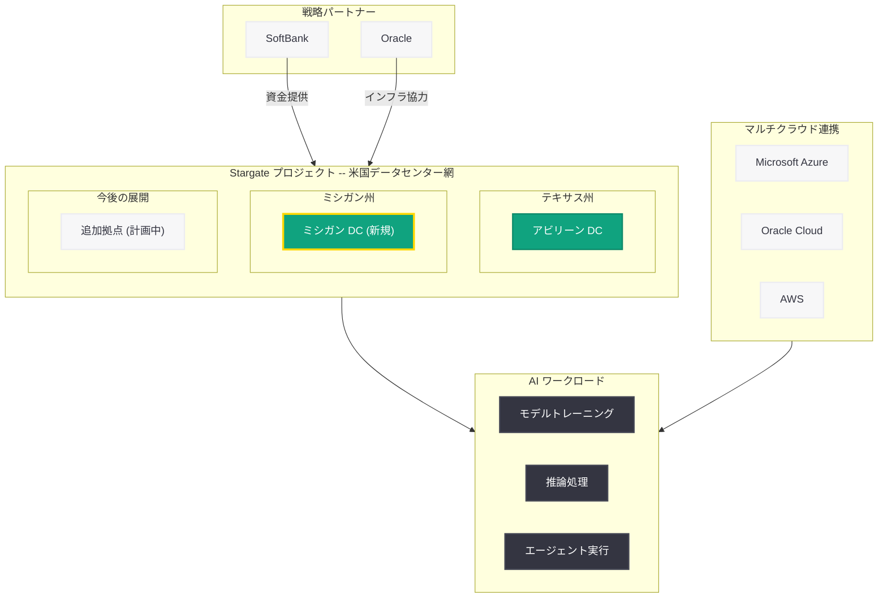
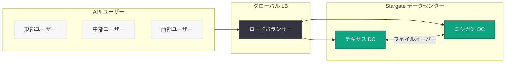

# OpenAI、Stargate プロジェクトにミシガン州データセンターを追加 -- 米国 AI インフラ網を更に拡充

## メタデータ

| 項目 | 内容 |
|------|------|
| 発表日 | 2026-06-02 |
| ソース | OpenAI News (Global Affairs) |
| カテゴリ | インフラストラクチャ / 企業 |
| 公式リンク | [Stargate Michigan Data Center](https://openai.com/index/stargate-michigan-data-center/) |

> **注:** 本レポートは OpenAI ブログのサイトマップ情報 (公開日: 2026-06-02T04:01:28.183Z)、URL スラッグ、および Stargate プロジェクトに関する公開情報に基づいて作成しています。記事本文へのアクセスは Cloudflare の保護により制限されたため、公式発表の詳細については公式リンクを参照してください。

## 概要

2026 年 6 月 2 日、OpenAI は Stargate プロジェクトの新たな拠点として、ミシガン州におけるデータセンターの建設を発表した。Stargate は OpenAI と SoftBank の合弁事業として推進される米国内の大規模 AI データセンター構想であり、総投資額は最大 5,000 億ドル (約 75 兆円) に達する計画である。テキサス州アビリーンに続くミシガン州の追加は、OpenAI が米国全土に AI コンピュートインフラを地理的に分散展開する戦略を着実に実行していることを示している。

本発表は OpenAI の Global Affairs 部門から公開されており、地域経済への貢献、雇用創出、州政府との連携といった公共政策的側面が強調されていると推測される。AGI 開発に向けた計算資源の確保と、地域社会との共存を両立させるアプローチが示されたものと考えられる。

## 主な内容

### Stargate プロジェクトの概要と経緯

Stargate プロジェクトは、OpenAI と SoftBank が 2025 年に発表した米国内の大規模 AI データセンター構想である。このプロジェクトは以下の目標を掲げている。

- **総投資額:** 最大 5,000 億ドル (約 75 兆円) を複数年にわたり投資
- **目的:** 先端 AI モデルのトレーニングおよび大規模推論処理に必要なインフラの構築
- **対象:** AGI (汎用人工知能) の実現に向けた計算基盤の確立
- **パートナー:** SoftBank、Oracle をはじめとする複数の戦略パートナーとの協業

### ミシガン州データセンターの追加

今回発表されたミシガン州のデータセンターは、Stargate プロジェクトにおける新たな拠点として位置付けられる。既に発表済みのテキサス州アビリーンに加え、ミシガン州が選定されたことで、Stargate のデータセンター網は米国内で更に拡大する。

#### 立地選定の背景

ミシガン州がデータセンターの立地として選定された背景には、以下の要因が考えられる。

| 要素 | ミシガン州の特徴 |
|------|-----------------|
| 電力供給 | 五大湖周辺の安定した電力インフラ、再生可能エネルギーへの投資拡大 |
| 冷却効率 | 北部の冷涼な気候による自然冷却コストの低減 |
| 人材 | デトロイト都市圏のエンジニアリング人材プール |
| 通信インフラ | 米国中西部のネットワークハブとしての接続性 |
| 産業基盤 | 自動車産業の製造インフラからの転用可能性 |
| 州政府の支援 | 大規模テクノロジー投資への誘致施策 |

### 地域経済への影響

Stargate のデータセンター建設は、設置地域に対して多面的な経済効果をもたらすことが期待される。

- **雇用創出:** 建設期間中の建設作業員、および運用開始後のデータセンター運用スタッフ、セキュリティ、施設管理人材
- **税収増:** 大規模な設備投資に伴う固定資産税および法人税収入
- **サプライチェーン:** 電力、通信、建設資材などの地域サプライチェーンへの波及効果
- **技術人材の集積:** AI / データセンター関連の高度技術人材の地域への流入

### Stargate データセンター拠点の拡大

現在判明している Stargate プロジェクトの拠点展開は以下の通りである。

| 拠点 | 州 | 状況 | 特記事項 |
|------|------|------|----------|
| アビリーン | テキサス州 | 建設中 / 一部稼働 | 最初に発表された主要拠点 |
| ミシガン | ミシガン州 | 発表 (2026-06-02) | 本発表で追加 |
| その他 | 複数州 | 計画中 | 段階的に発表予定 |

## 技術的な詳細

### データセンターの想定仕様

Stargate プロジェクトのデータセンターは、AI ワークロードに完全特化した設計が採用されている。ミシガン州施設も同様のアーキテクチャに基づくと推測される。

#### ハードウェア構成

| コンポーネント | 詳細 |
|---------------|------|
| GPU | Nvidia H100 / B200、Cerebras WSE |
| カスタムチップ | OpenAI Titan (Samsung HBM4 搭載) |
| ネットワーク | NVLink / InfiniBand による超高速ノード間通信 |
| ストレージ | 大規模分散ファイルシステム |
| 電力 | GW 級の電力供給インフラ |

#### 冷却システム

ミシガン州の冷涼な気候は、大規模データセンターの冷却効率に大きなアドバンテージをもたらす。AI ワークロードは極めて高い電力密度を持つため、冷却コストの削減はデータセンター運用効率に直結する。

### パートナーシップ構造

Stargate プロジェクトの主要パートナーは以下の通りである。

| パートナー | 役割 |
|-----------|------|
| SoftBank | 資金提供、合弁パートナー |
| Oracle | クラウドインフラ、データセンター協力 |
| Microsoft | 戦略的パートナー (Azure 統合) |
| Cerebras | AI 推論チップ供給 |
| Samsung | HBM4 メモリ供給 |

## アーキテクチャ

### Stargate 米国内データセンター網

### 地理的分散とフェイルオーバー

## 開発者への影響

Stargate プロジェクトへのミシガン州データセンター追加は、OpenAI API を利用する開発者に以下の恩恵をもたらすと考えられる。

- **レイテンシの改善:** 米国中西部・東部のユーザーに対して、地理的に近いデータセンターからの API レスポンス提供が可能になり、レイテンシが改善される見込み
- **可用性の向上:** テキサス州とミシガン州の 2 拠点によるフェイルオーバー構成が確立され、災害やメンテナンス時のサービス継続性が向上する
- **キャパシティの拡大:** 追加のコンピュートリソースにより、API のレート制限緩和やピーク時の応答速度改善が期待される
- **エンタープライズ対応:** データレジデンシー要件を持つ米国中西部の企業に対して、近接拠点からのサービス提供が可能になる
- **新モデルのロールアウト加速:** コンピュートキャパシティの増加により、新モデルのリリースや全ユーザーへの展開がより迅速に実施される可能性がある

### 今後のタイムライン (推定)

| 時期 | 想定される進展 |
|------|---------------|
| 2026 年下半期 | ミシガン DC の建設本格化 |
| 2027 年 | 段階的な稼働開始、API トラフィックの分散 |
| 2027 年以降 | 追加拠点の発表、フルキャパシティでの運用 |

## 関連リンク

- [Stargate Michigan Data Center](https://openai.com/index/stargate-michigan-data-center/) - 本記事の公式ページ
- [Building the compute infrastructure for the Intelligence Age](https://openai.com/index/building-the-compute-infrastructure-for-the-intelligence-age) - Stargate インフラ拡張の前回発表
- [OpenAI News](https://openai.com/news) - OpenAI 公式ニュース
- [OpenAI 公式ドキュメント](https://platform.openai.com/docs) - API ドキュメント

### 関連レポート

- [OpenAI、Stargate プロジェクトを拡大し「知性の時代」を支えるコンピュートインフラを構築](2026-04-29-stargate-compute-infrastructure.md)
- [OpenAI CFO、コンピュート不足により事業機会を見送り](2026-04-05-openai-cfo-compute-constraints.md)
- [OpenAI Stargate 主要リーダー 3 名が Meta へ移籍](2026-04-10-stargate-leaders-depart-for-meta.md)
- [OpenAI が Cerebras と 200 億ドル超のチップ供給契約を締結](2026-04-17-openai-cerebras-20b-chip-deal.md)
- [OpenAI、データセンター投資を縮小し Nvidia 契約を見直し](2026-03-22-openai-datacenter-pivot-nvidia-ipo.md)

## まとめ

OpenAI が発表した Stargate ミシガン州データセンターは、同社の米国内 AI インフラ展開における重要な新拠点である。本発表の要点は以下の 3 点に集約される。

1. **地理的分散の進展:** テキサス州アビリーンに続くミシガン州の追加により、Stargate の米国内データセンター網が更に広範囲に拡大した。複数拠点による冗長性とレイテンシ最適化が進む
2. **Stargate プロジェクトの着実な実行:** 2025 年の発表以来、OpenAI と SoftBank は最大 5,000 億ドルの投資計画を段階的に実行に移しており、ミシガン州の追加はその実行力を示すものである
3. **地域社会との連携:** Global Affairs 部門からの発表であることは、雇用創出や地域経済への貢献など、公共政策的側面が重視されていることを示唆する。大規模 AI インフラ建設と地域社会の共存モデルの構築が進められている

AGI の実現に向けて膨大な計算資源を必要とする OpenAI にとって、米国内での大規模データセンター網の構築は不可避の戦略である。ミシガン州の追加は、その戦略が着実に前進していることの証左であり、開発者にとっても API パフォーマンスや可用性の向上として今後その恩恵が実感されることになるだろう。
