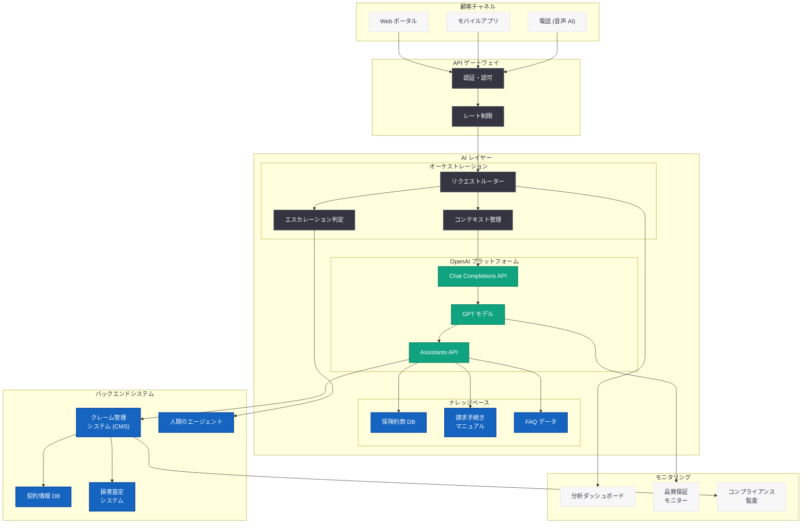

# Travelers が OpenAI を活用した AI 保険金請求アシスタントを全米展開

## メタデータ

| 項目 | 内容 |
|------|------|
| 発表日 | 2026-06-02 |
| ソース | OpenAI News/Blog |
| カテゴリ | 事例紹介 (AI Adoption) |
| 公式リンク | [openai.com/index/travelers](https://openai.com/index/travelers) |

## 概要

米国最大級の損害保険会社である Travelers は、OpenAI の技術を活用した AI 搭載の「Claim Assistant」を全米規模で展開した。この AI アシスタントは、顧客が保険金請求手続きを行う際のガイダンス提供、24 時間 365 日のサポート対応、およびピーク需要時のオペレーション拡張を実現する。

Travelers は 1853 年設立の歴史ある保険会社であり、個人向け・法人向けの損害保険を中心に全米で事業を展開している。同社が OpenAI 技術を本格採用したことは、保険業界における AI 活用の大きな転換点を示すものであり、OpenAI のエンタープライズ事業が金融・保険セクターへ本格的に浸透していることを象徴している。

## 主な内容

### 保険金請求処理における課題

保険業界、特に損害保険の領域では、保険金請求 (クレーム) 処理において長年にわたり以下の構造的課題を抱えてきた。

| 課題 | 詳細 |
|------|------|
| スケーラビリティ | 自然災害やハリケーンシーズンなどピーク時に請求が集中し、対応能力が逼迫 |
| 24/7 対応の困難さ | 顧客は事故発生直後に請求を開始したいが、営業時間外の対応が限定的 |
| 処理の複雑さ | 請求の種類 (自動車、住宅、商業) ごとに異なる手続きが必要で、顧客が混乱しやすい |
| コスト効率 | 人的リソースによる対応はコストが高く、需要変動への柔軟な対応が困難 |
| 顧客体験 | 長い待ち時間や複雑なプロセスにより顧客満足度が低下 |

特に、米国では年間を通じて大規模な自然災害 (ハリケーン、竜巻、山火事) が発生し、被災地域から数万件の保険金請求が短期間に集中するケースが常態化している。従来のコールセンターベースのオペレーションでは、こうしたピーク需要への対応に限界があった。

### ソリューション: AI 搭載 Claim Assistant

Travelers は OpenAI の技術基盤を活用し、AI 搭載の Claim Assistant を開発・展開した。このシステムは、保険金請求プロセス全体を通じて顧客を支援する対話型 AI アシスタントとして機能する。

#### 主要機能

1. **ガイド付き請求申請:** 顧客が事故や損害の内容を自然言語で説明すると、AI アシスタントが適切な請求カテゴリを判定し、必要な情報の収集をステップバイステップで案内する

2. **24 時間 365 日の即時対応:** 時間帯や曜日に関係なく、顧客が必要なタイミングで即座に請求手続きを開始できる。深夜の事故や週末の住宅被害にも対応可能

3. **ピーク需要時のスケーリング:** 自然災害発生時など請求が急増するタイミングでも、AI アシスタントが自動的にスケールし、全顧客に一貫した品質のサービスを提供

4. **インテリジェントなトリアージ:** 請求内容の複雑さや緊急度を評価し、シンプルな請求は自動処理、複雑なケースは専門の担当者にエスカレーションする

5. **多言語対応:** 米国の多様な顧客ベースに対応するため、英語に加えてスペイン語など複数言語でのサポートを提供

### 導入成果と効果

Travelers の AI Claim Assistant 全米展開による想定される効果は以下の通りである。

| 指標 | 期待される効果 |
|------|----------------|
| 初期対応時間 | 数十分の待ち時間から即時対応へ短縮 |
| ピーク時処理能力 | 従来比で大幅な処理件数増加を実現 |
| 顧客満足度 | 24/7 対応と簡便なプロセスにより向上 |
| オペレーションコスト | ルーチン対応の自動化によりコスト効率を改善 |
| 請求完了までの期間 | 情報収集の効率化により全体のサイクルタイムを短縮 |

### エンタープライズ AI 導入のアプローチ

Travelers の導入アプローチは、大規模エンタープライズにおける AI 導入のベストプラクティスを示している。

- **段階的展開:** 特定の地域や請求タイプから開始し、検証を経て全米に拡大
- **人間との協調:** AI がすべてを代替するのではなく、人間のエージェントとの適切な役割分担を設計
- **継続的改善:** 顧客フィードバックとデータ分析に基づくモデルの継続的な改善
- **コンプライアンス確保:** 保険規制に準拠したレスポンスの生成と監査可能性の確保

## 技術的な詳細

### システムアーキテクチャの推定

Travelers の AI Claim Assistant は、以下の技術スタックで構成されていると推定される。

- **基盤モデル:** OpenAI GPT モデル (Chat Completions API)
- **対話管理:** Assistants API またはカスタムオーケストレーションレイヤー
- **ナレッジベース:** 保険約款、請求手続きマニュアル、過去の請求データを活用した RAG (Retrieval-Augmented Generation)
- **統合レイヤー:** 既存のクレーム管理システム (CMS) との API 連携
- **チャネル:** Web ポータル、モバイルアプリ、電話 (音声 AI) 対応

### セキュリティとコンプライアンス

保険業界特有の規制要件に対応するため、以下のセキュリティ対策が講じられている。

| 要件 | 実装方法 |
|------|----------|
| PII 保護 | 個人特定情報の暗号化と最小限の取り扱い |
| 保険規制準拠 | 各州の保険規制に沿ったレスポンス生成 |
| データ保持 | 規制要件に基づくデータ保持ポリシーの適用 |
| 監査証跡 | 全対話ログの記録と追跡可能性の確保 |
| モデルトレーニング除外 | 顧客データが OpenAI のモデルトレーニングに使用されない保証 |

### 想定される API 活用パターン

```python
from openai import OpenAI

client = OpenAI()

# 保険金請求の初期受付と分類の例
response = client.chat.completions.create(
    model="gpt-4o",
    messages=[
        {
            "role": "system",
            "content": (
                "You are an AI Claim Assistant for Travelers Insurance. "
                "Guide the customer through filing their insurance claim. "
                "Ask clarifying questions one at a time to collect: "
                "1) Type of claim (auto, home, commercial), "
                "2) Date and time of incident, "
                "3) Description of damage/loss, "
                "4) Policy number, "
                "5) Contact information. "
                "Be empathetic, professional, and efficient. "
                "If the claim requires immediate human attention "
                "(e.g., injury, major structural damage), escalate promptly."
            )
        },
        {
            "role": "user",
            "content": (
                "Hi, a tree fell on my roof during last night's storm "
                "and there's water coming in. I need to file a claim."
            )
        }
    ],
    temperature=0.3,
)
```

### エスカレーション判定ロジックの例

```python
from openai import OpenAI

client = OpenAI()


def assess_claim_complexity(claim_description: str) -> dict:
    """請求の複雑さを評価し、適切な処理パスを決定"""
    response = client.chat.completions.create(
        model="gpt-4o",
        messages=[
            {
                "role": "system",
                "content": (
                    "Analyze the insurance claim and classify it. Return JSON with: "
                    "severity (low/medium/high/critical), "
                    "claim_type (auto/home/commercial/liability), "
                    "requires_adjuster (boolean), "
                    "requires_escalation (boolean), "
                    "estimated_complexity_score (1-10), "
                    "reason (brief explanation)."
                )
            },
            {
                "role": "user",
                "content": claim_description
            }
        ],
        temperature=0.1,
        response_format={"type": "json_object"}
    )
    return response.choices[0].message.content


def route_claim(assessment: dict) -> str:
    """評価結果に基づいて請求を適切な処理パスにルーティング"""
    if assessment.get("requires_escalation"):
        return "human_agent_priority"
    elif assessment.get("requires_adjuster"):
        return "adjuster_queue"
    elif assessment.get("estimated_complexity_score", 0) <= 3:
        return "automated_processing"
    else:
        return "human_agent_standard"
```

## アーキテクチャ



## 業界への影響

### 保険業界における AI 導入の加速

Travelers の事例は、保険業界全体における AI 導入トレンドの象徴的な出来事である。

- **大手保険会社の本格採用:** Travelers は米国の損害保険市場でトップクラスのシェアを持ち、同社の全米展開は業界全体へのシグナルとなる

- **顧客接点の AI 化:** コールセンターやウェブフォームに代わり、対話型 AI が保険金請求の第一接点となるモデルが標準化される可能性がある

- **競争環境の変化:** 大手保険会社が AI を活用したサービス品質向上とコスト効率化を実現することで、中小保険会社にも同様の技術導入圧力が高まる

- **InsurTech との連携:** 従来型の保険会社が OpenAI のような AI プラットフォームと直接提携するモデルが増加し、InsurTech スタートアップとの競争構図が変化

### OpenAI のエンタープライズ戦略

本事例は、OpenAI のエンタープライズ展開戦略における重要なマイルストーンでもある。

- **金融・保険セクターへの浸透:** 規制が厳しい金融・保険業界での実績は、同セクターの他社への導入を加速させる
- **スケーラビリティの実証:** 全米規模での展開は、OpenAI プラットフォームの大規模エンタープライズ対応能力を実証
- **顧客対応 AI の標準化:** B2C 向けカスタマーサポート AI としての活用事例が蓄積され、業界横断的なユースケースが確立

## 関連リンク

- [Travelers - AI-Powered Claims (OpenAI)](https://openai.com/index/travelers)
- [OpenAI for Enterprise](https://openai.com/enterprise)
- [OpenAI API ドキュメント](https://platform.openai.com/docs)
- [OpenAI Assistants API](https://platform.openai.com/docs/assistants/overview)
- [Travelers 公式サイト](https://www.travelers.com/)

## まとめ

Travelers が OpenAI 技術を活用した AI Claim Assistant を全米展開したことは、保険業界における AI 活用の新たなスタンダードを示す重要な事例である。24 時間 365 日の即時対応、ピーク需要時の自動スケーリング、そしてインテリジェントなトリアージ機能により、顧客体験の大幅な向上とオペレーション効率化を同時に実現している。

本事例の意義は、単なる技術導入にとどまらない。米国最大級の損害保険会社が AI を顧客接点の中核に据えたことは、保険業界全体のデジタルトランスフォーメーションを加速させるカタリストとなる。OpenAI にとっても、規制の厳しい金融・保険セクターでの大規模展開実績は、エンタープライズ事業の信頼性を裏付ける重要なリファレンスケースとなる。

今後、同様のアプローチが他の大手保険会社やグローバルな金融機関にも波及することで、AI が保険業界の顧客体験を根本的に変革する時代が到来しつつある。
