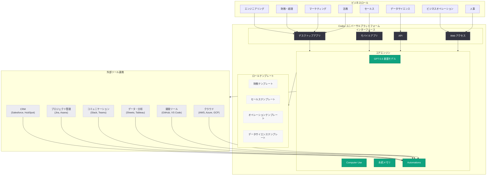

# Codex があらゆる職種・ツール・ワークフローに対応: ユニバーサル AI ワークプラットフォームとしての完成形

## メタデータ

| 項目 | 内容 |
|------|------|
| 発表日 | 2026-06-03 |
| ソース | OpenAI News |
| カテゴリ | Product / Codex |
| 公式リンク | [Codex for Every Role, Tool, and Workflow](https://openai.com/index/codex-for-every-role-tool-workflow/) |

> **注記:** 本レポートは OpenAI サイトマップのメタデータ (lastmod: 2026-06-03)、URL スラッグ、および 2026 年 4 月以降の「Codex for Work」シリーズや関連発表の文脈に基づいて作成している。記事本文へのアクセスは Cloudflare の保護により制限されたため、製品の進化の軌跡と公開情報から内容を構成している。正確な詳細については公式ページを参照されたい。

## 概要

OpenAI は 2026 年 6 月 3 日、「Codex for Every Role, Tool, and Workflow」と題する記事を公開した。本記事は、Codex がコーディングツールからユニバーサル AI ワークプラットフォームへと完全に進化したことを宣言する包括的なハブページと位置づけられる。2026 年 4 月 16 日の「Codex for (almost) everything」によるスーパーアプリ化、5 月の「Codex for Work」シリーズによる職種別ガイドの展開、5 月 13 日のエンタープライズ無料提供を経て、Codex があらゆるビジネスロール、ツール連携、ワークフロー自動化に対応するプラットフォームとして完成したことを総括する内容と推定される。

本発表は、OpenAI が 2026 年を通じて推進してきた「Codex の汎用化戦略」の集大成であり、従来の開発者向けコーディングエージェントという位置づけから、全ての知識労働者が業務で活用できるユニバーサルプラットフォームへの変革を完了したことを示すものである。

## 主な内容

### Codex の進化の軌跡: コーディングツールからユニバーサルプラットフォームへ

Codex は 2026 年に入り、段階的かつ急速にその適用範囲を拡大してきた。本記事はその進化を以下のように総括するものと考えられる。

| 時期 | マイルストーン | 内容 |
|------|-------------|------|
| 2026-03 | セキュリティ・オープンソース対応 | Codex のセキュリティリサーチプレビュー、OSS 開発への適用 |
| 2026-04-02 | チーム向け柔軟な従量課金制 | 企業導入の障壁を低減 |
| 2026-04-16 | Codex for (almost) everything | Computer Use、ブラウザ、画像生成、メモリ、プラグインを統合 |
| 2026-04-21 | Codex Labs / エンタープライズ展開加速 | グローバルコンサルティング企業との連携 |
| 2026-05-12 | Codex for Finance Teams | 財務チーム向け実践ガイド |
| 2026-05-13 | Codex Enterprise Free | エンタープライズ向け無料提供 |
| 2026-05-14 | Codex Mobile Anywhere | モバイル対応 |
| 2026-05-15 | Codex for Business Ops / Sales / Data Science | 各職種向けガイドの一斉公開 |
| 2026-05-16 | ChatGPT - Codex 統合 | ChatGPT と Codex の本格的な融合 |
| 2026-06-03 | **Codex for Every Role, Tool, and Workflow** | **全職種・全ツール・全ワークフロー対応の宣言** |

### あらゆる職種 (Every Role) への対応

Codex は、開発者だけでなく以下のような多様なビジネスロールに対応するプラットフォームとして位置づけられている。

- **エンジニアリング:** コード生成、コードレビュー、デバッグ、アーキテクチャ設計、CI/CD 自動化
- **財務・経理:** MBR 自動作成、差異分析、財務モデルチェック、レポーティングパック生成
- **セールス:** パイプラインブリーフ作成、ミーティング準備、フォーキャスト分析、アカウントプラン策定
- **ビジネスオペレーション:** イニシアチブブリーフ作成、戦略アップデート生成、意思決定パケット構築
- **データサイエンス:** 障害分析ブリーフ、影響レポート、KPI メモ、ダッシュボード仕様書
- **マーケティング:** キャンペーン分析、コンテンツ生成、市場調査レポート
- **人事:** 採用分析、人材評価レポート、オンボーディング資料
- **法務:** 契約書レビュー支援、コンプライアンスチェック、リーガルリサーチ
- **カスタマーサクセス:** チケット分析、顧客インサイトレポート、NPS 分析

### あらゆるツール (Every Tool) との連携

4 月 16 日に導入されたプラグインシステムと Automations 機能により、Codex は企業が利用する主要なビジネスツールとのシームレスな連携を実現している。

**CRM・営業ツール:**
- Salesforce、HubSpot、Pipedrive

**プロジェクト管理:**
- Jira、Asana、Linear、Monday.com

**コミュニケーション:**
- Slack、Microsoft Teams、Notion

**データ・分析:**
- Google Sheets、Excel、Tableau、Looker、Databricks

**開発ツール:**
- GitHub、GitLab、VS Code、JetBrains IDE

**クラウドプラットフォーム:**
- AWS (Amazon Bedrock)、Azure、GCP

**財務・ERP:**
- SAP、Oracle、NetSuite、QuickBooks

これらのツール連携は、プラグインシステムを通じて拡張可能であり、サードパーティ開発者による新規コネクタの開発も可能な設計となっている。

### あらゆるワークフロー (Every Workflow) の自動化

Codex の Automations 機能は、条件ベースのトリガーとワークフロー連鎖により、以下のような業務プロセスを自動化する。

**レポーティングワークフロー:**
- 定期的なデータ収集、集計、レポート生成の完全自動化
- 異常値検出時の自動アラートとブリーフ作成

**意思決定支援ワークフロー:**
- 複数データソースからの情報統合
- 選択肢の比較分析と推奨案の提示
- ステークホルダー向け資料の自動生成

**コラボレーションワークフロー:**
- 会議メモからアクションアイテムの自動抽出と担当者割り当て
- プロジェクト進捗の自動追跡と報告
- チーム横断のナレッジ共有と文書管理

**カスタマー対応ワークフロー:**
- 問い合わせの自動分類とルーティング
- FAQ からの回答案生成
- エスカレーション判断の支援

## 技術的な詳細

### Codex プラットフォームのアーキテクチャ

Codex がユニバーサルプラットフォームとして機能するための技術基盤は、以下の要素で構成される。

- **GPT-5.5 基盤モデル:** 自然言語理解とコード生成の両方に優れたマルチモーダル AI モデル
- **Computer Use:** デスクトップアプリケーションの直接操作
- **永続メモリ:** セッション間でのコンテキスト保持
- **プラグインシステム:** サードパーティツールとの拡張可能な統合
- **Automations:** 条件ベースのワークフロー自動化エンジン
- **クラウドサンドボックス:** セキュアなコード実行環境
- **Mobile Anywhere:** iOS / Android からのアクセス

### ワークフロー定義の例

```yaml
# Codex Automation: 週次セールスパイプラインレポート
name: weekly-pipeline-report
trigger:
  schedule: "every Monday at 9:00 AM"
steps:
  - name: extract-data
    tool: salesforce
    action: export_pipeline
    params:
      period: last_7_days
      format: csv
  - name: analyze-pipeline
    agent: codex
    prompt: |
      以下のパイプラインデータから VP of Sales 向けの
      週次パイプラインブリーフを作成してください。
      含めるべき要素:
      - エグゼクティブサマリー
      - ステージ別パイプライン内訳
      - パイプラインカバレッジ率
      - トップ 5 大型案件の状況
      - 今週の主要な変動
    input: "{{steps.extract-data.output}}"
  - name: distribute
    tool: slack
    action: post_message
    params:
      channel: "#sales-leadership"
      content: "{{steps.analyze-pipeline.output}}"
```

### ロールテンプレートの構成

```json
{
  "role_template": "business-operations",
  "version": "2.0",
  "capabilities": [
    "initiative_brief",
    "strategy_update",
    "decision_packet",
    "progress_report",
    "stakeholder_communication"
  ],
  "connected_tools": [
    "jira",
    "asana",
    "google_sheets",
    "slack",
    "confluence"
  ],
  "memory_context": {
    "project_history": true,
    "team_preferences": true,
    "organizational_goals": true
  },
  "automations": [
    {
      "name": "weekly-ops-report",
      "trigger": "schedule:monday:09:00",
      "output": "strategy_update"
    }
  ]
}
```

## アーキテクチャ



## 開発者への影響

### プラットフォーム開発者

- **プラグイン開発の機会拡大:** Codex が全職種に対応することで、各ドメイン特化型プラグインの需要が急増。新しいツールコネクタやワークフローテンプレートの開発市場が形成される
- **API 統合の拡充:** Codex API を通じて自社アプリケーションに AI エージェント機能を組み込む選択肢が増加
- **テンプレートマーケットプレイス:** ロール別テンプレートの作成・販売が可能な新しいエコシステムの出現

### エンタープライズ開発者

- **ローコード/ノーコード化の加速:** 非開発者が Codex を通じて自動化を構築できるようになるため、IT 部門の役割がガバナンスと高度な統合に集中する
- **セキュリティとコンプライアンスの考慮:** 多職種が AI エージェントを利用することで、データガバナンス、アクセス制御、監査証跡の設計がより重要になる
- **既存システムとの統合:** レガシーシステムと Codex を接続するためのミドルウェアやアダプタの開発需要が発生

### 個人開発者・フリーランス

- **競争力の向上:** Codex を活用することで、個人でも大規模チームに匹敵する業務処理能力を獲得可能
- **新しいサービスモデル:** Codex ワークフロー構築のコンサルティングやカスタムテンプレート開発という新しい専門領域が出現

## 関連リンク

- [Codex for (almost) everything](https://openai.com/index/codex-for-almost-everything) - スーパーアプリ化発表 (2026-04-16)
- [Codex for Work: Finance Teams](https://openai.com/academy/how-finance-teams-use-codex) - 財務チーム向けガイド (2026-05-12)
- [Codex for Work: Business Operations](https://openai.com/academy/codex-for-work/how-business-operations-teams-use-codex) - ビジネスオペレーション向けガイド (2026-05-15)
- [Codex for Work: Sales Teams](https://openai.com/academy/codex-for-work/how-sales-teams-use-codex) - セールスチーム向けガイド (2026-05-15)
- [Codex for Work: Data Science](https://openai.com/academy/codex-for-work/how-data-science-teams-use-codex) - データサイエンス向けガイド (2026-05-15)
- [Get Codex for your enterprise, free](https://openai.com/index/get-codex-for-your-enterprise-free/) - エンタープライズ無料提供 (2026-05-13)
- [Codex Mobile Anywhere](https://openai.com/index/codex-mobile-anywhere/) - モバイル対応 (2026-05-14)
- [Endava: Building an Agentic Organization with Codex](https://openai.com/index/endava) - エージェンティック組織事例 (2026-05-28)
- [OpenAI News](https://openai.com/news)

## まとめ

「Codex for Every Role, Tool, and Workflow」は、OpenAI が 2026 年を通じて推進してきた Codex の汎用化戦略の到達点を示す発表である。主要なポイントは以下の通りである。

1. **完全なるプラットフォーム化:** Codex はコーディングエージェントから、全ての知識労働者が業務で活用できるユニバーサル AI ワークプラットフォームへと進化を完了した

2. **職種の壁を越えた展開:** エンジニアリング、財務、セールス、オペレーション、データサイエンス、マーケティング、人事、法務など、あらゆるビジネスロールに対応するテンプレートとワークフローが整備された

3. **ツールエコシステムの確立:** プラグインシステムにより主要なビジネスツールとのシームレスな連携が実現し、サードパーティによるエコシステムの拡大が進行中である

4. **ワークフロー自動化の民主化:** Automations 機能と直感的なインターフェースにより、非開発者でも業務プロセスの自動化を構築できるようになった

5. **エンタープライズ戦略の完成:** 無料ティア提供、モバイル対応、多職種対応により、企業全体での Codex 導入を促進する条件が全て整った

本発表は、AI エージェントが「開発者のためのツール」から「全ての働く人のためのプラットフォーム」へと変貌する転換点を象徴するものであり、エンタープライズ AI 市場における OpenAI の支配的な地位を確立する戦略的施策と位置づけられる。
