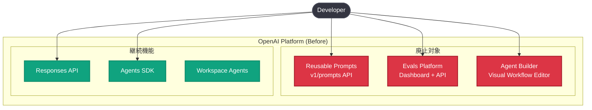
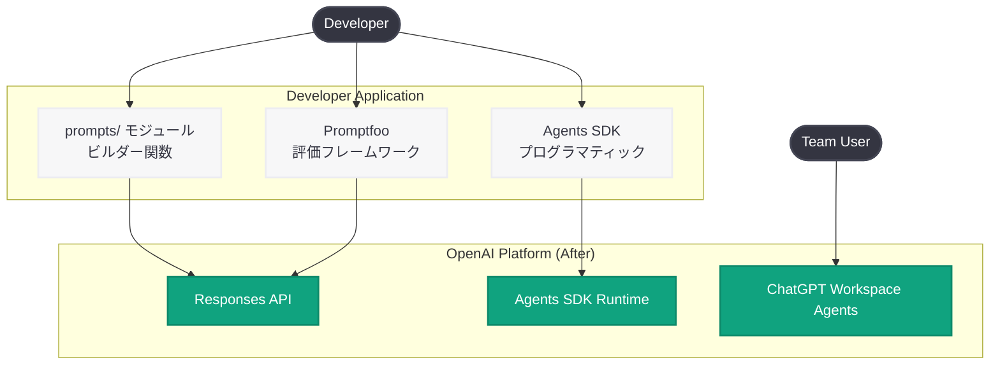

# Reusable Prompts、Evals プラットフォーム、Agent Builder の廃止発表

## メタデータ

| 項目 | 内容 |
|------|------|
| 発表日 | 2026-06-03 |
| ソース | OpenAI API Changelog |
| カテゴリ | API 更新 (Deprecation) |
| 公式リンク | [OpenAI API Changelog](https://developers.openai.com/api/docs/changelog) |

## 概要

OpenAI は 2026 年 6 月 3 日、プラットフォームの 3 つの機能 -- Reusable Prompt Objects (再利用可能なプロンプトオブジェクト)、Evals プラットフォーム、Agent Builder -- の廃止を発表した。いずれも 2026 年 11 月 30 日にシャットダウンが予定されており、開発者には約 6 か月の移行期間が与えられる。

この廃止は、OpenAI がプラットフォームの統合・簡素化を進めていることを示している。プロンプト管理はコードベースへ、評価は外部フレームワーク (Promptfoo) へ、エージェント構築は Agents SDK および ChatGPT Workspace Agents へと移行する方針であり、開発者にはより柔軟でエンジニアリング指向のワークフローが推奨される。

## 主な内容

### 廃止される 3 つの機能

#### 1. Reusable Prompt Objects (再利用可能なプロンプトオブジェクト)

2025 年 6 月 13 日にローンチされた機能で、ダッシュボード上でプロンプトテンプレートを作成・バージョン管理し、Responses API の `prompt` パラメータから参照できる仕組みだった。

- **用途:** プロンプトの一元管理、バージョニング、変数テンプレート
- **廃止理由:** プロンプトをコードリポジトリで管理する方が、PR レビュー・テスト・CI/CD との統合において優れているという判断

#### 2. Evals プラットフォーム

2025 年 10 月 6 日の DevDay でローンチされた評価・テストフレームワーク。モデル出力の品質評価、データセット管理、Trace Evals、Prompt Optimization などの機能を提供していた。

- **用途:** モデル出力の評価、A/B テスト、プロンプト最適化
- **廃止理由:** 外部の専門的な評価フレームワークへの移行を促進

#### 3. Agent Builder

2025 年 10 月 6 日の DevDay でローンチされた、ビジュアル / ノーコードのエージェント作成ツール。マルチエージェントワークフローを GUI で構築できた。

- **用途:** コードなしでのエージェントワークフロー設計・デプロイ
- **廃止理由:** Agents SDK によるプログラマティックなエージェント構築と、ChatGPT Workspace Agents による自然言語ベースのエージェント作成に集約

### シャットダウンタイムライン

| 機能 | 廃止発表 | 読み取り専用化 | シャットダウン | 移行先 |
|------|---------|-------------|------------|--------|
| Reusable Prompts | 2026-06-03 | N/A | 2026-11-30 | コード内インラインプロンプト |
| Evals プラットフォーム | 2026-06-03 | 2026-10-31 | 2026-11-30 | Promptfoo |
| Agent Builder | 2026-06-03 | N/A | 2026-11-30 | Agents SDK / Workspace Agents |

**重要:** Evals プラットフォームは 2026 年 10 月 31 日に読み取り専用となり (新規作成・編集不可)、2026 年 11 月 30 日に完全シャットダウンとなる。ChatKit は影響を受けない。

### 各機能の移行ガイダンス

#### Reusable Prompts からの移行

プロンプトの内容をアプリケーションコードに直接埋め込む。推奨パターンは `prompts/` モジュールを作成し、各プロンプトをビルダー関数として管理する方法。

#### Evals からの移行

OpenAI が公式に推奨する移行先は Promptfoo。Cookbook に「Moving from OpenAI Evals to Promptfoo」が公開されている。

#### Agent Builder からの移行

2 つの移行パスが用意されている:

1. **Agents SDK (コードベース):** 自社インフラでプログラマティックにエージェントを構築・デプロイ
2. **ChatGPT Workspace Agents (自然言語ベース):** チームでコード不要でエージェントを共有

## 技術的な詳細

### Reusable Prompts の移行: Before / After

**Before: プロンプトオブジェクトを参照**

```python
from openai import OpenAI

client = OpenAI()

response = client.responses.create(
    prompt={
        "prompt_id": "pmpt_123",
        "version": "1",
        "variables": {
            "customer_name": "Acme",
            "issue": "billing question",
        },
    }
)
```

**After: インラインプロンプト (推奨パターン)**

```python
from openai import OpenAI

client = OpenAI()


def build_support_prompt(customer_name: str, issue: str) -> list[dict]:
    return [
        {
            "role": "system",
            "content": "You are a helpful support assistant. "
                       "Be concise, accurate, and friendly. "
                       "Do not invent policy details.",
        },
        {
            "role": "user",
            "content": f"Customer name: {customer_name}. "
                       f"Issue: {issue}. "
                       f"Write a response to the customer.",
        },
    ]


response = client.responses.create(
    model="gpt-5.1",
    input=build_support_prompt(
        customer_name="Acme",
        issue="billing question",
    ),
)

print(response.output_text)
```

**TypeScript 版:**

```typescript
import OpenAI from "openai";

const client = new OpenAI();

function buildSupportPrompt({ customerName, issue }: {
  customerName: string;
  issue: string;
}) {
  return [
    {
      role: "system" as const,
      content:
        "You are a helpful support assistant. Be concise, accurate, and friendly.",
    },
    {
      role: "user" as const,
      content:
        `Customer name: ${customerName}. Issue: ${issue}. Write a response to the customer.`,
    },
  ];
}

const response = await client.responses.create({
  model: "gpt-5.1",
  input: buildSupportPrompt({
    customerName: "Acme",
    issue: "billing question",
  }),
});

console.log(response.output_text);
```

### Agent Builder からの移行: Agents SDK パターン

**Python:**

```python
from agents import Agent, Runner

# Agent Builder からエクスポートした定義を基に構築
agent = Agent(
    name="Customer Support Agent",
    instructions="You are a customer support agent. "
                 "Help users resolve their issues efficiently.",
    tools=[],  # Agent Builder のツール設定を移植
)

# エージェントの実行
result = Runner.run_sync(agent, "I need help with my billing.")
print(result.final_output)
```

**TypeScript:**

```typescript
import { Agent, run } from "@openai/agents";

const agent = new Agent({
  name: "Customer Support Agent",
  instructions: "You are a customer support agent. "
    + "Help users resolve their issues efficiently.",
  tools: [],
});

const result = await run(agent, "I need help with my billing.");
console.log(result.finalOutput);
```

### Agent Builder エクスポート手順

1. Agent Builder でワークフローを開く
2. 上部ナビゲーションの **Code** を選択
3. コードダイアログで **Agents SDK** を選択
4. **TypeScript** または **Python** を選択してエクスポートをコピー

### 移行時の重要なポイント

| 項目 | 対応内容 |
|------|---------|
| プロンプト変数 | 関数引数に置き換え (型安全性の確保) |
| バージョン管理 | Git コミット・PR レビュー・テストで管理 |
| キャッシュ最適化 | 静的コンテンツを先頭に配置 (プレフィックス一致でキャッシュヒット) |
| 決定的ワークフロー | Agent Builder の厳密な制御フローは SDK で再実装が必要 |
| 認証・接続アプリ | 別途設定・レビューが必要 |

## アーキテクチャ

### Before: 廃止前のプラットフォーム構成



### After: 移行後のプラットフォーム構成



## 開発者への影響

### 影響を受ける開発者

- **Reusable Prompts 利用者:** Responses API で `prompt` パラメータを使用してプロンプトオブジェクトを参照しているアプリケーション
- **Evals プラットフォーム利用者:** OpenAI ダッシュボードで Evals、Trace Evals、データセット、Prompt Optimization を使用しているチーム
- **Agent Builder 利用者:** ビジュアルエディタでマルチエージェントワークフローを構築・運用しているチーム

### 必要なアクション

1. **即時対応 (2026 年 6 月):**
   - 利用中の廃止機能を棚卸しする
   - 移行計画を策定する
   - Agent Builder のワークフローをコードとしてエクスポートする

2. **中期対応 (2026 年 7-9 月):**
   - プロンプトオブジェクトをコード内ビルダー関数に移行する
   - Evals のテストケースを Promptfoo に移植する
   - Agent Builder のワークフローを Agents SDK で再実装する

3. **最終期限前 (2026 年 10 月):**
   - Evals が読み取り専用になる前に全データをエクスポートする
   - 全移行を完了し、本番環境で検証する
   - 廃止 API への依存を完全に排除する

### メリット

- プロンプトが PR レビュー・CI/CD パイプラインの対象になる
- 評価フレームワークの選択自由度が向上する
- エージェント構築がより柔軟かつプログラマティックになる
- プラットフォームの複雑性が低減する

## 関連リンク

- [OpenAI API Changelog](https://developers.openai.com/api/docs/changelog)
- [OpenAI Deprecations ページ](https://developers.openai.com/api/docs/deprecations)
- [Reusable Prompts 移行ガイド](https://developers.openai.com/api/docs/guides/prompting/migrate-from-prompt-object)
- [Agent Builder 移行ガイド](https://developers.openai.com/api/docs/guides/agent-builder/migrate-from-agent-builder)
- [Moving from OpenAI Evals to Promptfoo (Cookbook)](https://developers.openai.com/cookbook/examples/evaluation/moving-from-openai-evals-to-promptfoo)
- [Agents SDK クイックスタート](https://developers.openai.com/api/docs/guides/agents/quickstart)
- [Agents SDK エージェント定義](https://developers.openai.com/api/docs/guides/agents/define-agents)
- [Agents SDK オーケストレーション](https://developers.openai.com/api/docs/guides/agents/orchestration)

## まとめ

OpenAI は Reusable Prompts、Evals プラットフォーム、Agent Builder の 3 機能を 2026 年 11 月 30 日にシャットダウンする。これはプラットフォームの簡素化と、開発者によりエンジニアリング指向のワークフローを促す戦略的な判断である。移行先はそれぞれ「コード内プロンプト管理」「Promptfoo」「Agents SDK / Workspace Agents」であり、いずれも既存のソフトウェア開発プラクティス (バージョン管理、コードレビュー、CI/CD) との統合を強化する方向性となっている。開発者は 6 か月の猶予期間を活用し、段階的に移行を進めることが推奨される。
