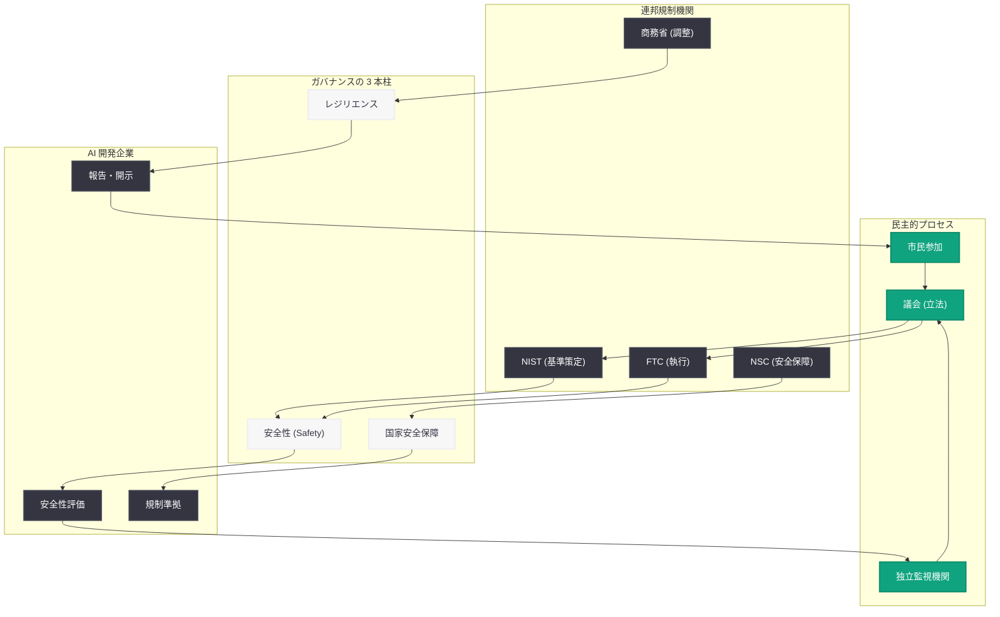

# OpenAI、フロンティア AI の民主的ガバナンスに関するブループリントを発表 — 米国連邦レベルの安全性・レジリエンス・国家安全保障フレームワークを提案

## メタデータ

| 項目 | 内容 |
|------|------|
| 発表日 | 2026-06-03 |
| ソース | OpenAI News/Blog |
| カテゴリ | ガバナンス (Global Affairs) |
| 公式リンク | [openai.com/index/frontier-safety-blueprint](https://openai.com/index/frontier-safety-blueprint) |

> **注:** 本レポートは OpenAI の公開情報、関連する政策文書、および 2026 年 5 月 28 日に発表された Frontier Governance Framework との連続性に基づいて作成しています。

## 概要

OpenAI は 2026 年 6 月 3 日、「A Blueprint for Democratic Governance of Frontier AI」(フロンティア AI の民主的ガバナンスに関するブループリント) を発表した。本ブループリントは、米国における フロンティア AI の連邦レベルでのガバナンスフレームワークを提案するものであり、安全性 (Safety)、レジリエンス (Resilience)、国家安全保障 (National Security) の 3 つの柱を中心に構成されている。

本提案は、2026 年 5 月 28 日に公開された「Frontier Governance Framework」の延長線上に位置づけられ、企業レベルの自主的ガバナンスから一歩踏み込み、米国政府が民主的プロセスを通じてフロンティア AI を規制するための具体的な制度設計を提示している。AI 技術の急速な進歩に伴い、州ごとの規制パッチワークではなく、統一的な連邦フレームワークの必要性を強調する内容となっている。

## 主な内容

### 連邦レベルの安全性フレームワーク

ブループリントの第一の柱である安全性フレームワークは、フロンティア AI モデルの開発・展開に関する統一的な安全基準を連邦レベルで制定することを提案している。

**主要な提案事項:**

- **フロンティアモデルの定義と分類基準:** 計算量閾値、能力評価結果、および潜在的リスクレベルに基づく明確な分類体系の確立
- **安全性評価の義務化:** 一定規模以上のモデルに対し、展開前の安全性評価 (レッドチーミング、能力テスト、バイアス評価) を法的に義務付ける制度
- **段階的展開要件:** フロンティアモデルの段階的なロールアウトと、各段階でのリスク評価を義務付けるプロセス
- **安全性基準の定期的見直し:** AI 技術の進歩に応じて安全性基準を更新する仕組み

| 評価カテゴリ | 対象 | 義務レベル |
|-------------|------|-----------|
| 事前安全性評価 | 全フロンティアモデル | 必須 |
| 第三者監査 | 高リスクモデル | 必須 |
| 継続的モニタリング | 展開済みモデル | 必須 |
| 公開報告 | 全フロンティアモデル | 推奨 |

### レジリエンス措置

レジリエンスの柱は、AI システムの障害や悪用に対する社会全体の耐性を高めるための施策を提案している。

**インフラストラクチャのレジリエンス:**

- AI システムの重要インフラ依存関係の特定と管理
- 障害時のフェイルセーフメカニズムの設計要件
- AI サービスの可用性に関する最低基準の設定
- サプライチェーンの多様化とバックアップ体制

**社会的レジリエンス:**

- AI 生成コンテンツの識別と透明性確保 (ウォーターマーキング、出所証明)
- ディープフェイクや偽情報への対抗措置
- AI リテラシー教育プログラムの推進
- 経済的影響に対するセーフティネットの整備

**組織的レジリエンス:**

- AI 開発企業に対するインシデント報告義務
- 業界横断的な脅威情報共有メカニズム
- AI システムの脆弱性開示プロセスの標準化

### 国家安全保障上の考慮事項

ブループリントは、フロンティア AI が国家安全保障に与える影響について包括的な対策を提案している。

**モデル重みの保護:**

- フロンティアモデルの重み (weights) を戦略的資産として位置づけ
- 国家レベルの攻撃者によるモデル窃取への対策強化
- 輸出管理との連携による技術流出防止
- セキュリティ基準の設定と定期的な監査

**敵対的利用の防止:**

- CBRN (化学・生物・放射線・核) リスクに対する特別な安全対策
- サイバー攻撃能力の制限に関するガイドライン
- 自律型兵器への転用防止措置
- 外国勢力による AI 悪用への監視体制

**政府との協力体制:**

- 国家安全保障関連のリスク評価における政府機関との情報共有
- セキュリティクリアランスを持つ評価者による機密レベルの安全性テスト
- 緊急時の対応プロトコルの事前策定

### 民主的ガバナンスメカニズム

ブループリントの核心である民主的ガバナンスの仕組みは、AI 規制が少数の技術企業や官僚の判断に委ねられることなく、民主的プロセスを通じて決定されることを保証するための制度設計を提案している。

**市民参加の仕組み:**

- パブリックコメント制度の AI 規制への適用
- 市民諮問パネルによる重要な政策決定への参画
- AI 影響評価における市民フィードバックの組み込み
- 定期的な公聴会とステークホルダー協議

**立法府の役割:**

- 議会による AI 政策の最終決定権の確保
- 超党派の AI 委員会の設立提案
- 技術的専門知識の議会への提供体制
- 予算配分を通じた政策優先順位の民主的決定

**透明性とアカウンタビリティ:**

- 規制当局の決定プロセスの公開
- AI 企業による定期的な透明性レポートの義務化
- 独立した監視機関の設置
- 規制の有効性に関する定期的なレビューと公開報告

### 提案される規制構造

ブループリントは、具体的な制度的枠組みとして以下の構造を提案していると考えられる。

**連邦 AI 規制機関:**

- 既存の規制機関 (FTC、NIST、商務省等) の AI 関連権限の明確化
- 新設または既存機関内での専門部門の設置
- 各機関間の調整メカニズムの確立
- 技術的専門性を持つ人材の確保

**規制の階層構造:**

| レベル | 対象 | 規制内容 |
|--------|------|---------|
| 連邦基準 | 全フロンティアモデル | 最低安全性基準、報告義務、展開前評価 |
| セクター別規則 | 特定分野での AI 利用 | 医療、金融、教育等での追加要件 |
| 自主的コミットメント | 業界全体 | ベストプラクティス、自主基準 |
| 州規制との調和 | 州レベル | 連邦基準との整合性確保、プリエンプション |

**国際協力:**

- 同盟国との AI ガバナンス基準の相互認証
- AI Safety Institute 間の連携強化
- 国際的なインシデント報告ネットワーク
- グローバルなリスク評価手法の標準化

## 政策的な詳細

### ガバナンス構造の全体像

### 先行する政策提案との比較

本ブループリントは、以下の既存フレームワークとの関係性を持つ。

| フレームワーク | 発行主体 | 本ブループリントとの関係 |
|---------------|---------|----------------------|
| Frontier Governance Framework (2026-05-28) | OpenAI | 企業レベルの自主的ガバナンス → 連邦制度化の提案 |
| NIST AI Risk Management Framework | NIST | 技術基準として採用・拡張を提案 |
| EU AI Act | EU | 国際的な相互運用性の確保を提案 |
| Executive Order on AI (2023) | 米国大統領府 | 行政命令の立法化を提案 |
| UK AI Safety Institute | 英国政府 | 同盟国との連携モデルとして参照 |

### 提案のタイムライン (推定)

ブループリントは段階的な実施を提案していると考えられる。

1. **短期 (6-12 か月):** 既存機関の権限明確化、自主的コミットメントの制度化
2. **中期 (1-2 年):** 連邦安全性基準の立法化、報告義務の制定
3. **長期 (2-3 年):** 包括的な連邦 AI 規制法の制定、国際的な相互認証体制の構築

## 開発者への影響

- **統一的な規制環境:** 州ごとに異なる規制のパッチワークが連邦基準に統一されることで、コンプライアンスコストの削減と事業計画の予測可能性が向上する可能性がある
- **安全性評価の標準化:** 連邦レベルでの安全性評価基準が確立されることで、モデル提供者と API 利用者の間の責任分界点がより明確になる
- **報告義務への対応:** AI 開発企業には定期的な安全性報告やインシデント報告が義務付けられる可能性があり、コンプライアンス体制の整備が必要になる
- **イノベーションへの影響:** 規制の設計次第では、中小規模の AI 開発者への参入障壁が生じる懸念がある一方、安全性基準の明確化によりイノベーションが促進される可能性もある
- **国際展開の円滑化:** 連邦基準が EU AI Act 等の国際規制と整合する場合、米国拠点の開発者がグローバル市場に展開する際の法的不確実性が軽減される

## 関連リンク

- [A Blueprint for Democratic Governance of Frontier AI (公式)](https://openai.com/index/frontier-safety-blueprint)
- [OpenAI Frontier Governance Framework (2026-05-28)](https://openai.com/index/openai-frontier-governance-framework)
- [OpenAI Safety](https://openai.com/safety)
- [OpenAI Preparedness Framework](https://openai.com/safety/preparedness)
- [NIST AI Risk Management Framework](https://www.nist.gov/artificial-intelligence/risk-management-framework)
- [Executive Order on AI (2023)](https://www.whitehouse.gov/briefing-room/presidential-actions/2023/10/30/executive-order-on-the-safe-secure-and-trustworthy-development-and-use-of-artificial-intelligence/)
- [OpenAI News](https://openai.com/news)

## まとめ

OpenAI が発表した「A Blueprint for Democratic Governance of Frontier AI」は、フロンティア AI の米国連邦レベルでの民主的ガバナンスに関する包括的な提案である。安全性 (Safety)、レジリエンス (Resilience)、国家安全保障 (National Security) の 3 本柱を中心に、市民参加、議会の役割、透明性とアカウンタビリティを組み込んだ民主的な規制構造を提示している。

2026 年 5 月 28 日に公開された企業レベルの Frontier Governance Framework から一歩進み、AI ガバナンスを国家制度として確立するための具体的な制度設計を提案した点で、AI 政策議論における重要なマイルストーンと位置づけられる。連邦統一基準の確立は、州ごとの規制の分断を解消し、AI 開発者にとっての予測可能性を高める一方で、規制の具体的な設計とイノベーションとのバランスが今後の議論の焦点となる。

本ブループリントは、OpenAI が AI 開発企業としての立場からだけでなく、AI ガバナンスの政策設計にも積極的に関与する姿勢を明確に示すものであり、今後の米国における AI 立法プロセスに影響を与える可能性がある。
