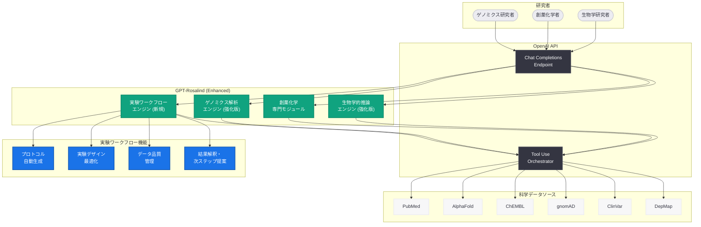
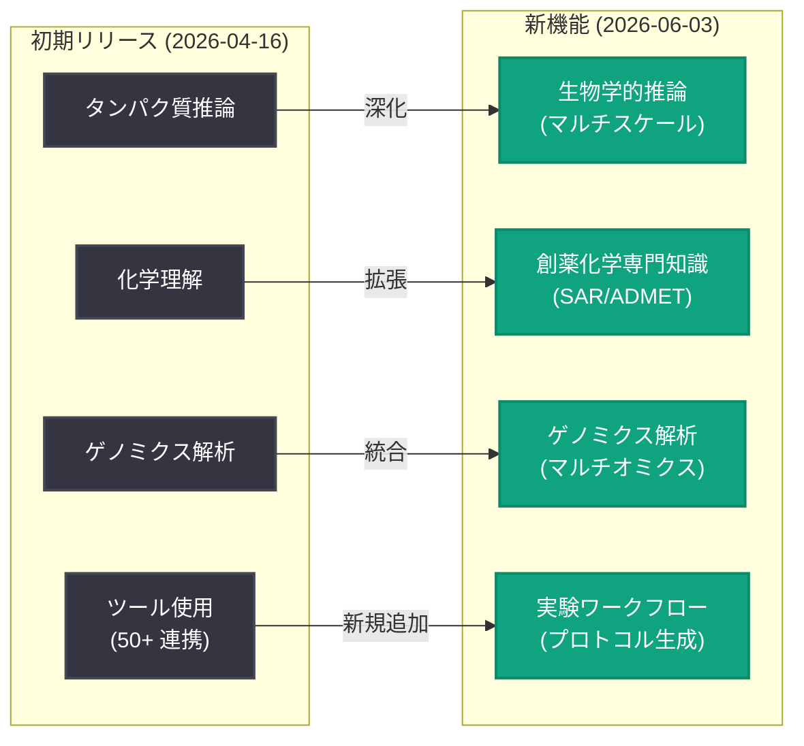

# GPT-Rosalind に新機能を導入: 生物学的推論、創薬化学、ゲノミクス解析の大幅強化

## メタデータ

| 項目 | 内容 |
|------|------|
| 発表日 | 2026-06-03 |
| ソース | OpenAI News/Blog |
| カテゴリ | 新機能 (Product) |
| 公式リンク | [Introducing new capabilities to GPT-Rosalind](https://openai.com/index/introducing-new-capabilities-to-gpt-rosalind) |

> **注記:** 本レポートは RSS フィードの説明文、GPT-Rosalind の過去の発表内容 (2026 年 4 月 16 日の初期発表、5 月 29 日の Rosalind Biodefense プログラム)、および OpenAI の能力拡張に関する公開情報に基づいて作成している。記事本文へのアクセスが制限されているため、公開されたメタデータと関連コンテキストから内容を構成している。

## 概要

OpenAI は 2026 年 6 月 3 日、ライフサイエンス研究特化型モデル「GPT-Rosalind」に対する大規模な機能拡張を発表した。今回のアップデートでは、生物学的推論 (biological reasoning) の強化、創薬化学 (medicinal chemistry) の専門知識の追加、ゲノミクス解析能力の向上、および実験ワークフロー機能の新規導入が含まれる。

GPT-Rosalind は 2026 年 4 月 16 日に信頼アクセスプログラム (Trusted Access Program) を通じた限定的な研究プレビューとして初めて発表されたモデルである。今回の機能拡張は、初期リリースから約 7 週間での大規模アップデートであり、実際の研究現場からのフィードバックを反映した実践的な改善が中心となっている。ライフサイエンス分野における AI 活用の加速と、創薬プロセスの効率化に向けた OpenAI の継続的な投資を示す重要な発表である。

## 主な内容

### 生物学的推論 (Biological Reasoning) の強化

今回のアップデートの中核となるのが、生物学的推論能力の大幅な強化である。GPT-Rosalind は初期リリース時点でも化学やタンパク質工学に関する推論能力を備えていたが、新バージョンではより複雑な生物学的メカニズムの理解と推論が可能になった。

**強化されたポイント:**

- **マルチスケール生物学的推論:** 分子レベル (タンパク質-リガンド相互作用) から細胞レベル (シグナル伝達パスウェイ)、組織・個体レベル (表現型発現) まで、異なるスケール間の因果関係を統合的に推論する能力
- **メカニズムベースの仮説生成:** 観察されたデータから生物学的メカニズムの仮説を自動生成し、検証可能な実験デザインを提案する機能
- **時系列的な生物学的プロセスの理解:** 遺伝子発現の動態、タンパク質の翻訳後修飾カスケード、細胞分化過程など、時間的に変化する生物学的プロセスの推論精度が向上
- **エビスタティック相互作用の予測:** 複数の遺伝子変異が組み合わさった際の非線形な表現型効果の予測能力

これにより、単一のタンパク質や遺伝子に関する質問応答だけでなく、複雑な生物システム全体の挙動を推論するユースケースが実現可能になる。

### 創薬化学 (Medicinal Chemistry) の専門知識

GPT-Rosalind に新たに追加された創薬化学の専門知識は、初期リリースの「化学分野の深い理解」を大幅に拡張するものである。創薬プロセスにおけるリード化合物の最適化から候補化合物の選定までをカバーする実践的な能力が追加された。

**新規追加された能力:**

| 能力 | 説明 |
|------|------|
| SAR 解析 (構造活性相関) | 化合物の構造変化と生物活性の関係を体系的に分析し、最適化方向を提案 |
| ADMET 予測 | 吸収 (Absorption)、分布 (Distribution)、代謝 (Metabolism)、排泄 (Excretion)、毒性 (Toxicity) プロファイルの予測 |
| リード最適化戦略 | ヒット化合物からリード化合物への最適化における構造修飾の提案 |
| 合成経路設計 | ターゲット化合物への合成ルートの提案と反応条件の最適化 |
| 特許回避設計 | 既存特許を考慮したスキャフォールドホッピングの提案 |
| 物性予測 | LogP、溶解度、pKa、代謝安定性などの物理化学的特性の予測 |

これらの能力は、Amgen をはじめとする製薬企業パートナーからのフィードバックに基づいて開発されたものと推測される。

### ゲノミクス解析能力の向上

ゲノミクス解析に関しても、初期リリースから大幅な能力向上が実現された。特に、大規模ゲノムデータの解釈と臨床的意義の評価において精度が向上している。

**強化されたゲノミクス機能:**

- **バリアントインタープリテーション:** ACMG/AMP ガイドラインに準拠したバリアント分類の精度向上。VUS (Variants of Uncertain Significance) の再分類を支援する根拠生成機能
- **トランスクリプトーム解析:** RNA-seq データの差次発現解析結果の生物学的解釈、エンリッチメント解析結果の文脈化
- **マルチオミクス統合:** ゲノミクス、トランスクリプトミクス、プロテオミクス、メタボロミクスの各レイヤーのデータを統合した包括的な解析支援
- **薬理ゲノミクス:** 遺伝的バリアントと薬物応答の関係予測。個別化医療 (precision medicine) のための投薬ガイダンス支援
- **がんゲノミクス:** 腫瘍変異負荷 (TMB) の評価、ドライバー変異の同定、分子標的治療の選択支援

### 実験ワークフロー機能

今回のアップデートで最も革新的な追加機能が、実験ワークフロー機能である。GPT-Rosalind が単なる解析・推論ツールから、実験の計画・実行・評価までを支援するエンドツーエンドの研究アシスタントへと進化したことを示す。

**新規ワークフロー機能:**

- **実験プロトコル生成:** 研究目的と利用可能なリソースに基づいて、詳細な実験プロトコルを自動生成。試薬リスト、機器設定、タイムライン、コントロール条件を含む
- **実験デザインの最適化:** 統計的検出力分析に基づくサンプルサイズの算出、適切なコントロール群の設計、交絡因子の特定と対処法の提案
- **データ品質管理:** 生データの品質評価、外れ値検出、バッチエフェクトの同定と補正方法の提案
- **再現性チェックリスト:** 実験の再現性を確保するための標準化されたチェックリストの生成。ARRIVE ガイドライン、MIAME 基準などの国際的な報告基準への準拠支援
- **結果の解釈と次ステップ:** 実験結果に基づく統計的検定の選択、結果の生物学的解釈、後続実験の提案を含むワークフロー

## 技術的な詳細

### API の利用: 新機能を活用したコード例

GPT-Rosalind の新機能は、引き続き OpenAI API の Chat Completions エンドポイントを通じてアクセス可能である。以下は新たに追加された機能を活用するコードサンプルである。

### 生物学的推論の強化を活用した例

```python
from openai import OpenAI

client = OpenAI()

# マルチスケール生物学的推論: シグナル伝達パスウェイの解析
response = client.chat.completions.create(
    model="gpt-rosalind",
    messages=[
        {
            "role": "system",
            "content": (
                "You are an expert in systems biology and signal transduction. "
                "Perform multi-scale biological reasoning, connecting molecular "
                "events to cellular phenotypes and therapeutic implications."
            )
        },
        {
            "role": "user",
            "content": """Analyze the following observation and provide multi-scale reasoning:

Observation: In a CRISPR screen of NSCLC cell lines, knockout of KEAP1
showed synthetic lethality with glutaminase inhibition (CB-839).

Please provide:
1. Molecular mechanism: How does KEAP1 loss affect NRF2 signaling?
2. Metabolic consequences: How does NRF2 activation alter glutamine dependency?
3. Cellular phenotype: Why does this create a therapeutic vulnerability?
4. Clinical translation: What patient population would benefit from this combination?
5. Testable hypotheses for validation experiments"""
        }
    ],
    max_tokens=8192
)

print(response.choices[0].message.content)
```

### 創薬化学専門知識を活用した ADMET 予測

```python
from openai import OpenAI

client = OpenAI()

# 創薬化学: リード化合物の最適化提案
compound_profile = """
Compound ID: ROS-2847
Target: CDK4/6 (selective)
SMILES: CC(=O)Nc1ccc(N2CCN(c3ccc(NC(=O)c4ccncc4)cc3)CC2)cc1
IC50 (CDK4): 8 nM
IC50 (CDK6): 12 nM
Selectivity vs CDK2: >500x

Current ADMET Issues:
- Microsomal stability (HLM): t1/2 = 15 min (poor)
- hERG IC50: 3.2 uM (moderate risk)
- Aqueous solubility: 2.1 ug/mL (poor)
- CYP3A4 inhibition: IC50 = 1.8 uM (high risk)
- Oral bioavailability (rat): 12%
"""

response = client.chat.completions.create(
    model="gpt-rosalind",
    messages=[
        {
            "role": "system",
            "content": (
                "You are a medicinal chemist specializing in lead optimization. "
                "Analyze compound profiles and suggest structural modifications "
                "to improve ADMET properties while maintaining target potency. "
                "Provide specific SAR rationale for each suggestion."
            )
        },
        {
            "role": "user",
            "content": f"""Optimize the following lead compound:

{compound_profile}

Please provide:
1. Root cause analysis: Which structural features contribute to each ADMET liability?
2. Prioritized modifications: Rank 3-5 structural changes by expected impact
3. Predicted property changes for each modification
4. Synthetic accessibility assessment for proposed analogs
5. Recommended in vitro assay cascade for validation"""
        }
    ],
    max_tokens=8192
)

print(response.choices[0].message.content)
```

### ゲノミクス解析: マルチオミクス統合

```python
from openai import OpenAI

client = OpenAI()

# マルチオミクス統合解析の支援
multi_omics_data = """
Patient: Metastatic breast cancer, HR+/HER2-
Genomics (WES):
- PIK3CA H1047R (VAF: 35%)
- ESR1 Y537S (VAF: 22%)
- TP53 R175H (VAF: 48%)
- FGFR1 amplification (CN: 8)

Transcriptomics (RNA-seq):
- ESR1 pathway: significantly upregulated (NES: 2.4)
- PI3K/AKT/mTOR: significantly upregulated (NES: 2.1)
- Cell cycle genes: highly enriched (NES: 3.1)
- Immune signature: low (CYT score: 0.12)

Proteomics (RPPA):
- p-AKT (S473): elevated 3.2x vs normal
- p-S6K: elevated 2.8x
- Cyclin D1: elevated 4.1x
- PD-L1: low expression

Treatment History:
- Letrozole + Palbociclib: PD after 18 months
- Fulvestrant + Alpelisib: PD after 8 months
"""

response = client.chat.completions.create(
    model="gpt-rosalind",
    messages=[
        {
            "role": "system",
            "content": (
                "You are a precision oncology specialist integrating multi-omics "
                "data for treatment decisions. Synthesize genomic, transcriptomic, "
                "and proteomic evidence to identify actionable targets and "
                "recommend evidence-based treatment strategies."
            )
        },
        {
            "role": "user",
            "content": f"""Perform integrated multi-omics analysis:

{multi_omics_data}

Provide:
1. Molecular portrait: Synthesize findings across omics layers
2. Resistance mechanisms: Explain prior treatment failures
3. Actionable targets: Rank by evidence level (OncoKB/CIViC)
4. Treatment recommendations: First-line and contingency options
5. Clinical trial matching: Suggest relevant trial designs
6. Pharmacogenomic considerations"""
        }
    ],
    max_tokens=8192
)

print(response.choices[0].message.content)
```

### 実験ワークフロー: プロトコル自動生成

```python
from openai import OpenAI

client = OpenAI()

# 実験ワークフロー: CRISPR スクリーニングプロトコルの自動生成
response = client.chat.completions.create(
    model="gpt-rosalind",
    messages=[
        {
            "role": "system",
            "content": (
                "You are an experimental biology workflow assistant. "
                "Generate detailed, reproducible experimental protocols "
                "following ARRIVE guidelines and field-specific best practices. "
                "Include reagent lists, equipment specifications, timeline, "
                "quality control checkpoints, and statistical analysis plans."
            )
        },
        {
            "role": "user",
            "content": """Design a complete experimental protocol for:

Objective: Genome-wide CRISPR knockout screen to identify synthetic lethal
partners with PARP inhibitor (olaparib) in BRCA1-wildtype ovarian cancer.

Constraints:
- Cell line: OVCAR-8 (BRCA1-wt, HR-proficient)
- Library: Brunello (77,441 sgRNAs, 19,114 genes)
- Available sequencing: NovaSeq 6000, 2x150bp
- Timeline: Must complete within 8 weeks
- Budget: Moderate (justify cost-critical decisions)

Generate:
1. Complete step-by-step protocol with timing
2. Reagent and consumables list with catalog numbers
3. Quality control checkpoints at each stage
4. Sequencing strategy and analysis pipeline
5. Statistical framework for hit identification
6. Validation strategy for top hits"""
        }
    ],
    max_tokens=12000
)

print(response.choices[0].message.content)
```

### ツール連携: 実験ワークフロー自動化

```python
from openai import OpenAI

client = OpenAI()

# 実験ワークフロー機能とツール連携の統合
response = client.chat.completions.create(
    model="gpt-rosalind",
    messages=[
        {
            "role": "system",
            "content": (
                "You are a research workflow coordinator that integrates "
                "wet lab experiments with computational analysis. "
                "Use available tools to retrieve relevant data and design "
                "optimal experimental approaches."
            )
        },
        {
            "role": "user",
            "content": (
                "I have RNA-seq data showing upregulation of SLC7A11 in my "
                "KEAP1-null cell line. Design a validation experiment to confirm "
                "this drives ferroptosis resistance, and suggest a combination "
                "strategy to overcome it."
            )
        }
    ],
    tools=[
        {
            "type": "function",
            "function": {
                "name": "search_pubmed",
                "description": "Search PubMed for relevant literature",
                "parameters": {
                    "type": "object",
                    "properties": {
                        "query": {
                            "type": "string",
                            "description": "PubMed search query"
                        },
                        "max_results": {
                            "type": "integer",
                            "description": "Maximum results to return"
                        }
                    },
                    "required": ["query"]
                }
            }
        },
        {
            "type": "function",
            "function": {
                "name": "design_experiment",
                "description": "Generate detailed experimental protocol",
                "parameters": {
                    "type": "object",
                    "properties": {
                        "objective": {
                            "type": "string",
                            "description": "Experimental objective"
                        },
                        "assay_type": {
                            "type": "string",
                            "description": "Type of assay (e.g., viability, Western blot)"
                        },
                        "cell_lines": {
                            "type": "array",
                            "items": {"type": "string"},
                            "description": "Cell lines to use"
                        },
                        "controls": {
                            "type": "array",
                            "items": {"type": "string"},
                            "description": "Control conditions"
                        }
                    },
                    "required": ["objective", "assay_type"]
                }
            }
        },
        {
            "type": "function",
            "function": {
                "name": "query_depmap",
                "description": "Query DepMap for gene dependency data",
                "parameters": {
                    "type": "object",
                    "properties": {
                        "gene": {
                            "type": "string",
                            "description": "Gene symbol"
                        },
                        "context": {
                            "type": "string",
                            "description": "Cancer type or lineage filter"
                        }
                    },
                    "required": ["gene"]
                }
            }
        }
    ],
    tool_choice="auto",
    max_tokens=8192
)

# ツール呼び出しの結果を処理
for choice in response.choices:
    message = choice.message
    if message.tool_calls:
        for tool_call in message.tool_calls:
            print(f"Tool: {tool_call.function.name}")
            print(f"Arguments: {tool_call.function.arguments}")
    else:
        print(message.content)
```

> **注:** 上記のコードサンプルは、公開情報に基づく想定的な利用パターンである。実際の API パラメータおよびツール定義の詳細は OpenAI の公式ドキュメントを参照されたい。

## アーキテクチャ



### 新機能の位置付け: 初期リリースからの進化



## 開発者への影響

### 既存ユーザーへのインパクト

GPT-Rosalind の新機能追加は、信頼アクセスプログラムに参加済みの開発者および研究機関に対して、即座に以下の恩恵をもたらす。

- **創薬パイプラインの効率化:** SAR 解析と ADMET 予測の自動化により、リード最適化サイクルの高速化が期待できる。従来は計算化学者の専門知識が必要だったタスクが、API を通じてプログラマティックにアクセス可能になる
- **マルチオミクス解析の民主化:** ゲノミクス、トランスクリプトミクス、プロテオミクスの統合解析を単一のモデル呼び出しで実行できるため、バイオインフォマティクスの専門チームを持たない研究グループでも高度な解析が可能になる
- **実験計画の標準化:** ワークフロー機能によるプロトコル自動生成は、研究の再現性向上に貢献する。ARRIVE ガイドラインや MIAME 基準への自動準拠により、出版時の報告品質が向上する
- **ウェットラボとドライラボの橋渡し:** 実験デザインから計算解析、結果の解釈までをシームレスに接続するワークフローにより、研究者のコンテキストスイッチングが削減される

### アクセスと提供形態の変化

初期リリース時の厳格な信頼アクセスプログラムからの緩和が進んでいる可能性がある。5 月 29 日の Rosalind Biodefense プログラムではバイオディフェンス機関への拡大が行われており、今回の機能追加により、より広範な研究コミュニティへのアクセス拡大が期待される。

- **API ユーザー:** 既存の `model="gpt-rosalind"` パラメータでアップデートされた機能にアクセス可能と推定される
- **ChatGPT ユーザー:** ChatGPT 内での研究プレビューとして強化された機能が利用可能
- **Codex 統合:** Life Sciences Research Plugin との連携が引き続きサポートされ、新たなツール定義が追加された可能性がある

### 競争環境への影響

- **Google DeepMind AlphaFold 3 との差別化拡大:** GPT-Rosalind は構造予測に留まらず、創薬化学の実践的な最適化やゲノミクスの臨床解釈まで包括的にカバーすることで、AlphaFold との明確な差別化を実現
- **Recursion Pharmaceuticals、Insilico Medicine 等の AI 創薬スタートアップとの競合:** ADMET 予測やリード最適化など、これまで専門企業が提供してきた機能が汎用 API として利用可能になることで、業界構造に変化が生じる可能性がある
- **実験ワークフロー機能の独自性:** 計算予測と実験設計の統合は、現時点で競合モデルには見られない GPT-Rosalind 独自の差別化要因である

## 関連リンク

- [Introducing new capabilities to GPT-Rosalind](https://openai.com/index/introducing-new-capabilities-to-gpt-rosalind)
- [GPT-Rosalind 初期発表 (2026-04-16)](https://openai.com/index/introducing-gpt-rosalind)
- [Rosalind Biodefense プログラム (2026-05-29)](https://openai.com/index/strengthening-societal-resilience-with-rosalind-biodefense)
- [OpenAI Trusted Access Program](https://openai.com/index/scaling-trusted-access-for-cyber-defense)
- [OpenAI API ドキュメント](https://platform.openai.com/docs)
- [OpenAI Research](https://openai.com/research)

## まとめ

GPT-Rosalind への新機能導入は、2026 年 4 月の初期リリースから約 7 週間で実現された大規模なアップデートであり、OpenAI がライフサイエンス AI 分野への投資を加速していることを示す。生物学的推論の強化、創薬化学の専門知識追加、ゲノミクス解析能力の向上、そして実験ワークフロー機能の新規導入という 4 つの柱は、いずれも実際の研究現場における実践的なニーズに応えるものである。

特に注目すべきは、実験ワークフロー機能の追加である。GPT-Rosalind が単なる「知識を持つ AI」から「研究プロセス全体を支援するパートナー」へと進化したことを意味し、ウェットラボの実験設計から計算解析、結果の解釈までをシームレスに統合する能力は、ライフサイエンス研究の効率化に大きく貢献する可能性がある。

創薬プロセスの 10 年から 15 年というタイムラインの短縮に向け、GPT-Rosalind は着実にその能力を拡充している。Amgen、Novo Nordisk をはじめとする製薬大手との協業を通じたフィードバックループが機能していることが、今回の迅速な機能拡張からも読み取れる。今後は信頼アクセスプログラムの対象拡大と、さらなる専門機能の追加が期待される。
