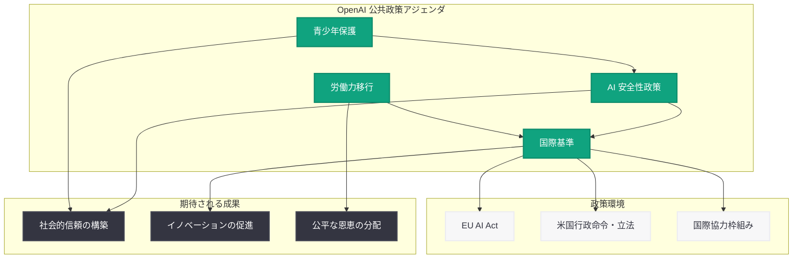

# OpenAI、包括的な公共政策アジェンダを発表 -- AI の安全性、青少年保護、労働力移行、国際基準の 4 本柱を提示

## メタデータ

| 項目 | 内容 |
|------|------|
| 発表日 | 2026-06-03 |
| ソース | OpenAI News/Blog |
| カテゴリ | ガバナンス (Global Affairs) |
| 公式リンク | [openai.com/index/public-policy-agenda](https://openai.com/index/public-policy-agenda) |

> **注:** 本レポートは OpenAI の公開情報、同日発表された Frontier Safety Blueprint、および 2026 年 5 月下旬から 6 月初旬にかけて公開された一連のガバナンス関連文書に基づいて作成しています。

## 概要

OpenAI は 2026 年 6 月 3 日、AI の社会的恩恵を最大化するための包括的な公共政策アジェンダを発表した。本アジェンダは、AI の安全性政策 (Safety)、青少年保護 (Youth Protection)、労働力移行 (Workforce Transition)、および国際基準 (Global Standards) の 4 つの柱で構成されており、OpenAI が考える AI ガバナンスの全体像を示す文書となっている。

本発表は、同日公開された「A Blueprint for Democratic Governance of Frontier AI」(フロンティア安全性ブループリント) と並行して行われたものであり、ブループリントが米国連邦レベルの制度設計に焦点を当てているのに対し、本アジェンダはより広範な社会課題に対する政策提言を包括的に示している。2026 年 6 月 1 日の「AI に関する見解」(Views on AI Policy)、6 月 2 日の「青少年の安全性推進」(Advancing Youth Safety) と合わせ、OpenAI が 3 日間にわたって展開した政策提言シリーズの集大成と位置付けられる。

## 主な内容

### AI 安全性政策

公共政策アジェンダの第一の柱として、AI の安全性に関する政策提言が含まれている。

**主要な提案事項:**

- **リスクベースの規制アプローチ:** AI システムの能力と潜在的リスクに応じた段階的な規制の導入
- **安全性評価の標準化:** フロンティアモデルの展開前に実施すべき安全性評価の統一基準の確立
- **第三者評価の制度化:** 独立した評価機関による AI モデルの安全性検証を制度として確立
- **インシデント報告制度:** AI システムに起因する事故やリスク事象の報告義務化と情報共有メカニズムの構築
- **レッドチーミングの推進:** 政府機関と民間企業が連携した脆弱性発見プログラムの制度化

これらの提案は、同日発表された Frontier Safety Blueprint で示された連邦レベルの安全性フレームワークと整合性を持ち、具体的な制度設計をより広い文脈で支える位置付けとなっている。

### 青少年保護措置

第二の柱として、AI サービスにおける青少年保護に関する具体的な政策提言が示されている。

**保護措置の枠組み:**

| 領域 | 具体的措置 | 対象 |
|------|-----------|------|
| 年齢確認 | 堅牢な年齢確認メカニズムの導入 | 全 AI サービス |
| コンテンツ制限 | 年齢に応じたコンテンツフィルタリング | 未成年ユーザー |
| 保護者管理 | 保護者向けの監視・管理ツールの提供 | 家庭環境 |
| データ保護 | 未成年者のデータ収集・利用の厳格な制限 | プラットフォーム全体 |
| 教育連携 | 教育機関との協力による安全な AI 利用の推進 | 学校・教育機関 |

**政策提言のポイント:**

- 業界全体での青少年保護基準の策定と遵守
- プライバシーを保護しつつ効果的な年齢確認を実現する技術的アプローチの研究支援
- AI リテラシー教育プログラムへの公的投資
- 未成年者に対する有害コンテンツ生成の防止に関する技術基準の策定
- 青少年のメンタルヘルスへの影響に関する継続的な調査研究の支援

OpenAI は 2026 年 6 月 2 日に「Advancing Youth Safety」を公開しており、本アジェンダはその具体的な政策面での展開と位置付けられる。また、2026 年 4 月の「Child Safety Blueprint」や、同年 3 月の「Japan Teen Safety Blueprint」など、地域別の青少年保護施策とも連続性を持つ。

### 労働力移行計画

第三の柱として、AI の普及に伴う労働市場の変化に対応するための政策提言が含まれている。

**労働力移行の枠組み:**

- **スキル開発への投資:** AI 時代に必要とされるスキルの特定と、リスキリング・アップスキリングプログラムへの公的投資の拡大
- **移行期のセーフティネット:** AI による雇用変化の影響を受ける労働者に対する経済的支援制度の設計
- **AI 活用による生産性向上:** 労働者が AI ツールを活用して生産性を向上させるための教育・トレーニングの推進
- **中小企業支援:** AI 導入に関する中小企業向けの技術支援と補助金制度の提案
- **雇用影響の継続的モニタリング:** AI の雇用への影響を定期的に測定・報告する仕組みの構築

**想定されるタイムライン:**

1. **短期 (1 年以内):** 既存の教育プログラムへの AI カリキュラム組み込み、影響調査の開始
2. **中期 (1-3 年):** 大規模リスキリングプログラムの展開、セーフティネットの制度設計
3. **長期 (3 年以上):** AI と人間の協働を前提とした労働市場制度の再設計

OpenAI は 2026 年 4 月に「AI Jobs Transition Framework」を公開しており、本アジェンダはその政策提言面での発展形と考えられる。

### 国際基準の提案

第四の柱として、AI ガバナンスに関する国際的な基準・枠組みの構築に関する提言が含まれている。

**国際協力の枠組み:**

- **相互運用可能な規制フレームワーク:** 各国の AI 規制が相互に認識可能で、企業が複数法域で事業を展開しやすい枠組みの構築
- **国際安全性基準の策定:** OECD や G7 などの国際枠組みを通じた AI 安全性基準の共同策定
- **AI Safety Institute の国際連携:** 各国の AI Safety Institute 間の情報共有と共同評価の制度化
- **輸出管理の調整:** AI 技術の輸出管理に関する同盟国間の調整メカニズム
- **グローバルなインシデント対応:** 国境を越えた AI インシデントに対する国際的な対応プロトコル

### 4 つの柱の相互関係

4 つの柱は独立したものではなく、相互に連携する構造となっている。AI 安全性政策は青少年保護の技術的基盤を提供し、国際基準は安全性評価の相互認証を可能にする。労働力移行は AI の恩恵が公平に分配されることを保証し、全体として AI が社会に利益をもたらすための条件を整備する。

## 規制環境における文脈

### EU AI Act との関係

EU AI Act は 2024 年に成立し、段階的に施行が進んでいる世界初の包括的な AI 規制法である。OpenAI の公共政策アジェンダは、EU AI Act の以下の要素と整合性を持つ。

| EU AI Act の要素 | OpenAI アジェンダとの対応 |
|-----------------|------------------------|
| リスクベースのアプローチ | 安全性政策における段階的規制の提案 |
| 高リスク AI の義務 | 安全性評価の標準化提案 |
| 透明性義務 | 第三者評価と報告制度の提案 |
| 汎用 AI モデル規制 | フロンティアモデルの安全性基準 |
| 脆弱なグループの保護 | 青少年保護措置 |

OpenAI のアジェンダは、EU AI Act と対立するのではなく、米国における類似の規制枠組みの構築を提案しつつ、国際的な相互運用性を確保する方向性を示している。

### 米国の政策環境

米国では 2023 年 10 月の AI に関する大統領行政命令以降、連邦レベルでの AI 規制の議論が続いている。OpenAI のアジェンダは、以下の文脈に位置づけられる。

- **連邦立法の推進:** 州ごとの規制のパッチワーク (カリフォルニア州 SB 1047 の議論等) に対し、統一的な連邦基準の必要性を主張
- **行政命令の立法化:** 大統領行政命令で示された方向性を、より安定した立法の形で制度化することを提案
- **NIST フレームワークの活用:** NIST AI Risk Management Framework を技術基準の基盤として位置付け
- **超党派アプローチ:** AI 規制を党派的な議論から離れ、安全性とイノベーションの両立という共通目標に焦点を当てる

### OpenAI の政策提言の時系列

| 日付 | 文書 | 焦点 |
|------|------|------|
| 2026-05-28 | Frontier Governance Framework | 企業レベルの自主的ガバナンス |
| 2026-06-01 | Views on AI Policy | AI 政策に関する基本的見解 |
| 2026-06-01 | 最新 Model Spec | モデルレベルの行動規範 |
| 2026-06-02 | Advancing Youth Safety | 青少年保護の具体的施策 |
| 2026-06-03 | Frontier Safety Blueprint | 連邦レベルの制度設計提案 |
| **2026-06-03** | **Public Policy Agenda** | **包括的な政策提言の全体像** |

## 業界および開発者への影響

OpenAI の公共政策アジェンダが実際の政策に反映された場合、AI 業界と開発者に以下の影響が想定される。

- **統一的な規制環境の形成:** 連邦レベルでの基準策定が進めば、州ごとに異なる規制への個別対応が不要になり、コンプライアンスコストが削減される可能性がある
- **安全性投資の正当化:** 安全性評価の義務化により、安全性への投資がコスト要因ではなく事業継続の必須要件として位置付けられる
- **青少年向けサービスの設計変更:** 年齢確認やコンテンツフィルタリングの義務化により、AI サービスの設計に追加的な要件が生じる
- **国際展開の円滑化:** 国際基準の相互認証が進めば、一つの基準でグローバル展開が可能になる
- **中小開発者への影響:** 規制遵守のコストが参入障壁となる懸念がある一方、明確な基準により法的不確実性が解消される利点もある
- **AI 人材市場への影響:** 労働力移行政策が実施されれば、AI スキルを持つ人材の需要と供給のバランスに変化が生じる
- **パートナーシップの機会:** 政府との協力、教育機関との連携、業界団体を通じた共同取り組みの機会が増加する

## 関連リンク

- [OpenAI Public Policy Agenda (公式)](https://openai.com/index/public-policy-agenda)
- [A Blueprint for Democratic Governance of Frontier AI (2026-06-03)](https://openai.com/index/frontier-safety-blueprint)
- [Advancing Youth Safety (2026-06-02)](https://openai.com/index/advancing-youth-safety)
- [OpenAI Frontier Governance Framework (2026-05-28)](https://openai.com/index/openai-frontier-governance-framework)
- [Sharing the Latest Model Spec (2026-06-01)](https://openai.com/index/sharing-the-latest-model-spec/)
- [AI Jobs Transition Framework (2026-04-16)](https://openai.com/index/ai-jobs-transition-framework)
- [Child Safety Blueprint (2026-04-08)](https://openai.com/index/introducing-child-safety-blueprint)
- [OpenAI Safety](https://openai.com/safety)
- [OpenAI News](https://openai.com/news)

## まとめ

OpenAI が 2026 年 6 月 3 日に発表した公共政策アジェンダは、AI の安全性、青少年保護、労働力移行、国際基準の 4 本柱から成る包括的な政策提言文書である。同日公開された Frontier Safety Blueprint が米国連邦レベルの具体的な制度設計に焦点を当てているのに対し、本アジェンダはより広範な社会課題をカバーし、AI が社会全体に利益をもたらすための条件整備を提案している。

2026 年 5 月下旬から 6 月初旬にかけて、OpenAI は Frontier Governance Framework、Model Spec 更新、Views on AI Policy、Advancing Youth Safety、Frontier Safety Blueprint、そして本アジェンダと、短期間に集中的な政策提言を展開した。この一連の動きは、OpenAI が AI 開発企業としてだけでなく、AI ガバナンスの設計者としても積極的な役割を果たす意思を明確に示すものである。

EU AI Act の施行が進み、米国でも連邦レベルの AI 立法が議論される中、OpenAI の包括的な政策アジェンダは今後の規制議論に影響を与える可能性がある。特に、リスクベースのアプローチ、国際的な相互運用性、イノベーションと安全性のバランスという 3 つの原則は、産業界と規制当局の双方にとって議論の出発点となり得る。
