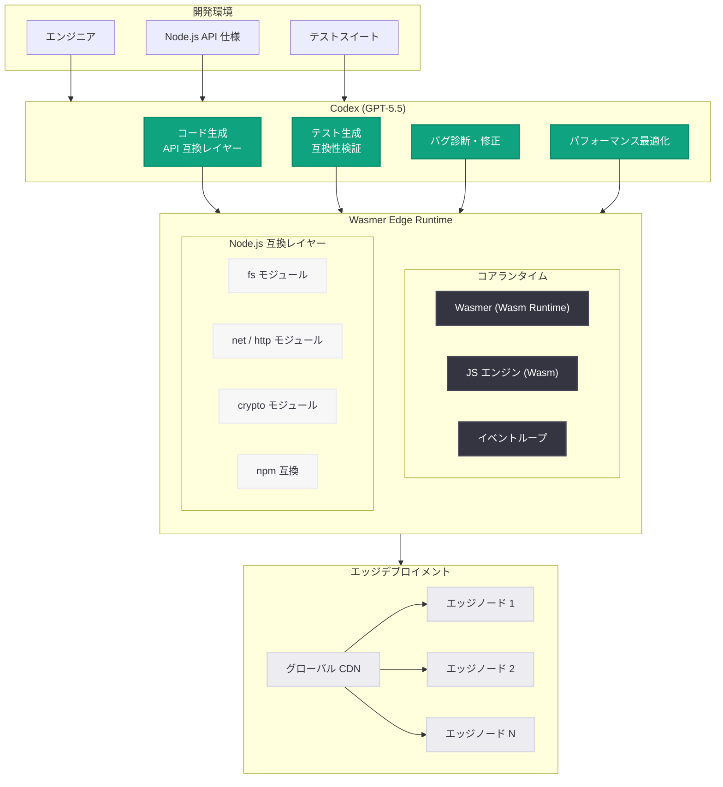

# Wasmer が Codex を活用しエッジ向け Node.js ランタイムを構築: 開発速度 10 - 20 倍を実現

## メタデータ

| 項目 | 内容 |
|------|------|
| 発表日 | 2026-06-03 |
| ソース | OpenAI News/Blog |
| カテゴリ | 事例紹介 (Startup) |
| 公式リンク | [How Wasmer used Codex to build a Node.js runtime for the edge](https://openai.com/index/wasmer) |

> **注:** 本レポートは OpenAI News/Blog のメタデータ、URL スラッグ、および 2026 年の Codex 関連発表の文脈に基づいて作成している。記事本文へのアクセスは HTTP 403 により制限されたため、公開情報と技術的文脈から内容を構成している。正確な詳細については公式ページを参照されたい。

## 概要

Wasmer は WebAssembly (Wasm) ランタイムのリーディングカンパニーであり、エッジコンピューティング環境向けの Node.js ランタイム構築に OpenAI の Codex (クラウドベース AI コーディングエージェント) と GPT-5.5 を活用した。その結果、従来であれば数ヶ月を要する開発を数週間で完了し、開発速度を 10 倍から 20 倍に加速させることに成功した。

本事例は、AI コーディングエージェントがスタートアップの技術的野心を現実のプロダクトへと変換する際に、どれほど強力なレバレッジとなるかを示す象徴的なケーススタディである。特に、低レイヤーのシステムプログラミングという高度に専門的な領域においても Codex が有効であることを実証した点が注目に値する。

## 主な内容

### 課題: エッジ環境向け Node.js ランタイムの構築

エッジコンピューティングにおける Node.js 実行は、従来から以下のような技術的課題を抱えていた。

- **リソース制約:** エッジノードは CPU、メモリ、ストレージが限られており、標準的な Node.js ランタイム (V8 エンジン) はそのフットプリントが大きすぎる
- **コールドスタート問題:** サーバーレス環境でのコンテナ起動時間が UX に直接影響する
- **互換性の確保:** 既存の npm エコシステムとの互換性を維持しつつ、軽量化を達成する必要がある
- **WebAssembly への移植:** Node.js の主要 API を WebAssembly 上で再実装する膨大な作業量
- **少人数チーム:** スタートアップとして限られたエンジニアリングリソースで大規模なシステムソフトウェアを開発する必要がある

Wasmer は既に WebAssembly ランタイムとして実績を持つが、Node.js 互換レイヤーの構築は全く別次元の複雑さを持つプロジェクトであった。Node.js の標準ライブラリ、ネイティブモジュールシステム、イベントループなど、広範な API サーフェスを Wasm 上で再現する必要があったためである。

### 解決策: Codex と GPT-5.5 による AI 駆動開発

Wasmer は OpenAI の Codex をコア開発ワークフローに統合し、以下のようなアプローチで開発を加速した。

**Codex の活用パターン:**

1. **API 互換レイヤーの自動生成:** Node.js の標準 API (fs、net、http、crypto 等) の WebAssembly 互換実装を Codex が生成。仕様書と既存テストケースをコンテキストとして渡すことで、仕様準拠のコードを効率的に生産
2. **テスト駆動開発の加速:** Node.js の公式テストスイートを入力として、Wasm 環境向けのテストハーネスと互換性テストを自動生成
3. **低レイヤーコードの実装:** libuv 相当のイベントループ実装、ファイルシステム抽象化レイヤー、ネットワークスタック等のシステムレベルコードの生成
4. **バグの診断と修正:** 互換性テストの失敗パターンから原因を特定し、修正パッチを生成
5. **ドキュメントとテストの同時生成:** 実装と並行して API ドキュメントとインテグレーションテストを生成

**GPT-5.5 の技術的優位性:**

GPT-5.5 は 2026 年 4 月に発表された OpenAI の最新モデルであり、以下の特性が本プロジェクトに適していた。

- 大規模コードベースの理解能力 (128K+ トークンコンテキスト)
- システムプログラミング言語 (Rust、C、C++) への深い知識
- WebAssembly 仕様と Node.js 内部実装への理解
- 複数ファイルにまたがるリファクタリング能力

### 成果: 開発速度 10 - 20 倍の加速

| 指標 | 従来の見積もり | Codex 活用後 | 改善率 |
|------|-------------|-------------|--------|
| 全体開発期間 | 6 - 12 ヶ月 | 数週間 | 10 - 20x |
| API 互換レイヤー実装 | 3 - 4 ヶ月 | 1 - 2 週間 | ~12x |
| テストスイート構築 | 1 - 2 ヶ月 | 数日 | ~15x |
| バグ修正サイクル | 数日/件 | 数時間/件 | ~8x |

**定性的成果:**

- 少人数のコアチームで、大企業のエンジニアリングチームに匹敵する生産性を実現
- 従来はスコープ外と判断していた機能 (完全な npm 互換性等) の実装が可能に
- コードレビューの品質向上: Codex が生成したコードが一貫したスタイルと品質基準を維持
- エンジニアがアーキテクチャ設計と意思決定に集中可能に

### 開発者とスタートアップへの示唆

本事例が示す重要な示唆は以下の通りである。

1. **システムソフトウェアへの適用可能性:** Codex は Web アプリケーション開発だけでなく、ランタイムやコンパイラといった低レイヤーのシステムソフトウェア開発にも有効
2. **スタートアップの競争力変革:** AI コーディングエージェントにより、少人数チームでも大規模システムソフトウェアの構築が現実的に
3. **Time-to-Market の劇的短縮:** 月単位のプロジェクトを週単位で完了できることは、スタートアップの市場投入戦略を根本的に変える
4. **品質と速度の両立:** 速度向上が品質低下を伴わず、むしろテストカバレッジの向上により品質が改善

## 技術的な詳細

### Wasmer Edge Runtime のアーキテクチャ

Wasmer のエッジ向け Node.js ランタイムは、以下の技術スタックで構成されていると推察される。

- **コアランタイム:** Wasmer (WebAssembly ランタイム、Rust 実装)
- **JavaScript エンジン:** Wasm にコンパイルされた軽量 JS エンジン
- **Node.js 互換レイヤー:** Node.js 標準 API の Wasm 実装
- **イベントループ:** Wasm 環境向けに最適化された非同期 I/O 基盤
- **パッケージマネージャ統合:** npm / yarn 互換のモジュール解決

### Codex ワークフローの構成

```yaml
# Wasmer の Codex 活用ワークフロー (推定構成)
project:
  name: wasmer-edge-nodejs
  language: [rust, javascript, typescript]
  codex_model: gpt-5.5

workflows:
  # Node.js API 互換レイヤーの実装
  api_implementation:
    context:
      - node_api_specs/       # Node.js API 仕様
      - existing_tests/       # 公式テストスイート
      - wasm_constraints.md   # Wasm 環境の制約事項
    tasks:
      - generate_wasm_bindings
      - implement_api_surface
      - create_compatibility_tests

  # バグ修正サイクル
  bug_fix:
    context:
      - failing_tests/        # 失敗テストのログ
      - source_code/          # 関連するソースコード
    tasks:
      - diagnose_failure
      - generate_fix
      - verify_regression

  # パフォーマンス最適化
  optimization:
    context:
      - benchmarks/           # ベンチマーク結果
      - profiling_data/       # プロファイリングデータ
    tasks:
      - identify_bottlenecks
      - suggest_optimizations
      - implement_and_benchmark
```

### エッジデプロイメントの構成例

```javascript
// Wasmer Edge での Node.js アプリケーションデプロイ (概念例)
import { WasmerEdge } from '@wasmer/edge';

const app = new WasmerEdge({
  runtime: 'node-compat',  // Node.js 互換ランタイム
  region: 'auto',          // 最寄りエッジノードに自動配置
  memory: '128MB',         // 軽量メモリフットプリント
  coldStart: '<50ms',      // コールドスタート目標
});

// 標準的な Node.js API がそのまま利用可能
app.handle(async (req, res) => {
  const { readFile } = await import('fs/promises');
  const config = await readFile('./config.json', 'utf-8');
  res.json({ status: 'ok', config: JSON.parse(config) });
});

app.deploy();
```

## アーキテクチャ



## 開発者への影響

### エッジコンピューティング開発者

- **Node.js エコシステムのエッジ展開:** 既存の Node.js アプリケーションをエッジ環境にデプロイする選択肢が拡大。Wasmer Edge Runtime により、Cloudflare Workers や Deno Deploy に加えた新たな選択肢が登場
- **WebAssembly ベースの軽量実行:** V8 ベースのランタイムと比較して大幅に軽量な Wasm ベースの Node.js 実行環境が利用可能に
- **コールドスタートの改善:** Wasm のインスタンス化速度により、サーバーレスのコールドスタート問題が大幅に軽減される可能性

### AI 駆動開発を検討するスタートアップ

- **低レイヤー開発の民主化:** ランタイムやコンパイラといった従来は大規模チームを要したシステムソフトウェアが、Codex を活用することで少人数チームでも構築可能に
- **見積もりの再考:** 従来の開発期間見積もりが AI 活用を前提に大幅に短縮される可能性。投資家へのピッチや技術ロードマップの策定に影響
- **人材採用戦略の変化:** AI ツールを効果的に活用できるエンジニアの採用が、単純なヘッドカウント増加よりも重要に

### Codex ユーザー全般

- **Codex の適用範囲の拡大実証:** Web アプリケーションだけでなく、システムプログラミング、言語ランタイム開発、コンパイラ構築といった高度に専門的な領域での有効性が確認された
- **GPT-5.5 のコーディング能力の実証:** 最新モデルの大規模コードベース理解能力と複雑なシステム設計支援能力が実プロジェクトで検証された

## 関連リンク

- [How Wasmer used Codex to build a Node.js runtime for the edge](https://openai.com/index/wasmer) - 公式事例記事
- [Codex for Every Role, Tool, and Workflow](https://openai.com/index/codex-for-every-role-tool-workflow/) - Codex のユニバーサルプラットフォーム化 (2026-06-03)
- [Codex for (almost) everything](https://openai.com/index/codex-for-almost-everything) - Codex スーパーアプリ化 (2026-04-16)
- [Introducing GPT-5.5](https://openai.com/index/introducing-gpt-5-5) - GPT-5.5 発表 (2026-04-23)
- [Endava: Building an Agentic Organization with Codex](https://openai.com/index/endava) - Codex エンタープライズ事例 (2026-05-28)
- [Simplex: Codex Development](https://openai.com/index/simplex-codex-development) - Codex スタートアップ事例 (2026-05-07)
- [SEA: Codex Agentic Development](https://openai.com/index/sea-codex-agentic-development) - Codex 活用事例 (2026-05-14)
- [Wasmer 公式サイト](https://wasmer.io/) - Wasmer WebAssembly ランタイム
- [OpenAI News](https://openai.com/news)

## まとめ

Wasmer による Codex 活用事例は、AI コーディングエージェントがスタートアップのエンジニアリング能力を根本的に変革する可能性を実証するものである。主要なポイントは以下の通りである。

1. **システムソフトウェア開発への適用:** Codex と GPT-5.5 は、Node.js ランタイムという複雑なシステムソフトウェアの構築を効果的に支援できることが実証された。低レイヤーのコード生成、API 互換レイヤーの実装、テスト自動化のいずれにおいても有効性が確認された

2. **10 - 20 倍の開発速度向上:** 従来 6 - 12 ヶ月を要する開発を数週間で完了。これはスタートアップの市場投入戦略を根本的に変えるインパクトである

3. **品質と速度の両立:** 高速開発が品質低下を伴わず、むしろ自動テスト生成によるカバレッジ向上で品質が改善される好循環が実現された

4. **少人数チームの可能性拡大:** AI エージェントの活用により、スタートアップの少人数チームが大企業の大規模チームに匹敵する技術的アウトプットを生み出せることが示された

5. **エッジコンピューティングの進化:** 本プロジェクトの成果として、WebAssembly ベースの軽量 Node.js ランタイムがエッジ環境で利用可能になり、開発者のデプロイメント選択肢が拡大した

本事例は、OpenAI が 2026 年を通じて推進する「Codex によるソフトウェア開発の民主化」というビジョンの具体的な成功例であり、特にシステムプログラミングという高度に専門的な領域での有効性を証明した点で、Codex の適用範囲の広さを強く裏付けるものである。
