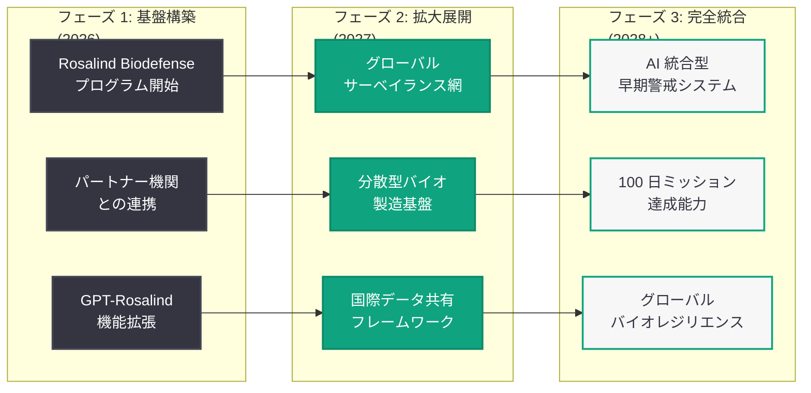

# Intelligence Age におけるバイオディフェンス: AI を活用した生物学的レジリエンスのアクションプラン

## メタデータ

| 項目 | 内容 |
|------|------|
| 発表日 | 2026-06-04 |
| ソース | OpenAI News/Blog |
| カテゴリ | 安全性・政策 |
| 公式リンク | [Biodefense in the Intelligence Age](https://openai.com/index/biodefense-in-the-intelligence-age) |

> **注記:** 本レポートは RSS フィードの説明文 ("An action plan for AI-powered biological resilience.")、2026 年 5 月 29 日に発表された Rosalind Biodefense プログラムの関連情報、および OpenAI のバイオセキュリティに関する公開方針に基づいて作成している。記事本文へのアクセスが制限されているため、公開メタデータと関連コンテキストから内容を構成している。

## 概要

OpenAI は 2026 年 6 月 4 日、「Biodefense in the Intelligence Age」と題した政策提言文書を公開した。本文書は「AI を活用した生物学的レジリエンスのためのアクションプラン」として位置付けられ、フロンティア AI モデルがバイオディフェンス (生物防衛) の能力をいかに強化できるかについて、包括的なビジョンと具体的な行動計画を提示している。

本文書は、2026 年 5 月 29 日に発表された Rosalind Biodefense プログラム (GPT-Rosalind を活用したバイオディフェンスパートナーシップ) の延長線上にあるが、個別のプログラム紹介ではなく、より広範な政策フレームワークと社会的レジリエンスの構築に焦点を当てた戦略文書である。OpenAI が「Intelligence Age」(知能の時代) と呼ぶ AI の急速な進歩の時代において、生物学的脅威に対する社会の防御力を根本的に変革するための道筋を描いている。

## 主な内容

### 「Intelligence Age」における生物学的脅威の変容

OpenAI が提唱する「Intelligence Age」は、AI が科学研究と社会インフラの根幹を変革する時代を指す。この時代における生物学的脅威は、従来とは質的に異なる特徴を持つ。

**脅威の新たな側面:**

- **AI による攻撃能力の潜在的加速:** 悪意ある行為者が AI ツールを使用して病原体の設計や合成プロセスを加速する可能性
- **グローバル化による拡散速度の増大:** 国際的な人流・物流の増加により、新興感染症の拡散が従来以上に迅速化
- **合成生物学の民主化:** バイオテクノロジーのアクセシビリティ向上に伴う、デュアルユースリスクの増大
- **自然発生パンデミックの頻度増加:** 人間活動の拡大、気候変動、都市化による人獣共通感染症のスピルオーバーリスクの上昇

しかし同時に、AI は防御側にも前例のない能力を付与する。本文書は、攻撃と防御の非対称性を防御側に有利な方向に傾けるための戦略を提示している。

### AI を活用した生物学的レジリエンスの 4 本柱

本アクションプランは、生物学的レジリエンスの構築を 4 つの柱で構成している。

#### 1. 早期検出と警戒 (Early Detection and Warning)

AI を活用したサーベイランスシステムにより、生物学的脅威をその初期段階で検出する能力の構築を提案する。

**具体的施策:**

| 施策 | 内容 |
|------|------|
| ゲノミクスサーベイランスの高速化 | AI による配列データのリアルタイム解析で、従来数週間かかっていた変異検出を数時間に短縮 |
| 下水疫学の AI 解析 | 都市の下水サンプルから病原体の存在を自動検出するシステムの全国展開 |
| 異常シグナルの自動検出 | 医療データ、処方箋データ、救急搬送データの統合解析による異常パターンの早期発見 |
| グローバルバイオサーベイランスネットワーク | 国際的なデータ共有基盤の構築と AI による統合解析 |

#### 2. 迅速対応 (Rapid Response)

脅威が検出された後の対応速度を飛躍的に向上させるための AI 活用戦略を提示する。

**具体的施策:**

- **ワクチン設計の加速:** GPT-Rosalind のようなモデルを用いた抗原設計の自動化。従来数か月を要していたワクチン候補の同定を数日に短縮
- **治療薬候補のインシリコスクリーニング:** 既存薬のリパーパシング (再目的化) と新規化合物の高速スクリーニング
- **診断法の迅速開発:** 新規病原体に対する PCR プライマー設計、抗原検査ターゲットの同定を AI で自動化
- **医療対策の供給予測:** サプライチェーンのボトルネック分析と最適配分計画の策定

#### 3. 予測と準備 (Prediction and Preparedness)

AI を活用した予測能力により、将来の脅威に対する事前準備を強化する。

**具体的施策:**

- **パンデミックシミュレーション:** 高精度な感染拡大モデルによる政策介入効果の事前評価
- **人獣共通感染症のスピルオーバー予測:** 動物-人間間の病原体移行リスクの継続的モニタリング
- **抗菌薬耐性 (AMR) の進化予測:** 耐性遺伝子の拡散パターン分析と将来の耐性プロファイル予測
- **パンデミック対策備蓄の最適化:** 需要予測に基づく戦略的備蓄の配置と更新計画

#### 4. 回復力の構築 (Building Resilience)

長期的な社会的レジリエンスの構築に向けたインフラと制度の整備を提言する。

**具体的施策:**

- **分散型バイオ製造:** AI 支援による分散型ワクチン・治療薬製造拠点の整備
- **人材育成:** AI リテラシーを持つバイオディフェンス人材の大規模育成プログラム
- **研究基盤の強化:** オープンサイエンスと AI ツールのアクセス民主化による研究能力の底上げ
- **国際協力の制度化:** グローバルバイオサーベイランスのためのデータ共有フレームワークの構築

### 政策提言: 政府機関と制度への要請

本文書は、具体的な政策提言を含んでおり、各国政府および国際機関に対して以下のアクションを呼びかけている。

**米国政府への提言:**

1. **AI バイオディフェンス統合戦略の策定:** 国家バイオディフェンス戦略に AI の活用を明示的に組み込む
2. **資金配分の拡大:** BARDA、DTRA、CDC 等の機関における AI バイオディフェンス予算の大幅増額
3. **規制フレームワークの整備:** AI を活用したバイオメディカル製品の審査プロセスの迅速化 (FDA との連携)
4. **パブリック-プライベートパートナーシップ:** AI 企業とバイオディフェンス機関の連携を促進する制度的枠組み

**国際社会への提言:**

1. **グローバルゲノミクスサーベイランスネットワーク:** WHO を中心とした国際的なデータ共有基盤
2. **バイオセキュリティ規範の策定:** AI を用いた生物学研究に関する国際的な行動規範の合意
3. **能力構築支援:** 途上国における AI バイオディフェンス能力の構築支援
4. **デュアルユースガバナンス:** AI モデルの生物学的能力に関する国際的な管理フレームワーク

### デュアルユースの課題と安全性へのアプローチ

本文書は、AI が生物学分野で持つデュアルユース (軍民両用) の性質について率直に言及し、OpenAI のアプローチを説明している。

**OpenAI の安全性原則:**

- **防御優先の原則:** AI 能力の開発において、防御的応用を攻撃的応用に先行させる
- **段階的アクセス:** リスクレベルに応じたアクセス管理 (Rosalind Biodefense プログラムの招待制モデル)
- **継続的レッドチーミング:** バイオセキュリティ専門家による定期的な脆弱性評価
- **透明性とアカウンタビリティ:** 安全性対策の公開報告と外部監査

**リスク軽減策:**

| 対策レベル | 内容 |
|-----------|------|
| モデル設計 | 危険な生物学的知識の生成を防止するアライメント |
| アクセス管理 | 資格認証に基づく段階的なモデルアクセス |
| 利用監視 | AI 出力の継続的モニタリングと異常検出 |
| コミュニティ連携 | バイオセキュリティ研究コミュニティとの協働的ガバナンス |

### Rosalind Biodefense プログラムとの関係

本文書は、2026 年 5 月 29 日に発表された Rosalind Biodefense プログラムを「アクションプランの実装の第一歩」として位置付けている。同プログラムは GPT-Rosalind モデルをバイオディフェンスパートナー (政府機関、研究機関、公衆衛生機関) に提供する取り組みであり、本文書で提案された戦略の具体的な実行例となっている。

さらに、2026 年 6 月 3 日に発表された GPT-Rosalind の新機能 (生物学的推論強化、創薬化学、ゲノミクス解析向上、実験ワークフロー) が、本アクションプランで描かれたビジョンを技術的に裏付けるものとして参照されている。

## 技術的な詳細

### AI バイオディフェンスシステムの技術要件

本アクションプランで描かれた AI 活用バイオディフェンスの実現には、以下の技術的要件が必要となる。

**データインフラストラクチャ:**

- リアルタイムゲノミクスデータのストリーミング処理基盤
- 国際的に相互運用可能なデータフォーマット (FHIR、HL7 等)
- プライバシー保護と共有のバランスを実現する連合学習基盤
- ペタバイト規模の生物学データの低レイテンシ検索

**AI モデル要件:**

- マルチモーダル入力 (配列データ、構造データ、テキスト、画像) への対応
- リアルタイム推論が可能な低レイテンシアーキテクチャ
- 不確実性の定量化と信頼度スコアの提供
- 説明可能性 (Explainability) の担保
- 継続的学習による最新知識の反映

**セキュリティ要件:**

- エンドツーエンドの暗号化通信
- ゼロトラストアーキテクチャの採用
- マルチテナント環境でのデータ分離
- FISMA、HIPAA、GDPR への準拠

### GPT-Rosalind の位置付けと拡張構想

本文書は GPT-Rosalind を AI バイオディフェンスの中核技術として位置付けつつ、将来の拡張方向として以下を示唆している。

```python
from openai import OpenAI

client = OpenAI()

# バイオサーベイランスアラートの統合分析 (将来構想)
response = client.chat.completions.create(
    model="gpt-rosalind",
    messages=[
        {
            "role": "system",
            "content": (
                "You are a biodefense intelligence analyst. Integrate "
                "signals from genomic surveillance, clinical data, and "
                "environmental monitoring to assess biological threat levels. "
                "Provide actionable recommendations for public health authorities."
            )
        },
        {
            "role": "user",
            "content": """Assess the following multi-source intelligence:

1. Genomic surveillance: Novel reassortant H5N1 detected in poultry
   farms across 3 countries with mammalian adaptation markers (PB2 E627K)
2. Clinical signals: 12% increase in ILI (influenza-like illness)
   presentations in sentinel hospitals near affected farms
3. Wastewater data: H5 RNA detected in 4/15 municipal treatment
   plants in the affected region
4. Animal health: Unusual mortality in feral cats near affected farms

Provide:
1. Threat level assessment (1-5 scale with justification)
2. Key uncertainties requiring immediate investigation
3. Recommended public health actions (tiered by urgency)
4. Suggested genomic sequencing priorities
5. International notification requirements under IHR (2005)"""
        }
    ],
    temperature=0.1,
    max_tokens=4000
)

print(response.choices[0].message.content)
```

```python
# パンデミック対策シミュレーション (将来構想)
response = client.chat.completions.create(
    model="gpt-rosalind",
    messages=[
        {
            "role": "system",
            "content": (
                "You are a pandemic preparedness simulation coordinator. "
                "Design and evaluate countermeasure strategies using "
                "epidemiological modeling and AI-powered scenario analysis."
            )
        },
        {
            "role": "user",
            "content": """Design a countermeasure timeline for the following scenario:

Pathogen: Novel coronavirus with R0=4.5, IFR=1.2%, serial interval=4 days
Day 0: First cluster identified (50 confirmed cases, estimated 500 actual)
Current countermeasure stockpile: None specific to this pathogen
Available platforms: mRNA (2 facilities), protein subunit (1 facility)

Model the following intervention scenarios and compare outcomes:
A) Immediate NPI + accelerated mRNA vaccine (AI-designed antigen)
B) Moderate NPI + traditional vaccine development timeline
C) AI-accelerated therapeutic development + targeted NPI

For each scenario, estimate:
- Time to first vaccine dose availability
- Peak healthcare system burden
- Total infections at 6 months
- Economic impact estimate"""
        }
    ],
    temperature=0.2,
    max_tokens=6000
)

print(response.choices[0].message.content)
```

## アーキテクチャ

```mermaid
flowchart TD
    subgraph Threats["生物学的脅威"]
        Natural["自然発生\nパンデミック"]
        Engineered["人為的\n生物学的脅威"]
        AMR["抗菌薬耐性\n(AMR)"]
        Spillover["人獣共通感染症\nスピルオーバー"]
    end

    subgraph Detection["早期検出・警戒層"]
        GenomicSurv["ゲノミクス\nサーベイランス"]
        Wastewater["下水疫学\nモニタリング"]
        ClinicalSignal["臨床シグナル\n検出"]
        GlobalNet["グローバル\nサーベイランス網"]
    end

    subgraph AICore["AI コア (GPT-Rosalind)"]
        direction TB
        Analysis["統合分析\nエンジン"]
        Prediction["予測モデリング\nエンジン"]
        Design["分子設計\nエンジン"]
        Workflow["ワークフロー\n自動化"]
    end

    subgraph Response["迅速対応層"]
        Vaccine["ワクチン設計\n加速"]
        Therapeutics["治療薬\nスクリーニング"]
        Diagnostics["診断法\n迅速開発"]
        Supply["供給チェーン\n最適化"]
    end

    subgraph Governance["ガバナンス・安全性"]
        DualUse["デュアルユース\n管理"]
        Access["段階的\nアクセス制御"]
        Oversight["外部専門家\n監督委員会"]
        Intl["国際協力\nフレームワーク"]
    end

    subgraph Resilience["社会的レジリエンス"]
        Prepared["パンデミック\n準備態勢"]
        Capacity["分散型\nバイオ製造"]
        Talent["人材育成"]
        Research["研究基盤\n強化"]
    end

    Natural --> Detection
    Engineered --> Detection
    AMR --> Detection
    Spillover --> Detection

    GenomicSurv --> Analysis
    Wastewater --> Analysis
    ClinicalSignal --> Analysis
    GlobalNet --> Analysis

    Analysis --> Prediction
    Prediction --> Design
    Design --> Workflow

    Workflow --> Vaccine
    Workflow --> Therapeutics
    Workflow --> Diagnostics
    Workflow --> Supply

    Vaccine --> Prepared
    Therapeutics --> Prepared
    Diagnostics --> Capacity
    Supply --> Capacity

    DualUse --> AICore
    Access --> AICore
    Oversight --> DualUse
    Intl --> Oversight

    Prepared --> Resilience
    Capacity --> Resilience
    Talent --> Resilience
    Research --> Resilience

    classDef openai fill:#10A37F,stroke:#0D8A6A,stroke-width:2px,color:white
    classDef dark fill:#343541,stroke:#444654,stroke-width:2px,color:white
    classDef light fill:#F7F7F8,stroke:#ECECF1,stroke-width:2px,color:#343541
    classDef threat fill:#DC2626,stroke:#B91C1C,stroke-width:2px,color:white
    classDef safety fill:#D97706,stroke:#B45309,stroke-width:2px,color:white

    class Analysis,Prediction,Design,Workflow openai
    class GenomicSurv,Wastewater,ClinicalSignal,GlobalNet dark
    class Vaccine,Therapeutics,Diagnostics,Supply dark
    class Prepared,Capacity,Talent,Research light
    class Natural,Engineered,AMR,Spillover threat
    class DualUse,Access,Oversight,Intl safety
```



### アクションプランのタイムライン構想



## 開発者への影響

- **バイオディフェンス API エコシステムの拡大:** 本アクションプランの実装に伴い、GPT-Rosalind を中心としたバイオディフェンス向け API サービスの拡大が予想される。サーベイランスデータの統合分析、脅威評価の自動化、対策措置の設計支援など、新たな API エンドポイントが追加される可能性がある

- **パブリックヘルス分野での AI 開発機会:** 政府機関との連携拡大により、パブリックヘルスインフォマティクス分野での AI アプリケーション開発の需要が増加する。下水疫学データの解析ツール、ゲノミクスサーベイランスダッシュボード、早期警戒システムなどの開発プロジェクトが見込まれる

- **安全性ガードレールの設計標準化:** 本文書で示されたデュアルユース管理のフレームワークは、高リスクドメインで AI アプリケーションを構築する開発者にとって参考となる設計標準を提供する。段階的アクセス制御、利用監視、外部監査の組み込みが業界標準となる方向性を示唆する

- **国際データ相互運用性への対応:** グローバルバイオサーベイランスネットワークの構築に伴い、国際的なデータフォーマット標準 (FHIR、HL7、GA4GH) への対応が開発者に求められる。マルチリージョンでのデータ処理とプライバシー規制への準拠が設計上の重要課題となる

- **連合学習と分散型 AI の需要増:** 機密性の高い生物学データを共有せずに AI モデルを訓練する連合学習 (Federated Learning) の需要が高まる。国際機関間でのモデル共有とデータ主権の両立を実現する技術的ソリューションの開発が期待される

## 関連リンク

- [Biodefense in the Intelligence Age (公式)](https://openai.com/index/biodefense-in-the-intelligence-age)
- [Rosalind Biodefense プログラム](https://openai.com/index/strengthening-societal-resilience-with-rosalind-biodefense)
- [GPT-Rosalind 新機能 (2026-06-03)](https://openai.com/index/introducing-new-capabilities-to-gpt-rosalind)
- [GPT-Rosalind 初期発表 (2026-04-16)](https://openai.com/index/introducing-gpt-rosalind)
- [OpenAI Safety](https://openai.com/safety)
- [OpenAI Preparedness Framework](https://openai.com/safety/preparedness)
- [Global Health Security Agenda](https://ghsagenda.org/)
- [WHO - International Health Regulations](https://www.who.int/health-topics/international-health-regulations)

## まとめ

「Biodefense in the Intelligence Age」は、OpenAI が AI 技術とバイオディフェンスの交差点において包括的な政策ビジョンを提示した戦略文書である。単なる技術的提案にとどまらず、政府機関への政策提言、国際協力フレームワーク、デュアルユースガバナンス、人材育成まで含む広範なアクションプランとして構成されている。

本文書の核心は、AI の急速な進歩 (Intelligence Age) において、防御的応用を攻撃的応用に先行させるという「防御優先の原則」にある。GPT-Rosalind と Rosalind Biodefense プログラムを具体的な実装例として示しつつ、より広範な社会的レジリエンスの構築に向けたロードマップを描いている。

特に注目すべきは、OpenAI が AI の安全性議論を「モデルの能力制限」だけでなく「防御的応用による社会全体の安全性向上」という積極的な枠組みで再定義しようとしている点である。バイオディフェンスという具体的かつ社会的重要性の高い分野での成果を示すことで、フロンティア AI 開発の社会的正当性を強化する戦略的意図も読み取れる。今後、この政策フレームワークが各国政府の実際の政策にどのように反映されるかが注目される。
