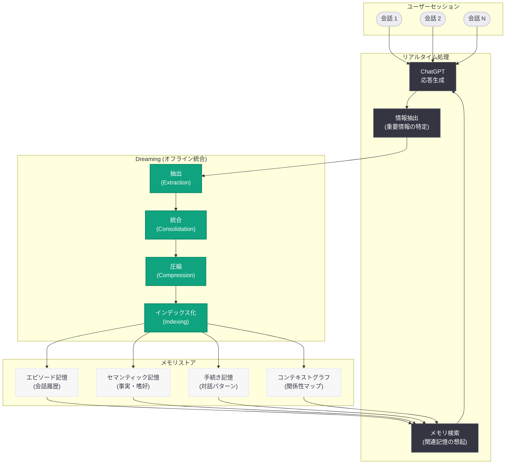
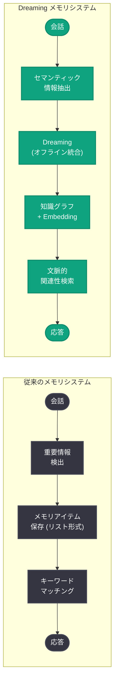

# Dreaming: ChatGPT の新しいメモリシステムによるパーソナライズの進化

## メタデータ

| 項目 | 内容 |
|------|------|
| 発表日 | 2026-06-04 |
| ソース | OpenAI News/Blog, Research |
| カテゴリ | 新機能 / ChatGPT |
| 公式リンク | [Dreaming: Better memory for a more helpful ChatGPT](https://openai.com/index/chatgpt-memory-dreaming) |

> **注記:** 本レポートは RSS フィードの説明文 ("ChatGPT introduces a new memory system to better remember preferences across conversations.")、OpenAI サイトマップ情報 (lastmod: 2026-06-04T23:12:19.808Z)、および ChatGPT のメモリ機能に関する公開情報に基づいて作成している。記事本文へのアクセスが制限されているため、公開されたメタデータと関連コンテキストから内容を構成している。

## 概要

OpenAI は 2026 年 6 月 4 日、ChatGPT の新しいメモリアーキテクチャ「Dreaming」を発表した。この機能は、会話を跨いでユーザーの好み、文脈、過去のやり取りをより効果的に記憶・活用するための新しいシステムである。「Dreaming」という名称は、人間の睡眠中に行われる記憶の整理・統合プロセスに着想を得ており、オフライン処理によってメモリを構造化・最適化するアプローチを示唆している。

従来の ChatGPT メモリ機能は、明示的なメモリアイテム (ユーザーが指示した情報や ChatGPT が重要と判断した情報を個別に保存する仕組み) に依存していた。Dreaming は、これを大幅に拡張し、会話全体から文脈的な理解を抽出・統合することで、より自然で深いパーソナライゼーションを実現する。これは ChatGPT のユーザー体験を根本的に変える可能性のあるアーキテクチャレベルの革新である。

## 主な内容

### Dreaming とは何か

Dreaming は、ChatGPT が会話のないオフライン時間を活用して、蓄積された会話データからユーザーに関する理解を深化させる新しいメモリシステムである。人間が睡眠中に日中の体験を整理・統合し、長期記憶として定着させるプロセスにインスパイアされたアーキテクチャとなっている。

**主要な特徴:**

- **オフライン統合処理:** 会話が終了した後、バックグラウンドで情報の抽出・整理・統合を行う
- **文脈的理解の構築:** 個別の事実ではなく、ユーザーの嗜好パターン、思考スタイル、関心領域の全体像を構築する
- **動的な記憶の更新:** 新しい会話から得られた情報で既存の理解を更新・修正する
- **関連性に基づく想起:** 会話の文脈に応じて、最も関連性の高い記憶を適切なタイミングで呼び出す

### 従来のメモリ機能との比較

| 側面 | 従来のメモリ (Before) | Dreaming (After) |
|------|----------------------|-------------------|
| 記憶の粒度 | 個別のメモリアイテム (箇条書き形式) | 構造化された文脈的理解 |
| 保存トリガー | 明示的な指示またはモデルの判断 | 自動的かつ継続的な統合処理 |
| 記憶の形式 | 事実ベース ("ユーザーは Python を好む") | 関係性ベース (嗜好パターンの包括的理解) |
| 更新メカニズム | 手動追加・削除 | オフライン自動統合と漸進的更新 |
| 想起の精度 | キーワードマッチング的 | 文脈依存の関連性スコアリング |
| スケーラビリティ | メモリアイテム数の上限あり | より大規模な記憶空間を管理可能 |

### オフライン統合プロセスの仕組み

Dreaming のコアイノベーションは、会話間のオフライン時間を活用した記憶統合プロセスにある。このプロセスは以下のステージで構成されると推定される。

**ステージ 1 - 抽出 (Extraction):** 会話から重要な情報、嗜好、パターンを抽出する。単純なキーワード抽出ではなく、意図や文脈を含むセマンティックな理解を行う。

**ステージ 2 - 統合 (Consolidation):** 新たに抽出された情報を既存の記憶グラフに統合する。矛盾する情報の解決、時系列的な変化の追跡、関連情報間のリンク生成を行う。

**ステージ 3 - 圧縮 (Compression):** 冗長な情報を圧縮し、より効率的な表現に変換する。重要度に基づくプライオリティ付けにより、限られたコンテキストウィンドウで最大限の情報を活用可能にする。

**ステージ 4 - インデックス化 (Indexing):** 統合された記憶を、将来の会話で効率的に検索・想起できるようにインデックス化する。

### ユーザーへのメリット

Dreaming によって実現される具体的なユーザー体験の向上は以下の通りである。

- **会話の継続性:** 数日前、数週間前の会話内容を踏まえた自然な対話が可能になる
- **嗜好の自動学習:** 文体の好み、説明の詳細度、専門分野に合わせた応答の自動調整
- **プロジェクト文脈の保持:** 長期プロジェクトの進捗、決定事項、未解決の課題を記憶し続ける
- **反復の削減:** 毎回同じ前提条件や背景情報を説明する必要がなくなる
- **より深いパーソナライゼーション:** 明示的に伝えていない暗黙的な嗜好パターンも学習し反映する

### プライバシーとユーザーコントロール

メモリ機能の拡張に伴い、プライバシーへの配慮も強化されていると考えられる。

**ユーザーコントロール:**

- メモリ機能の有効化・無効化の選択
- 保存された記憶の閲覧・編集・削除
- 特定の会話をメモリ対象から除外する機能
- Dreaming プロセスの一時停止オプション

**データ保護:**

- メモリデータの暗号化保存
- モデルトレーニングへのメモリデータ非使用ポリシー (既存の ChatGPT プライバシーポリシーとの整合)
- 明確なデータ保持期間と削除ポリシー

## 技術的な詳細

### メモリアーキテクチャの推定構造

Dreaming は、従来の単純なキーバリュー型メモリストアから、グラフベースの知識表現と Embedding によるセマンティック検索を組み合わせたハイブリッドアーキテクチャへの移行を意味すると考えられる。

### 想定されるメモリ API の進化

ChatGPT のメモリ機能は現在ユーザー向け機能であるが、将来的に API を通じた開発者向け機能としての展開も想定される。

```python
from openai import OpenAI

client = OpenAI()

# 将来的に想定されるメモリ対応の会話 (概念的な例)
response = client.chat.completions.create(
    model="gpt-4o",
    messages=[
        {"role": "user", "content": "前回話していたプロジェクトの続きだけど"}
    ],
    # Dreaming による文脈的メモリが自動的に適用される
    # 明示的なメモリ管理は不要 - システムが自動的に
    # 関連する過去の会話コンテキストを統合
)

print(response.choices[0].message.content)
```

### メモリの階層構造

Dreaming では、以下のような階層的なメモリ構造が採用されていると推定される。

```python
# Dreaming メモリシステムの概念的な階層構造
memory_hierarchy = {
    "episodic_memory": {
        # 個別の会話エピソードの記録
        "description": "具体的な会話の内容と文脈",
        "retention": "短期〜中期",
        "example": "2026-06-01 にユーザーが新プロジェクトについて相談した"
    },
    "semantic_memory": {
        # ユーザーに関する一般的な知識
        "description": "会話から抽出された永続的な事実と嗜好",
        "retention": "長期",
        "example": "ユーザーは Python を主要言語として使用する"
    },
    "procedural_memory": {
        # ユーザーとの対話パターン
        "description": "応答スタイルや説明方法に関する学習",
        "retention": "長期",
        "example": "ユーザーはコード例を含む詳細な説明を好む"
    },
    "contextual_graph": {
        # 情報間の関係性マップ
        "description": "記憶アイテム間のリレーション",
        "retention": "動的更新",
        "example": "プロジェクト A は Python + FastAPI で構築中"
    }
}
```

## アーキテクチャ



### 従来のメモリと Dreaming の比較アーキテクチャ



## 開発者への影響

### ChatGPT ユーザーとしての開発者

- **開発コンテキストの保持:** 長期にわたるプロジェクト開発において、アーキテクチャの決定、技術スタックの選択、過去のデバッグ履歴が自動的に保持される。毎回プロジェクトの背景を説明する必要がなくなる
- **コーディングスタイルの学習:** ユーザーの命名規則、エラーハンドリングの好み、コメントスタイルを学習し、一貫したコード提案を行う
- **ペアプログラミングの進化:** 長期的なパートナーとしての役割が強化され、プロジェクト全体を理解した上でのアドバイスが可能になる

### API / プラットフォーム開発者への示唆

- **将来的なメモリ API の可能性:** Dreaming のアーキテクチャが API として開放される可能性があり、開発者が自社アプリケーションにパーソナライゼーション機能を組み込める将来が見込まれる
- **Assistants API との統合:** 既存の Assistants API の Thread 機能と Dreaming の統合により、より長期的な会話コンテキスト管理が API レベルで実現する可能性がある
- **プライバシー設計の参考:** Dreaming のプライバシーコントロール設計は、ユーザーデータを活用する AI アプリケーション開発における参考モデルとなる

### 競争環境への影響

- **Google Gemini との差別化:** Google Gemini も長期メモリ機能を提供しているが、Dreaming のオフライン統合アプローチは、リアルタイム処理に依存しない点で差別化される
- **Anthropic Claude との比較:** Claude のプロジェクト機能やメモリ機能と比較して、より自動的で暗黙的なパーソナライゼーションに焦点を当てている
- **AI アシスタント市場全体:** 長期的なユーザー関係構築を可能にするメモリ技術は、AI アシスタントのスイッチングコストを高め、ユーザーロックイン効果を生む戦略的意義がある

## 関連リンク

- [Dreaming: Better memory for a more helpful ChatGPT](https://openai.com/index/chatgpt-memory-dreaming)
- [ChatGPT Memory 機能紹介](https://openai.com/index/memory-and-new-controls-for-chatgpt)
- [OpenAI プライバシーポリシー](https://openai.com/policies/privacy-policy)
- [OpenAI API ドキュメント](https://platform.openai.com/docs)
- [OpenAI Research](https://openai.com/research)

## まとめ

Dreaming は、ChatGPT のメモリ機能を根本的に進化させるアーキテクチャレベルのイノベーションである。従来の明示的なメモリアイテム保存方式から、人間の睡眠中の記憶統合プロセスに着想を得たオフライン処理方式への移行は、AI アシスタントのパーソナライゼーションにおける大きなパラダイムシフトを示している。

技術的には、セマンティックな情報抽出、グラフベースの知識表現、Embedding による関連性検索を組み合わせたハイブリッドアーキテクチャが、従来のキーワードマッチング型メモリを大幅に凌駕する記憶の質と想起精度を実現する。ユーザーにとっては、回を重ねるごとに自分を理解してくれる AI アシスタントという体験が、これまで以上に自然な形で実現される。

一方で、より深いパーソナライゼーションはプライバシーリスクとの緊張関係を内包する。OpenAI がどのようなユーザーコントロールとデータ保護メカニズムを提供するかが、この機能の社会的受容を左右する重要な要素となる。開発者にとっては、将来的な API 展開の可能性も含め、AI アプリケーションにおける長期メモリ設計の新しい参照モデルとなる発表である。
