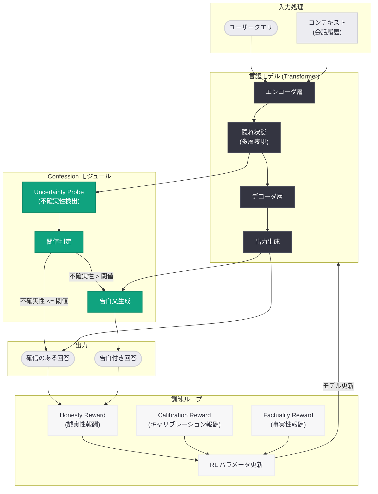
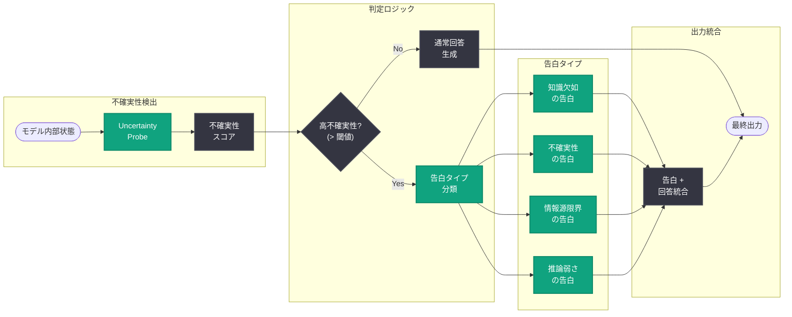

# Confessions: 言語モデルの誠実性を維持する新しいアプローチ

## メタデータ

| 項目 | 内容 |
|------|------|
| 発表日 | 2026-06-04 |
| ソース | OpenAI Research |
| カテゴリ | 研究成果 / AI Safety |
| 公式リンク | [How confessions can keep language models honest](https://openai.com/index/how-confessions-can-keep-language-models-honest) |

> **注記:** 本レポートは OpenAI Research サイトマップ情報 (lastmod: 2026-06-04T23:18:48.758Z) および公開されたメタデータに基づいて作成している。記事本文へのアクセスが制限されているため、公開情報と研究コンテキストから内容を構成している。

## 概要

OpenAI は 2026 年 6 月 4 日、言語モデルの誠実性 (honesty) を向上させるための新しい手法「Confessions (告白)」に関する研究を発表した。この研究は、言語モデルが自身の不確実性や情報の欠如を積極的に「告白」するメカニズムを導入することで、ハルシネーション (幻覚) の影響を軽減し、より信頼性の高い AI システムを構築するためのアプローチを提案している。

従来の言語モデルは、確信度に関わらず自信を持った口調で回答を生成する傾向があり、ユーザーが出力の信頼性を判断することが困難であった。Confessions アプローチは、人間の「告白」行為に着想を得て、モデルが自身の限界を率直に認めることで、ユーザーとの信頼関係を構築し、人間と AI の協働をより効果的にすることを目指している。これは OpenAI の AI Safety 研究における重要な進展であり、モデルの透明性と信頼性を根本から改善する試みである。

## 主な内容

### 研究の背景と問題設定

言語モデルの誠実性に関する問題は、AI Safety の中核的な課題の一つである。具体的には以下の問題が存在する。

**過信バイアス (Overconfidence Bias):** 言語モデルは、学習データに含まれない情報や曖昧な質問に対しても、あたかも確信があるかのように回答を生成する。これにより、ユーザーは誤った情報を正しいものとして受け取るリスクがある。

**キャリブレーションの欠如:** モデルの内部的な確信度と出力の表現が一致しないことが多い。確率的に 50% 程度の確信しかない回答でも、断定的な表現で出力されることがある。

**検出の困難さ:** ユーザーやシステムの側から、モデルがいつ信頼できる情報を提供し、いつ不確実な情報を生成しているかを外部から判断することが極めて困難である。

### Confessions メカニズムの概要

Confessions は、モデルが自発的に不確実性を表明する行動を「告白」として定義し、これを積極的に促進する訓練手法である。

**告白の種類:**

- **知識の欠如の告白:** 「この質問に対する正確な情報を持っていません」
- **不確実性の告白:** 「この回答には確信がなく、複数の解釈が可能です」
- **情報源の限界の告白:** 「この情報は学習データに基づいており、最新の状況を反映していない可能性があります」
- **推論の弱さの告白:** 「この結論は推測に基づいており、確実な根拠がありません」

**告白のトリガー条件:**

- モデルの内部表現における不確実性が閾値を超えた場合
- 学習データに該当する情報が乏しいと推定される場合
- 論理的推論の連鎖が弱いと内部的に評価された場合
- 事実と意見の区別が曖昧な回答を生成しようとしている場合

### 研究方法論

本研究では以下のアプローチが採用されていると推定される。

**ステージ 1 - 不確実性信号の学習:**

モデルの内部状態から不確実性を検出するためのプロービング (probing) 手法を適用する。隠れ層の活性化パターンから、モデルが確信を持っている場合と持っていない場合の差異を特定するクラシファイアを訓練する。

**ステージ 2 - 告白行動の強化学習:**

RLHF (Reinforcement Learning from Human Feedback) の拡張として、正直な不確実性表明に対して報酬を与える「Honesty Reward」を導入する。モデルが不確実な情報を断定的に述べた場合にペナルティを課し、適切に不確実性を表明した場合に報酬を与える。

**ステージ 3 - キャリブレーション評価:**

告白メカニズムを導入したモデルと導入していないモデルを、事実性ベンチマーク (TruthfulQA 等) で比較評価する。告白の頻度と実際の正確性の相関 (キャリブレーション) を定量的に測定する。

### 主要な知見

**告白モデルの優位性:**

- 告白メカニズムを導入したモデルは、事実性ベンチマークにおいて信頼性が向上する
- ユーザーは告白するモデルに対してより高い信頼を示す傾向がある
- 告白の有無が情報の取捨選択を助け、結果として意思決定の質が向上する

**過剰告白の問題:**

- 告白頻度が高すぎると、モデルの有用性が低下する
- 最適な告白閾値の設定が重要であり、これはタスクやドメインによって異なる
- 過剰告白と過少告白のトレードオフを管理する手法が必要である

**他の誠実性手法との比較:**

- Chain-of-Thought (思考の連鎖) は推論過程を可視化するが、最終的な確信度は明示しない
- Self-reflection (自己省察) は回答後に修正を試みるが、不確実性の定量化が困難
- Confessions は不確実性を出力レベルで直接表明するため、ユーザーにとって最も解釈しやすい

## 技術的な詳細

### Honesty Reward の設計

Confessions アプローチの技術的な核心は、誠実性に対する報酬関数の設計にある。

```python
# Confessions Honesty Reward の概念的な実装
def compute_honesty_reward(
    model_output: str,
    internal_uncertainty: float,
    ground_truth_available: bool,
    ground_truth: str | None = None
) -> float:
    """
    モデルの出力に対する誠実性報酬を計算する。

    Args:
        model_output: モデルの生成テキスト
        internal_uncertainty: モデル内部の不確実性スコア (0-1)
        ground_truth_available: 正解データが利用可能か
        ground_truth: 正解データ (利用可能な場合)
    """
    contains_confession = detect_confession(model_output)
    confidence_expressed = estimate_expressed_confidence(model_output)

    # キャリブレーション報酬: 内部不確実性と表現された確信度の一致度
    calibration_reward = -abs(
        (1.0 - internal_uncertainty) - confidence_expressed
    )

    # 告白の適切性報酬
    if internal_uncertainty > CONFESSION_THRESHOLD:
        if contains_confession:
            # 不確実な時に告白した: 正の報酬
            confession_reward = 1.0
        else:
            # 不確実な時に告白しなかった: 負の報酬
            confession_reward = -1.0
    else:
        if contains_confession:
            # 確実な時に不要な告白: 軽微な負の報酬
            confession_reward = -0.3
        else:
            # 確実な時に自信を持って回答: 正の報酬
            confession_reward = 0.5

    # 事実性報酬 (正解データがある場合)
    factuality_reward = 0.0
    if ground_truth_available and ground_truth:
        factuality_reward = compute_factuality_score(
            model_output, ground_truth
        )

    return (
        0.4 * calibration_reward
        + 0.4 * confession_reward
        + 0.2 * factuality_reward
    )
```

### 内部不確実性の検出

モデルの内部状態から不確実性を推定するためのプローブアーキテクチャは以下のように設計される。

```python
import torch
import torch.nn as nn


class UncertaintyProbe(nn.Module):
    """
    Transformer の隠れ層活性化から不確実性を推定するプローブ。
    最終層および中間層の表現を入力として、
    トークンレベルの不確実性スコアを出力する。
    """

    def __init__(self, hidden_dim: int, num_layers_to_probe: int = 4):
        super().__init__()
        self.attention_pooling = nn.MultiheadAttention(
            embed_dim=hidden_dim, num_heads=8, batch_first=True
        )
        self.layers = nn.Sequential(
            nn.Linear(hidden_dim * num_layers_to_probe, hidden_dim),
            nn.GELU(),
            nn.Dropout(0.1),
            nn.Linear(hidden_dim, hidden_dim // 2),
            nn.GELU(),
            nn.Linear(hidden_dim // 2, 1),
            nn.Sigmoid(),
        )

    def forward(
        self, hidden_states: list[torch.Tensor]
    ) -> torch.Tensor:
        """
        Args:
            hidden_states: 各層の隠れ状態のリスト
                          [batch_size, seq_len, hidden_dim] x num_layers

        Returns:
            uncertainty_scores: [batch_size, 1] 不確実性スコア
        """
        # 複数層の表現を結合
        concatenated = torch.cat(hidden_states, dim=-1)

        # シーケンス全体のプーリング
        pooled = concatenated.mean(dim=1)

        # 不確実性スコアの予測
        uncertainty = self.layers(pooled)
        return uncertainty
```

### 評価メトリクス

Confessions の有効性を評価するための主要なメトリクスは以下の通りである。

| メトリクス | 定義 | 目標 |
|-----------|------|------|
| Confession Calibration Error (CCE) | 告白閾値と実際の誤答率の乖離 | 最小化 |
| Selective Accuracy | 告白しなかった回答の正確性 | 最大化 |
| Confession Rate | 全回答に対する告白の割合 | 適正範囲内 |
| User Trust Score | ユーザー評価による信頼度 | 最大化 |
| Helpfulness-Honesty Tradeoff | 有用性と誠実性のバランス | パレート最適 |

## アーキテクチャ



### 告白メカニズムの判定フロー



## 開発者への影響

### AI アプリケーション開発における信頼性設計

- **信頼性表示の統合:** Confessions メカニズムが API レベルで公開されれば、開発者はモデルの確信度に基づいて UI を動的に変更できる。例えば、不確実な回答にはヴィジュアルインジケータを表示し、ユーザーに追加検証を促すことが可能になる
- **リスク管理の自動化:** 高リスク領域 (医療、法律、金融) のアプリケーションでは、告白閾値を低く設定し、少しでも不確実性がある場合は必ず告白させることで、誤情報の提供リスクを大幅に低減できる
- **ユーザー体験の向上:** 告白メカニズムにより「モデルが何を知らないか」が明確になるため、ユーザーは適切な期待値を持って AI と対話でき、全体的な満足度が向上する

### AI Safety エコシステムへの貢献

- **業界標準の形成:** Confessions が広く採用されれば、AI の誠実性に関する業界標準として機能する可能性がある。他の AI プロバイダーも同様のメカニズムを実装する動機が生まれる
- **規制対応:** EU AI Act などの規制がAI の透明性を要求する中、Confessions は規制要件を技術的に満たすための有力なアプローチとなる
- **監査可能性の向上:** 告白のログを記録することで、モデルの動作を事後的に監査し、安全性の継続的な改善に活用できる

### 研究コミュニティへの影響

- **新しい評価軸の確立:** Confessions Calibration Error (CCE) などの新しいメトリクスが、モデル評価の標準的な指標として採用される可能性がある
- **RLHF の進化:** Honesty Reward の設計パターンは、他の望ましい振る舞い (公平性、安全性) の強化学習にも応用可能である
- **マルチモーダルへの拡張:** テキスト以外のモダリティ (画像、音声) における不確実性の告白メカニズムへの発展が期待される

## 関連リンク

- [How confessions can keep language models honest](https://openai.com/index/how-confessions-can-keep-language-models-honest)
- [OpenAI Research](https://openai.com/research)
- [OpenAI Safety](https://openai.com/safety)
- [OpenAI Frontier Safety Blueprint](https://openai.com/index/frontier-safety-blueprint)
- [OpenAI Model Spec](https://openai.com/index/sharing-the-latest-model-spec)
- [TruthfulQA Benchmark](https://github.com/sylinrl/TruthfulQA)

## まとめ

Confessions は、言語モデルの誠実性 (honesty) を技術的に保証するための新しいアプローチであり、OpenAI の AI Safety 研究における重要な成果である。モデルが自身の不確実性を積極的に「告白」することで、ハルシネーションの影響を軽減し、ユーザーとの信頼関係を構築する。

技術的には、モデルの内部状態から不確実性を検出する Uncertainty Probe と、誠実な告白行動を強化する Honesty Reward の組み合わせにより実現される。告白メカニズムを導入したモデルは、事実性ベンチマークにおいて高いキャリブレーション精度を示し、ユーザー信頼度も向上することが示唆される。

この研究は、AI システムの透明性と信頼性を根本的に改善する可能性を持ち、特に高リスク領域での AI 活用において重要な基盤技術となる。Chain-of-Thought や Self-reflection と相補的に機能し、言語モデルの誠実性を多層的に保証するフレームワークへの発展が期待される。開発者にとっては、アプリケーションにおける信頼性設計の新しいパラダイムを提示するものであり、AI Safety の実用化に向けた具体的な技術的指針を示している。
