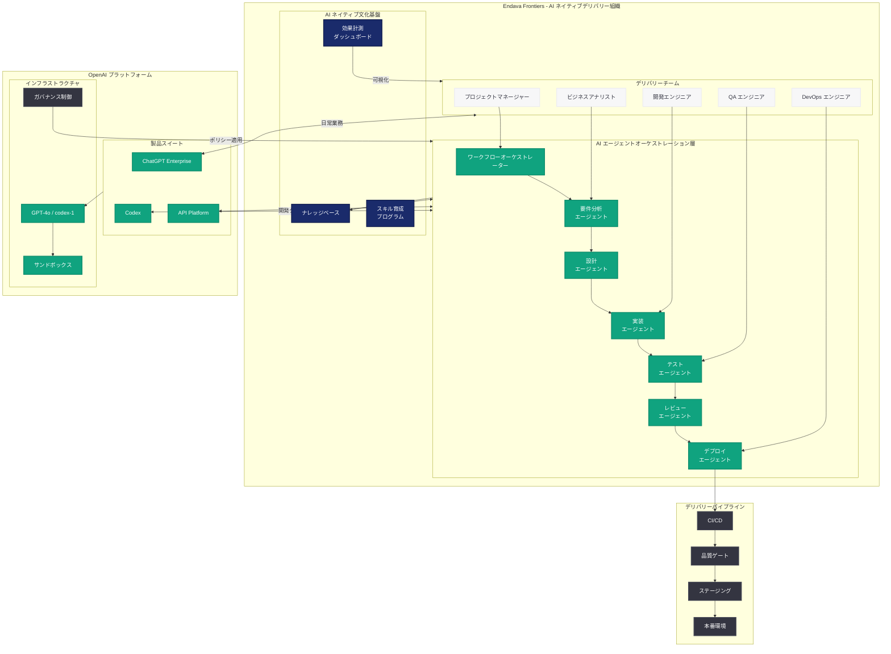
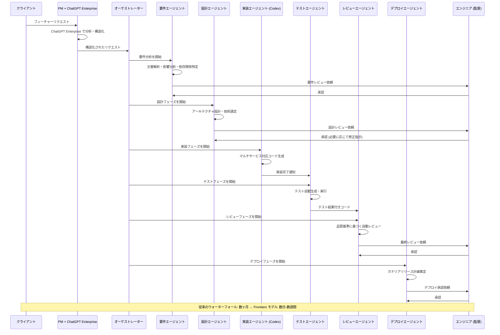

# Endava が AI エージェントを中心にソフトウェアデリバリーを再設計する方法

## メタデータ

| 項目 | 内容 |
|------|------|
| 発表日 | 2026-06-04 |
| ソース | OpenAI News/Blog |
| カテゴリ | AI Adoption / Enterprise / Codex |
| 公式リンク | [openai.com/index/endava-frontiers](https://openai.com/index/endava-frontiers) |

> **注:** 本レポートは OpenAI ブログの公開情報 (タイトル、RSS 記述、URL) および 2026-05-28 の先行記事に基づいて作成しています。本記事は先行記事「How Endava builds an agentic organization with Codex」の続編であり、より深い組織変革とデリバリーライフサイクル全体の再設計に焦点を当てています。

## 概要

グローバル IT サービス企業 Endava は、AI エージェント、ChatGPT Enterprise、および Codex を活用して、ソフトウェアデリバリーの全工程を根本から再設計している。本記事「Frontiers」は、2026 年 5 月 28 日に公開された初期導入事例の続編として、単なるツール活用を超えた「AI ネイティブ文化」の構築と、デリバリーパイプライン全体にわたるエージェント統合の深化を報告している。

先行記事では要件分析の短縮 (数週間から数時間) が主な成果として紹介されたが、本記事では要件定義から設計、開発、テスト、デプロイメントに至るすべてのフェーズにおいて AI エージェントが中核的な役割を担う、成熟したデリバリーモデルへの進化が示されている。「Frontiers」というタイトルが示すとおり、Endava は AI 導入の最前線を切り拓き、エンタープライズ規模での AI ネイティブ組織の実現可能性を実証している。

## 主な内容

### ソフトウェアデリバリーパイプライン全体の AI エージェント統合

Endava の「Frontiers」アプローチでは、ソフトウェアデリバリーの各ステージに専用の AI エージェントが配置され、人間のエンジニアと協調して業務を遂行する。初期導入時の要件分析に限定されたアプローチから、デリバリーライフサイクル全体への拡張が実現している。

| デリバリーステージ | AI エージェントの役割 | 期待される効果 |
|-------------------|---------------------|---------------|
| 要件定義 | ステークホルダー文書の解析、要件構造化 | リードタイム 90% 以上削減 |
| アーキテクチャ設計 | 設計パターン提案、技術選定根拠の自動生成 | 設計品質の均一化 |
| 実装 | Codex によるコード生成、並列開発 | 開発速度の大幅向上 |
| テスト | テストケース自動生成、カバレッジ最適化 | テスト網羅性の向上 |
| コードレビュー | 品質基準に基づく自動レビュー | レビュー待ち時間の解消 |
| デプロイメント | CI/CD パイプラインの自動最適化 | デプロイ頻度の増加 |

### ChatGPT Enterprise による組織横断的な AI 活用

Endava は ChatGPT Enterprise を組織全体に展開し、開発者以外のロール (プロジェクトマネージャー、ビジネスアナリスト、デザイナー、QA エンジニア) にも AI 活用を浸透させている。これにより、デリバリーチーム全体が AI ネイティブな働き方を実現している。

- **プロジェクトマネージャー:** スプリント計画の最適化、リスク分析の自動化、ステークホルダーコミュニケーションの効率化
- **ビジネスアナリスト:** 市場調査の加速、競合分析、要件の一貫性検証
- **QA エンジニア:** テスト戦略の策定支援、バグレポートの自動分類、回帰テストの優先順位付け
- **デザイナー:** ユーザーリサーチの分析、デザインシステムの整合性チェック

### Codex を活用した開発ワークフローの高度化

初期導入では要件分析への Codex 適用が中心だったが、Frontiers フェーズでは以下の高度なワークフローが実現されている。

1. **マルチリポジトリ対応:** 複数のマイクロサービスにまたがる変更を Codex が統合的に管理
2. **コンテキスト認識型コード生成:** プロジェクト固有のアーキテクチャ規約やコーディング標準を理解した上でのコード生成
3. **自律的な技術負債解消:** Codex がコードベースを分析し、リファクタリング提案を自動的に生成
4. **インシデント対応の高速化:** 本番環境の問題に対し、Codex が原因分析と修正パッチの生成を支援

### AI ネイティブ文化の構築

「Frontiers」の最も重要な側面は、テクノロジーそのものではなく、組織文化の変革にある。Endava が推進する AI ネイティブ文化の要素は以下の通りである。

| 文化的要素 | 具体的な施策 |
|-----------|-------------|
| 実験奨励 | AI エージェントの新しい活用パターンを各チームが自律的に探索 |
| 知識共有 | 成功事例と失敗事例をナレッジベースとして組織横断で共有 |
| スキル進化 | AI と協調するための新しいスキルセット (プロンプトエンジニアリング、エージェント設計) の体系的な育成 |
| 計測文化 | AI 導入効果を定量的に計測し、継続的改善につなげる |
| 心理的安全性 | AI が仕事を奪うのではなく、仕事を拡張するものというマインドセットの醸成 |

### 成熟したデプロイパターンと教訓

大規模な AI エージェント導入を経て得られた知見として以下が挙げられる。

- **段階的自律性の拡大:** 初期は人間の承認を必要とする範囲を広く設定し、信頼度が上がるにつれてエージェントの自律範囲を段階的に拡大
- **品質ゲートの設計:** AI 生成物の品質を担保するための多層的なレビューメカニズム
- **フィードバックループの構築:** エージェントの出力に対する人間のフィードバックを蓄積し、プロンプトとワークフローを継続的に改善
- **ガバナンスの進化:** セキュリティ要件やコンプライアンス要件に応じたエージェント権限の動的制御

## 技術的な詳細

### デリバリーパイプライン全体のエージェント統合ワークフロー

```python
# Endava Frontiers: デリバリーライフサイクル全体のエージェント統合 (概念例)
from openai import OpenAI

client = OpenAI()


class FrontiersDeliveryPipeline:
    """
    Endava Frontiers モデル: AI エージェントがデリバリーの
    全ステージを統合的に管理するパイプライン。
    """

    def __init__(self, project_config: dict):
        self.client = OpenAI()
        self.project_config = project_config

    def execute_delivery_cycle(self, feature_request: str) -> dict:
        """
        フィーチャーリクエストから本番デプロイまでの
        エンドツーエンドデリバリーサイクルを実行する。
        """
        # Stage 1: 要件の構造化と影響分析
        requirements = self._analyze_and_structure(feature_request)

        # Stage 2: アーキテクチャ設計と技術選定
        design = self._design_architecture(requirements)

        # Stage 3: マルチリポジトリ対応の実装
        implementation = self._implement_across_services(design)

        # Stage 4: 包括的テスト戦略の実行
        test_results = self._execute_test_strategy(implementation, requirements)

        # Stage 5: デプロイメント準備と実行
        deployment = self._prepare_deployment(implementation, test_results)

        return {
            "requirements": requirements,
            "design": design,
            "implementation": implementation,
            "test_results": test_results,
            "deployment": deployment,
        }

    def _analyze_and_structure(self, feature_request: str) -> dict:
        """要件分析エージェント: 影響範囲と依存関係を自動特定。"""
        response = self.client.responses.create(
            model="codex-1",
            instructions="""あなたはシニア要件アナリストエージェントです。
フィーチャーリクエストを分析し、以下を特定してください:
1. 機能要件と非機能要件
2. 影響を受けるマイクロサービス
3. 依存関係とリスク
4. 受け入れ基準
5. 推定工数と優先度""",
            input=f"フィーチャーリクエスト: {feature_request}\n"
            f"プロジェクト構成: {self.project_config}",
        )
        return {"structured_requirements": response.output_text}

    def _design_architecture(self, requirements: dict) -> dict:
        """設計エージェント: プロジェクト規約に準拠した設計を自動生成。"""
        response = self.client.responses.create(
            model="codex-1",
            instructions="""あなたはアーキテクチャ設計エージェントです。
要件に基づき、プロジェクトの既存アーキテクチャと整合する
技術設計を作成してください。設計決定の根拠も明記すること。""",
            input=f"要件: {requirements}\n"
            f"アーキテクチャ規約: {self.project_config.get('architecture_standards')}",
        )
        return {"architecture_design": response.output_text}

    def _implement_across_services(self, design: dict) -> dict:
        """実装エージェント: 複数サービスにまたがる変更を統合管理。"""
        response = self.client.responses.create(
            model="codex-1",
            instructions="""あなたは実装エージェントです。
設計に基づき、影響を受ける全マイクロサービスの変更を
一貫性を保ちながら実装してください。
各サービスのコーディング規約に従うこと。""",
            input=f"設計: {design}\n"
            f"コーディング標準: {self.project_config.get('coding_standards')}",
        )
        return {"implementation": response.output_text}

    def _execute_test_strategy(self, implementation: dict, requirements: dict) -> dict:
        """テストエージェント: 包括的テスト戦略を策定し実行。"""
        response = self.client.responses.create(
            model="codex-1",
            instructions="""あなたはテスト戦略エージェントです。
以下のテストレベルすべてをカバーしてください:
1. ユニットテスト
2. インテグレーションテスト
3. E2E テスト
4. パフォーマンステスト
5. セキュリティテスト""",
            input=f"実装: {implementation}\n要件: {requirements}",
        )
        return {"test_results": response.output_text}

    def _prepare_deployment(self, implementation: dict, test_results: dict) -> dict:
        """デプロイメントエージェント: 安全なリリース計画を策定。"""
        response = self.client.responses.create(
            model="codex-1",
            instructions="""あなたはデプロイメントエージェントです。
テスト結果を検証し、安全なデプロイメント計画を策定してください。
カナリアリリース、ロールバック計画を含めること。""",
            input=f"実装: {implementation}\nテスト結果: {test_results}",
        )
        return {"deployment_plan": response.output_text}
```

### ChatGPT Enterprise と Codex のマルチツール統合

```python
# マルチツール統合: ChatGPT Enterprise + Codex の組み合わせ (概念例)
from openai import OpenAI

client = OpenAI()


def multi_tool_delivery_workflow(project_brief: str) -> dict:
    """
    ChatGPT Enterprise (ナレッジワーク) と Codex (開発タスク) を
    組み合わせた統合デリバリーワークフロー。
    """
    # ChatGPT Enterprise: ビジネス分析と戦略策定
    business_analysis = client.chat.completions.create(
        model="gpt-4o",
        messages=[
            {
                "role": "system",
                "content": "あなたはビジネスアナリストです。"
                "プロジェクトブリーフから技術要件を抽出してください。",
            },
            {"role": "user", "content": project_brief},
        ],
    )

    # Codex: 技術的な実装とコード生成
    technical_implementation = client.responses.create(
        model="codex-1",
        instructions="ビジネス要件を技術実装に変換してください。",
        input=business_analysis.choices[0].message.content,
    )

    return {
        "business_requirements": business_analysis.choices[0].message.content,
        "technical_implementation": technical_implementation.output_text,
    }
```

### エージェント自律性の段階的拡大モデル

```yaml
# Endava Frontiers: エージェント自律性レベル設定 (概念例)
# agent-autonomy-config.yaml

autonomy_levels:
  level_1_supervised:
    description: "完全監視モード - すべてのアクションに人間の承認が必要"
    applicable_phases:
      - production_deployment
      - security_critical_changes
      - architecture_modifications
    human_approval: required_before_execution

  level_2_guided:
    description: "ガイド付きモード - 主要な決定に承認が必要"
    applicable_phases:
      - design_decisions
      - external_api_integrations
      - database_schema_changes
    human_approval: required_for_major_decisions

  level_3_autonomous:
    description: "自律モード - 事後レビューで品質を担保"
    applicable_phases:
      - code_generation
      - test_creation
      - code_review
      - documentation_updates
    human_approval: post_execution_review

  level_4_fully_autonomous:
    description: "完全自律モード - 定型タスクの自動実行"
    applicable_phases:
      - lint_fixes
      - dependency_updates
      - formatting
      - changelog_generation
    human_approval: none

escalation_rules:
  - condition: "confidence_score < 0.7"
    action: "escalate_to_human"
  - condition: "security_impact == high"
    action: "require_senior_review"
  - condition: "blast_radius > 3_services"
    action: "require_architecture_review"
```

## アーキテクチャ



### デリバリーライフサイクルのエージェント協調シーケンス



## 開発者への影響

- **デリバリーライフサイクル全体の AI 化:** 本記事は、AI エージェントが開発の一部分ではなくデリバリーの全ステージを統合的にカバーするモデルを示している。要件定義からデプロイメントまで、人間とエージェントが各フェーズで協調する新しい働き方が標準になりつつある

- **マルチツール戦略の重要性:** ChatGPT Enterprise (ナレッジワーク・コミュニケーション) と Codex (開発タスク) の併用により、開発者だけでなくデリバリーチーム全体が AI の恩恵を受けられる。単一ツールへの依存ではなく、用途に応じたツール選択が求められる

- **AI ネイティブ文化が競争優位に:** テクノロジーの導入だけでなく、組織文化の変革が成功の鍵であることが明確になった。実験を奨励し、失敗から学び、AI と協調するスキルを継続的に育成する組織が、デリバリー速度と品質の両面で優位に立つ

- **エージェント自律性の段階的設計:** すべてのタスクを完全自律にするのではなく、リスクと信頼度に応じて自律性レベルを段階的に設計するアプローチが、エンタープライズ環境での安全な AI 導入パターンとして確立されつつある

- **IT サービス業界のビジネスモデル変革の加速:** 約 12,000 人規模の Endava がデリバリー全体を AI エージェントで再設計したことは、「人月」ベースから「価値ベース」へのビジネスモデル変革が具体的に進行していることを示す。競合他社も同様の変革を迫られる

- **新しいエンジニアリングロールの出現:** エージェントオーケストレーション設計、プロンプトエンジニアリング、AI ガバナンス設計といった新しい専門領域が、従来のソフトウェアエンジニアリングスキルと並んで重要性を増している

## 関連リンク

- [How Endava is redesigning software delivery around AI agents](https://openai.com/index/endava-frontiers)
- [How Endava builds an agentic organization with Codex](https://openai.com/index/endava)
- [OpenAI Codex](https://openai.com/codex)
- [ChatGPT Enterprise](https://openai.com/enterprise)
- [Codex for every role and workflow](https://openai.com/index/codex-for-every-role-tool-workflow)
- [Endava 公式サイト](https://www.endava.com/)
- [OpenAI News](https://openai.com/news)

## まとめ

Endava の「Frontiers」事例は、AI エージェントによるソフトウェアデリバリーの再設計が概念段階を超え、エンタープライズ規模で実践されていることを示す重要なマイルストーンである。先行記事で示された要件分析の効率化 (数週間から数時間) を起点として、今回はデリバリーライフサイクル全体 (要件定義、設計、実装、テスト、デプロイメント) への AI エージェント統合が報告されている。

特に注目すべきは 3 つのポイントである。第一に、ChatGPT Enterprise と Codex のマルチツール戦略により、開発者だけでなくデリバリーチーム全員が AI の恩恵を受けている点。第二に、テクノロジー導入と並行して AI ネイティブ文化の構築を推進し、組織全体の変革を実現している点。第三に、エージェントの自律性を段階的に拡大する成熟したガバナンスモデルにより、品質とスピードの両立を達成している点である。

Endava のモデルは、グローバル IT サービス企業が AI 時代にどのように進化すべきかの青写真を提示しており、業界全体に大きな影響を与える事例となるだろう。
