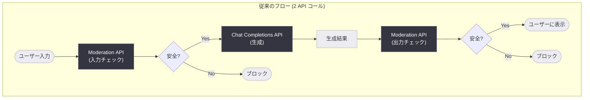
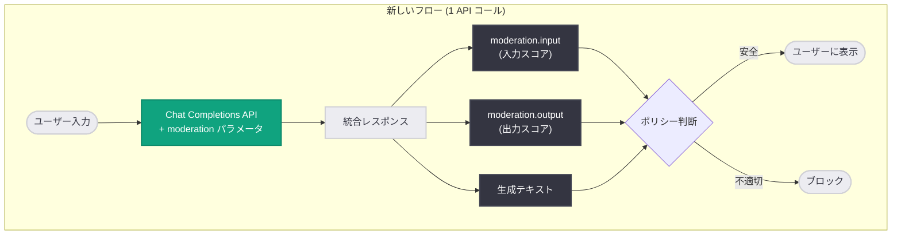
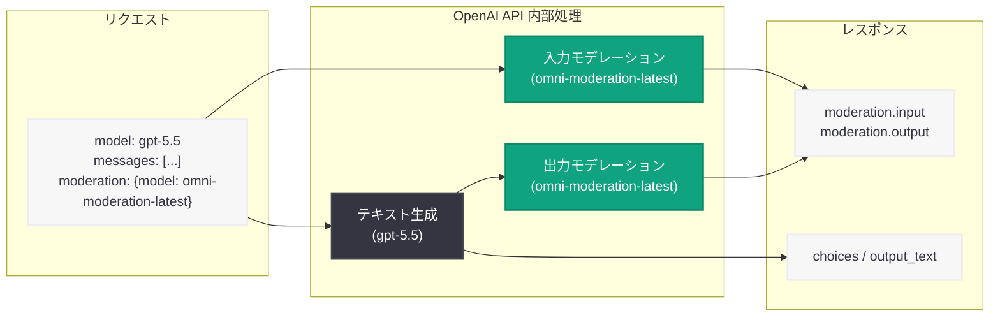

# Responses API と Chat Completions API にインラインモデレーションスコアが追加

## メタデータ

| 項目 | 内容 |
|------|------|
| 発表日 | 2026-06-04 |
| ソース | OpenAI API Changelog |
| カテゴリ | API 更新 (新機能) |
| 公式リンク | [Moderation - Moderate generated content](https://developers.openai.com/api/docs/guides/moderation#moderate-generated-content) |

## 概要

OpenAI は 2026 年 6 月 4 日、Responses API および Chat Completions API にインラインモデレーションスコア機能を追加した。これにより、開発者はモデルの入力と生成出力の両方に対するモデレーション結果を、同一の API レスポンス内で受け取ることが可能になった。従来は生成 API とモデレーション API を別々に呼び出す必要があったが、この更新によりリクエストパラメータに `moderation` オブジェクトを追加するだけで、1 回の API コールで生成とモデレーションの両方を完了できる。

この機能は、有害コンテンツの検出・フィルタリングを行うアプリケーションのアーキテクチャを大幅に簡素化する。モデレーションスコアはあくまで「アプリケーションのポリシー判断のためのシグナル」であり、自動的なブロッキングは行わない設計となっている。開発者はスコアを確認した上で、出力をユーザーに表示するかどうかを独自のポリシーに基づいて判断できる。

## 主な内容

### 新機能の概要

生成リクエストにトップレベルの `moderation` オブジェクトを渡すことで、API レスポンスに入力・出力それぞれのモデレーション結果が含まれるようになった。モデレーションモデルとして `omni-moderation-latest` を指定し、テキストおよび画像の有害性を 13 カテゴリにわたって評価する。

**主要なポイント:**

- **入力・出力の両方を評価:** ユーザー入力とモデル出力の双方について、有害性スコアを返却する
- **自動ブロックではない:** モデルは通常通り生成を行い、モデレーション結果は開発者がポリシー判断に使用するシグナルである
- **ストリーミング対応:** ストリーミング時は、完全な出力が生成された後にモデレーションスコアが到着する
- **ツール呼び出し対応:** ツールの引数と出力はカバーするが、ツール名・説明・スキーマは対象外
- **モデレーションエンドポイント自体は無料:** 引き続きモデレーション API は無料で利用可能

### Before / After 比較

| 側面 | Before (従来) | After (新機能) |
|------|--------------|----------------|
| API コール数 | 2 回 (生成 + モデレーション) | 1 回 (生成 + インラインモデレーション) |
| レイテンシ | 2 回のラウンドトリップ | 1 回のラウンドトリップ |
| 実装の複雑さ | 2 つの API レスポンスを管理 | 単一レスポンスで完結 |
| 入力モデレーション | 生成前に別途呼び出し | リクエストに含めるだけ |
| 出力モデレーション | 生成後に別途呼び出し | レスポンスに自動的に含まれる |
| エラーハンドリング | 2 つの API のエラーを個別管理 | 統合されたエラー処理 |

### moderation オブジェクトのパラメータ

| パラメータ | 型 | 説明 |
|-----------|------|------|
| `model` | string | モデレーションモデル識別子 (例: `"omni-moderation-latest"`) |

## 技術的な詳細

### Responses API での使用例

```python
from openai import OpenAI
client = OpenAI()

response = client.responses.create(
    model="gpt-5.5",
    input=[
        {
            "role": "user",
            "content": (
                "A user asks for instructions to make a harmful weapon. "
                "Draft a brief refusal and offer a safer alternative."
            ),
        }
    ],
    moderation={"model": "omni-moderation-latest"},
)

input_moderation = response.moderation.input
output_moderation = response.moderation.output

print(input_moderation.flagged)
print(output_moderation.flagged)
```

### Chat Completions API での使用例

```python
from openai import OpenAI
client = OpenAI()

completion = client.chat.completions.create(
    model="gpt-5.5",
    messages=[
        {
            "role": "user",
            "content": (
                "A user asks for instructions to make a harmful weapon. "
                "Draft a brief refusal and offer a safer alternative."
            ),
        }
    ],
    moderation={"model": "omni-moderation-latest"},
)

input_moderation = completion.moderation.input.results[0]
output_moderation = completion.moderation.output.results[0]

print(input_moderation.flagged)
print(output_moderation.flagged)
```

### レスポンス形式

API レスポンスの `.moderation.input` および `.moderation.output` に `moderation_result` オブジェクトが含まれる。

| フィールド | 型 | 説明 |
|-----------|------|------|
| `flagged` | boolean | コンテンツが有害である可能性がある場合 `true` |
| `categories` | object | カテゴリごとの違反フラグ (boolean) |
| `category_scores` | object | カテゴリごとの信頼度スコア (0-1) |
| `category_applied_input_types` | object | 各カテゴリが適用される入力タイプ |

### サポートされるカテゴリ

| カテゴリ | 説明 |
|---------|------|
| `harassment` | ハラスメント |
| `harassment/threatening` | 脅迫的なハラスメント |
| `hate` | ヘイトスピーチ |
| `hate/threatening` | 脅迫的なヘイトスピーチ |
| `illicit` | 違法行為 |
| `illicit/violent` | 暴力的な違法行為 |
| `self-harm` | 自傷行為 |
| `self-harm/intent` | 自傷の意図 |
| `self-harm/instructions` | 自傷の指示 |
| `sexual` | 性的コンテンツ |
| `sexual/minors` | 未成年に関する性的コンテンツ |
| `violence` | 暴力 |
| `violence/graphic` | 生々しい暴力描写 |

### 重要な注意事項

- **エラーの可能性:** モデレーション結果にはスコアではなくエラーが含まれる場合がある。結果のタイプを確認する必要がある
- **ツール呼び出しの制限:** ツールの引数と出力はモデレーション対象だが、ツール名、説明、スキーマは対象外
- **ストリーミング時の動作:** ストリーミングモードでは、完全な出力が生成された後にモデレーションスコアが配信される
- **omni-moderation-latest モデル:** テキストと画像の両方をサポートするマルチモーダルモデレーションモデルを使用

## アーキテクチャ

### 従来のモデレーションフロー vs 新しいインラインモデレーションフロー





### API 内部処理の概念図



## 開発者への影響

### 実装の簡素化

- **コード量の削減:** モデレーション処理のための別途 API コールが不要になり、コードがシンプルになる
- **エラーハンドリングの統合:** 2 つの API コールそれぞれのエラー処理を管理する必要がなくなる
- **状態管理の簡素化:** 生成結果とモデレーション結果を紐付ける処理が不要になる

### パフォーマンスの改善

- **レイテンシの削減:** ネットワークラウンドトリップが 1 回で済むため、エンドユーザーへの応答が高速化する
- **スループットの向上:** API コール数が半減するため、レート制限に達しにくくなる

### アーキテクチャへの影響

- **ミドルウェアの簡素化:** 生成とモデレーションを別々のレイヤーで管理していた場合、統合が可能になる
- **既存実装の移行:** 既存のモデレーションパイプラインを段階的に新しいインライン方式へ移行できる。従来のモデレーションエンドポイントも引き続き利用可能

### ベストプラクティス

- **ポリシーエンジンの構築:** `category_scores` の閾値を自社のコンテンツポリシーに合わせて設定する
- **エラーチェックの実装:** モデレーション結果がエラーを含む可能性があるため、結果タイプの確認を行う
- **ストリーミング対応:** ストリーミング利用時は、モデレーションスコアの到着タイミングを考慮した UI 設計が必要

## 関連リンク

- [OpenAI Moderation Guide - Moderate generated content](https://developers.openai.com/api/docs/guides/moderation#moderate-generated-content)
- [OpenAI Moderation API Reference](https://platform.openai.com/docs/api-reference/moderations)
- [OpenAI API Changelog](https://platform.openai.com/docs/changelog)
- [OpenAI Responses API Documentation](https://platform.openai.com/docs/api-reference/responses)
- [OpenAI Chat Completions API Documentation](https://platform.openai.com/docs/api-reference/chat)

## まとめ

Responses API と Chat Completions API へのインラインモデレーションスコア追加は、コンテンツ安全性を担保するアプリケーション開発を大幅に効率化する実践的なアップデートである。従来の 2 段階の API コール (生成 + モデレーション) が 1 回のリクエストに統合されたことで、実装の複雑さ、レイテンシ、エラーハンドリングの負担がすべて軽減される。

特に重要なのは、この機能が「自動ブロック」ではなく「シグナル提供」という設計思想に基づいている点である。開発者は `category_scores` の各カテゴリスコアを自社のコンテンツポリシーに照らし合わせ、独自の判断ロジックを構築できる。この柔軟性により、過度なフィルタリングによるユーザー体験の劣化を避けつつ、適切なコンテンツ管理を実現できる。

`omni-moderation-latest` モデルによるテキストと画像の両方のサポート、13 カテゴリにわたる詳細な分類、そしてモデレーションエンドポイント自体が無料であるという点も、幅広いユースケースでの採用を促進する要因となるだろう。
