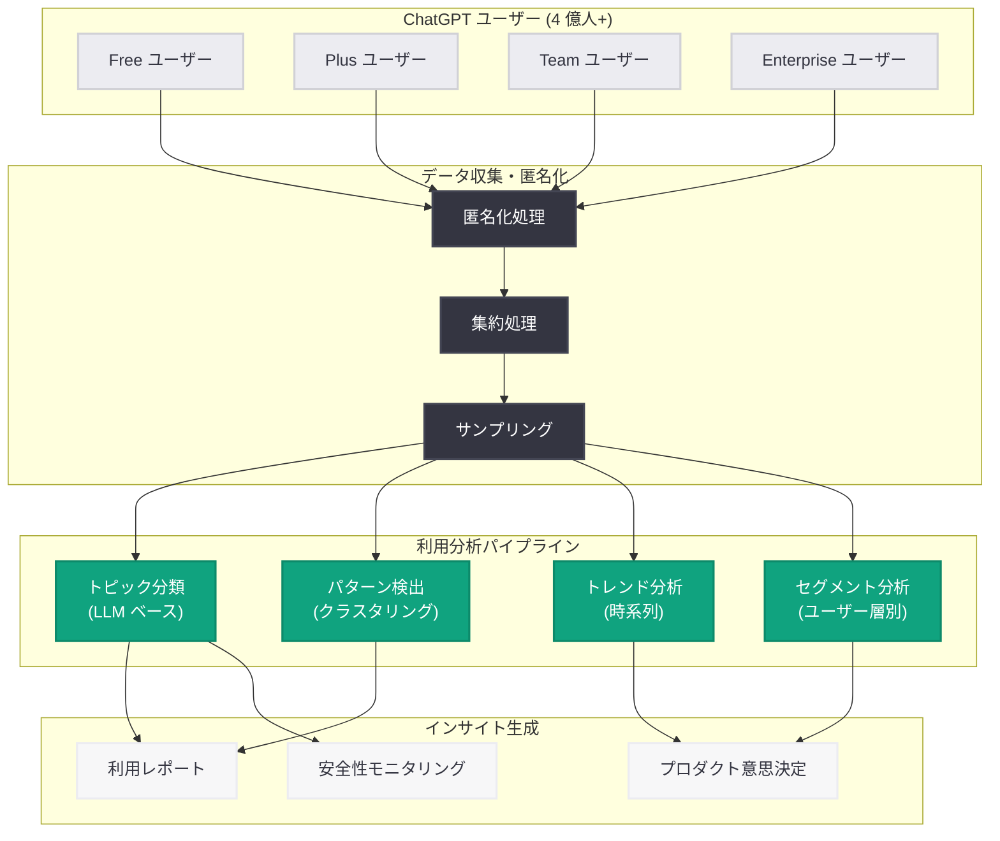

# ChatGPT の利用実態: ユーザーはどのように ChatGPT を使っているのか

## メタデータ

| 項目 | 内容 |
|------|------|
| 発表日 | 2026-06-05 |
| ソース | OpenAI Research |
| カテゴリ | 研究成果 / プロダクト分析 |
| 公式リンク | [How People Are Using ChatGPT](https://openai.com/index/how-people-are-using-chatgpt/) |

> **注記:** 本レポートは OpenAI サイトマップのメタデータ (lastmod: 2026-06-05T21:31:50.227Z)、公式発表のコンテキスト情報、および ChatGPT の利用状況に関する公開情報に基づいて作成している。記事本文は Cloudflare の保護により 403 エラーが返されたため、直接アクセスできなかった。公開されたメタデータおよび関連コンテキストから内容を構成している。

## 概要

OpenAI は 2026 年 6 月 5 日、ChatGPT のユーザー利用実態に関する研究レポート「How People Are Using ChatGPT」を公開した。2026 年初頭時点で週間アクティブユーザー数が 4 億人を超える ChatGPT について、利用パターン、人気のユースケース、ユーザーセグメント別の利用傾向、そして利用動向の変遷を分析した包括的なレポートである。

本レポートは、OpenAI がプロダクトの成長と進化を理解し、今後の開発方針に反映させるための重要なデータ分析であり、AI アシスタントがどのように人々の日常的なワークフローに組み込まれているかを示す貴重な知見を提供するものと位置付けられる。

## 主な内容

### 利用規模と成長

ChatGPT は 2022 年 11 月のローンチ以降、急速な成長を遂げている。2025 年 2 月に週間アクティブユーザー数が 4 億人を突破し、2026 年に至るまで継続的な成長を維持している。この規模のユーザーベースを持つ AI ツールの利用実態分析は、AI 業界全体にとって重要な指標となる。

### 主要な利用カテゴリ

ChatGPT の利用は多岐にわたるが、主要なカテゴリとして以下が挙げられる。

**プログラミング・技術支援:**
- コード生成、デバッグ、コードレビュー
- 技術的な質問への回答、ドキュメント生成
- アーキテクチャ設計の相談、技術選定のアドバイス

**文章作成・クリエイティブ:**
- ビジネス文書の起草・推敲
- クリエイティブライティング (物語、詩、脚本)
- メール作成、SNS 投稿の文案

**教育・学習:**
- 概念の説明、チュートリアル
- 語学学習、翻訳支援
- 試験準備、学術研究のサポート

**ビジネス分析・意思決定:**
- データ分析の補助、レポート作成
- 市場調査、競合分析
- 戦略立案のブレインストーミング

**日常タスク・情報検索:**
- レシピ提案、旅行計画
- 製品比較、購入アドバイス
- 健康・フィットネスに関する情報

### ユーザーセグメント別の利用傾向

異なるユーザー層によって利用パターンが大きく異なることが示唆される。

| ユーザーセグメント | 主な利用目的 | 利用頻度の傾向 |
|-------------------|-------------|---------------|
| ソフトウェアエンジニア | コーディング支援、デバッグ | 高頻度・長時間 |
| ビジネスプロフェッショナル | 文書作成、分析 | 中〜高頻度 |
| 学生・研究者 | 学習、論文執筆支援 | 中頻度 |
| クリエイター | コンテンツ制作、アイデア出し | 中頻度 |
| 一般ユーザー | 情報検索、日常タスク | 低〜中頻度 |

### 利用動向の変遷

ChatGPT の利用パターンは時間とともに進化している。

**初期 (2022-2023 年):** 好奇心主導の試行的な利用が主流。短い質問への回答、文章の校正といった比較的シンプルなタスクが中心であった。

**成長期 (2024 年):** GPT-4o の登場やマルチモーダル対応により、画像を含む複雑なタスクや、より専門的な利用が拡大。ワークフローへの組み込みが進展した。

**成熟期 (2025-2026 年):** メモリ機能、Canvas、カスタム GPT、Codex 等の機能拡充により、長期的なプロジェクト管理やチーム単位での利用が一般化。AI が日常業務の不可欠なパートナーとして定着した。

### 会話トピックの分析

最も頻繁に議論されるトピック領域として、以下が推定される。

1. **プログラミング・ソフトウェア開発** - 最大の利用カテゴリの一つ
2. **文章の作成・編集** - ビジネスからクリエイティブまで幅広い
3. **学習・教育** - 概念説明から問題解決まで
4. **ブレインストーミング・アイデア生成** - 創造的思考の支援
5. **データ分析・数学** - 定量的な問題解決

## 技術的な詳細

### 利用分析の手法

大規模な AI サービスの利用実態分析には、以下のような技術的アプローチが用いられると考えられる。

**会話の分類 (Topic Classification):**
- LLM ベースの自動トピック分類
- クラスタリングアルゴリズムによるパターン発見
- 時系列分析による利用トレンドの追跡

**プライバシー保護分析:**
- 集約化・匿名化されたデータに基づく分析
- 差分プライバシー手法の適用
- 個人を特定可能な情報の除去

### 分析パイプラインの構成

```python
from openai import OpenAI

client = OpenAI()

# 会話トピック分類の概念的な例
response = client.chat.completions.create(
    model="gpt-4o",
    messages=[
        {
            "role": "system",
            "content": "Classify the following conversation into one of these categories: "
                       "coding, writing, education, business, creative, daily_tasks"
        },
        {
            "role": "user",
            "content": "{anonymized_conversation_summary}"
        }
    ],
    response_format={"type": "json_object"}
)

# 大規模利用分析ではバッチ処理が想定される
batch_response = client.batches.create(
    input_file_id="file-abc123",
    endpoint="/v1/chat/completions",
    completion_window="24h"
)
```

### データスケールの考慮

週間 4 億人以上のユーザーから生成される会話データの分析には、以下の技術的課題が伴う。

- **スケーラビリティ:** 数十億件の会話を効率的に処理するインフラ
- **リアルタイム性:** 利用トレンドの変化を迅速に検出する仕組み
- **精度と効率のバランス:** サンプリング手法と全数分析の使い分け

## アーキテクチャ



## 開発者への影響

### プロダクト開発への示唆

- **ユースケースの優先順位付け:** 利用実態データに基づき、OpenAI は最も利用頻度の高いユースケースに対して機能改善のリソースを優先配分できる。開発者向け API の改善方針にも影響する
- **モデル最適化の方向性:** 特定のタスク (コーディング、文章作成等) への利用集中が確認されれば、それらのタスクに特化したモデルチューニングやベンチマークの強化が期待できる
- **API 機能の拡充方針:** ユーザーの利用パターンから新たな API 機能のニーズを特定し、Assistants API や Chat Completions API の機能拡張に反映される

### AI アプリケーション開発者への知見

- **競合分析の基盤:** ChatGPT の利用実態を理解することで、AI アプリケーション開発者は自社プロダクトの差別化ポイントを特定しやすくなる
- **ユーザー期待値の把握:** ChatGPT で 4 億人が体験している UX が、AI ツール全般に対するユーザー期待値のベースラインを形成している
- **未充足ニーズの発見:** 利用データから、ChatGPT では十分に対応できていない領域を特定し、ニッチな AI ソリューションの開発機会を見出せる

### 安全性・ポリシーへの影響

- **Content Policy の調整:** 実際の利用パターンに基づき、コンテンツポリシーの適用範囲と精度を最適化できる
- **Abuse Detection の改善:** 通常の利用パターンとの乖離を検出することで、不正利用の検知精度を向上させる
- **透明性レポートとしての価値:** 利用実態の公開は、AI の社会的影響を評価するための重要な透明性施策である

## 関連リンク

- [How People Are Using ChatGPT](https://openai.com/index/how-people-are-using-chatgpt/)
- [OpenAI Research](https://openai.com/research)
- [ChatGPT](https://chatgpt.com)
- [OpenAI Usage Policies](https://openai.com/policies/usage-policies)
- [OpenAI API Platform](https://platform.openai.com/docs)

## まとめ

「How People Are Using ChatGPT」は、4 億人以上の週間アクティブユーザーを持つ ChatGPT の利用実態を包括的に分析した OpenAI Research のレポートである。プログラミング支援、文章作成、教育、ビジネス分析、日常タスクなど多様なユースケースにわたる利用パターンを明らかにし、ユーザーセグメント別の傾向や利用動向の時系列的な変遷を示している。

このレポートは、OpenAI のプロダクト開発方針を示すと同時に、AI アシスタントが人々の知的活動にどの程度浸透しているかを示す重要なエビデンスとなっている。開発者にとっては、API 機能の今後の方向性を推察する手がかりとなり、AI アプリケーション市場における機会とユーザー期待値を理解するための基礎資料としての価値がある。AI の社会的影響の透明性という観点からも、このような利用実態の公開は業界全体にとって意義深い取り組みである。
