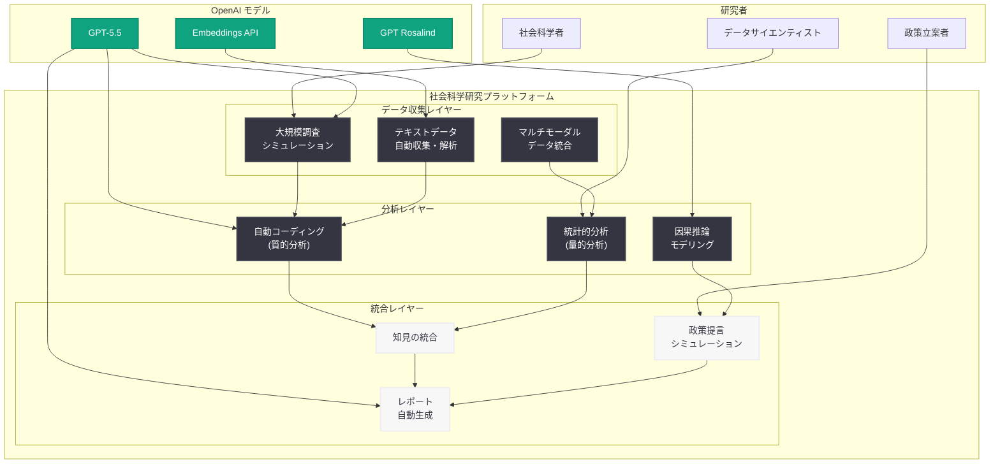

# AI による社会科学研究のスケーリング

## メタデータ

| 項目 | 内容 |
|------|------|
| 発表日 | 2026-06-05 |
| ソース | OpenAI Research |
| カテゴリ | 研究成果 |
| 公式リンク | [Scaling Social Science Research](https://openai.com/index/scaling-social-science-research/) |

> **注記:** 本レポートは OpenAI Research サイトマップ情報 (lastmod: 2026-06-05T21:31:46.752Z) および公開されたメタデータに基づいて作成している。記事本文へのアクセスが Cloudflare の保護により制限されているため、公開情報と研究コンテキストから内容を構成している。完全な詳細については公式ページを参照されたい。

## 概要

OpenAI は 2026 年 6 月 5 日、AI を活用して社会科学研究をスケーリングする手法に関する研究成果を発表した。この研究は、従来の社会科学研究が抱えていたスケーラビリティの課題 (調査の規模制限、データ収集コスト、分析の時間的制約) に対して、大規模言語モデル (LLM) がどのように解決策を提供できるかを探求するものである。

社会科学研究は、人間の行動、社会的動態、政策効果の理解に不可欠な学問分野であるが、伝統的に小規模なサンプルサイズ、高コストなデータ収集、長期にわたる分析プロセスによって制約されてきた。OpenAI の本研究は、GPT モデルを活用することで、これらの制約を克服し、社会科学研究の規模と速度を飛躍的に向上させる可能性を示している。これは OpenAI が推進する「AI による科学研究の加速」という広範な取り組みの一環である。

## 主な内容

### 社会科学研究における AI の役割

社会科学研究において AI が貢献できる領域は多岐にわたる。本研究では、以下のような応用領域が検討されていると推察される。

**大規模調査シミュレーション:** LLM を用いて多様な人口統計学的プロファイルを持つ仮想回答者を生成し、大規模な調査を迅速かつ低コストで実施する手法。これにより、従来数ヶ月を要していた調査研究を数時間で予備的に実施できる可能性がある。

**行動パターン分析:** テキストデータ、ソーシャルメディアデータ、公開データセットから人間の行動パターンを大規模に抽出・分析する AI パイプライン。従来の手動コーディングと比較して、桁違いの処理速度を実現する。

**政策シミュレーション:** 政策介入の効果を事前にモデル化し、多様なシナリオにおける社会的影響を予測する。複雑な社会システムのダイナミクスを AI が支援することで、エビデンスベースの政策立案を加速する。

### AI 支援による研究ワークフローの変革

従来の社会科学研究ワークフローと AI 支援ワークフローの比較は以下の通りである。

**従来の研究プロセス:**

1. 文献レビュー (数週間 - 数ヶ月)
2. 研究設計と倫理審査 (数ヶ月)
3. データ収集 (数ヶ月 - 数年)
4. コーディングと分析 (数週間 - 数ヶ月)
5. 論文執筆と査読 (数ヶ月 - 1 年以上)

**AI 支援研究プロセス:**

1. AI 支援文献レビューと仮説生成 (数日 - 数週間)
2. AI シミュレーションによる予備検証 (数時間 - 数日)
3. 大規模データ収集の自動化 (数日 - 数週間)
4. AI による自動コーディングと多面的分析 (数時間 - 数日)
5. AI 支援による論文執筆と反復改善 (数週間)

### LLM を活用した調査研究の手法

LLM を社会科学調査に活用する際の主要なアプローチとして、以下が考えられる。

**シリコンサンプリング (Silicon Sampling):** LLM に特定の人口統計学的属性を付与し、仮想的な調査回答を生成する手法。多様な視点を大規模にシミュレーションできるが、バイアスの管理と妥当性の検証が課題となる。

**ハイブリッドアプローチ:** 人間の実際の回答データと LLM 生成データを組み合わせ、サンプルサイズの拡張やデータの欠損を補完する手法。実データによるキャリブレーションを通じて、シミュレーションの精度を向上させる。

**質的データの大規模分析:** インタビュー記録、自由記述回答、フィールドノートなどの質的データを LLM が自動的にコーディング・分類し、パターンを抽出する手法。研究者の解釈を支援しつつ、処理規模を飛躍的に拡大する。

### 倫理的考慮と限界

AI を社会科学研究に適用する際の倫理的考慮事項も重要な論点である。

- **代表性の問題:** LLM の学習データに反映されたバイアスが、シミュレーション結果に影響を与える可能性
- **生態学的妥当性:** AI 生成データが実際の人間の行動をどの程度正確に反映するかの検証
- **研究倫理:** AI シミュレーションにおけるインフォームドコンセントや倫理審査の新たな枠組みの必要性
- **解釈の限界:** AI が生成する分析結果の因果的解釈には慎重さが求められる

## 技術的な詳細

### AI 支援社会科学研究アーキテクチャ



### 研究スケーリングの比較

| 側面 | 従来手法 | AI 支援手法 | 改善倍率 |
|------|---------|------------|---------|
| 調査回答者数 | 数百 - 数千人 | 数万 - 数十万 (シミュレーション) | 10-100x |
| データ収集期間 | 数ヶ月 - 数年 | 数時間 - 数日 | 100-1000x |
| 質的コーディング速度 | 1 研究者あたり数百件/月 | 数万件/時間 | 1000x+ |
| 多言語・多文化分析 | 各言語専門家が必要 | 単一モデルで対応 | 言語数に比例 |
| 政策シミュレーション | 簡易モデルのみ | 複雑な社会ダイナミクス | 質的向上 |

### 想定される API 活用パターン

```python
from openai import OpenAI

client = OpenAI()

# 調査回答のシミュレーション例
def simulate_survey_response(demographic_profile, survey_questions):
    """特定の人口統計プロファイルに基づく調査回答シミュレーション"""
    response = client.chat.completions.create(
        model="gpt-5.5",
        messages=[
            {
                "role": "system",
                "content": f"""You are simulating a survey respondent with the
following demographic profile: {demographic_profile}.
Respond to each question as this person would,
considering their background, values, and experiences."""
            },
            {
                "role": "user",
                "content": f"Please answer the following survey:\n{survey_questions}"
            }
        ],
        temperature=0.8  # 回答の多様性を確保
    )
    return response.choices[0].message.content


# 質的データの自動コーディング例
def code_qualitative_data(text_data, coding_scheme):
    """質的データの自動コーディング"""
    response = client.chat.completions.create(
        model="gpt-5.5",
        messages=[
            {
                "role": "system",
                "content": f"""You are a qualitative research assistant.
Apply the following coding scheme to the provided text:
{coding_scheme}
Return structured codes with confidence scores."""
            },
            {
                "role": "user",
                "content": text_data
            }
        ],
        response_format={"type": "json_object"}
    )
    return response.choices[0].message.content
```

## 開発者への影響

本研究の成果は、AI を活用した社会科学研究ツールの開発に携わる開発者や研究者に対して、以下のような影響を与える。

- **研究ツール開発の加速:** OpenAI API を活用した社会科学研究支援ツールの開発が促進され、新たなスタートアップやプロダクトの創出が期待される
- **マルチモーダル研究の実現:** テキスト、画像、音声を統合した社会科学研究パイプラインの構築が技術的に可能になる
- **リアルタイム分析基盤:** 社会的イベントやトレンドのリアルタイム分析を可能にする AI システムの需要が増大する
- **倫理フレームワークの必要性:** AI を研究に利用する際の新たな倫理ガイドラインやレビュープロセスの開発が急務となる
- **学際的コラボレーション:** コンピュータサイエンスと社会科学の連携がさらに重要になり、双方の知見を橋渡しする開発者の需要が高まる
- **検証ツールの需要:** AI 生成データの妥当性を検証するためのツールやベンチマークの開発機会が増大する

## 関連リンク

- [Scaling Social Science Research (公式記事)](https://openai.com/index/scaling-social-science-research/)
- [OpenAI Research](https://openai.com/research)
- [Accelerating Science with GPT-5](https://openai.com/index/accelerating-science-gpt-5)
- [OpenAI 公式ドキュメント](https://platform.openai.com/docs)
- [OpenAI API リファレンス](https://platform.openai.com/docs/api-reference)

## まとめ

OpenAI の「Scaling Social Science Research」は、AI 技術が社会科学研究の根本的な制約を克服する可能性を示す重要な研究である。以下の点が特に注目される。

1. **研究スケールの飛躍的拡大:** LLM を活用することで、従来の社会科学研究のスケール制約を桁違いに解消できる可能性がある。調査研究、質的分析、政策シミュレーションのいずれにおいても、処理規模の大幅な拡大が見込まれる。

2. **研究サイクルの高速化:** データ収集から分析、論文執筆に至るまでの研究サイクル全体が AI 支援により大幅に短縮される。これにより、社会的課題に対するエビデンスの提供がよりタイムリーになる。

3. **新しい研究方法論の確立:** AI シミュレーションを組み込んだ新しい社会科学研究方法論が形成されつつあり、従来の実証研究を補完する形で研究の質と幅を拡大する。

4. **倫理的枠組みの重要性:** AI 生成データの代表性、バイアス管理、生態学的妥当性など、新たな方法論に対応した倫理的枠組みの構築が不可欠である。

5. **科学研究の民主化:** AI ツールにより、大規模な資金やインフラを持たない研究者でも高度な社会科学研究を実施できる環境が整いつつある。

本研究は、OpenAI が掲げる「AI による科学研究の加速」というビジョンの社会科学領域への展開であり、自然科学分野での成果 (GPT Rosalind など) に続く重要なマイルストーンとなる。
