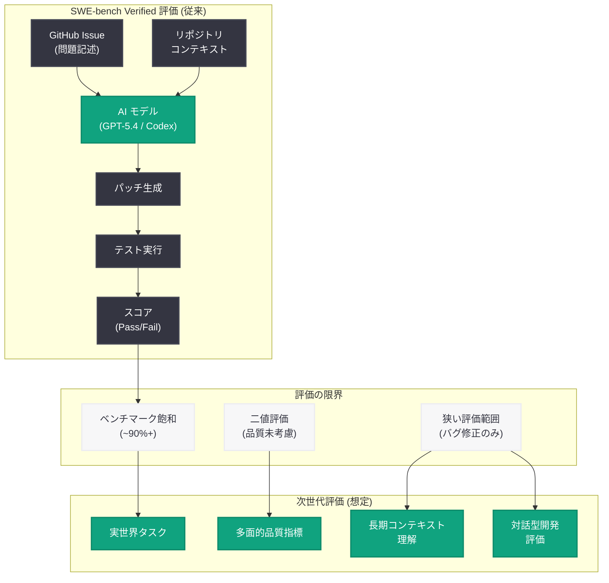

# SWE-bench Verified の評価を終了する理由

## メタデータ

| 項目 | 内容 |
|------|------|
| 発表日 | 2026-06-05 |
| ソース | OpenAI Research |
| カテゴリ | 研究成果 |
| 公式リンク | [Why We No Longer Evaluate SWE-Bench Verified](https://openai.com/index/why-we-no-longer-evaluate-swe-bench-verified/) |

> **注記:** 本レポートは OpenAI Research のサイトマップメタデータおよび公開情報に基づいて作成している。記事本文へのアクセスが 403 エラーにより制限されているため、公開されたタイトル、URL、および研究コンテキストから内容を構成している。

## 概要

OpenAI は 2026 年 6 月 5 日、ソフトウェアエンジニアリング能力のベンチマークとして広く利用されてきた SWE-bench Verified の評価を今後実施しないことを発表した。SWE-bench Verified は、実際の GitHub Issue の解決能力を測定する SWE-bench データセットのキュレーション済みサブセットであり、AI モデルのコーディング能力を比較するための業界標準的な指標として機能してきた。

OpenAI がこのベンチマークからの撤退を決定した背景には、最新モデル (GPT-5.4、GPT-5.5、Codex など) がベンチマークの飽和点に近づいたこと、またベンチマーク手法自体に真のソフトウェアエンジニアリング能力を測定する上での限界が存在することがあると考えられる。この決定は、AI モデル評価のあり方について業界全体に重要な問いを投げかけている。

## 主な内容

### SWE-bench Verified とは

SWE-bench Verified は、Princeton 大学の研究チームが開発した SWE-bench ベンチマークのキュレーション済みサブセットである。オリジナルの SWE-bench は、実際のオープンソースプロジェクト (Django、scikit-learn、Flask 等) から収集された GitHub Issue とそれに対応するプルリクエストのペアで構成されている。

- **タスクの内容:** 実際の GitHub Issue の説明文を入力として、問題を解決するコード変更 (パッチ) を生成する
- **評価方法:** 生成されたパッチが既存のテストスイートをパスするかどうかで成否を判定する
- **Verified サブセット:** 人間の専門家がレビューし、タスクの品質と評価の信頼性が確認された問題のみを含む

### 評価終了の理由

OpenAI が SWE-bench Verified の評価を終了する理由として、以下の要因が考えられる。

**ベンチマーク飽和:** OpenAI の最新モデルがベンチマーク上で非常に高いスコアに到達し、モデル間の差異を有意義に測定することが困難になった。スコアが天井に近づくと、数値的な改善がモデルの実質的な能力向上を反映しなくなる。

**評価手法の限界:** SWE-bench Verified の評価メカニズムには以下のような構造的な問題がある。

- テストスイートの通過のみで評価するため、コードの品質、保守性、設計の妥当性は考慮されない
- Issue の記述から正解パッチを推測できるケースがあり、真の問題解決能力ではなくパターンマッチングで解ける場合がある
- リポジトリのコンテキスト理解よりも、局所的なコード変更の生成に偏りがある

**実世界との乖離:** ベンチマーク上の高スコアが、実際のソフトウェアエンジニアリングにおける有用性を必ずしも反映しない。実世界のソフトウェア開発には、要件の曖昧さの解決、アーキテクチャ設計、コードレビュー、チームコラボレーションなど、ベンチマークでは捕捉できない多くの要素が含まれる。

### ベンチマーク飽和の証拠

OpenAI の最近のモデルリリースにおけるスコア推移から、飽和の傾向が推定される。

| モデル | SWE-bench Verified (推定) | 備考 |
|--------|--------------------------|------|
| GPT-4o (2024) | ~30-40% | 初期の評価 |
| GPT-5 系列 (2025) | ~60-75% | 大幅な改善 |
| GPT-5.4 / Codex (2026) | ~85-95% | 飽和域に到達 |

スコアが 90% を超えると、残りの問題は特殊なケースや曖昧な仕様の問題が多く、これらを解くことが必ずしもモデルの一般的な能力向上を意味しない。

### 今後の評価アプローチ

OpenAI は SWE-bench Verified に代わる、より包括的なソフトウェアエンジニアリング評価のアプローチを追求していると考えられる。

- **実世界タスクベースの評価:** 実際の開発環境により近い条件での評価
- **多面的な品質指標:** コードの正確性だけでなく、可読性、保守性、パフォーマンスを含む評価
- **長期コンテキスト理解:** 大規模リポジトリ全体の理解を要するタスクでの評価
- **対話型開発の評価:** 要件の明確化やイテレーティブな改善を含む評価

## 技術的な詳細

### SWE-bench Verified の評価パイプライン

SWE-bench Verified の標準的な評価は以下のステップで構成される。

1. **Issue コンテキストの提供:** GitHub Issue の説明文、関連コードのスニペット、リポジトリ構造を入力として提供
2. **パッチ生成:** AI モデルが問題を解決するためのコード変更 (unified diff 形式) を生成
3. **パッチ適用:** 生成されたパッチを対象リポジトリに適用
4. **テスト実行:** リポジトリのテストスイートを実行し、パスするかどうかを確認
5. **スコア算出:** テストをパスした問題の割合を最終スコアとして報告

### 飽和問題の技術的分析

ベンチマーク飽和が発生するメカニズムとして、以下の技術的要因が考えられる。

**パターンの有限性:** SWE-bench Verified は 500 問程度の有限な問題セットであり、問題のパターンに多様性の限界がある。最新のモデルは学習データや推論能力の向上により、これらのパターンの大部分をカバーできるようになった。

**評価基準の二値性:** テストの通過/不通過という二値的な評価では、パッチの品質の段階的な差異を捕捉できない。90% のスコアと 95% のスコアの差が、実用上の能力差を反映しない可能性がある。

**データ汚染のリスク:** 公開されたベンチマークであるため、学習データに含まれるリスクが存在する。直接的な汚染がなくても、類似パターンへの過剰適合が生じる可能性がある。

### ソフトウェアエンジニアリング能力の多面的評価

真のソフトウェアエンジニアリング能力を測定するためには、以下の多面的な評価軸が必要である。

| 評価軸 | SWE-bench での対応 | 理想的な評価 |
|--------|-------------------|-------------|
| バグ修正 | 部分的に対応 | 多様なバグタイプをカバー |
| 機能実装 | 限定的 | 要件定義から実装まで |
| リファクタリング | 未対応 | コード品質の改善を評価 |
| アーキテクチャ設計 | 未対応 | 大規模設計の妥当性 |
| コードレビュー | 未対応 | 問題発見能力の評価 |
| テスト作成 | 未対応 | テストの網羅性と品質 |
| ドキュメント作成 | 未対応 | 説明の明確さと正確性 |

## アーキテクチャ

## 開発者への影響

### ベンチマーク評価の信頼性に関する再考

- **モデル選択基準の変化:** SWE-bench Verified のスコアだけでは AI コーディングツールの優劣を判断できなくなる。開発者は自身のユースケースに即した独自の評価を実施する必要がある
- **ベンチマークリーダーボードの相対化:** 公開ベンチマークのスコア競争が必ずしも実用的な能力向上を反映しないことを認識し、実タスクでのパフォーマンスを重視すべきである
- **評価の多様化:** 単一のベンチマークに依存せず、複数の評価軸 (正確性、コード品質、速度、コスト) を組み合わせた総合評価が重要になる

### AI コーディングツールの選定

- **実環境でのテスト:** ベンチマークスコアではなく、自社のコードベースやタスクでの実際のパフォーマンスに基づいてツールを選定することが推奨される
- **Codex の実用性評価:** OpenAI の Codex やその他の AI コーディングアシスタントは、ベンチマークスコアを超えた実用性で評価されるべきである
- **カスタム評価の構築:** 組織固有の技術スタック、コーディング規約、ドメイン知識を反映した内部評価スイートの構築が有効である

### ソフトウェアエンジニアリング AI の進化

- **能力の天井ではなく質の向上:** スコアの飽和は AI の進化の限界ではなく、評価基準の進化が必要であることを示している
- **複合的なタスクへの移行:** 単一ファイルのバグ修正から、マルチファイル・マルチリポジトリにまたがる複雑なタスクへと、AI エージェントの能力が拡張されている
- **開発ワークフロー全体への統合:** コード生成だけでなく、設計、レビュー、テスト、デプロイを含む開発ライフサイクル全体を支援する方向へ進化している

## 関連リンク

- [Why We No Longer Evaluate SWE-Bench Verified](https://openai.com/index/why-we-no-longer-evaluate-swe-bench-verified/)
- [OpenAI Research](https://openai.com/research)
- [SWE-bench (Princeton NLP)](https://www.swebench.com/)
- [SWE-bench GitHub リポジトリ](https://github.com/princeton-nlp/SWE-bench)
- [OpenAI Codex](https://openai.com/index/openai-codex)
- [OpenAI Platform Documentation](https://platform.openai.com/docs)

## まとめ

OpenAI が SWE-bench Verified の評価を終了する決定は、AI ベンチマーク評価の成熟と限界を象徴する出来事である。同社の最新モデル群がベンチマークの飽和域に到達したことで、従来の評価指標がモデル能力の差異を捕捉する有効性を失ったと判断されたと考えられる。

この決定は、AI コミュニティにおけるベンチマーク駆動型の開発競争に対する重要な問題提起でもある。公開ベンチマークのスコア最適化が必ずしも実世界での有用性向上に直結しないことを OpenAI 自身が認めた形であり、より現実的で多面的な評価手法への移行を促すものである。

開発者にとっては、AI コーディングツールの選定においてベンチマークスコアに過度に依存せず、実際のユースケースにおけるパフォーマンスを重視する姿勢がますます重要になる。ソフトウェアエンジニアリング AI は、単純なバグ修正の正確性を超えて、設計、保守性、チーム協働を含む包括的な開発支援へと進化している段階にある。
