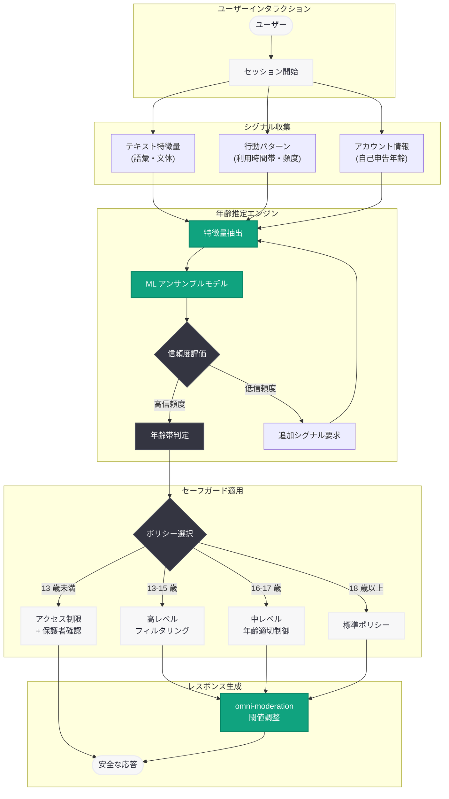
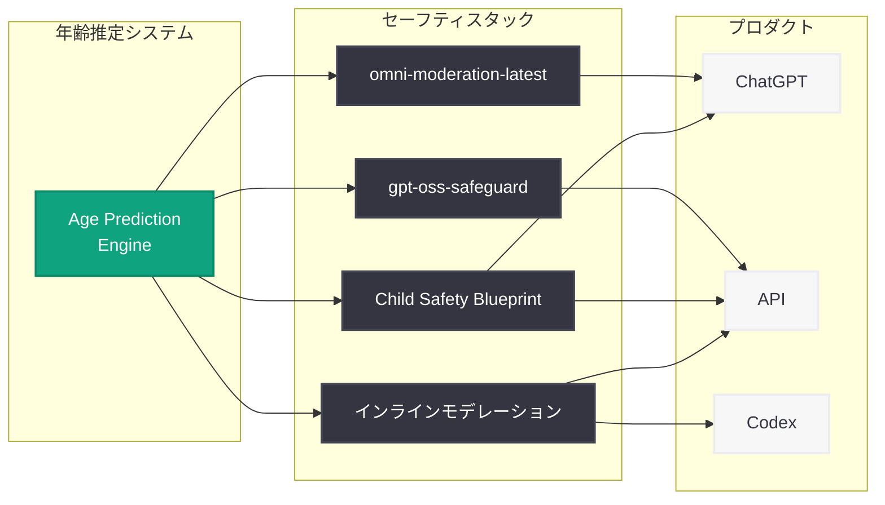

# OpenAI の年齢推定アプローチ: AI プロダクトにおける未成年者保護のための技術基盤

## メタデータ

| 項目 | 内容 |
|------|------|
| 発表日 | 2026-06-06 |
| ソース | OpenAI News |
| カテゴリ | 安全性 / 未成年者保護 |
| 公式リンク | [Our Approach to Age Prediction](https://openai.com/index/our-approach-to-age-prediction/) |

> **注記:** 本レポートは、OpenAI のサイトマップメタデータおよび公開概要情報に基づいて作成されている。記事全文はアクセス制限 (HTTP 403) により直接取得できなかったため、OpenAI が 2026 年を通じて展開してきた青少年安全施策の文脈と公開情報を基に構成している。正確な詳細については公式ページを参照されたい。

## 概要

OpenAI は 2026 年 6 月 6 日、AI プロダクトにおける年齢推定 (Age Prediction) の技術的アプローチを詳述する記事を公開した。本記事は、ChatGPT をはじめとする OpenAI の製品において、ユーザーの年齢を推定し、年齢に応じた適切なセーフガードを適用するための技術基盤について説明するものである。

年齢推定は、2026 年前半を通じて OpenAI が段階的に構築してきた青少年安全アーキテクチャの中核技術の一つである。Japan Teen Safety Blueprint (3 月)、gpt-oss-safeguard (3 月)、Child Safety Blueprint (4 月)、国際機関設立提案 (6 月) といった一連の施策を技術的に支えるものとして、年齢推定システムがどのように設計・運用されているかを透明性をもって開示する取り組みと位置づけられる。

## 主な内容

### 年齢推定の必要性と背景

AI プロダクトにおける年齢推定は、以下の課題に対応するために不可欠な技術である。

- **年齢に応じたコンテンツ制御:** ティーンユーザー (13-17 歳) と成人ユーザーでは、適切なコンテンツの範囲が異なる
- **規制遵守:** COPPA (米国児童オンラインプライバシー保護法)、EU のデジタルサービス法、UK Age Appropriate Design Code など各国の年齢関連規制への対応
- **セーフガードの適用:** 年齢層に応じた段階的な安全機能の自動適用
- **プライバシーと実効性のバランス:** 身分証明書の提出を求めることなく、実用的な年齢推定を実現する必要性

### 年齢推定の技術的手法

OpenAI の年齢推定アプローチは、生体認証データに依存せず、複数のシグナルを組み合わせた機械学習ベースの手法を採用していると考えられる。

**推定に用いられるシグナル:**

| シグナルカテゴリ | 具体例 | プライバシーへの配慮 |
|----------------|--------|-------------------|
| 言語パターン | 語彙の複雑さ、文体、スラングの使用 | テキストの統計的特徴のみを使用 |
| インタラクションパターン | 会話のトピック選択、質問の形式 | 個別の会話内容は保持しない |
| アカウント情報 | 登録時の自己申告年齢、アカウント設定 | 最小限のデータ収集 |
| 利用行動 | セッション時間帯、利用頻度のパターン | 集約された統計情報のみ |

**アプローチの特徴:**

- **非侵襲的手法:** 顔写真や身分証明書のアップロードを必須としない
- **確率的推定:** 二値分類ではなく、年齢帯の確率分布として推定結果を出力
- **継続的更新:** 単一時点の判定ではなく、インタラクションの蓄積に応じて推定精度を向上
- **多層的な確認:** 高リスクな操作に対しては追加の確認メカニズムを適用

### プライバシーへの配慮

年齢推定システムの設計において、プライバシー保護は最重要の制約条件として扱われている。

**プライバシー設計原則:**

- **データ最小化:** 年齢推定に必要最小限のデータのみを処理し、不必要な個人情報を収集しない
- **目的限定:** 収集したシグナルは年齢推定とセーフガード適用にのみ使用し、広告やマーケティング目的には利用しない
- **処理の透明性:** どのようなデータが年齢推定に使用されるかをユーザーに明確に開示
- **オプトアウトの権利:** アカウント認証による明示的な年齢確認を選択した場合、行動ベースの推定を無効化可能
- **データ保持期間の制限:** 年齢推定に使用された行動データの保持期間を必要最小限に限定

### 精度とその限界

年齢推定システムには固有の限界があり、OpenAI はこれらを透明に開示することで信頼性の確保を図っている。

**精度に関する考慮事項:**

- **偽陽性と偽陰性のトレードオフ:** 安全性を優先する場合、成人ユーザーが未成年と判定される (偽陽性) ケースが増加する。逆に利便性を優先すると未成年の検知漏れ (偽陰性) が増加する
- **文化・言語による差異:** 言語パターンに基づく推定は、文化圏や使用言語によって精度が変動する可能性がある
- **境界年齢の困難さ:** 17 歳と 18 歳の区別は、13 歳と 25 歳の区別に比べて本質的に困難である
- **意図的な回避:** ユーザーが意図的に年齢を偽装しようとする場合の検知は完全ではない

### セーフガードへの適用

年齢推定の結果は、以下のような段階的なセーフガードの適用に使用される。

**年齢帯に応じたセーフガードレベル:**

| 推定年齢帯 | セーフガードレベル | 適用される制限 |
|-----------|-----------------|--------------|
| 13 歳未満 | 最高 | アクセス制限、保護者同意の要求 |
| 13-15 歳 | 高 | コンテンツフィルタリング強化、機能制限 |
| 16-17 歳 | 中 | 年齢不適切コンテンツの制限、注意喚起 |
| 18 歳以上 | 標準 | 標準的なコンテンツポリシーを適用 |

## 技術的な詳細

### 機械学習パイプライン

年齢推定システムは、複数の機械学習モデルを組み合わせたアンサンブルアプローチを採用していると推測される。

**システムの構成要素:**

1. **特徴量抽出層:** テキスト、インタラクションパターン、メタデータから年齢関連の特徴量を抽出
2. **推定モデル層:** 抽出された特徴量を基に年齢帯の確率分布を算出
3. **信頼度評価層:** 推定結果の信頼度を評価し、低信頼度の場合は追加シグナルを要求
4. **ポリシー適用層:** 推定された年齢帯に基づいて適切なセーフガードを選択・適用

### セーフティシステムとの統合

年齢推定は、OpenAI の既存のセーフティインフラストラクチャと密接に統合されている。

- **omni-moderation モデルとの連携:** 年齢推定結果に基づいてモデレーション閾値を動的に調整
- **gpt-oss-safeguard との統合:** 推定された年齢帯に応じてシステムプロンプトの安全ポリシーを切り替え
- **Responses API / Chat Completions API:** インラインモデレーションスコアと組み合わせた多層防御

### 評価と改善のサイクル

年齢推定システムの品質を維持・向上するために、継続的な評価と改善が行われている。

- **Red Teaming:** 年齢偽装の試みに対するシステムの頑健性を検証
- **公平性監査:** 特定の言語、文化、地域のユーザーに対してバイアスが生じていないかを定期的に監査
- **精度モニタリング:** 推定精度の経時的な変化を追跡し、劣化が検知された場合に迅速に対応
- **フィードバックループ:** アカウント認証で年齢が確認されたケースを教師データとして活用

## アーキテクチャ

### 年齢推定パイプラインとセーフガード適用フロー

### 既存セーフティシステムとの統合

## 開発者への影響

### API 利用者への影響

- **年齢推定シグナルの活用:** 開発者は将来的に、API レスポンスに含まれる年齢推定シグナルを活用して、自社アプリケーションのセーフガードを動的に調整できるようになる可能性がある
- **gpt-oss-safeguard との連携強化:** 年齢推定結果に基づいてティーン安全ポリシーを自動的に適用するワークフローが標準化される方向性
- **コンプライアンス支援:** 各国の年齢関連規制に対応するためのツールとして、年齢推定機能が API レベルで提供される可能性

### プラットフォーム事業者への影響

- **年齢確認の負担軽減:** 従来はプラットフォーム側で独自に実装する必要があった年齢確認機能を、OpenAI の推定結果を補助的に活用することで効率化
- **段階的なセーフガードの実装:** 年齢帯に応じた多段階のコンテンツ制御を、API レベルの機能として統合的に実装可能
- **監査・レポーティング:** 年齢推定の精度やセーフガードの動作状況に関するデータが、コンプライアンス報告に活用できる可能性

### 注意点

- **年齢推定は補助的手段:** 法的に有効な年齢確認の代替ではなく、あくまで追加的なセーフガードとして機能する
- **プライバシー影響評価の必要性:** 年齢推定機能を利用する場合、開発者自身もプライバシー影響評価を実施する必要がある
- **地域ごとの法規制確認:** 年齢推定データの取り扱いに関する法的要件は地域によって異なるため、各国の規制を確認する必要がある

## 関連リンク

- [Our Approach to Age Prediction (本件)](https://openai.com/index/our-approach-to-age-prediction/)
- [Advancing Youth Safety and Opportunity through Global Leadership (2026-06-02)](https://openai.com/index/advancing-youth-safety-and-opportunity-through-global-leadership)
- [OpenAI Public Policy Agenda (2026-06-03)](https://openai.com/index/public-policy-agenda)
- [ChatGPT Sensitive Context Safety Updates (2026-05-14)](https://openai.com/index/chatgpt-sensitive-context-safety)
- [Introducing the Child Safety Blueprint (2026-04-08)](https://openai.com/index/introducing-child-safety-blueprint)
- [Teen Safety Policies / gpt-oss-safeguard (2026-03-24)](https://openai.com/index/teen-safety-policies-gpt-oss-safeguard)
- [Japan Teen Safety Blueprint (2026-03-17)](https://openai.com/index/japan-teen-safety-blueprint)
- [OpenAI Safety](https://openai.com/safety)

## まとめ

OpenAI が 2026 年 6 月 6 日に公開した「Our Approach to Age Prediction」は、AI プロダクトにおけるユーザーの年齢推定技術について、その設計思想、技術的手法、プライバシーへの配慮、精度の限界を透明に開示する取り組みである。

本記事の公開は、OpenAI が 2026 年前半を通じて構築してきた青少年安全アーキテクチャの技術的基盤を明らかにするものとして重要な意義を持つ。Japan Teen Safety Blueprint (3 月)、gpt-oss-safeguard (3 月)、Child Safety Blueprint (4 月)、国際機関設立提案 (6 月) といった一連の政策・技術施策は、いずれも「ユーザーの年齢を適切に把握し、それに応じたセーフガードを適用する」という前提に立っており、年齢推定はその前提を技術的に実現する中核コンポーネントである。

特筆すべきは、OpenAI が生体認証データに依存しない非侵襲的な手法を採用し、プライバシー保護と安全性確保のバランスを追求している点である。言語パターンや行動シグナルに基づく確率的な推定は、完全な精度を保証するものではないが、プライバシーリスクを最小化しつつ実効的な保護を提供するアプローチとして、AI 安全性における年齢確認の現実的な解決策を示している。
