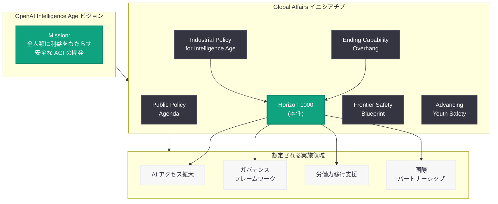
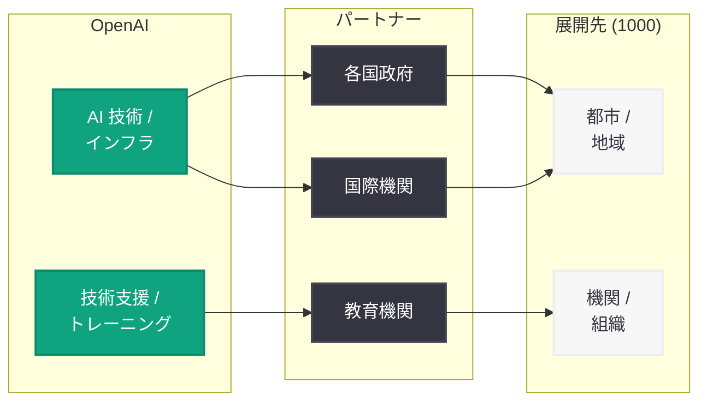

# OpenAI、「Horizon 1000」グローバルアフェアーズ・イニシアチブを発表

> **注記:** 本レポートは、元記事が Cloudflare の保護により全文取得できなかったため (HTTP 403)、公開されているサイトマップメタデータ (公開日時: 2026-06-06T15:45:21.534Z、カテゴリ: Global Affairs)、URL スラグ、および OpenAI のグローバルアフェアーズ関連の公開情報に基づいて作成している。正確な詳細については [公式ページ](https://openai.com/index/horizon-1000/) を参照されたい。

## メタデータ

| 項目 | 内容 |
|------|------|
| 発表日 | 2026-06-06 |
| ソース | OpenAI News (Global Affairs) |
| カテゴリ | グローバルアフェアーズ / 政策 |
| 公式リンク | [Horizon 1000](https://openai.com/index/horizon-1000/) |

## 概要

OpenAI は 2026 年 6 月 6 日、「Horizon 1000」と題するグローバルアフェアーズの取り組みを公開した。Global Affairs カテゴリに分類された本発表は、AI 技術のグローバルな展開、国際協力、またはアクセス拡大に関する大規模なイニシアチブであると推測される。

「Horizon」(地平線) という名称は将来への見通しや長期的ビジョンを示唆し、「1000」という数字は規模感 (1,000 日間の計画、1,000 都市・地域への展開、1,000 の組織との連携など) を示している可能性がある。同カテゴリに分類された記事には「How Countries Can End the Capability Overhang」「Frontier Safety Blueprint」「Public Policy Agenda」「Advancing Youth Safety」などがあり、Horizon 1000 もこれらと同様に AI ガバナンス、国際展開、または社会的インパクトに関する政策的取り組みと位置付けられる。

## 主な内容

### 「Horizon 1000」の名称が示唆するもの

「Horizon」と「1000」の組み合わせから、以下のいずれかの方向性が想定される。

**仮説 1: 1,000 日間の長期計画**

2026 年 6 月を起点とした約 2.7 年間 (2029 年初頭まで) の AI ガバナンスや国際協力に関するロードマップ。OpenAI が掲げる「Intelligence Age」の実現に向けた中期的な行動計画として、具体的なマイルストーンや達成目標を設定している可能性がある。

**仮説 2: 1,000 の都市・地域・組織への AI アクセス拡大**

開発途上国や新興国を含む 1,000 の都市、地域、または組織に対して AI 技術へのアクセスを提供するプログラム。OpenAI はこれまでも「機会の拡大 (Expanding Opportunity)」を産業政策の柱の一つとして掲げており、その具体的な実行計画である可能性がある。

**仮説 3: AI 人材 1,000 人の育成プログラム**

グローバルな AI 人材育成を目的とした大規模なプログラム。各国の政策立案者、研究者、開発者を対象に、AI リテラシーやガバナンス能力の向上を支援する取り組みである可能性がある。

### OpenAI Global Affairs の文脈

OpenAI の Global Affairs チームは 2026 年に入り、AI 政策と国際協力に関する発信を強化している。Horizon 1000 は以下の取り組みの延長線上にあると考えられる。

| 発表時期 | タイトル | テーマ |
|----------|---------|--------|
| 2026-04 | Industrial Policy for the Intelligence Age | 産業政策の提言 |
| 2026-05 | How Countries Can End the Capability Overhang | 各国の AI 能力格差解消 |
| 2026-06 | Frontier Safety Blueprint | フロンティアモデルの安全性 |
| 2026-06 | Public Policy Agenda | 公共政策アジェンダ |
| 2026-06 | Advancing Youth Safety | 青少年の安全性向上 |
| 2026-06 | **Horizon 1000 (本件)** | **グローバル・イニシアチブ** |

特に「How Countries Can End the Capability Overhang」(各国が能力格差を解消する方法) との関連性が強く示唆される。「Capability Overhang」とは、AI 技術が存在するにもかかわらず各国が十分に活用できていない状態を指し、Horizon 1000 はその具体的な解決策として大規模な展開プログラムを提示している可能性がある。

### Intelligence Age 構想との関連

OpenAI は「Intelligence Age」(知能の時代) というフレーミングで、AI が社会全体に浸透する未来像を描いている。Sam Altman CEO が繰り返し強調してきたこのビジョンの中で、Horizon 1000 は以下の役割を果たすと想定される。

- **グローバルアクセスの民主化:** AI の恩恵を先進国だけでなく世界中に行き渡らせる具体的な計画
- **ガバナンスフレームワークの構築:** AI の安全かつ責任ある展開を各国で実現するための枠組み提供
- **官民パートナーシップの確立:** 政府、民間企業、学術機関の協力体制の構築
- **労働力の移行支援:** AI による産業構造の変化に対応するための人材育成や社会保障の整備

## アーキテクチャ

### OpenAI Global Affairs における Horizon 1000 の位置付け

### 想定される展開モデル

## 開発者への影響

本発表は政策・イニシアチブレベルの取り組みであるが、AI 開発者やエコシステムに対して以下のような影響が考えられる。

- **新市場へのアクセス:** Horizon 1000 が新興国への AI 展開を含む場合、これらの地域向けのアプリケーション開発やローカライゼーションの需要が増加する可能性がある
- **規制環境の明確化:** 各国における AI ガバナンスフレームワークの整備が進むことで、開発者にとってのコンプライアンス要件がより明確になる可能性がある
- **パートナーシップ機会:** OpenAI と各国政府・機関のパートナーシップを通じて、開発者が参加できるプロジェクトやグラントプログラムが創設される可能性がある
- **API の地域展開:** 新たな地域への AI アクセス提供に伴い、OpenAI API のリージョン拡大やデータレジデンシー対応が進む可能性がある
- **多言語・多文化対応の強化:** グローバル展開に伴い、モデルの多言語性能やカルチャルコンテキストへの対応が強化される可能性がある

### 推奨アクション

- **公式ページの確認:** [https://openai.com/index/horizon-1000/](https://openai.com/index/horizon-1000/) で詳細が閲覧可能になり次第確認する
- **Global Affairs 発信の追跡:** OpenAI の政策関連発表を継続的にモニタリングし、具体的なプログラム内容や参加方法を把握する
- **地域展開への準備:** 新興市場向けの AI アプリケーション開発に関心がある場合、関連するローカライゼーションや規制対応の準備を検討する

## 関連リンク

- [Horizon 1000 (本件)](https://openai.com/index/horizon-1000/)
- [How Countries Can End the Capability Overhang](https://openai.com/index/how-countries-can-end-the-capability-overhang/)
- [Industrial Policy for the Intelligence Age](https://openai.com/index/industrial-policy-for-the-intelligence-age)
- [Frontier Safety Blueprint](https://openai.com/index/frontier-safety-blueprint/)
- [Public Policy Agenda](https://openai.com/index/public-policy-agenda/)
- [Advancing Youth Safety](https://openai.com/index/advancing-youth-safety/)
- [OpenAI News](https://openai.com/news)

## まとめ

OpenAI が 2026 年 6 月 6 日に発表した「Horizon 1000」は、Global Affairs カテゴリに分類された大規模なイニシアチブである。名称から推測されるのは、AI 技術のグローバルな普及と活用を 1,000 の都市・地域・組織、または 1,000 日間という規模で推進する野心的な計画である。

これは OpenAI が 2026 年前半に展開してきた一連の政策提言 (産業政策、能力格差の解消、安全性フレームワーク) の集大成として位置付けられる可能性が高く、「Intelligence Age」の恩恵をグローバルに行き渡らせるための具体的なアクションプランを示すものと考えられる。

開発者にとっては、新市場へのアクセス、規制環境の明確化、パートナーシップ機会など、中長期的に影響を与える取り組みとなる可能性がある。詳細な内容については公式ページが閲覧可能になり次第、本レポートを更新する予定である。
