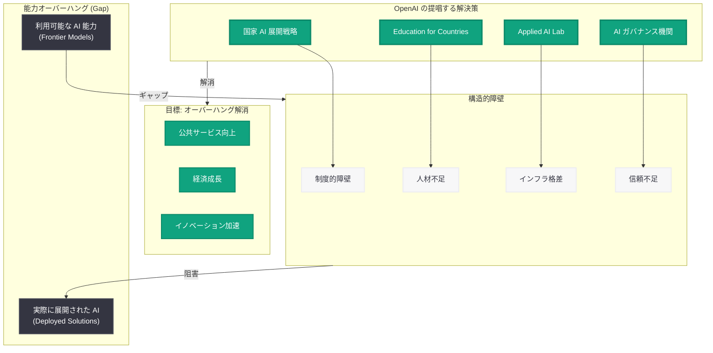
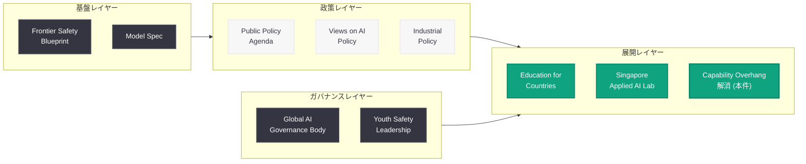

# 各国が「能力オーバーハング」を解消するための方策 -- OpenAI が AI 展開ギャップの克服に向けた政策提言を公開

## メタデータ

| 項目 | 内容 |
|------|------|
| 発表日 | 2026-06-06 |
| ソース | OpenAI News (Global Affairs) |
| カテゴリ | Global Affairs / 政策提言 |
| 公式リンク | [How Countries Can End the Capability Overhang](https://openai.com/index/how-countries-can-end-the-capability-overhang/) |

> **注記:** 本レポートは OpenAI のサイトマップメタデータおよび公開情報に基づいて作成している。記事本文へのアクセスは Cloudflare の保護により制限されたため (HTTP 403)、URL スラッグ、公開日時 (2026-06-06T15:35:38.557Z)、Global Affairs カテゴリへの分類、および OpenAI の最近の政策関連発表から内容を構成している。正確な詳細については公式ページを参照されたい。

## 概要

OpenAI は 2026 年 6 月 6 日、「How Countries Can End the Capability Overhang」(各国が能力オーバーハングを解消する方法) と題した Global Affairs カテゴリの記事を公開した。「能力オーバーハング」(Capability Overhang) とは、AI システムが技術的に達成可能な能力と、実際に各国で展開・活用されている水準との間に存在するギャップを指す概念である。

本記事は、多くの国がフロンティア AI モデルへのアクセスを持ちながらも、政府運営、公共サービス、経済発展において AI を十分に活用できていない現状に対し、このギャップを埋めるための政策フレームワークや展開戦略を提言するものと位置付けられる。OpenAI が 2026 年前半に展開してきた一連のグローバル政策提言シリーズの最新成果であり、「Education for Countries」(5 月 20 日)、「Singapore Applied AI Lab」(5 月 20 日)、「Public Policy Agenda」(6 月 3 日) と密接に関連する発表である。

## 主な内容

### 「能力オーバーハング」とは何か

AI における「能力オーバーハング」は、以下の 2 つの文脈で用いられる概念である。

**技術的オーバーハング:** AI モデルが潜在的に保有する能力のうち、ファインチューニングやプロンプト設計の制約により実際に発揮されていない部分。

**展開オーバーハング:** フロンティア AI 技術が利用可能であるにもかかわらず、制度的・組織的・人的要因により社会実装が進んでいない状態。

OpenAI の本記事は後者、すなわち「展開オーバーハング」に焦点を当てていると推測される。各国政府や公共機関が最先端の AI 能力を活用できるインフラや制度を持ちながら、実際の導入・運用が遅れている現象を「オーバーハング」として問題提起し、その解消策を論じているものと考えられる。

### 能力オーバーハングの構造的要因

各国で AI の展開が遅れる要因として、以下の構造的課題が想定される。

| 要因カテゴリ | 具体的課題 | 影響 |
|-------------|-----------|------|
| 制度的障壁 | AI ガバナンスフレームワークの未整備 | 導入判断の遅延 |
| 人材不足 | AI 技術者・政策立案者の不足 | 実装能力の制約 |
| インフラ格差 | 計算資源・データ基盤の不足 | 技術的制約 |
| 組織文化 | リスク回避志向、変革への抵抗 | 意思決定の停滞 |
| 調達制約 | 政府調達プロセスの硬直性 | 技術導入の遅延 |
| 信頼不足 | AI の安全性・信頼性への懸念 | 政策的慎重姿勢 |

### OpenAI が提唱する解決アプローチ (推定)

OpenAI のこれまでの Global Affairs 発表と本記事の文脈から、以下のような政策提言が含まれていると推測される。

**1. 国家 AI 展開戦略の策定**

各国が AI 技術の社会実装を加速するための包括的なロードマップを策定すること。OpenAI は 2026 年 4 月に「Industrial Policy for the Intelligence Age」を公開しており、国家レベルでの AI 産業政策の必要性を訴えてきた。

**2. AI 人材育成の制度化**

「Education for Countries」プログラム (2026 年 5 月 20 日発表) の拡大を通じた、AI リテラシーの底上げと専門人材の育成。教育システム全体への AI 統合により、長期的な人材基盤を構築する。

**3. 応用 AI 拠点の設置**

「Singapore Applied AI Lab」(2026 年 5 月 20 日発表) のモデルに基づく、各国・地域における応用 AI 研究拠点の設立。現地の課題に即した AI ソリューションの開発と展開を加速する。

**4. 公共セクターでの AI 導入支援**

政府機関、医療、教育、インフラなどの公共サービスにおける AI 導入を支援するフレームワークの提供。安全性とプライバシーを確保しつつ、市民サービスの質的向上を実現する。

**5. 国際協力メカニズムの構築**

OpenAI が 2026 年 5 月 14 日に提案した「グローバル AI ガバナンス機関」構想と連動し、各国間での知見共有、ベストプラクティスの移転、共同研究を促進するメカニズムの構築。

### OpenAI の Global Affairs 政策シリーズとの関連

本記事は、OpenAI が 2026 年前半に展開してきた一連の政策提言シリーズの集大成的な位置付けにある。

| 発表日 | タイトル | 焦点 |
|--------|---------|------|
| 2026-04-06 | Industrial Policy for the Intelligence Age | 国家 AI 産業政策 |
| 2026-05-14 | Global AI Governance Body | 国際ガバナンス機構 |
| 2026-05-20 | Education for Countries (Next Phase) | AI 教育プログラム |
| 2026-05-20 | Singapore Applied AI Lab | 地域 AI 研究拠点 |
| 2026-06-01 | Views on AI Policy and Political Advocacy | 政策提言の基本方針 |
| 2026-06-03 | Public Policy Agenda | 包括的政策アジェンダ |
| 2026-06-03 | Frontier Safety Blueprint | 安全性フレームワーク |
| 2026-06-06 | How Countries Can End the Capability Overhang (本件) | 展開ギャップの解消 |

この流れから、OpenAI は「安全なフロンティア AI の開発」(Frontier Safety Blueprint) と「各国での実効的な展開」(本件) を車の両輪として位置付け、AI の恩恵を世界的に民主化する戦略を構築していることがわかる。

## アーキテクチャ

### 能力オーバーハング解消のフレームワーク

### OpenAI Global Affairs の政策展開構造

## 開発者への影響

### 直接的な技術的影響

本記事は政策提言であり、API の変更や新機能のリリースを直接伴うものではない。ただし、OpenAI の Global Affairs 方針は中長期的に以下の形で開発者に影響を与える可能性がある。

### 想定される影響

- **新市場の開拓:** 各国の AI 展開が加速することで、OpenAI API を活用した公共セクター向けソリューションの需要が増大する可能性
- **地域別コンプライアンス要件:** 各国が AI ガバナンスフレームワークを整備することで、地域固有の規制対応が必要になる可能性
- **パートナーシップ機会:** Applied AI Lab のような拠点が各国に展開された場合、現地開発者との協業機会が拡大
- **多言語・多文化対応:** グローバル展開の加速により、多言語対応や文化的コンテキストを考慮したアプリケーション開発の重要性が増大
- **政府調達市場:** 公共セクターでの AI 導入が進むことで、政府向け AI ソリューション市場が拡大し、OpenAI API を活用した GovTech 開発の機会が増加

### 推奨アクション

- **公式ページの確認:** [https://openai.com/index/how-countries-can-end-the-capability-overhang/](https://openai.com/index/how-countries-can-end-the-capability-overhang/) で詳細が公開され次第確認
- **関連政策文書の把握:** Public Policy Agenda、Frontier Safety Blueprint など一連の政策文書を横断的に理解し、OpenAI の方向性を把握
- **公共セクター向け開発の検討:** 自国の AI 展開動向を注視し、政府・公共機関向けソリューション開発の機会を探る
- **OpenAI パートナーシップの確認:** Applied AI Lab や Education for Countries プログラムへの参画機会の確認

## 関連リンク

- [How Countries Can End the Capability Overhang (本件)](https://openai.com/index/how-countries-can-end-the-capability-overhang/)
- [Public Policy Agenda (2026-06-03)](https://openai.com/index/public-policy-agenda)
- [Frontier Safety Blueprint (2026-06-03)](https://openai.com/index/frontier-safety-blueprint/)
- [The Next Phase of Education for Countries (2026-05-20)](https://openai.com/index/the-next-phase-of-education-for-countries)
- [OpenAI Singapore Applied AI Lab (2026-05-20)](https://openai.com/index/openai-singapore-applied-ai-lab/)
- [Global AI Governance Body (2026-05-14)](https://openai.com/index/openai-global-ai-governance-body/)
- [Industrial Policy for the Intelligence Age (2026-04-06)](https://openai.com/index/industrial-policy-intelligence-age/)
- [Views on AI Policy and Political Advocacy (2026-06-01)](https://openai.com/index/views-ai-policy-political-advocacy/)
- [Advancing Youth Safety as a Global Leader (2026-06-02)](https://openai.com/index/advancing-youth-safety-global-leadership/)

## まとめ

OpenAI は 2026 年 6 月 6 日に「How Countries Can End the Capability Overhang」を公開し、各国における AI の「能力オーバーハング」-- すなわち利用可能な AI 能力と実際の社会実装との間のギャップ -- を解消するための方策を提言した。

本記事は、OpenAI が 2026 年前半に展開してきた包括的な Global Affairs 政策シリーズの最新成果であり、「Education for Countries」による人材育成、「Singapore Applied AI Lab」による地域拠点の設立、「Public Policy Agenda」による包括的政策フレームワーク、「Frontier Safety Blueprint」による安全性担保といった一連の取り組みを統合的に論じるものと位置付けられる。

OpenAI のメッセージは明確である。フロンティア AI の開発だけでなく、その恩恵を世界中の国々が実効的に享受できる環境を整備することが、AI の民主化において不可欠であるということだ。各国政府、開発者、企業はこの政策的方向性を理解し、自国・自組織における AI 展開戦略の策定に活用すべきである。
