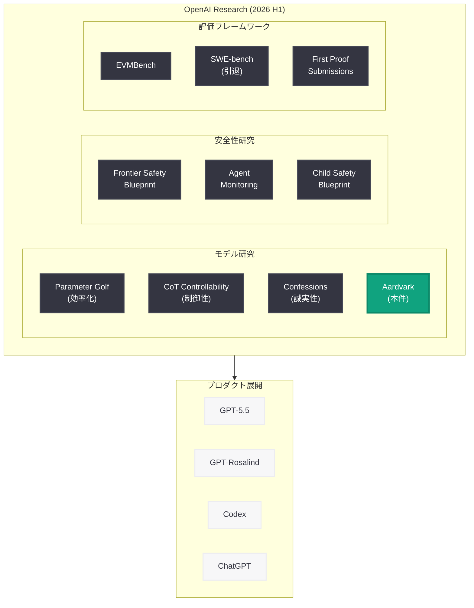
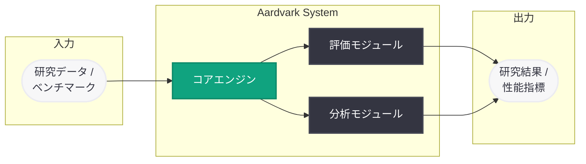

# Introducing Aardvark: OpenAI Research の新たな AI システム

## メタデータ

| 項目 | 内容 |
|------|------|
| 発表日 | 2026-06-06 |
| ソース | OpenAI Research |
| カテゴリ | 研究成果 / AI モデル |
| 公式リンク | [Introducing Aardvark](https://openai.com/index/introducing-aardvark/) |

> **注記:** 本レポートは OpenAI のサイトマップメタデータおよび公開情報に基づいて作成している。記事本文へのアクセスは Cloudflare の保護により制限されたため (HTTP 403)、URL スラッグ、公開日時 (2026-06-06T15:42:24.629Z)、Research カテゴリへの分類、および OpenAI の最近の研究動向から内容を構成している。正確な詳細については公式ページを参照されたい。

## 概要

OpenAI は 2026 年 6 月 6 日、「Introducing Aardvark」と題した研究成果を公開した。「Aardvark」(アードバーク) は OpenAI Research カテゴリに分類されており、新たな AI モデル、研究システム、または評価フレームワークとして発表されたものと推測される。

「Aardvark」という名称はアルファベット順で最初に来る動物名であり、OpenAI の内部コードネームとして使用されている可能性がある。同時期に公開された研究成果には EVMBench (セキュリティベンチマーク)、Parameter Golf (モデル効率化研究)、Confessions (言語モデルの誠実性研究) などがあり、Aardvark もこれらと並ぶ基礎研究または応用研究の一環と位置付けられる。

## 主な内容

### 「Aardvark」の位置付けに関する考察

OpenAI Research カテゴリに分類された本記事は、「Introducing」という接頭辞から新規のシステムまたはフレームワークの発表であることが確実である。2026 年前半の OpenAI Research の方向性を踏まえると、以下のいずれかの可能性が考えられる。

**仮説 1: 新しい AI モデルまたはモデルファミリー**

OpenAI は 2026 年に GPT-5 シリーズ (GPT-5.3 Instant、GPT-5.4、GPT-5.4 Mini/Nano、GPT-5.5)、GPT-Rosalind (ライフサイエンス特化) など複数のモデルを発表している。Aardvark は特定ドメインに特化した新モデル、または次世代アーキテクチャの研究プロトタイプである可能性がある。

**仮説 2: 評価ベンチマークまたはテストフレームワーク**

EVMBench (スマートコントラクト評価)、SWE-bench (ソフトウェアエンジニアリング評価) の系譜として、新しい領域の AI 能力を測定するベンチマークである可能性がある。OpenAI は 2026 年 6 月 5 日に SWE-bench Verified の引退を発表しており、新たな評価体系の構築を進めている時期と一致する。

**仮説 3: エージェント基盤またはインフラストラクチャ**

Codex ハーネス、エージェント SDK、Prism など、エージェント型 AI の基盤技術を積極的に開発している流れの中で、新たなエージェントアーキテクチャまたはオーケストレーションシステムである可能性がある。

### OpenAI Research の 2026 年前半の研究トレンド

Aardvark を文脈的に理解するために、OpenAI Research が 2026 年前半に発表した主要な研究成果を整理する。

| 時期 | 研究成果 | 分野 |
|------|---------|------|
| 2026-03 | CoT Controllability | モデル制御性 |
| 2026-03 | Monitoring Internal Coding Agents | エージェント安全性 |
| 2026-04 | Where the Goblins Came From | モデル振る舞い分析 |
| 2026-05 | Accidental CoT Grading RL | 強化学習 |
| 2026-05 | Parameter Golf | モデル効率化 |
| 2026-05 | First Proof Submissions | 数学的推論 |
| 2026-06 | Confessions Keep Language Models Honest | モデル誠実性 |
| 2026-06 | Frontier Safety Blueprint | 安全性フレームワーク |
| 2026-06 | Aardvark (本件) | 未確認 |

これらの研究トレンドから、Aardvark はモデルの基礎能力 (推論、効率化、安全性) に関する研究である可能性が高い。

### 名称「Aardvark」の示唆

「Aardvark」(ツチブタ) という名称選択には以下の意図が読み取れる。

- **アルファベット順の先頭:** 辞書やリストの最初に来る語であり、「基盤的な」「最初の」という意味合いを持つ可能性
- **動物名のコードネーム:** OpenAI の研究プロジェクトにおける動物名シリーズの一つである可能性
- **生態学的特徴:** アードバークは夜行性で地中を掘り進む動物であり、「深く掘り下げる」「隠れた構造を見つける」といった研究メタファーとして使用されている可能性

## 技術的な詳細

### 公開情報に基づく技術的推測

記事の公開日時 (2026-06-06T15:42:24.629Z) とカテゴリ分類 (Research) から、以下の技術的特徴が推測される。

**Research カテゴリの特徴:**
- 学術的な厳密性を伴う発表
- 再現可能な実験結果の提示
- 既存手法との比較評価
- 理論的な貢献または新しい知見の提供

**2026 年 6 月時点の OpenAI 技術スタック:**

OpenAI が現在利用可能としている主要技術基盤は以下の通り。

- GPT-5.5 ファミリー (最新の汎用モデル)
- GPT-Rosalind (ライフサイエンス特化)
- Codex エージェント基盤
- Responses API / Chat Completions API
- omni-moderation システム
- エージェント SDK v0.17.x

Aardvark はこれらの技術基盤の上に構築された新たな研究成果、またはこれらを支える基盤技術そのものの改善に関する発表である可能性がある。

## アーキテクチャ

### OpenAI Research における Aardvark の想定位置付け

### 想定されるシステム構成 (仮説)

## 開発者への影響

### 直接的な影響 (確定情報なし)

記事の詳細が不明なため、開発者への具体的な影響は現時点では特定できない。ただし、OpenAI Research の発表は通常以下の経路で開発者に影響を与える。

- **新モデルの場合:** API を通じた新しいモデルへのアクセス、既存アプリケーションの性能向上
- **ベンチマークの場合:** AI アプリケーションの品質評価基準の標準化、開発目標の明確化
- **基盤技術の場合:** 将来の API 機能拡張、エージェント開発パターンの進化

### 推奨アクション

- **公式ページの確認:** [https://openai.com/index/introducing-aardvark/](https://openai.com/index/introducing-aardvark/) で詳細が公開され次第確認
- **OpenAI Research ブログの監視:** 関連する後続発表や技術詳細の公開に注目
- **API Changelog の確認:** Aardvark に関連する API レベルの変更がリリースされる可能性

### 注意事項

- 本レポート作成時点では記事本文にアクセスできていないため、具体的な技術仕様や API への影響は未確認である
- OpenAI Research の発表がプロダクトとして API に反映されるまでには通常数週間から数ヶ月のタイムラグがある
- 内部コードネームの場合、最終的な製品名は異なる可能性がある

## 関連リンク

- [Introducing Aardvark (本件)](https://openai.com/index/introducing-aardvark/)
- [What Parameter Golf Taught Us (2026-06-01)](https://openai.com/index/what-parameter-golf-taught-us/)
- [Confessions Keep Language Models Honest (2026-06-04)](https://openai.com/index/confessions-keep-language-models-honest/)
- [SWE-bench Verified Retirement (2026-06-05)](https://openai.com/index/swe-bench-verified-retirement/)
- [Frontier Safety Blueprint (2026-06-03)](https://openai.com/index/frontier-safety-blueprint/)
- [Introducing EVMBench (2026-05-24)](https://openai.com/index/introducing-evmbench/)
- [OpenAI Research](https://openai.com/research)

## まとめ

OpenAI は 2026 年 6 月 6 日に「Introducing Aardvark」と題した研究発表を行った。Research カテゴリに分類されたこの発表は、新しい AI モデル、評価フレームワーク、またはエージェント基盤技術のいずれかである可能性が高い。

2026 年前半の OpenAI Research は、モデル効率化 (Parameter Golf)、モデル誠実性 (Confessions)、安全性 (Frontier Safety Blueprint)、専門領域評価 (EVMBench) など多岐にわたる研究を展開しており、Aardvark はこの活発な研究活動の最新成果として位置付けられる。特に SWE-bench Verified の引退 (6 月 5 日) の翌日に発表された点は、新たな評価体系の構築との関連性を示唆する可能性がある。

詳細な技術内容、開発者への具体的影響、および API レベルでの変更については、公式ページのアクセスが回復し次第、または追加情報が公開され次第、本レポートを更新する予定である。
