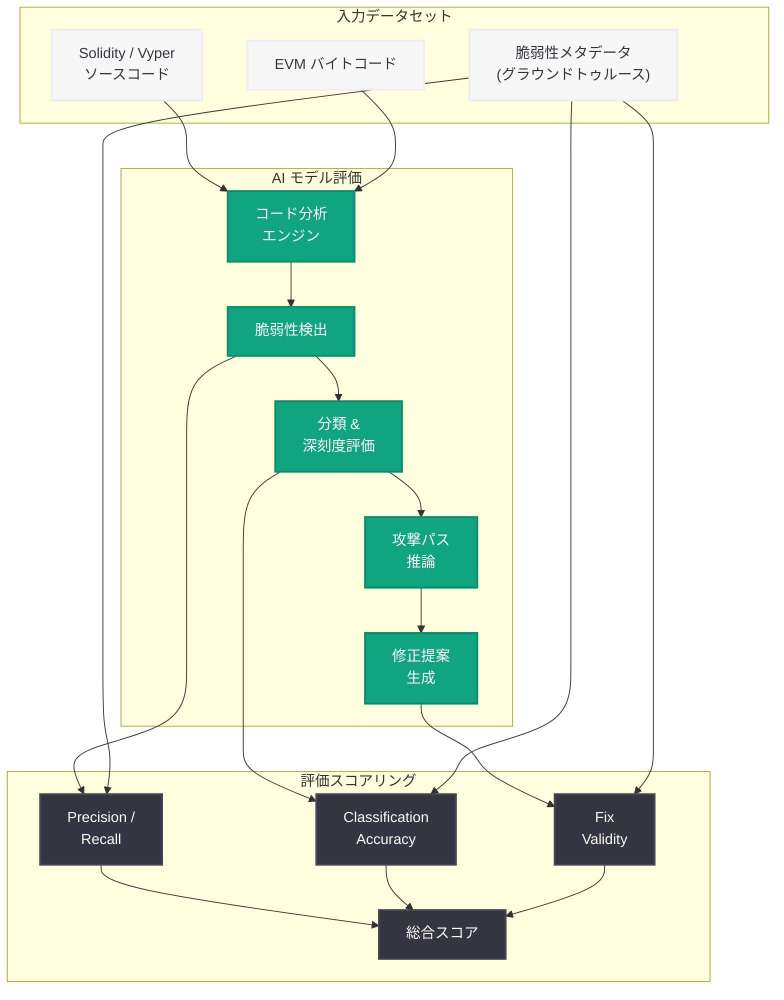
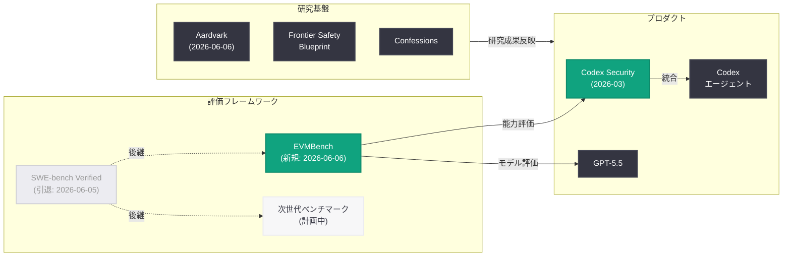
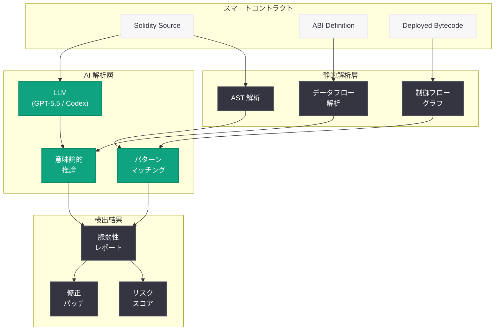

# EVMBench: Ethereum スマートコントラクトセキュリティ評価ベンチマークの導入

## メタデータ

| 項目 | 内容 |
|------|------|
| 発表日 | 2026-06-06 |
| ソース | OpenAI Research |
| カテゴリ | 研究成果 / ベンチマーク / セキュリティ |
| 公式リンク | [Introducing EVMBench](https://openai.com/index/introducing-evmbench/) |

> **注記:** 本レポートは OpenAI のサイトマップメタデータおよび公開情報に基づいて作成している。記事本文へのアクセスは Cloudflare の保護により制限されたため (HTTP 403)、URL スラッグ、公開日時、Research カテゴリへの分類、および OpenAI の最近の研究動向から内容を構成している。正確な詳細については公式ページを参照されたい。

## 概要

OpenAI は 2026 年 6 月 6 日、Ethereum Virtual Machine (EVM) 上のスマートコントラクトに対する AI のセキュリティ分析能力を評価するベンチマーク「EVMBench」を発表した。EVMBench は、AI モデルがスマートコントラクトの脆弱性を検出・分析・分類する能力を体系的に測定するための評価フレームワークである。

この発表は、OpenAI が 2026 年 3 月に公開した Codex Security (AI 駆動型脆弱性検出) の研究を発展させたものであり、また 2026 年 6 月 5 日に SWE-bench Verified の評価終了を発表した直後のタイミングで公開された。汎用的なソフトウェアエンジニアリングベンチマークの限界を認識した OpenAI が、特定ドメインに特化した高精度な評価フレームワークへと戦略を転換していることを示す重要な研究成果である。

## 主な内容

### EVMBench の目的と背景

Ethereum エコシステムでは、スマートコントラクトの脆弱性がもたらす経済的損失が深刻な問題となっている。リエントランシー攻撃、整数オーバーフロー、アクセス制御の不備、フラッシュローン攻撃など、スマートコントラクト特有の脆弱性パターンは従来のソフトウェアセキュリティツールでは十分に対応できない。

EVMBench は、AI モデルが以下の能力をどの程度有するかを定量的に評価するために設計されたと考えられる。

- **脆弱性検出:** Solidity / Vyper コードから既知および未知の脆弱性パターンを特定する能力
- **脆弱性分類:** 検出した脆弱性を正確に分類し、深刻度を評価する能力
- **攻撃シナリオの推論:** 脆弱性がどのように悪用され得るかを推論する能力
- **修正提案:** 安全なコードへの修正を提案する能力

### スマートコントラクトセキュリティの主要な脆弱性カテゴリ

EVMBench が評価対象とすると想定される脆弱性カテゴリは以下の通りである。

| カテゴリ | 脆弱性例 | 想定される評価内容 |
|----------|---------|-------------------|
| リエントランシー | Cross-function reentrancy、Read-only reentrancy | 再帰呼び出しパターンの検出 |
| アクセス制御 | Missing owner check、Unprotected selfdestruct | 権限管理の不備の特定 |
| 算術エラー | Integer overflow/underflow、Precision loss | 数値計算の安全性評価 |
| フラッシュローン | Price manipulation、Oracle manipulation | DeFi 特有の攻撃ベクトル分析 |
| ロジックエラー | Business logic flaws、State inconsistency | 意図と実装の乖離の検出 |
| ガス最適化 | Denial of Service via gas、Unbounded loops | リソース消費の脆弱性評価 |

### SWE-bench Verified からの進化

EVMBench の発表は、OpenAI のベンチマーク戦略の明確な転換を示している。

**SWE-bench Verified の課題:**
- 汎用的なバグ修正タスクに偏っていた
- テストスイートの通過のみで評価 (セキュリティ品質は未考慮)
- ベンチマーク飽和 (最新モデルで ~90% 以上を達成)

**EVMBench のアプローチ (想定):**
- 特定ドメイン (スマートコントラクトセキュリティ) に特化
- 多段階評価 (検出、分類、推論、修正)
- 実際のセキュリティインシデントに基づいた評価データセット
- 経済的影響度を考慮した重み付け評価

### Codex Security との関連

OpenAI は 2026 年 3 月に Codex Security を発表し、AI 駆動型の脆弱性検出機能を Codex に統合した。EVMBench はこの Codex Security の能力を定量的に評価し、改善するためのフレームワークとして機能すると考えられる。

```
Codex Security (2026-03) --> EVMBench (2026-06)
    [AI 脆弱性検出の実装]      [能力の定量評価]
```

この関係性は、OpenAI が「機能開発」と「評価フレームワーク構築」を並行して進め、評価に基づいた反復的改善サイクルを回している証左である。

## 技術的な詳細

### 想定される評価パイプライン

EVMBench の評価パイプラインは、以下のステップで構成されると推測される。

1. **コントラクト入力:** Solidity / Vyper ソースコードまたはコンパイル済みバイトコードを AI モデルに提供
2. **脆弱性スキャン:** モデルがコード全体を分析し、潜在的な脆弱性箇所を特定
3. **分類と深刻度評価:** 検出された脆弱性を CWE (Common Weakness Enumeration) や SWC (Smart Contract Weakness Classification) に基づいて分類
4. **攻撃パス推論:** 脆弱性の悪用シナリオを構築
5. **修正提案:** セキュアなコードパッチを生成
6. **評価スコア算出:** 各ステップの正確性を既知のグラウンドトゥルースと比較して定量化

### 評価データセットの構成 (想定)

EVMBench のデータセットは以下のソースから構成されている可能性がある。

- **過去のセキュリティインシデント:** The DAO hack (2016)、Parity Wallet Freeze (2017)、Wormhole Bridge (2022)、Euler Finance (2023) 等の実際の攻撃事例
- **監査レポート:** Trail of Bits、OpenZeppelin、Consensys Diligence 等の著名なセキュリティ監査企業のレポートから抽出された脆弱性
- **合成データ:** 既知の脆弱性パターンを組み込んだ合成コントラクト
- **CTF チャレンジ:** Ethernaut、Damn Vulnerable DeFi 等のセキュリティ学習プラットフォームからのチャレンジ

### 評価指標

| 指標 | 説明 |
|------|------|
| Detection Precision | 報告された脆弱性のうち、実際に脆弱性であった割合 |
| Detection Recall | 実際の脆弱性のうち、検出された割合 |
| Classification Accuracy | 脆弱性の種類を正しく分類した割合 |
| Severity Correlation | 深刻度評価と実際の影響度の相関 |
| Fix Validity | 提案された修正が脆弱性を解消し、機能を維持する割合 |
| Attack Path Score | 攻撃シナリオの推論の正確性と完全性 |

### EVM バイトコード解析の技術的課題

AI モデルが EVM ベースのコントラクトを分析する際、以下の技術的課題が存在する。

**ソースコードレベル:**
- Solidity のバージョン間での挙動差異
- コンパイラ最適化によるコード変換
- 継承とライブラリの複雑な依存関係

**バイトコードレベル:**
- 逆コンパイルの不完全性
- プロキシパターンとアップグレーダブルコントラクト
- CREATE2 による動的デプロイ

**DeFi 特有の課題:**
- プロトコル間の相互作用 (composability)
- 価格オラクルへの依存
- MEV (Maximal Extractable Value) の考慮

### コードサンプル: 評価対象の脆弱性例

以下は EVMBench が評価対象とすると想定されるリエントランシー脆弱性の典型的な例である。

```solidity
// 脆弱なコントラクト例 (リエントランシー)
contract VulnerableVault {
    mapping(address => uint256) public balances;

    function withdraw(uint256 amount) external {
        require(balances[msg.sender] >= amount, "Insufficient balance");
        // 脆弱性: 状態更新前の外部呼び出し
        (bool success, ) = msg.sender.call{value: amount}("");
        require(success, "Transfer failed");
        balances[msg.sender] -= amount; // CEI パターン違反
    }
}
```

AI モデルに期待される出力:
- 脆弱性の特定 (リエントランシー、行番号の指定)
- CWE/SWC 分類 (SWC-107: Reentrancy)
- 攻撃シナリオの記述
- 修正コードの提案 (Checks-Effects-Interactions パターンの適用)

## アーキテクチャ

### EVMBench 評価パイプライン



### OpenAI セキュリティ評価エコシステムにおける位置付け



### 脆弱性検出の多層分析アーキテクチャ



## 開発者への影響

### スマートコントラクト開発者

- **セキュリティ監査の自動化:** EVMBench の評価基準に基づいた AI セキュリティツールの発展により、開発段階での脆弱性検出が容易になる可能性がある
- **コスト削減:** 専門的なセキュリティ監査 (通常数万〜数十万ドル) を AI ツールで補完することで、監査コストの削減が期待される
- **開発ワークフロー統合:** Codex Security と EVMBench の知見が IDE やCI/CD パイプラインに統合され、リアルタイムな脆弱性フィードバックが実現する可能性がある

### AI / ML エンジニア

- **ドメイン特化評価の標準化:** EVMBench は、特定ドメインにおける AI 能力を評価するための方法論的テンプレートとして活用できる
- **セキュリティ AI モデルの開発:** ベンチマークの公開により、スマートコントラクトセキュリティに特化した AI モデルの研究開発が加速する
- **評価指標の設計:** 多段階評価 (検出→分類→推論→修正) のアプローチは、他のセキュリティドメインのベンチマーク設計にも応用可能

### セキュリティ研究者

- **AI 監査ツールの客観的評価:** 既存の AI セキュリティツール (Slither、Mythril 等との連携を含む) の能力を EVMBench で定量比較できるようになる
- **新しい攻撃パターンの発見:** AI モデルが未知の脆弱性パターンを検出する能力の評価は、ゼロデイ脆弱性の早期発見につながる可能性がある

### 注意事項

- 本レポート作成時点では記事本文にアクセスできていないため、具体的なデータセット規模、評価プロトコル、モデルスコアは未確認である
- EVMBench が公開データセットとして提供されるか、OpenAI 内部の評価ツールに留まるかは不明である
- スマートコントラクトセキュリティは急速に進化する分野であり、ベンチマークの有効期限にも留意が必要である

## 関連リンク

- [Introducing EVMBench (本件)](https://openai.com/index/introducing-evmbench/)
- [Introducing Aardvark (2026-06-06)](https://openai.com/index/introducing-aardvark/)
- [Why We No Longer Evaluate SWE-Bench Verified (2026-06-05)](https://openai.com/index/why-we-no-longer-evaluate-swe-bench-verified/)
- [Codex Security (2026-03-06)](https://openai.com/index/codex-security/)
- [Frontier Safety Blueprint (2026-06-03)](https://openai.com/index/frontier-safety-blueprint/)
- [OpenAI Research](https://openai.com/research)
- [SWC Registry (Smart Contract Weakness Classification)](https://swcregistry.io/)
- [Ethereum Smart Contract Security Best Practices](https://consensys.github.io/smart-contract-best-practices/)

## まとめ

EVMBench は、OpenAI が Ethereum スマートコントラクトのセキュリティ分析という高度に専門的なドメインにおいて、AI モデルの能力を定量的に評価するために開発した新しいベンチマークフレームワークである。

この発表には 3 つの重要な意義がある。第一に、SWE-bench Verified の引退 (2026 年 6 月 5 日) の翌日に発表されたことで、OpenAI が汎用ベンチマークからドメイン特化型の精密な評価フレームワークへと戦略を転換していることが明確になった。第二に、Codex Security (2026 年 3 月) の能力を客観的に測定し改善するためのフィードバックループが確立されたことで、AI セキュリティツールの反復的な品質向上が期待される。第三に、ブロックチェーンセキュリティという数十億ドル規模の経済的影響を持つ分野に OpenAI が本格的に取り組んでいることが示された。

スマートコントラクト開発者、セキュリティ研究者、AI エンジニアにとって、EVMBench は AI 駆動型セキュリティ分析の能力と限界を理解するための重要な基準点となるだろう。詳細な評価プロトコルやデータセットについては、公式ページのアクセスが回復し次第確認されたい。
