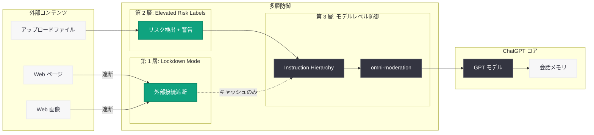

# ChatGPT に Lockdown Mode と Elevated Risk Labels を導入: プロンプトインジェクション対策の新たなセキュリティレイヤー

## メタデータ

| 項目 | 内容 |
|------|------|
| 発表日 | 2026-06-06 |
| ソース | OpenAI News (Safety) |
| カテゴリ | 安全性 / セキュリティ |
| 公式リンク | [Introducing Lockdown Mode and Elevated Risk Labels in ChatGPT](https://openai.com/index/introducing-lockdown-mode-and-elevated-risk-labels-in-chatgpt/) |

## 概要

OpenAI は 2026 年 6 月 6 日、ChatGPT に「Lockdown Mode」(ロックダウンモード) と「Elevated Risk Labels」(高リスクラベル) という 2 つの新しいセキュリティ機能を導入したことを発表した。Lockdown Mode は、機密データを扱うユーザーや組織を対象に、プロンプトインジェクション攻撃によるデータ流出リスクを軽減するための厳格な保護機能である。

本機能は、ChatGPT の利便性の一部を意図的に制限することで、外部からの悪意ある指示 (プロンプトインジェクション) が実行される攻撃面 (attack surface) を大幅に縮小するアプローチを採用している。すべてのユーザー向けではなく、機密情報を扱い、データ流出リスクに対してより厳格な保護を求める個人および組織が対象となる。

## 主な内容

### Lockdown Mode の概要

Lockdown Mode は、ChatGPT において外部コンテンツとの接触を最小限に抑えることで、プロンプトインジェクション攻撃の主要な攻撃経路を遮断するセキュリティ機能である。

**無効化される機能:**

| 機能 | 通常時 | Lockdown Mode 有効時 |
|------|--------|-------------------|
| ライブ Web ブラウジング | 有効 | 無効 (キャッシュコンテンツのみアクセス可能) |
| Web からの画像取得・表示 | 有効 | 無効 (画像生成は引き続き利用可能) |
| Deep Research | 有効 | 無効 |
| Agent モード | 有効 | 無効 |

**設計思想:** Lockdown Mode は、外部ソースからの入力を制限することにより、悪意ある第三者が Web ページや外部コンテンツを通じて ChatGPT に不正な指示を注入する攻撃ベクターを根本的に排除する。これは「攻撃面の縮小」(attack surface reduction) というセキュリティの基本原則に基づいたアプローチである。

### Lockdown Mode の制限事項

OpenAI は、Lockdown Mode がすべてのプロンプトインジェクションリスクを排除するものではないことを明確に認めている。

**残存するリスク:**

- **キャッシュされた Web コンテンツ:** ライブブラウジングは無効化されるが、事前にキャッシュされたコンテンツには悪意ある指示が含まれている可能性がある
- **アップロードされたファイル:** ユーザーがアップロードするドキュメントや画像に悪意あるプロンプトが埋め込まれている場合、Lockdown Mode では防げない
- **会話内の注入:** ユーザーが意図せずコピー&ペーストした悪意あるテキストなど

この透明な制限事項の開示は、ユーザーが Lockdown Mode を過信せず、多層防御の一要素として適切に活用するために重要である。

### Elevated Risk Labels (高リスクラベル)

Lockdown Mode と併せて導入された Elevated Risk Labels は、ChatGPT が処理するコンテンツやインタラクションにおいて、潜在的なセキュリティリスクが検出された場合にユーザーに警告を表示する機能である。

**想定される機能:**

- Web コンテンツやアップロードされたファイルに不審なパターンが検出された際の視覚的な警告表示
- プロンプトインジェクションの可能性があるコンテンツの自動フラグ付け
- リスクレベルに応じた段階的な警告 (情報提供レベルから高リスク警告まで)

### 対象ユーザーと展開

**対象ユーザー:**

- 機密データを取り扱う組織および個人
- データ流出リスクに対してより厳格な保護を必要とするユーザー
- セキュリティポリシーが厳格な企業環境

**展開状況:**

- ChatGPT Business のセルフサーブアカウントへのロールアウトを開始
- 対象となる個人アカウントへも順次提供
- 全ユーザーへの一律適用ではなく、オプトイン方式

## 技術的な詳細

### プロンプトインジェクション攻撃と防御

プロンプトインジェクション攻撃とは、LLM (大規模言語モデル) が処理する外部コンテンツに悪意ある指示を埋め込み、モデルの動作を乗っ取る攻撃手法である。

**典型的な攻撃シナリオ:**

1. 攻撃者が Web ページに隠し指示を埋め込む (例: 白文字のテキスト、HTML コメント)
2. ChatGPT のブラウジング機能がそのページを読み込む
3. モデルが埋め込まれた指示に従い、ユーザーの機密情報を外部に送信する

**Lockdown Mode の防御メカニズム:**

Lockdown Mode は、上記のシナリオにおけるステップ 2 を遮断する。外部コンテンツの取得そのものを無効化することで、攻撃者が ChatGPT に悪意ある指示を到達させる経路を物理的に遮断する。

### セキュリティモデル

Lockdown Mode のセキュリティモデルは、以下の原則に基づいている。

1. **最小権限の原則:** 必要最小限の機能のみを有効にし、攻撃面を最小化する
2. **外部入力の制限:** 信頼できない外部ソースからの入力を遮断する
3. **段階的な保護:** 完全な防御ではなく、リスクの大幅な低減を目的とする
4. **透明性:** 残存リスクについて明確に開示し、ユーザーの適切な判断を支援する

### Elevated Risk Labels の検出メカニズム

Elevated Risk Labels は、以下のようなパターンを検出して警告を発する仕組みと推定される。

- **既知のインジェクションパターン:** `Ignore previous instructions` 等の典型的なプロンプトインジェクション文字列
- **不自然なエンコーディング:** Base64 エンコードされた指示、Unicode の悪用
- **隠しテキスト:** CSS で非表示にされたテキスト、極小フォントサイズのコンテンツ
- **データ流出パターン:** 外部 URL へのデータ送信を誘導する指示

## アーキテクチャ

### Lockdown Mode の動作フロー

```mermaid
flowchart TD
    subgraph User["ユーザー入力"]
        Input(["ユーザー"]) --> Message["メッセージ送信"]
        Input --> Upload["ファイルアップロード"]
    end

    subgraph LockdownCheck{"Lockdown Mode 判定"}
        Message --> ModeCheck{"Lockdown Mode\n有効?"}
        Upload --> ModeCheck
    end

    subgraph Disabled["無効化される経路"]
        ModeCheck -->|有効| BlockBrowse["Web ブラウジング\n遮断"]
        ModeCheck -->|有効| BlockImage["Web 画像取得\n遮断"]
        ModeCheck -->|有効| BlockResearch["Deep Research\n遮断"]
        ModeCheck -->|有効| BlockAgent["Agent モード\n遮断"]
    end

    subgraph Normal["通常処理経路"]
        ModeCheck -->|無効| Browse["Web ブラウジング"]
        ModeCheck -->|無効| ImageFetch["Web 画像取得"]
        ModeCheck -->|無効| Research["Deep Research"]
        ModeCheck -->|無効| Agent["Agent モード"]
    end

    subgraph RiskLabel["Elevated Risk Labels"]
        Upload --> Scanner["コンテンツスキャナー"]
        Scanner --> RiskEval{"リスク評価"}
        RiskEval -->|リスク検出| Warning["警告ラベル表示"]
        RiskEval -->|安全| Pass["通常処理"]
    end

    subgraph Processing["応答生成"]
        BlockBrowse --> SafeProcess["制限付き処理\n(キャッシュのみ)"]
        BlockImage --> SafeProcess
        BlockResearch --> SafeProcess
        BlockAgent --> SafeProcess
        Warning --> SafeProcess
        Pass --> SafeProcess
        Browse --> FullProcess["フル機能処理"]
        ImageFetch --> FullProcess
        Research --> FullProcess
        Agent --> FullProcess
        SafeProcess --> Response(["安全な応答"])
        FullProcess --> Response
    end

    classDef openai fill:#10A37F,stroke:#0D8A6A,stroke-width:2px,color:white
    classDef dark fill:#343541,stroke:#444654,stroke-width:2px,color:white
    classDef light fill:#F7F7F8,stroke:#ECECF1,stroke-width:2px,color:#343541
    classDef danger fill:#FF6B6B,stroke:#EE5A5A,stroke-width:2px,color:white

    class SafeProcess,Scanner,RiskEval openai
    class ModeCheck,FullProcess dark
    class Input,Message,Upload,Response,Pass light
    class BlockBrowse,BlockImage,BlockResearch,BlockAgent,Warning danger
```

### セキュリティレイヤーの全体像



## 開発者への影響

### API 利用者への影響

- **Agent 構築への考慮:** Lockdown Mode 相当の制限を API 経由のアプリケーションにも適用する仕組みが今後提供される可能性がある。機密データを扱うエージェントアプリケーションでは、外部コンテンツへのアクセスを制限する設計パターンの採用を検討すべきである
- **セキュリティ設計の参考:** OpenAI が公式に「ブラウジング無効化」をセキュリティ対策として位置づけたことで、同様のアプローチが API レベルでも標準化される方向性が示唆される
- **Elevated Risk Labels の API 提供:** コンテンツのリスク評価結果が API レスポンスに含まれるようになる可能性があり、開発者が独自のセキュリティポリシーに活用できるようになることが期待される

### ChatGPT Business 管理者への影響

- **セキュリティポリシーの策定:** 組織全体で Lockdown Mode を有効にするか、ユーザー単位で設定するかの方針決定が必要になる
- **業務効率とセキュリティのトレードオフ:** Deep Research や Agent モードを利用していたワークフローの見直しが必要になる場合がある
- **コンプライアンス対応:** 規制対象のデータを扱う業務では、Lockdown Mode の有効化がコンプライアンス要件を満たす追加的な対策として位置づけられる可能性がある

### セキュリティ研究者への影響

- **プロンプトインジェクション研究の方向性:** OpenAI が「完全な防御は困難」と公式に認めたことで、残存リスクに対する研究の重要性が再確認された
- **攻撃面の分析:** キャッシュコンテンツやアップロードファイルを経由する攻撃経路の研究が今後の重要課題として浮上する

## 関連リンク

- [Introducing Lockdown Mode and Elevated Risk Labels in ChatGPT (本件)](https://openai.com/index/introducing-lockdown-mode-and-elevated-risk-labels-in-chatgpt/)
- [Designing Agents That Resist Prompt Injection (2026-03-11)](https://openai.com/index/designing-agents-resist-prompt-injection/)
- [ChatGPT Sensitive Context Safety (2026-05-14)](https://openai.com/index/chatgpt-sensitive-context-safety/)
- [Advanced Account Security (2026-04-30)](https://openai.com/index/advanced-account-security/)
- [Scaling Trusted Access for Cyber Defense (2026-04-14)](https://openai.com/index/scaling-trusted-access-cyber-defense/)
- [Frontier Safety Blueprint (2026-06-03)](https://openai.com/index/frontier-safety-blueprint/)
- [OpenAI Safety](https://openai.com/safety)

## まとめ

OpenAI が 2026 年 6 月 6 日に発表した Lockdown Mode と Elevated Risk Labels は、ChatGPT におけるプロンプトインジェクション攻撃への防御を強化する重要なセキュリティ機能である。

Lockdown Mode の核心は「攻撃面の縮小」であり、Web ブラウジング、Web 画像取得、Deep Research、Agent モードといった外部コンテンツとの接触を伴う機能を意図的に無効化することで、悪意ある指示が ChatGPT に到達する経路を物理的に遮断する。これは利便性とセキュリティのトレードオフを明示的にユーザーに委ねるアプローチであり、すべてのユーザーに一律に適用するのではなく、機密データを扱う組織と個人がオプトインで利用する設計となっている。

特筆すべきは、OpenAI が Lockdown Mode の限界を率直に開示している点である。キャッシュコンテンツやアップロードファイル経由の攻撃は依然として残存リスクとして存在し、完全な防御を保証するものではない。この透明性は、ユーザーが多層防御の一要素として本機能を適切に位置づけ、過信を避けるために不可欠な情報開示である。

Elevated Risk Labels は、Lockdown Mode を補完する検出・警告メカニズムとして、ユーザーのセキュリティ意識を高める役割を果たす。防御 (Lockdown Mode) と検知 (Elevated Risk Labels) の組み合わせにより、ChatGPT のセキュリティ態勢が一段階強化されたと評価できる。
