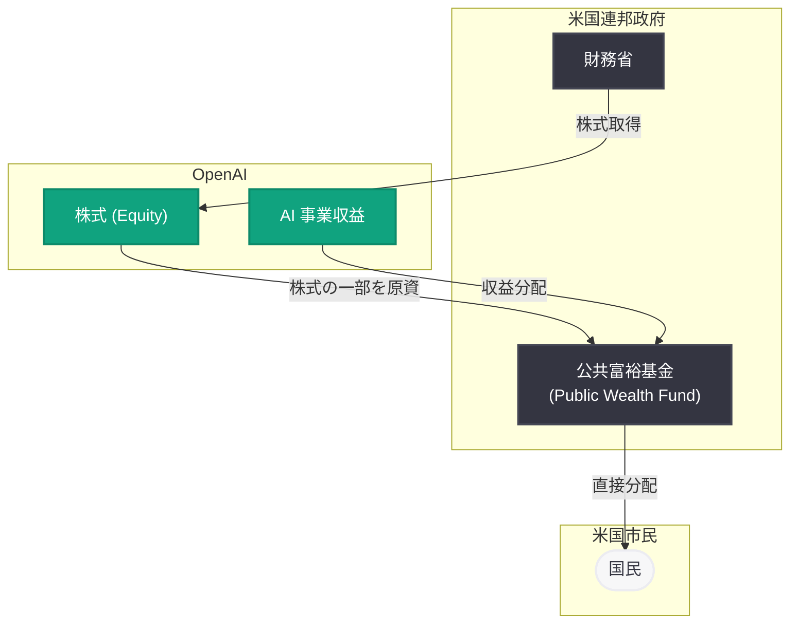
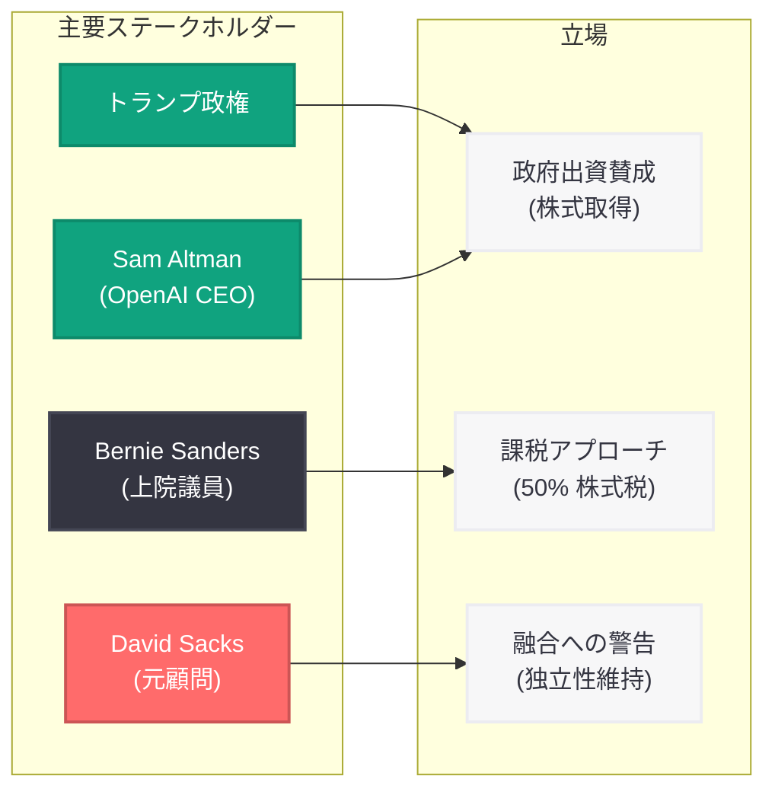

# トランプ政権が OpenAI の株式取得を検討: 政府による AI 企業への出資構想

## メタデータ

| 項目 | 内容 |
|------|------|
| 発表日 | 2026-06-06 |
| ソース | TechCrunch (外部報道) |
| カテゴリ | ビジネス / 政府政策 |
| 公式リンク | [Trump Administration Might Take an Equity Stake in OpenAI](https://techcrunch.com/2026/06/06/the-trump-administration-might-take-an-equity-stake-in-openai/) |

## 概要

2026 年 6 月 6 日、Donald Trump 大統領が AI 企業との間で「国民が AI の経済的成功を共有できる仕組み」について協議していることを明らかにした。CNBC の報道によれば、トランプ政権は OpenAI との間で株式取得 (equity stake) について積極的に議論を進めている。この構想は、政府が取得した株式の一部を OpenAI が提案する「公共富裕基金」(Public Wealth Fund) の原資とし、AI による経済成長の恩恵を国民に直接分配するというものである。

本件は AI 産業と政府の関係性に根本的な変化をもたらす可能性があり、OpenAI の API を利用する開発者やビジネスパートナーにとっても、プラットフォームのガバナンス構造や将来の方向性に影響を及ぼしうる重要な動向である。

## 主な内容

### トランプ大統領の発言と提案の概要

Trump 大統領はエアフォースワン機内で記者団に対し、「アメリカ国民が本質的にパートナーとなり、(AI 企業の) 一部が国民に付与されるというコンセプト」について言及した。具体的な企業名は明かさなかったものの、CNBC はトランプ政権が OpenAI との間で株式取得について協議中であると報じている。

**提案の骨子:**

- 政府が OpenAI の株式 (equity stake) を取得する
- 取得した株式の一部を「公共富裕基金」(Public Wealth Fund) の原資とする
- 基金からの収益を国民に直接分配し、AI による成長の恩恵を広く共有する

### OpenAI の公共富裕基金構想

OpenAI 自身が提案している Public Wealth Fund は、「AI 主導の成長による恩恵に、より多くの人々が直接参加できるよう、収益を市民に直接分配する」ことを目的としている。この構想は、Sam Altman CEO が 2025 年初頭から政府による主要 AI 企業への出資というアイデアについて議論してきたことと一致する (Bloomberg 報道)。

### 前例と政治的文脈

**Intel への出資前例:** トランプ政権は前年 (2025 年) に Intel の株式 10% を取得しており、営利企業への政府出資に対する積極的な姿勢を示している。今回の OpenAI への出資構想はこの路線の延長線上にある。

**Bernie Sanders 上院議員の提案:** Sanders 上院議員は OpenAI、Anthropic、xAI などの企業に対し、株式で支払う一回限りの 50% 税を提案している。これは政府による出資とは異なるアプローチだが、AI 企業の利益を公共に還元するという共通の目的を持つ。

### 批判的見解

**David Sacks (元 AI・暗号通貨担当顧問):** 「我々が既に滑り落ちつつある企業と政府の融合を加速させることになる」と警告した。政府が AI 企業の株主となることで、規制の独立性や市場競争への影響が懸念される。

**Dare Obasanjo (元 Microsoft 社員):** 将来的な OpenAI の政府救済 (bailout) への布石が敷かれつつあると指摘した。政府が株主として利害関係を持つことで、経営危機時に公的資金による救済が行われる構図が生まれる可能性がある。

### 未確定事項

- 具体的な出資額や持株比率は公表されていない
- 法的枠組みや議会承認の必要性について詳細は不明
- 実施時期に関する具体的なタイムラインは示されていない

## 技術的な詳細

本件は主としてビジネス・政策に関するニュースであり、直接的な技術変更は伴わない。ただし、政府が株主となった場合の技術面への波及効果として以下が考えられる。

### 想定される技術的影響領域

| 領域 | 潜在的影響 |
|------|-----------|
| データプライバシー | 政府アクセス要件の強化 |
| コンテンツモデレーション | 政策に基づくフィルタリング要件 |
| API アクセス制限 | 特定国・地域への提供制限の変更 |
| セキュリティ基準 | 政府調達基準 (FedRAMP 等) への準拠強化 |
| オープンソース方針 | 公共性の観点からの方針変更 |

## アーキテクチャ

### 提案されている株式・基金構造

### ステークホルダー関係図

## 開発者への影響

政府が OpenAI の株主となった場合、API を利用する開発者やプラットフォーム上でビジネスを展開する企業に以下の影響が想定される。

### API アクセスとコンプライアンス

- **地政学的制約の変化:** 政府が株主となることで、特定国への API 提供に関する制限が強化または緩和される可能性がある
- **データ所在地要件:** 政府のセキュリティ要件に基づき、データ処理の地理的制約が追加される可能性がある
- **政府向け優先アクセス:** 公共セクター向けの専用エンドポイントやモデルバリアントが優先的に提供される可能性がある

### 料金設定とビジネスモデル

- **公共性の要請:** 政府が株主となることで、API 料金の引き下げや無料枠の拡大など、公共利益を重視した料金政策が導入される可能性がある
- **逆に収益化圧力:** 基金への分配原資確保のため、収益最大化への圧力が強まる可能性もある

### プラットフォームガバナンス

- **コンテンツポリシーの変化:** 政府の政策優先事項がモデレーション基準に反映される可能性がある
- **透明性要件:** 公的資金が関与することで、モデルの意思決定プロセスやトレーニングデータに関する情報開示要件が強化される可能性がある
- **規制の独立性への懸念:** 政府が株主と規制者の両方の役割を持つことで、公平な規制が担保されるか不透明

### 推奨アクション

- OpenAI の公式発表や API Changelog を注視し、ガバナンス変更の兆候を把握する
- マルチベンダー戦略を検討し、特定プラットフォームへの依存リスクを分散する
- データ処理に関するコンプライアンス要件の変更に備え、現行のデータフローを文書化する

## 関連リンク

- [TechCrunch: Trump Administration Might Take an Equity Stake in OpenAI](https://techcrunch.com/2026/06/06/the-trump-administration-might-take-an-equity-stake-in-openai/)
- [OpenAI News](https://openai.com/news)
- [OpenAI Platform](https://platform.openai.com/)
- [OpenAI API Changelog](https://platform.openai.com/docs/changelog)

## まとめ

トランプ政権が OpenAI への株式取得を検討しているという報道は、AI 産業と政府の関係性における歴史的な転換点となる可能性がある。主要なポイントは以下の通り。

1. **政府出資の構想:** トランプ政権は OpenAI の株式取得を通じて、AI の経済的恩恵を国民に還元する仕組みを構築しようとしている
2. **公共富裕基金:** OpenAI 自身が提案した基金構想と政府の出資構想が合流し、国民への直接分配メカニズムが検討されている
3. **前例の存在:** Intel への 10% 出資という前例があり、AI 企業への出資も実現可能性は低くない
4. **批判と懸念:** 企業と政府の融合への警告、将来的な救済への布石という批判的見解も存在する
5. **開発者への波及:** 実現した場合、API アクセス、料金、コンテンツポリシー、コンプライアンス要件など多方面への影響が想定される

具体的な出資額や持株比率、実施時期は未定であり、今後の議会での議論や OpenAI 側の正式な対応を注視する必要がある。
