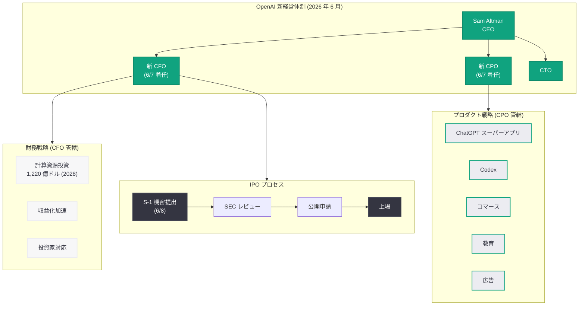

# OpenAI、新 CFO・CPO を迎える — IPO 体制の強化

## メタデータ

| 項目 | 内容 |
|------|------|
| 発表日 | 2026-06-07 |
| ソース | OpenAI News |
| カテゴリ | 企業ニュース |
| 公式リンク | https://openai.com/index/openai-welcomes-cfo-cpo/ |

## 概要

OpenAI は 2026 年 6 月 7 日、新たな最高財務責任者 (CFO) および最高プロダクト責任者 (CPO) を迎えることを公式ブログで発表した。この人事は、翌日 6 月 8 日に SEC へ S-1 を機密提出するという IPO プロセスの直前に行われたものであり、公開企業への移行に向けた経営体制の強化を明確に示すものである。

2026 年に入って以降、OpenAI は CMO Kate Rouch の退任 (4 月 3 日)、CPO Kevin Weil を含む幹部 3 名の同日離脱 (4 月 17 日)、Fidji Simo の医療休暇 (4 月 3 日) など、相次ぐ経営層の人材流出に直面してきた。今回の新 CFO・CPO の任命は、こうした空白を埋め、IPO を成功裏に遂行するための経営チーム再構築の集大成と位置づけられる。

## 主な内容

### CFO の役割と重要性

OpenAI の CFO ポジションは、同社の財務戦略において極めて重要な位置を占める。2028 年に約 1,220 億ドルの計算資源支出が計画されており、売上が倍増しても 850 億ドルのキャッシュバーンが予想される中、IPO による資金調達と投資家向けの財務ストーリーの構築が CFO の最重要任務となる。

Sarah Friar 前 CFO は、大規模データセンター支出の持続可能性について懸念を表明していた経緯がある。新 CFO には、この巨額投資の合理性を公開市場の投資家に説得力をもって説明し、少なくとも 4 年間は黒字化が見込めない財務構造を長期成長戦略として提示する能力が求められる。

### CPO の役割と「スーパーアプリ」戦略

CPO ポジションは、2026 年 4 月 17 日に Kevin Weil が退任して以来空席となっていた。OpenAI は現在、ChatGPT を核とした「スーパーアプリ」戦略を推進しており、以下の統合が進行中である。

- **ChatGPT と Codex の統合:** コーディング支援機能の本体アプリへの組み込み (2026 年 5 月 16 日発表)
- **コマース機能:** ChatGPT 内での商品購入機能 (2026 年 6 月 8 日「Buy it in ChatGPT」発表)
- **教育プラットフォーム:** ChatGPT for Teachers の展開 (2026 年 6 月 8 日発表)
- **広告事業:** ChatGPT 内広告の拡大 (2026 年 5 月 7 日「Testing Ads in ChatGPT」)
- **音声・マルチモーダル:** CarPlay 対応、カスタムボイス API など

新 CPO には、これらの多岐にわたるプロダクトラインを統合し、一貫性のあるユーザー体験を構築しながら収益化を加速する役割が期待される。

### IPO 前の経営体制確立

今回の人事発表のタイミングは戦略的に極めて重要である。翌 6 月 8 日に S-1 を SEC に機密提出することが予定されていたため、投資家やアナリストに対して「経営チームが完成している」というメッセージを発信する必要があった。

2026 年の OpenAI における主要な人事異動の時系列は以下の通りである。

| 日付 | 内容 |
|------|------|
| 3 月 21 日 | 従業員数が約 8,000 人に倍増と報道 |
| 3 月 23 日 | Meta 広告幹部を採用 |
| 4 月 3 日 | CMO Kate Rouch 退任、Fidji Simo 医療休暇 |
| 4 月 17 日 | CPO Kevin Weil、Bill Peebles、Srinivas Narayanan の 3 名が同日退社 |
| 4 月 20 日 | JioStar CEO を APAC 責任者として採用 |
| 5 月 11 日 | Porterfield を Youth Safety 責任者として採用 |
| **6 月 7 日** | **新 CFO・CPO の任命発表** |
| 6 月 8 日 | SEC に S-1 機密提出 |

### 研究組織から上場テクノロジー企業への転換

OpenAI は、非営利の AI 研究所として設立された組織から、8,520 億ドルの評価額を持つ上場テクノロジー企業へと変貌を遂げつつある。この転換には、研究文化を維持しながらも収益性と株主への説明責任を果たせる経営チームが不可欠である。新 CFO・CPO の着任は、この組織的変革の象徴的な出来事である。

## アーキテクチャ

## 開発者への影響

今回の経営人事は直接的な API 変更を伴うものではないが、中長期的に以下のような影響が想定される。

- **プロダクト戦略の安定化:** CPO の着任により、API プロダクトと ChatGPT プラットフォームの統合戦略に一貫性が生まれ、開発者向け機能のロードマップが明確化される可能性がある
- **料金体系への影響:** 新 CFO の下で IPO に向けた収益化圧力が高まることで、API 料金の見直しや新たな課金モデルの導入が加速する可能性がある
- **プラットフォーム投資の継続:** CFO による財務規律の確立は、計算資源への継続投資 (2028 年に 1,220 億ドル) の実現可能性を高め、モデル性能の向上やレイテンシの改善として開発者に還元される
- **エンタープライズ向け強化:** IPO を見据えた収益基盤の強化により、エンタープライズ向け API 機能 (SLA、セキュリティ、コンプライアンス) の充実が期待される
- **パートナーエコシステムの拡大:** スーパーアプリ戦略の推進により、サードパーティ開発者向けのプラグインやインテグレーション機会が拡大する見込み

## 関連リンク

- [OpenAI 公式発表](https://openai.com/index/openai-welcomes-cfo-cpo/)
- [OpenAI S-1 機密提出](https://openai.com/index/openai-submits-confidential-s-1/)
- [OpenAI News](https://openai.com/news)
- [OpenAI 幹部 3 名退社 (2026 年 4 月 17 日)](https://openai.com/index/openai-triple-executive-exit/)

## まとめ

OpenAI の新 CFO・CPO 任命は、2026 年前半を通じて続いた経営層の流動化に終止符を打ち、IPO 体制を完成させるための決定的な一手である。翌日の S-1 機密提出と合わせて見ると、OpenAI が研究主導の非営利組織から、1 兆ドル規模の評価額を目指す上場テクノロジー企業へと不可逆的に移行していることが明白である。CPO は ChatGPT スーパーアプリを中心とした多角的なプロダクト戦略を統括し、CFO は 1,220 億ドル規模の計算資源投資と IPO プロセスを財務面から支える。従業員数が約 8,000 人に倍増した組織を率いるこの新経営チームの手腕が、OpenAI の次の章を決定づけることになる。
