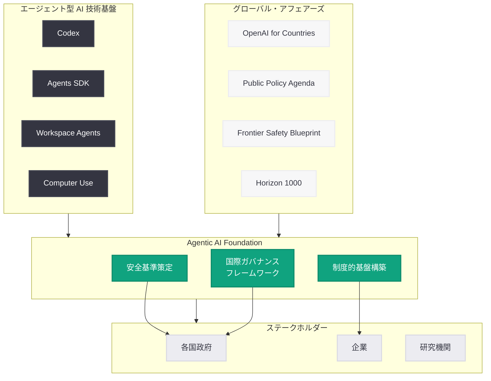

# Agentic AI Foundation -- AI エージェント時代の基盤構築

## メタデータ

| 項目 | 内容 |
|------|------|
| 発表日 | 2026-06-08 |
| ソース | OpenAI News |
| カテゴリ | グローバル・アフェアーズ |
| 公式リンク | https://openai.com/index/agentic-ai-foundation/ |

> **注記:** 本レポートは OpenAI の公開情報、URL メタデータ、および 2026 年前半に展開された一連の Global Affairs 関連発表との連続性に基づいて作成している。記事本文へのアクセスが制限されたため (HTTP 403)、公開日時、カテゴリ分類、関連する政策文書から内容を構成している。正確な詳細については公式ページを参照されたい。

## 概要

OpenAI は 2026 年 6 月 8 日、Global Affairs ブログにて「Agentic AI Foundation」(AI エージェント基盤) イニシアティブを発表した。本イニシアティブは、AI エージェントが社会のあらゆる領域で自律的に活動する時代を見据え、その安全な展開、国際的なガバナンスフレームワーク、および制度的基盤を構築することを目的としている。

この発表は、OpenAI が 2026 年前半に加速してきたエージェント型 AI の技術展開と、それに並行して進めてきたグローバルガバナンス戦略の集大成と位置づけられる。Codex によるエージェント型コーディング、Agents SDK の成熟、ChatGPT 内の Workspace Agents、Computer Use 機能など、急速に拡大するエージェント型 AI の能力に対し、制度的・組織的な受け皿を整備するものである。

## 主な内容

### エージェント型 AI の急速な展開と基盤整備の必要性

2026 年に入り、OpenAI のエージェント型 AI 製品は急速に拡大してきた。

| 時期 | 発表 | 内容 |
|------|------|------|
| 2026 年 4 月 | Codex 拡張 | エージェント型コーディングを「ほぼすべて」に対応 |
| 2026 年 4 月 | Workspace Agents | ChatGPT 内で組織横断的に動作する AI エージェント |
| 2026 年 4-5 月 | Agents SDK v0.17.x | 複数リリースによる SDK の成熟 |
| 2026 年 5-6 月 | Computer Use | デスクトップおよびモバイルでの自律操作 |
| 2026 年 6 月 2 日 | Codex for Knowledge Work | 知識労働向けエージェント型 AI |

これらの技術がもたらす自律性の拡大に伴い、従来の「ツールとしての AI」を前提とした規制枠組みでは対応しきれない課題が浮上している。Agentic AI Foundation は、この制度的ギャップを埋めるための国際的な取り組みとして構想されている。

### Agentic AI Foundation の目的と構造

Agentic AI Foundation は、以下の 3 つの柱を中心に構成されていると考えられる。

**1. 安全な展開のための基準策定**

AI エージェントが人間の監督下で自律的にタスクを実行する際の安全基準を策定する。具体的には、エージェントの行動範囲の制限、人間によるオーバーライド機構、エスカレーションプロトコルなどを含む。

**2. 国際的なガバナンスフレームワーク**

各国政府と連携し、エージェント型 AI の展開に関する共通ルールを策定する。OpenAI の「OpenAI for Countries」プログラム (George Osborne が Head of Countries として率いる) と連動し、各国の制度環境に適応したガバナンスモデルを提供する。

**3. 制度的基盤の構築**

AI エージェントが経済活動に参加する際の法的地位、責任分担、監査メカニズムなど、制度インフラを整備する。

### 関連するグローバル・アフェアーズ戦略

Agentic AI Foundation は、OpenAI が 2026 年 5-6 月に集中的に展開してきた政策提言シリーズの文脈に位置づけられる。

- **グローバル AI ガバナンス機関** (5 月 14 日): IAEA モデルの国際機関設立提案
- **OpenAI Public Policy Agenda** (6 月 3 日): 包括的な公共政策アジェンダの公開
- **Frontier Safety Blueprint** (6 月 3 日): フロンティア AI の民主的ガバナンスに関する具体的提案
- **How Countries Can End Capability Overhang** (6 月 6 日): 各国の AI 展開ギャップ解消に向けた提言
- **Horizon 1000** (6 月 6 日): 新興国を含む 1000 都市への AI 展開プログラム

### サイバーセキュリティとの連携

AI エージェントの自律的活動には、サイバーセキュリティ上の新たなリスクが伴う。OpenAI は Daybreak イニシアティブや GPT-5.5-Cyber など、AI を活用したサイバー防衛能力を並行して開発しており、Agentic AI Foundation はこれらの取り組みとも連携し、エージェント型 AI のセキュリティ基盤を強化するものと位置づけられる。

## アーキテクチャ

## 開発者への影響

Agentic AI Foundation の設立は、AI エージェントを開発・展開する開発者に以下のような影響を与える可能性がある。

- **エージェント安全性ガイドラインの標準化:** AI エージェントの設計・実装において準拠すべき安全基準が明確化される。これにより、開発者はエージェントの行動範囲、フェイルセーフ機構、人間への報告義務などについて具体的な指針を得られるようになる
- **国際展開の容易化:** ガバナンスフレームワークが国際的に標準化されることで、各国ごとに異なる規制への対応コストが低減する。Agents SDK を活用したアプリケーションのグローバル展開が容易になる
- **認証・監査プロセスの導入:** AI エージェントの能力レベルに応じた認証プロセスや定期監査が義務化される可能性がある。特に金融、医療、インフラなどの高リスク領域では厳格な要件が課される見込み
- **責任分担モデルの明確化:** AI エージェントが引き起こした問題に対する責任の所在 (開発者、運用者、AI プロバイダー) が明確になり、法的リスクの予見可能性が向上する
- **Agents SDK エコシステムの拡大:** Foundation の活動を通じて、安全なエージェント構築のためのツール、ライブラリ、ベストプラクティスが整備され、開発者エコシステムが拡充する

## 関連リンク

- [Agentic AI Foundation (公式)](https://openai.com/index/agentic-ai-foundation/)
- [OpenAI Public Policy Agenda](https://openai.com/index/openai-public-policy-agenda/)
- [Frontier Safety Blueprint](https://openai.com/index/frontier-safety-blueprint/)
- [How Countries Can End Capability Overhang](https://openai.com/index/how-countries-can-end-the-capability-overhang/)
- [Horizon 1000](https://openai.com/index/horizon-1000/)
- [Global AI Governance Body](https://openai.com/index/global-ai-governance-body/)
- [Codex for Knowledge Work](https://openai.com/index/codex-for-knowledge-work/)
- [Agents SDK ドキュメント](https://platform.openai.com/docs/agents)

## まとめ

Agentic AI Foundation は、AI エージェントが社会に広く浸透する時代に向けた制度的基盤を構築する OpenAI の戦略的イニシアティブである。2026 年前半に急速に展開されたエージェント型 AI 技術 (Codex、Agents SDK、Workspace Agents、Computer Use) の能力拡大に対応し、安全性基準の策定、国際ガバナンスフレームワークの構築、制度インフラの整備を包括的に推進する。

本イニシアティブは、OpenAI が単なる AI モデル開発企業から、AI 時代の制度設計を主導するプラットフォーム企業へと進化する過程を示すものであり、Frontier Safety Blueprint やグローバル AI ガバナンス機関の提案と一体となって、エージェント型 AI の責任ある展開を国際的に推進する役割を担うと考えられる。
