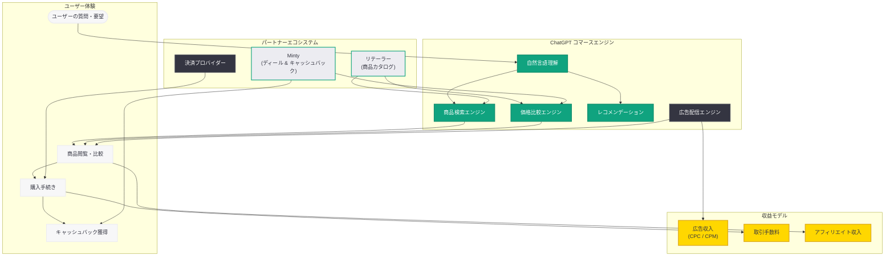

# Buy it in ChatGPT -- ChatGPT 内購入機能の本格展開

## メタデータ

| 項目 | 内容 |
|------|------|
| 発表日 | 2026-06-08 |
| ソース | OpenAI News |
| カテゴリ | 新機能 |
| 公式リンク | https://openai.com/index/buy-it-in-chatgpt/ |

## 概要

OpenAI は 2026 年 6 月 8 日、ChatGPT 内で商品を直接購入できる「Buy it in ChatGPT」機能の本格展開を発表した。本機能により、ユーザーは ChatGPT の会話インターフェース内で商品の閲覧、比較、購入までを一貫して行えるようになる。同日には関連ページ「chatgpt-shopping-research」も公開されており、ショッピング体験の研究開発に関する情報も提供されている。

この発表は、OpenAI が ChatGPT を「スーパーアプリ」化する戦略の一環として位置づけられる。WSJ や TechCrunch が報じてきたように、OpenAI は ChatGPT を単なる AI アシスタントから、ユーザーの生活全般をカバーするゲートウェイへと進化させることを目指している。コマース機能の本格展開は、サブスクリプション収入を超えたトランザクションベースの収益モデルへの多角化を加速させるものである。

## 主な内容

### ChatGPT ショッピングアシスタントの全容

「Buy it in ChatGPT」は、ChatGPT をフルスタックのショッピングアシスタントとして機能させる機能である。ユーザーは自然言語で商品に関する質問や要望を伝えるだけで、AI が最適な商品を提案し、価格比較を行い、購入手続きまでをサポートする。

主な機能は以下の通りである。

- **対話型商品検索:** 「予算 5 万円以内でノイズキャンセリング付きのワイヤレスヘッドホンが欲しい」といった自然言語での商品検索
- **リアルタイム価格比較:** 複数のリテーラーやプラットフォームの価格をリアルタイムで比較表示
- **AI パワードお得情報:** パートナープラットフォームと連携したセール情報やキャッシュバックの提示
- **チャット内購入フロー:** 会話の流れの中でシームレスに購入手続きを完了

### Minty との統合: AI パワードディールとキャッシュバック

e コマースプラットフォーム Minty が ChatGPT との統合を実現し、AI パワードのディール (お得情報) とキャッシュバックを ChatGPT 内で直接提供している。この統合により、ユーザーは会話中にリアルタイムのオファーや価格比較情報にアクセスでき、最もお得な購入方法を AI が自動的に提案する。

Minty 統合の特徴は以下の通りである。

- **リアルタイムオファー表示:** 会話コンテキストに基づいた最新のセール情報をリアルタイムで表示
- **キャッシュバック自動適用:** 対象商品の購入時にキャッシュバックが自動的に適用される仕組み
- **価格履歴分析:** AI が過去の価格推移を分析し、購入タイミングのアドバイスを提供
- **クーポン自動検出:** 利用可能なクーポンやプロモーションコードを自動的に検出・適用

### コマース戦略の進化: Instant Checkout からの学び

今回の「Buy it in ChatGPT」は、2026 年 3 月に終了した Instant Checkout からの学びを反映した設計となっている。Instant Checkout では、リアルタイム商品情報の不整合やユーザーの購買行動とのミスマッチが課題となったが、新機能では以下の改善が施されている。

- **リテーラーアプリ連携の強化:** 購入の最終ステップはリテーラーの決済インフラを活用し、情報の正確性を担保
- **検索・発見の優位性活用:** AI の強みである商品理解と推薦に注力し、ユーザー体験を最適化
- **パートナーエコシステムの拡大:** Minty をはじめとする複数のコマースプラットフォームとの統合

### スーパーアプリ戦略における位置づけ

WSJ や TechCrunch の報道によれば、OpenAI は ChatGPT を「スーパーアプリ」として確立し、無料ユーザーを有料プロダクトへと誘導するゲートウェイにする戦略を推進している。「Buy it in ChatGPT」はこの戦略の重要な構成要素であり、以下の役割を果たす。

- **ユーザーエンゲージメントの向上:** ショッピング機能の追加により、日常的な利用シーンが拡大
- **収益多角化:** サブスクリプション収入に加え、取引手数料やアフィリエイト収入を獲得
- **エコシステムのロックイン:** 購買データの蓄積によるパーソナライズの強化

## 技術的な詳細

### コマースプラットフォームのアーキテクチャ

「Buy it in ChatGPT」は、2026 年 3 月に発表された Agentic Commerce Protocol (ACP) を基盤としつつ、リテーラーアプリ連携とパートナープラットフォーム統合を組み合わせたハイブリッドアーキテクチャを採用している。

**主要な技術コンポーネント:**

- **商品検索エンジン:** 自然言語クエリを構造化された商品検索に変換する AI エンジン
- **価格比較エンジン:** 複数ソースからのリアルタイム価格データを集約・比較
- **レコメンデーションエンジン:** ユーザーの好み、予算、過去の会話履歴に基づく商品推薦
- **オファー統合レイヤー:** Minty 等のパートナープラットフォームからのディール・キャッシュバック情報を統合
- **決済連携ゲートウェイ:** リテーラーの決済システムとの安全な連携を提供

### 広告・コマースの収益統合

2026 年 5 月から開始された ChatGPT 広告と、今回のコマース機能は、統合的な収益プラットフォームとして設計されている。広告による商品認知とコマース機能による直接購入が一気通貫で機能する仕組みである。

## 開発者への影響

### EC 事業者・リテーラーへの影響

- **新たな販売チャネル:** ChatGPT が巨大なトラフィックソースとして機能し、AI 経由の商品販売が本格化する。ACP 準拠のデータフィードを提供することで、このエコシステムに参加可能
- **価格競争の可視化:** AI による価格比較が標準化されることで、価格透明性が高まり、競争環境が変化する
- **商品データの品質要件:** AI が商品を正確に理解・推薦するためには、構造化された高品質なメタデータの提供が不可欠となる

### 広告主・マーケターへの影響

- **コマース広告の統合:** 広告とショッピングが一体化した体験により、広告から購買までのファネルが短縮される
- **パフォーマンス計測の進化:** CPC 広告経由の購買コンバージョンが直接追跡可能になり、ROAS (広告費用対効果) の可視化が向上
- **新たなパートナーシップ機会:** Minty のようなディール・キャッシュバックプラットフォームとの連携による集客手段が拡大

### AI コマース市場への影響

- **競合との差別化:** Amazon の AI ショッピングアシスタント、Google Shopping の AI 機能との競争が激化。OpenAI はチャットインターフェースの自然さを武器に差別化を図る
- **収益モデルの変革:** AI アシスタントが直接コマースの収益を生む時代の到来。サブスクリプション以外の収益源として、取引手数料とアフィリエイトが成長エンジンとなる
- **ユーザー行動の変化:** 「検索してから購入」から「対話して購入」への消費者行動の変化を加速させる可能性がある

## 関連リンク

- [Buy it in ChatGPT](https://openai.com/index/buy-it-in-chatgpt/)
- [ChatGPT Shopping Research](https://openai.com/index/chatgpt-shopping-research/)
- [Powering product discovery in ChatGPT (2026-03-24)](https://openai.com/index/powering-product-discovery-in-chatgpt)
- [New ways to buy ChatGPT ads (2026-05-05)](https://openai.com/index/new-ways-to-buy-chatgpt-ads)
- [Testing ads in ChatGPT (2026-05-07)](https://openai.com/index/testing-ads-in-chatgpt)
- [OpenAI News](https://openai.com/news)

## まとめ

「Buy it in ChatGPT」の本格展開は、OpenAI のコマース戦略における重要なマイルストーンである。2026 年 3 月の Instant Checkout 終了から約 3 か月、検索・商品発見への注力とリテーラーアプリ連携の強化を経て、ChatGPT は再びフルスタックのショッピング体験を提供する段階に到達した。Minty との統合によるリアルタイムディールやキャッシュバックの提供は、ユーザーにとっての具体的なメリットを創出している。

OpenAI のスーパーアプリ戦略の観点からは、広告 (2026 年 5 月開始) とコマース機能の組み合わせにより、サブスクリプション以外の収益源が本格的に稼働し始めたことを意味する。Amazon、Google Shopping、その他の AI アシスタントとの競争が激化する中、ChatGPT は自然言語による対話型ショッピング体験という独自の強みを武器に、AI コマース市場での地位確立を目指す。今後はパートナーエコシステムの拡大と、ユーザーの購買データに基づくパーソナライズの深化が競争力の鍵となるだろう。
