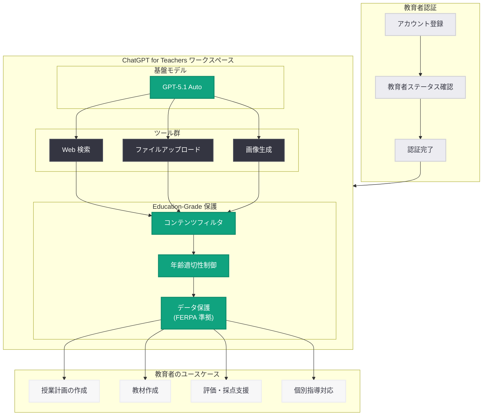

# ChatGPT for Teachers — 米国 K-12 教育者向け無料ワークスペース

## メタデータ

| 項目 | 内容 |
|------|------|
| 発表日 | 2026-06-08 |
| ソース | OpenAI News |
| カテゴリ | 新機能 |
| 公式リンク | [ChatGPT for Teachers](https://openai.com/index/chatgpt-for-teachers/) |

## 概要

OpenAI は 2026 年 6 月 8 日、米国の K-12 (幼稚園から高校 12 年生まで) 教育者を対象とした専用ワークスペース「ChatGPT for Teachers」を発表した。教育者としてのステータスが確認された verified ユーザーに対し、2027 年 6 月まで無料で提供される。

本サービスは、GPT-5.1 Auto を基盤モデルとして採用し、Web 検索、ファイルアップロード、画像生成に加え、教育現場に特化した「education-grade」の安全保護機能とツールを備えている。AI 技術の教室への導入に慎重な教育者が依然として存在する中、OpenAI が教育セクターへ直接的に進出する戦略的な取り組みである。

## 主な内容

### 製品の位置付け

ChatGPT for Teachers は、一般消費者向けの ChatGPT とは異なり、K-12 教育者の業務に最適化された専用ワークスペースとして設計されている。教育現場特有のニーズに応える目的で構築されたプロダクトであり、OpenAI にとって教育分野初の purpose-built (専用設計) 製品となる。

### 主要機能

| 機能 | 説明 |
|------|------|
| GPT-5.1 Auto | 最新の基盤モデルによる高品質な応答生成 |
| Web 検索 | リアルタイムの情報検索によるカリキュラム準備支援 |
| ファイルアップロード | 教材、PDF、文書の読み込みと分析 |
| 画像生成 | 授業教材用のビジュアル素材作成 |
| Education-grade 保護 | 教育現場向けの安全性フィルタリングとコンテンツ制御 |

### 利用条件

- **対象:** 米国 K-12 教育者 (幼稚園〜高校 12 年生を担当する教員)
- **認証:** 教育者ステータスの確認 (verification) が必要
- **費用:** 無料 (2027 年 6 月まで)
- **地域:** 米国のみ

### OpenAI の教育戦略における位置付け

ChatGPT for Teachers は、OpenAI が段階的に推進してきた教育分野への取り組みの集大成と位置付けられる。

1. **2024 年 11 月:** ChatGPT の教育者向けガイド (Teacher's Guide to ChatGPT) を公開
2. **2026 年 5 月:** Education-for-Countries イニシアチブを発表
3. **2026 年 6 月:** ChatGPT for Teachers のローンチ (本発表)

この時系列からは、ガイドラインの策定から国家レベルの教育戦略、そして専用プロダクトの提供へと、OpenAI が教育セクターへの関与を段階的に深化させていることが読み取れる。

### 教育現場における AI 受容の課題

AI 技術の教室導入に対しては、一部の教育者から依然として慎重な見方が示されている。主な懸念事項として、以下が挙げられる。

- 学生の自主的な学習能力への影響
- 学術的誠実性 (アカデミック・インテグリティ) の担保
- データプライバシーと未成年者の保護
- デジタルデバイドの拡大リスク

ChatGPT for Teachers は、education-grade の保護機能により、これらの懸念に対処しつつ教育者が安心して活用できる環境を提供することを目指している。

## 技術的な詳細

### 基盤モデル: GPT-5.1 Auto

ChatGPT for Teachers は GPT-5.1 Auto を採用している。「Auto」の名称は、タスクの種類や複雑さに応じてモデルの推論レベルを自動的に調整する機能を示唆しており、教育者が技術的な設定を意識することなく最適な応答品質を得られる設計となっている。

### Education-Grade 保護機能

教育現場での利用に特化した安全性対策として、以下のような保護機能が実装されていると想定される。

- **コンテンツフィルタリング:** 教育上不適切なコンテンツの生成を制限する強化フィルタ
- **年齢適切性制御:** K-12 各学年レベルに適した応答の生成
- **学術的誠実性支援:** 学生の学びを支援する方向での回答生成 (答えを直接提示するのではなく、思考プロセスを促す)
- **データ保護:** 教育データに関する FERPA (Family Educational Rights and Privacy Act) 等の規制への準拠

### ワークスペースの構成

## 開発者への影響

### 教育テクノロジー (EdTech) 開発者への示唆

- **競合環境の変化:** OpenAI が教育向け専用プロダクトを無料提供することにより、教育用 AI ツールを開発する EdTech スタートアップは差別化戦略の見直しが必要になる可能性がある
- **エコシステムとの連携:** ChatGPT for Teachers がプラットフォーム化すれば、サードパーティ連携の機会が生まれる可能性がある (LMS 連携、カリキュラム管理システムとの統合等)
- **Education-grade 安全基準:** OpenAI が設定する教育向け安全基準が業界のベースラインとなり、他の教育用 AI 製品にも同等の保護レベルが求められるようになる可能性がある

### API 開発者への影響

- **GPT-5.1 Auto モデルの存在確認:** 教育向けに GPT-5.1 Auto が投入されたことは、今後 API でも同モデルが利用可能になる可能性を示唆する
- **教育向け API の展開:** ChatGPT for Teachers の成功により、教育向けの特化 API エンドポイントやカスタムモデレーション設定が提供される可能性がある
- **無料アクセスモデルの前例:** 特定セクター向けの無料提供モデルが他業界 (医療、非営利等) にも拡大する可能性があり、開発者はこれらのユーザー基盤へのリーチ戦略を検討する材料となる

### 教育向けアプリケーション開発への知見

- **ユーザー認証の重要性:** 教育者の verified ステータス確認は、セクター特化型 AI アプリケーションにおけるユーザー認証の設計パターンとして参考になる
- **安全性の階層化:** education-grade という概念は、ユーザー属性やコンテキストに応じた安全性レベルの動的制御という設計思想を示している

## 関連リンク

- [ChatGPT for Teachers](https://openai.com/index/chatgpt-for-teachers/)
- [A Teacher's Guide to ChatGPT (2024 年 11 月)](https://openai.com/index/a-teachers-guide-to-chatgpt/)
- [OpenAI Education](https://openai.com/education)
- [OpenAI News](https://openai.com/news)
- [ChatGPT](https://chatgpt.com)

## まとめ

ChatGPT for Teachers は、OpenAI が教育セクターに本格参入するための戦略的プロダクトである。米国 K-12 教育者を対象に 2027 年 6 月まで無料で提供されるこのサービスは、GPT-5.1 Auto を基盤とし、Web 検索、ファイルアップロード、画像生成といったフル機能に加え、教育現場に特化した安全保護機能を備えている。

OpenAI は 2024 年の教育者向けガイドの公開から、2026 年 5 月の Education-for-Countries イニシアチブ、そして本プロダクトのローンチへと、教育分野への関与を着実に深めてきた。無料アクセスモデルの採用は、AI 技術の教育現場への普及を加速させるためのアプローチであり、教育者コミュニティにおける AI への慎重な姿勢を克服するための戦略的な施策である。

EdTech 開発者にとっては競合環境の変化を意味し、API 開発者にとっては教育向け安全基準や認証モデルの設計パターンとして示唆に富む発表といえる。
