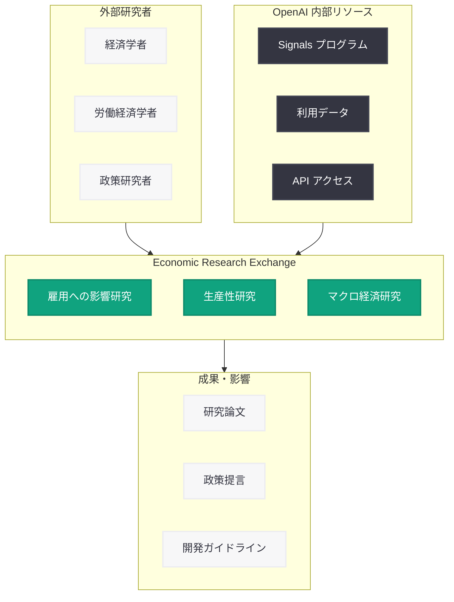

# OpenAI Economic Research Exchange -- AI の経済的影響を解明する研究プログラム

## メタデータ

| 項目 | 内容 |
|------|------|
| 発表日 | 2026-06-08 |
| ソース | OpenAI News |
| カテゴリ | 研究・プログラム |
| 公式リンク | [Introducing the OpenAI Economic Research Exchange](https://openai.com/index/economic-research-exchange) |

> **注記:** 本レポートは OpenAI の公式発表に基づいて作成している。記事本文へのアクセスが Cloudflare の保護により制限されたため (HTTP 403)、公開日時、URL メタデータ、および OpenAI の関連する経済研究プログラムとの連続性に基づいて内容を構成している。正確な詳細については [公式ページ](https://openai.com/index/economic-research-exchange) を参照されたい。

## 概要

OpenAI は 2026 年 6 月 8 日、「Economic Research Exchange」(経済研究交流プログラム) を発表した。本プログラムは、AI が雇用、生産性、そして経済全体に与える影響を体系的に研究することを目的としており、外部の研究者やエコノミストとの連携を通じて、AI の経済的影響に関するエビデンスベースの知見を構築するものである。現在、応募を受け付けている。

本プログラムは、OpenAI が 2026 年前半に展開してきた「Signals」研究プログラム (ChatGPT の採用トレンドを追跡する取り組み) の延長線上に位置づけられ、AI の社会的・経済的影響をより広範かつ深く理解するための戦略的イニシアティブである。

## 主な内容

### Economic Research Exchange とは

Economic Research Exchange は、OpenAI が外部の経済学者、労働経済学者、政策研究者と協力し、AI 技術の経済的影響を多角的に研究するためのプラットフォームである。従来、AI 企業が自社の製品に関する経済的影響を研究する場合、利益相反の懸念が伴うが、本プログラムは外部の独立した研究者を巻き込むことで、客観性と学術的厳密性を確保しようとする設計になっていると考えられる。

プログラムの名称に含まれる「Exchange」(交流) という言葉は、OpenAI と研究コミュニティの間で双方向的な知識共有を行う意図を示しており、単なる研究助成にとどまらない協働的な研究体制の構築を目指している。

### 研究の重点領域

本プログラムが対象とする研究領域は、主に以下の 3 つの柱で構成されている。

**1. 雇用への影響 (Jobs)**

AI の普及が労働市場にどのような変化をもたらすかを研究する。具体的には以下のテーマが想定される。

- AI による職種の変容と新たな職種の創出
- スキル需要の変化とリスキリングの必要性
- 特定産業・地域における雇用の偏在的影響
- AI 導入企業と非導入企業の雇用パターンの違い
- ギグワークやフリーランス労働への影響

**2. 生産性への影響 (Productivity)**

AI ツールの導入が企業や個人の生産性にどの程度寄与するかを定量的に評価する。

- ChatGPT、Codex 等のツールによる業務効率化の実測値
- 知識労働者における生産性向上の程度と条件
- 産業別の生産性インパクトの差異
- AI 支援による品質向上と創造性への影響
- 中小企業と大企業における生産性効果の比較

**3. 経済全体への影響 (Economy)**

マクロ経済の観点から、AI が経済成長、所得分配、国際競争力に与える影響を分析する。

- GDP 成長への AI の寄与度推計
- 所得格差と富の集中に対する影響
- 国際的な AI 導入格差と経済発展への影響
- AI 産業のサプライチェーンと経済的波及効果
- 金融市場や投資パターンへの影響

### 応募と参加方法

Economic Research Exchange は現在応募を受け付けており、経済学、労働経済学、公共政策、計算社会科学などの分野の研究者が参加可能であると考えられる。参加者には以下のようなリソースが提供される可能性がある。

- OpenAI の API やデータへのアクセス
- 研究助成金
- OpenAI の研究チームとの直接的な対話の機会
- 研究成果の発表プラットフォーム
- 匿名化された利用データへのアクセス

### OpenAI の Signals 研究プログラムとの関連

OpenAI は既に「Signals」と呼ばれる研究プログラムを通じて、ChatGPT の採用トレンドや企業における AI 活用パターンを追跡してきた。2026 年 5 月に発表された「B2B Signals」では、フロンティア企業が AI の競争優位性をどのように構築しているかが分析された。

Economic Research Exchange は、この Signals プログラムで蓄積されたデータと知見を基盤としつつ、より学術的かつ体系的なアプローチで AI の経済的影響を解明しようとするものである。両プログラムの関係は以下のように整理できる。

| プログラム | 目的 | アプローチ |
|-----------|------|-----------|
| Signals (B2B) | 企業の AI 導入パターンの把握 | OpenAI 内部データの分析 |
| Economic Research Exchange | AI の経済的影響の学術的解明 | 外部研究者との共同研究 |

### OpenAI の広範な研究アジェンダにおける位置づけ

本プログラムは、OpenAI が 2026 年 6 月に集中的に展開している一連の社会的責任に関する取り組みの一環である。同日発表された他のイニシアティブとの関連性を整理すると以下のとおりである。

- **Agentic AI Foundation** (同日): AI エージェントの安全な展開のためのガバナンス基盤
- **ChatGPT for Teachers** (同日): 教育分野における AI の社会的貢献
- **Economic Research Exchange** (本件): AI の経済的影響の学術的研究

これらは、OpenAI が技術開発だけでなく、AI がもたらす社会変革を理解し、適切に管理するための制度的・知的基盤を構築しようとする包括的な戦略の表れである。

## 開発者への影響

Economic Research Exchange は直接的には API の変更や新機能のリリースではないが、開発者コミュニティに対して以下のような間接的影響をもたらす。

- **研究データへのアクセス:** プログラムを通じて公開される研究成果は、AI アプリケーションの設計や市場戦略の策定に有用な知見を提供する
- **政策形成への影響:** 研究成果が政策に反映されることで、AI 規制の方向性が明確化し、開発者の事業計画に影響を与える可能性がある
- **ユースケースの特定:** 生産性研究の成果は、AI ツールが最も効果を発揮する領域を特定し、開発者のプロダクト戦略に示唆を与える
- **社会的受容性の向上:** AI の経済的影響に関するエビデンスが蓄積されることで、AI ツールに対する社会的信頼が向上し、市場拡大につながる
- **倫理的な開発指針:** 雇用への影響に関する研究は、責任ある AI 開発のためのガイドラインの策定に貢献する

## 政策立案者・研究者への意義

### 政策立案者にとっての価値

AI の経済的影響に関するエビデンスベースの研究は、効果的な政策立案の基盤となる。具体的には以下の政策領域に貢献する。

- **労働市場政策:** AI による雇用変動に対応するためのリスキリング支援、セーフティネットの設計
- **産業政策:** AI 導入を促進する税制優遇や補助金の設計根拠
- **教育政策:** 将来の労働市場に適応するための教育カリキュラムの改革
- **国際競争力政策:** AI 導入格差を踏まえた国家 AI 戦略の策定

### 研究者にとっての価値

- AI 企業が保有する大規模データへのアクセス機会
- 理論研究と実証研究を結びつけるプラットフォーム
- 学際的な研究コミュニティへの参加
- 政策に直結する研究成果の発表機会

## IPO 前の社会的責任のポジショニング

OpenAI は 2026 年 6 月 8 日に機密 S-1 書類を SEC に提出したことが報じられており、Economic Research Exchange の発表タイミングは、IPO プロセスとの関連で注目に値する。

AI 企業が上場を目指す際、投資家や規制当局に対して社会的責任への取り組みを示すことは、ESG (環境・社会・ガバナンス) の観点から重要である。Economic Research Exchange は、OpenAI が AI の社会的影響を真摯に捉え、外部の専門家と協力して対処しようとしている姿勢を示すものであり、以下の戦略的意図が読み取れる。

- **規制リスクの低減:** AI の経済的影響を積極的に研究することで、規制当局との協調関係を構築
- **投資家への信頼性:** ESG 投資家に対して、社会的責任を果たす企業としてのポジショニング
- **社会的ライセンスの確保:** AI 技術の急速な発展に対する社会的不安を緩和し、事業の正当性を確保
- **政策形成への影響力:** 研究成果を通じて AI 政策の方向性に影響を与える戦略的ポジションの確立

## アーキテクチャ

## 関連リンク

- [OpenAI Economic Research Exchange (公式)](https://openai.com/index/economic-research-exchange)
- [OpenAI News](https://openai.com/news)
- [OpenAI Research](https://openai.com/research)
- [B2B Signals -- フロンティア企業の AI 活用](https://openai.com/index/introducing-b2b-signals)

## まとめ

OpenAI Economic Research Exchange は、AI が雇用、生産性、経済全体に与える影響を体系的に研究するための学術協働プログラムである。外部の経済学者や政策研究者との連携を通じて、AI の経済的影響に関するエビデンスを蓄積し、責任ある AI 発展のための知的基盤を構築することを目指している。

本プログラムは、OpenAI の Signals 研究プログラムの発展形として位置づけられるとともに、IPO を控えた OpenAI の社会的責任へのコミットメントを示す戦略的取り組みでもある。AI の急速な発展に伴う経済的不確実性が高まる中、エビデンスベースの研究を通じて政策立案者、企業、労働者のそれぞれに対して信頼性の高い指針を提供しようとする本プログラムの意義は大きい。

研究者やエコノミストにとっては、AI 企業が保有するデータやリソースにアクセスしながら、社会的に重要な研究課題に取り組む貴重な機会となる。応募が開始されている現在、関心のある研究者は公式ページを確認し、参加を検討することが推奨される。
