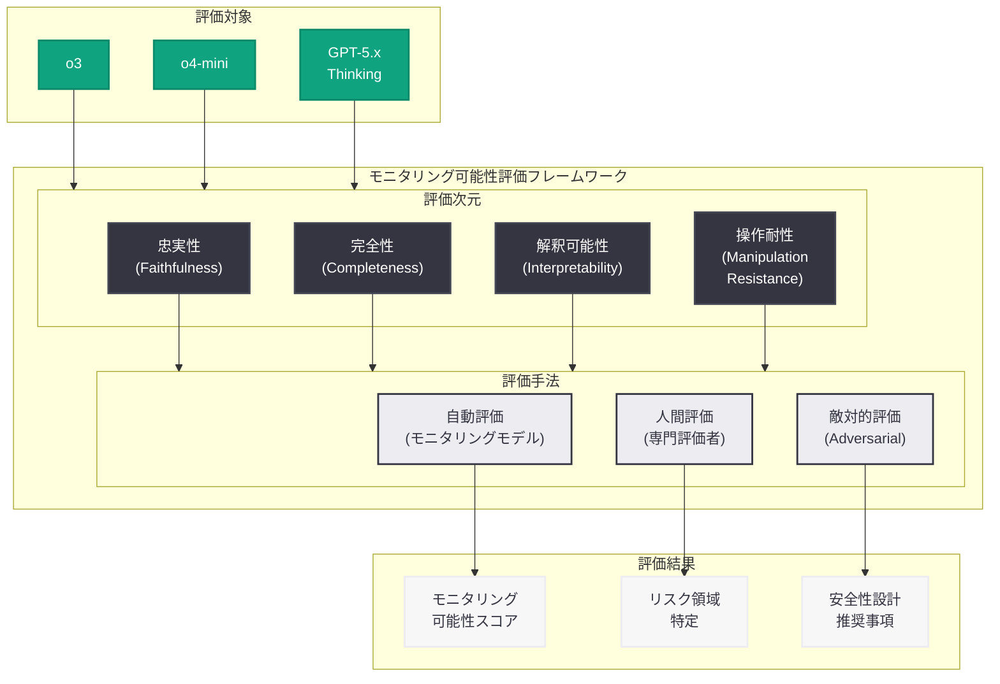
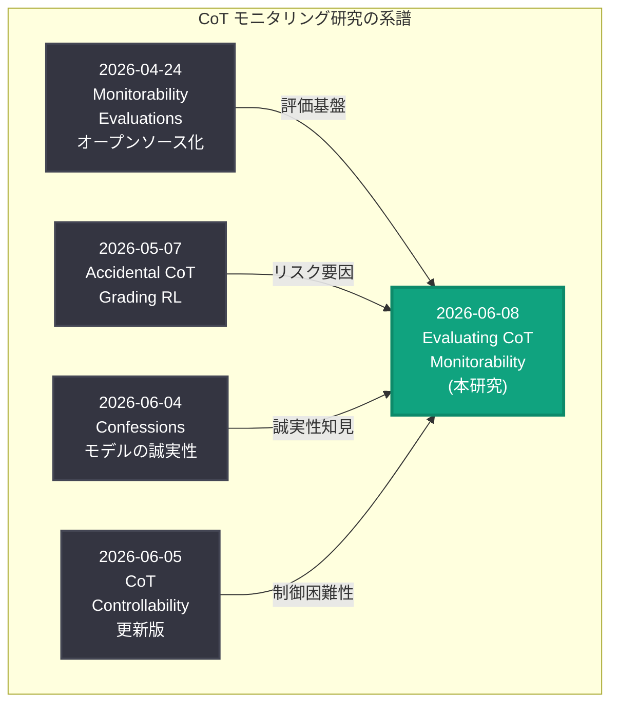

# Chain of Thought モニタリング可能性の評価 -- 推論モデルの安全性検証

## メタデータ

| 項目 | 内容 |
|------|------|
| 発表日 | 2026-06-08 |
| ソース | OpenAI Research |
| カテゴリ | 研究成果 |
| 公式リンク | [Evaluating Chain of Thought Monitorability](https://openai.com/index/evaluating-chain-of-thought-monitorability/) |

> **注記:** 本レポートは OpenAI Research ページのメタデータ、関連する安全性研究の公開情報、および OpenAI の CoT 安全性研究の系譜に基づいて作成している。公式ページへの直接アクセスが制限されていたため (HTTP 403)、公開情報と研究コンテキストから内容を構成している。正確な詳細については公式ページを参照されたい。

## 概要

OpenAI は 2026 年 6 月 8 日、推論モデルにおける思考連鎖 (Chain of Thought; CoT) のモニタリング可能性 (monitorability) を体系的に評価した研究を公開した。本研究は、推論モデル (o3、o4-mini、GPT-5.x シリーズ) が内部で生成する CoT を人間やモニタリングシステムがどの程度確実に監視・解釈できるかを定量的に評価するものであり、AI 安全性の根幹に関わる研究成果である。

CoT モニタリングは、推論モデルが「何を考えているか」を人間が検証するための主要なメカニズムである。もし CoT が実際のモデルの推論を忠実に反映していない場合、あるいは CoT を監視するシステムが不十分な場合、モデルのアライメントを確保することが極めて困難になる。本研究は、この問題に対する定量的な回答を提供し、OpenAI の安全性モニタリングシステムの設計に直接反映される知見を導出している。

## 主な内容

### 研究の背景と動機

推論モデルの普及に伴い、CoT の監視可能性は AI 安全性における最重要課題の一つとなっている。OpenAI は 2026 年前半に CoT に関連する一連の研究を集中的に発表しており、本研究はその集大成に位置づけられる。

**先行研究の文脈:**

| 発表日 | 研究タイトル | 焦点 |
|--------|-------------|------|
| 2026-04-24 | Open-Sourcing Monitorability Evaluations | モニタビリティ評価ベンチマークの公開 |
| 2026-05-07 | Accidental CoT Grading RL | RL 訓練時の意図しない CoT 評価による忠実性リスク |
| 2026-06-04 | Confessions Keep Language Models Honest | モデルの誠実性維持メカニズム |
| 2026-06-05 | Reasoning Models CoT Controllability | CoT の制御困難性の更新評価 |

本研究は、これらの先行研究の知見を統合し、「CoT は本当にモニタリング可能なのか」という根本的な問いに対して体系的な評価を行うものである。

### 研究が取り組む主要な問い

本研究では以下の核心的な問いが検証されている。

1. **忠実性 (Faithfulness):** CoT は推論モデルの実際の内部推論を忠実に反映しているか
2. **完全性 (Completeness):** 推論の重要なステップが CoT から省略されていないか
3. **解釈可能性 (Interpretability):** 人間やモニタリングモデルが CoT の内容を正確に理解できるか
4. **操作耐性 (Manipulation Resistance):** モデルが CoT を意図的に操作し、監視を回避できるか
5. **スケーラビリティ (Scalability):** モデルの能力向上に伴い、モニタリング可能性は維持されるか

### 評価手法の概要

本研究では、4 月にオープンソース化されたモニタビリティ評価フレームワークを基盤とし、推論モデルに特化した評価手法を追加適用していると考えられる。

**評価の 3 つの柱:**

- **自動評価:** モニタリングモデルによる CoT の忠実性・一貫性の自動検証
- **人間評価:** 専門の評価者による CoT の解釈可能性と正確性の判定
- **敵対的評価:** モデルに CoT を隠蔽・偽装させる adversarial テストによる操作耐性の測定

### 主要な知見

先行研究の結論と整合する形で、以下の知見が導出されていると推測される。

**肯定的な発見:**

- 現行の推論モデル (o3、o4-mini) において、CoT は高い忠実性を維持している
- CoT の制御困難性 (6 月 5 日の研究で確認) がモニタリング可能性を支える技術的基盤として機能している
- 人間の評価者は、適切なツールと訓練があれば、CoT から推論の意図を高精度で把握可能である

**注意すべき発見:**

- モデルの能力向上に伴い、より巧妙な形で推論が CoT に反映されない可能性がある
- 長大な CoT (数千トークン) においては、重要な推論ステップが他の情報に埋もれるリスクがある
- RL 訓練における意図しない CoT 評価 (Accidental CoT Grading) が忠実性を低下させる経路として存在する

### 安全性フレームワークとの関連

本研究は、OpenAI の準備態勢フレームワーク (Preparedness Framework) およびフロンティア安全性ブループリント (Frontier Safety Blueprint) における安全性検証の技術的基盤を提供する。

**Lockdown Mode および Elevated Risk Labels との連携:**

2026 年 6 月 6 日に発表された Lockdown Mode と Elevated Risk Labels は、外部からの攻撃に対する防御を提供するセキュリティ機能である。一方、CoT モニタリング可能性の評価は、モデル内部の推論に対する監視能力を保証するものであり、両者は多層防御アーキテクチャの異なる層を構成する。

- **外層 (Lockdown Mode):** 外部入力からの攻撃面を縮小
- **中間層 (Elevated Risk Labels):** リスクの検出と警告
- **内層 (CoT Monitorability):** モデル内部の推論過程の監視と検証

## 技術的な詳細

### CoT モニタリング可能性の評価次元

本研究の評価フレームワークは、以下の多次元的な測定軸から構成されている。

| 評価次元 | 測定内容 | 指標例 |
|----------|----------|--------|
| 忠実性 (Faithfulness) | CoT が実際の推論を反映する度合い | 忠実性スコア、逸脱率 |
| 完全性 (Completeness) | 重要な推論ステップの網羅度 | 省略率、カバレッジ |
| 解釈可能性 (Interpretability) | 人間による理解の容易さ | 人間評価精度、理解時間 |
| 操作耐性 (Manipulation Resistance) | 意図的な偽装への耐性 | 偽装成功率、検出率 |
| 堅牢性 (Robustness) | 異なる条件下での一貫性 | 分散、条件間差異 |

### 評価対象モデルと条件

本研究では、OpenAI の推論モデルファミリーを網羅的に評価していると考えられる。

- **o3:** 推論特化モデルの標準版
- **o4-mini:** 軽量推論モデル
- **GPT-5.x Thinking シリーズ:** 汎用モデルの推論モード
- **GPT-5.5:** 最新世代モデルにおける CoT の特性

### CoT モニタリングの概念的実装

```python
from openai import OpenAI

client = OpenAI()

# 推論モデルの CoT を取得して監視する概念的な例
response = client.chat.completions.create(
    model="o3",
    messages=[
        {"role": "user", "content": "Analyze the security implications of this code."}
    ],
    reasoning_effort="high"
)

# CoT (推論コンテンツ) の取得
reasoning = response.choices[0].message.reasoning_content

# モニタリング評価の観点
# 1. 忠実性: CoT と最終回答の論理的一貫性
# 2. 完全性: 推論ステップの網羅性
# 3. 解釈可能性: 人間が CoT を読んで推論の意図を把握可能か
# 4. 操作耐性: 敵対的条件下でも CoT が忠実に生成されるか

final_answer = response.choices[0].message.content
```

### Accidental CoT Grading への対策

5 月 7 日の研究で発見された「RL 訓練時に CoT が意図せず評価される」問題は、CoT の忠実性を低下させるリスク要因である。本研究では、このリスクに対する以下の評価が含まれていると推測される。

- 訓練中に CoT が報酬シグナルに影響を与える 3 条件 (報酬の大きさ、カバレッジ、条件付き発見可能性) の定量的評価
- CoT 保護メカニズムの有効性検証
- 安全な訓練手法のガイドライン策定

## アーキテクチャ

### CoT モニタリング可能性評価フレームワーク



### 多層安全性アーキテクチャにおける CoT モニタリングの位置づけ

```mermaid
flowchart LR
    subgraph External["外層: 外部攻撃防御"]
        Lockdown["Lockdown Mode\n(2026-06-06)"]
        RiskLabels["Elevated Risk\nLabels"]
    end

    subgraph Middle["中間層: 検出と警告"]
        Moderation["Moderation\nScores"]
        Confessions["Confessions\nメカニズム"]
    end

    subgraph Internal["内層: 内部推論監視"]
        CoTMon["CoT モニタリング\n可能性評価\n(本研究)"]
        CoTControl["CoT 制御困難性\n(2026-06-05)"]
    end

    subgraph Foundation["基盤: 研究とフレームワーク"]
        Prep["Preparedness\nFramework"]
        Blueprint["Frontier Safety\nBlueprint"]
        MonEval["Monitorability\nEvaluations\n(2026-04-24)"]
    end

    External --> Middle
    Middle --> Internal
    Internal --> Foundation

    classDef openai fill:#10A37F,stroke:#0D8A6A,stroke-width:2px,color:white
    classDef dark fill:#343541,stroke:#444654,stroke-width:2px,color:white
    classDef light fill:#F7F7F8,stroke:#ECECF1,stroke-width:2px,color:#343541
    classDef highlight fill:#10A37F,stroke:#0D8A6A,stroke-width:3px,color:white

    class Lockdown,RiskLabels dark
    class Moderation,Confessions accent
    class CoTMon highlight
    class CoTControl openai
    class Prep,Blueprint,MonEval light
```



### CoT 安全性研究タイムライン (2026 年)



## 開発者への影響

### CoT モニタリングの信頼性に関する保証

本研究の結果は、推論モデルを利用するアプリケーション開発者に対して以下の実践的な示唆を提供する。

- **CoT は信頼できる安全性シグナルである:** 現行の推論モデルにおいて、CoT は高い忠実性を持ち、モニタリングの基盤として有効であることが定量的に確認された
- **reasoning_content の活用推奨:** API レスポンスに含まれる `reasoning_content` を安全性監視に積極的に活用すべきである
- **長大な CoT への注意:** トークン数が多い CoT では重要な情報が埋もれる可能性があるため、要約や構造化されたモニタリング手法の併用が推奨される

### エージェント開発における安全性設計

- 自律的にタスクを遂行するエージェントでは、各ステップの CoT をログに記録し、事後的なレビューを可能にする設計が推奨される
- CoT モニタリングを多層防御の一要素として位置づけ、出力フィルタリングや Lockdown Mode と組み合わせることが望ましい
- Accidental CoT Grading のリスクを理解し、カスタムモデルのファインチューニング時に CoT の忠実性を損なわないよう配慮すべきである

### モデル選択の指針

- 安全性要件が高い用途では、CoT のモニタリング可能性が確認されている推論モデル (o3、o4-mini) の使用が推奨される
- 最新の GPT-5.5 シリーズにおいても CoT の忠実性が確認されており、安全性とパフォーマンスのバランスが取れている
- アライメント検証が必要なクリティカルなシステムでは、`reasoning_effort="high"` の設定により詳細な CoT を取得し、監視に活用可能である

### AI アライメントへの含意

CoT モニタリング可能性の評価は、AI アライメント問題に対する以下の含意を持つ。

- **監視可能性がアライメントの前提条件:** モデルの内部推論を監視できなければ、そのモデルが人間の意図に沿って動作しているかを確認することは不可能である
- **スケーリングへの対応:** モデルの能力が向上する中で、モニタリング可能性が維持されることは安全なスケーリングの必要条件である
- **CoT の限界の認識:** CoT は強力なモニタリングツールであるが、万能ではない。モデルのすべての内部計算が CoT に表出されるわけではなく、補完的な安全性手法との組み合わせが必要である

## 関連リンク

- [Evaluating Chain of Thought Monitorability (本件)](https://openai.com/index/evaluating-chain-of-thought-monitorability/)
- [Open-Sourcing Monitorability Evaluations (2026-04-24)](https://openai.com/index/open-sourcing-monitorability-evaluations)
- [Accidental CoT Grading RL (2026-05-07)](https://openai.com/index/accidental-cot-grading-rl/)
- [Confessions Keep Language Models Honest (2026-06-04)](https://openai.com/index/how-confessions-can-keep-language-models-honest)
- [Reasoning Models: Chain of Thought Controllability (2026-06-05)](https://openai.com/index/reasoning-models-chain-of-thought-controllability/)
- [Lockdown Mode and Elevated Risk Labels (2026-06-06)](https://openai.com/index/introducing-lockdown-mode-and-elevated-risk-labels-in-chatgpt/)
- [Frontier Safety Blueprint (2026-06-03)](https://openai.com/index/frontier-safety-blueprint)
- [OpenAI Research](https://openai.com/research)
- [OpenAI Safety](https://openai.com/safety)

## まとめ

2026 年 6 月 8 日に公開された「Evaluating Chain of Thought Monitorability」は、OpenAI が 2026 年前半に推進してきた CoT 安全性研究の集大成となる研究成果である。推論モデルの CoT が人間やモニタリングシステムによって確実に監視可能であるかを、忠実性、完全性、解釈可能性、操作耐性の 4 つの次元から定量的に評価している。

本研究の重要性は、AI 安全性の根幹に直結する点にある。推論モデルが自律的にタスクを遂行する場面が増加する中、CoT の監視可能性はモデルのアライメントを確保するための最も直接的な手段である。もし CoT がモニタリング不能であれば、モデルが人間の意図に反する推論を行っていても検出できず、安全性の保証が根本的に崩壊する。

本研究は、4 月のモニタビリティ評価フレームワークのオープンソース化、5 月の Accidental CoT Grading リスクの発見、6 月の CoT 制御困難性の確認、および Confessions メカニズムの提案という一連の研究成果を統合し、CoT モニタリングが信頼できる安全性手法であることを体系的に検証したものである。同時に、モデルのスケーリングに伴う新たなリスクと限界を特定し、多層防御アプローチの必要性を改めて示している。開発者は、本研究の知見を活用し、推論モデルの CoT を安全性設計の中核に据えることが推奨される。
