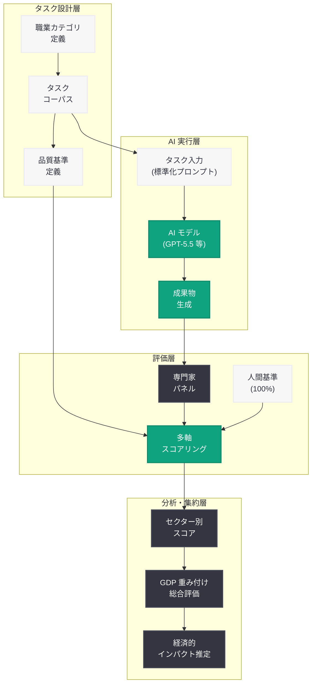
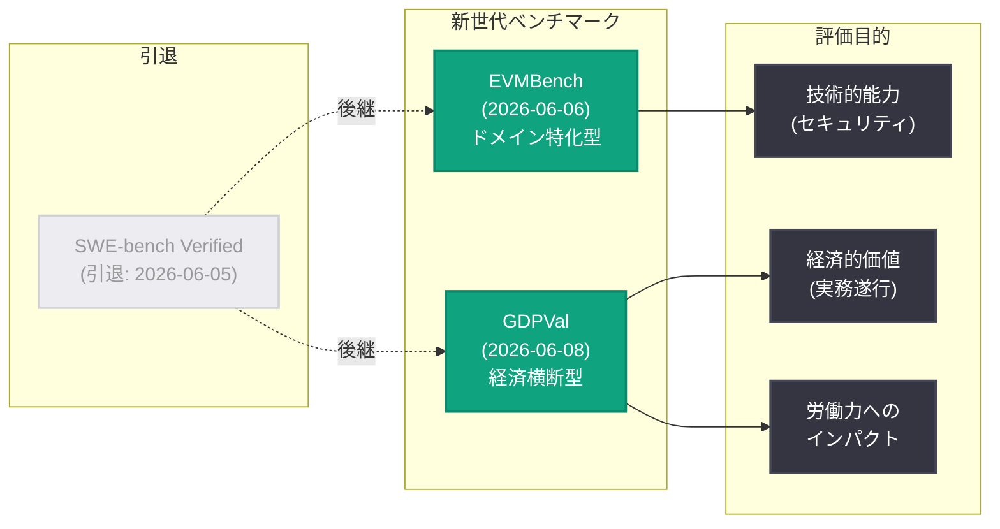
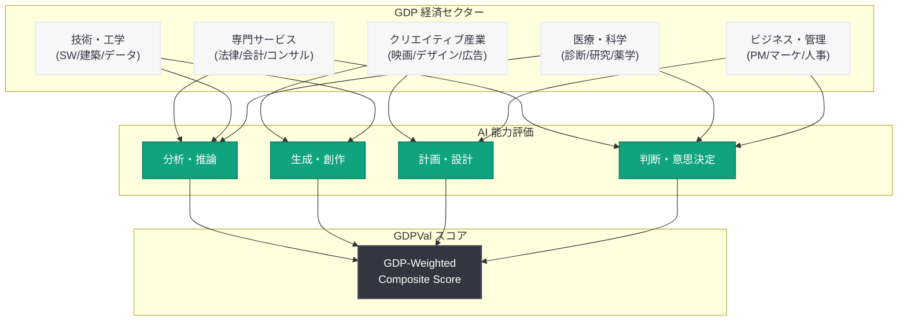

# GDPVal — AI の実世界パフォーマンスを測定する新ベンチマーク

## メタデータ

| 項目 | 内容 |
|------|------|
| 発表日 | 2026-06-08 |
| ソース | OpenAI Research |
| カテゴリ | 研究成果 |
| 公式リンク | [GDPVal](https://openai.com/index/gdpval/) |

> **注記:** 本レポートは OpenAI のサイトマップメタデータおよび公開情報に基づいて作成している。記事本文へのアクセスは Cloudflare の保護により制限されたため (HTTP 403)、URL スラッグ、公開日時、Research カテゴリへの分類、および OpenAI の最近の研究動向から内容を構成している。正確な詳細については公式ページを参照されたい。

## 概要

OpenAI は 2026 年 6 月 8 日、AI モデルの実世界における能力を測定する新しいベンチマーク「GDPVal」を発表した。GDPVal は「GDP (Gross Domestic Product: 国内総生産)」と「Validation / Value (検証 / 価値)」を組み合わせた名称であり、AI システムが弁護士、映画監督、その他の専門職の業務をどの程度再現できるかを評価するフレームワークである。

従来の学術的・合成的なベンチマーク (SWE-bench 等) が狭い技術的測定に留まっていたことへの反省から、GDPVal は GDP に貢献する幅広い職業カテゴリにおける AI の実務遂行能力を定量化する。これは OpenAI が 2026 年 6 月 5 日に SWE-bench Verified の評価を終了し、6 月 6 日に EVMBench を導入した流れの延長線上にある、ベンチマーク戦略の根本的な転換を象徴する研究成果である。

## 主な内容

### GDPVal の目的と設計思想

GDPVal は、AI が人類全体に利益をもたらすという OpenAI のミッションを定量的に検証するために設計されたベンチマークである。その核心的な問いは「AI は実際の経済活動においてどの程度の価値を生み出せるか」にある。

従来のベンチマークが抱えていた課題に対し、GDPVal は以下のアプローチで対応する。

| 従来のベンチマーク | GDPVal のアプローチ |
|-------------------|-------------------|
| 合成的・学術的タスク | 実世界の職業タスク |
| 狭い技術領域のみ測定 | GDP 構成セクター横断で測定 |
| 正解/不正解の二値評価 | 専門家の品質基準に基づく多段階評価 |
| ベンチマーク飽和が発生しやすい | 多様な職種により飽和しにくい構造 |
| モデル能力の技術的指標のみ | 経済的インパクトの予測に直結 |

### 評価対象の職業カテゴリ

GDPVal は GDP に貢献する多様な経済セクターの職業を対象とすると考えられる。以下は想定される評価カテゴリの例である。

**専門サービス:**
- 弁護士 (契約書作成、判例分析、法的助言)
- 会計士 (財務分析、税務申告、監査)
- コンサルタント (戦略立案、市場分析)

**クリエイティブ産業:**
- 映画監督 (脚本分析、演出計画、編集判断)
- グラフィックデザイナー (ブランディング、レイアウト)
- コピーライター (広告文、マーケティングコンテンツ)

**技術・工学:**
- ソフトウェアエンジニア (設計、実装、レビュー)
- 建築家 (設計、規制遵守、クライアント対応)
- データサイエンティスト (分析、モデリング、報告)

**医療・科学:**
- 医師 (診断、治療計画)
- 研究者 (文献調査、実験設計、論文執筆)
- 薬剤師 (処方確認、相互作用分析)

**ビジネス・管理:**
- プロジェクトマネージャー (計画、リスク管理)
- マーケティング担当者 (キャンペーン設計、分析)
- 人事担当者 (採用評価、制度設計)

### 評価方法論

GDPVal の方法論は、AI システムに実際の専門家が行う業務タスクを遂行させ、その出力品質を専門家基準で評価するものである。

1. **タスク設計:** 各職業の実務から代表的なタスクを抽出し、標準化された形式で提示する
2. **AI による遂行:** AI モデルがタスクを遂行し、成果物を生成する
3. **専門家評価:** 各分野の専門家が成果物を品質基準に基づいて評価する
4. **スコアリング:** 専門家のパフォーマンスを基準 (100%) として、AI の達成度を算出する

### SWE-bench Verified からの戦略転換

GDPVal の発表は、OpenAI のベンチマーク哲学の根本的な転換を示している。

**2026 年 6 月のベンチマーク戦略の変遷:**

| 日付 | イベント | 意義 |
|------|---------|------|
| 6 月 5 日 | SWE-bench Verified の評価終了 | 従来型ベンチマークの限界を認識 |
| 6 月 6 日 | EVMBench の導入 | ドメイン特化型評価への移行 |
| 6 月 8 日 | GDPVal の発表 | 経済全体への AI インパクト測定 |

SWE-bench Verified が「AI はバグを修正できるか」という狭い問いに答えるものであったのに対し、GDPVal は「AI は人間の仕事をどの程度代替・補完できるか」という本質的かつ社会的に重要な問いに正面から取り組む。

### 経済的影響の測定との接続

GDPVal という名称は、このベンチマークが単なる技術的評価を超えて、AI の経済的インパクトを推定するためのツールでもあることを示唆している。各職業セクターにおける AI の達成度を GDP 寄与度と組み合わせることで、以下のような分析が可能になると考えられる。

- AI による経済生産性向上の潜在的規模の推定
- 各産業セクターにおける AI 導入の成熟度の定量化
- 労働市場への影響予測のためのデータ基盤の構築
- AI 開発の投資対効果の客観的評価

## 技術的な詳細

### 評価パイプライン

GDPVal の評価パイプラインは以下のように構成されると推測される。

**1. タスクコーパスの構築:**
- 各職業カテゴリから代表的な業務タスクを収集
- 難易度レベル (ジュニア、ミドル、シニア、エキスパート) に分類
- 入力条件と期待される出力の品質基準を定義

**2. AI モデルによるタスク遂行:**
- 標準化されたプロンプト形式でタスクを AI モデルに提示
- モデルの出力 (テキスト、コード、分析結果等) を記録
- 複数回の試行による安定性の評価

**3. 品質評価:**
- 各分野の専門家パネルによる盲検評価
- 複数の評価軸 (正確性、完全性、専門性、実用性) でのスコアリング
- 人間の専門家パフォーマンスとの比較

**4. 経済セクターへのマッピング:**
- 職業カテゴリごとのスコアを経済セクターに集約
- GDP 寄与度による重み付けで総合スコアを算出

### 想定される評価指標

| 指標 | 説明 |
|------|------|
| Task Completion Rate | タスクを完遂できた割合 |
| Expert Equivalence Score | 専門家の出力品質を 100% とした場合の達成度 |
| Sector Coverage | 評価対象セクターのカバー率 |
| Difficulty Scaling | 難易度レベル別の達成度推移 |
| GDP-Weighted Score | GDP 寄与度で重み付けした総合スコア |
| Human-AI Gap | 人間の専門家との品質差 |

### 評価の技術的課題

GDPVal が直面すると考えられる技術的課題は以下の通りである。

**タスクの標準化:**
- 職業タスクの多様性を標準化されたフォーマットに落とし込む困難さ
- 暗黙知や経験に基づく判断の評価方法
- コンテキスト依存性の高いタスクの再現性確保

**評価の客観性:**
- 主観的な品質評価を定量化する方法論
- 評価者間の一致度 (Inter-rater reliability) の確保
- 文化・地域差による品質基準の変動への対応

**スケーラビリティ:**
- 数百の職業カテゴリを網羅的に評価するためのコスト
- 専門家パネルの確保と評価の時間的制約
- 継続的な更新 (職業内容の変化への追従)

## アーキテクチャ

### GDPVal 評価フレームワーク

### OpenAI ベンチマーク戦略の進化 (2026 年 6 月)

### GDPVal の経済セクターマッピング

## 開発者への影響

### AI プロダクト開発者

- **評価基準の拡張:** GDPVal は AI プロダクトの価値を技術的指標だけでなく、実世界の業務遂行能力で測定する新しい基準を提供する。プロダクトの競争力を主張する際に、GDPVal スコアが業界標準の指標となる可能性がある
- **ユースケース発見:** GDPVal の職業カテゴリ別スコアは、AI が最も価値を発揮できる領域の特定に活用できる。スコアが高いセクターは商業化の機会を示唆する
- **品質目標の設定:** 専門家の出力品質を基準とした客観的な品質目標を設定でき、プロダクト開発のマイルストーン管理に活用可能

### AI 研究者

- **能力の可視化:** GDPVal は AI モデルの能力プロファイルを職業カテゴリ別に可視化し、強みと弱みの特定を支援する
- **研究方向の決定:** スコアが低い領域は、研究投資の優先度を高めるべき分野として特定できる
- **ベンチマーク設計の参考:** 実世界タスクに基づくベンチマーク設計の方法論として、他の研究機関にも影響を与える可能性がある

### ビジネスリーダー・政策立案者

- **AI 投資判断:** GDPVal のスコアにより、自社の業務領域における AI の成熟度を客観的に評価し、導入判断の根拠とできる
- **労働市場への影響予測:** 各職業セクターにおける AI の達成度データは、労働力計画や再教育プログラムの設計に活用される
- **政策立案の基盤:** AI の経済的影響に関する客観的データが、規制や支援政策の策定に貢献する

### 注意事項

- 本レポート作成時点では記事本文にアクセスできていないため、具体的なタスク数、評価プロトコルの詳細、モデル別スコアは未確認である
- GDPVal のデータセットが公開されるか、論文が公開されるかは不明である
- 「専門家の業務を再現する」という方法論は、専門家の定義や業務範囲の変化に伴い、継続的な更新が必要となる

## 関連リンク

- [GDPVal (本件)](https://openai.com/index/gdpval/)
- [Why We No Longer Evaluate SWE-Bench Verified (2026-06-05)](https://openai.com/index/why-we-no-longer-evaluate-swe-bench-verified/)
- [Introducing EVMBench (2026-06-06)](https://openai.com/index/introducing-evmbench/)
- [Horizon 1000 (2026-06-06)](https://openai.com/index/horizon-1000/)
- [How Countries Can End Capability Overhang (2026-06-06)](https://openai.com/index/how-countries-can-end-capability-overhang/)
- [OpenAI Research](https://openai.com/research)

## まとめ

GDPVal は、OpenAI が AI の能力評価を根本から再定義する試みとして発表した画期的なベンチマークである。従来のベンチマークが特定の技術的タスク (コード生成、数学的推論等) に限定されていたのに対し、GDPVal は GDP に貢献する幅広い経済セクターの職業タスクを対象とし、AI が実世界で人間の専門家の業務をどの程度遂行できるかを包括的に測定する。

この研究には 3 つの重要な意義がある。第一に、SWE-bench Verified の引退 (6 月 5 日) と EVMBench の導入 (6 月 6 日) に続く第三のステップとして、OpenAI のベンチマーク戦略が「狭い技術測定」から「実世界の経済的価値の測定」へと明確に転換したことを示している。第二に、「AI は人類全体に利益をもたらすべきである」という OpenAI のミッションを、経済生産性という観点から客観的に検証するためのフレームワークを提供している。第三に、AI の労働市場への影響に関する議論に、推測ではなくデータに基づく根拠を提供する基盤となる。

GDPVal は、AI 開発者にとってはプロダクトの価値を客観的に測定する指標として、研究者にとっては能力の強みと弱みを特定するツールとして、政策立案者にとっては AI の社会経済的インパクトを予測するためのデータ基盤として、それぞれ活用されることが期待される。
