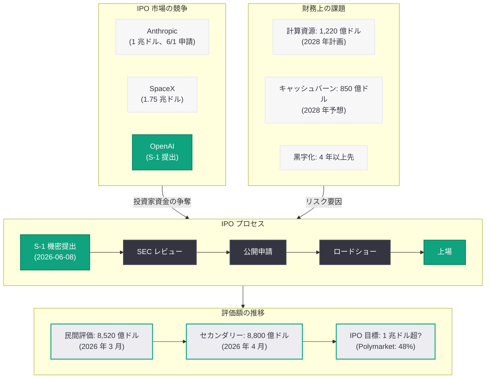

# OpenAI、SEC に S-1 を機密提出 — IPO に向けた第一歩

## メタデータ

| 項目 | 内容 |
|------|------|
| 発表日 | 2026-06-08 |
| ソース | OpenAI News |
| カテゴリ | 企業ニュース |
| 公式リンク | https://openai.com/index/openai-submits-confidential-s-1/ |

## 概要

OpenAI は 2026 年 6 月 8 日、新規株式公開 (IPO) に向けた登録届出書 (S-1) の草案を米国証券取引委員会 (SEC) に機密提出したことを発表した。直近の民間評価額は 8,520 億ドル (2026 年 3 月末の 1,220 億ドル規模の資金調達ラウンドにおけるポストマネーバリュエーション) に達しており、セカンダリーマーケットでは 2026 年 4 月時点で約 8,800 億ドルの評価を受けている。Washington Post が「1 兆ドル規模のデビューが見込まれる」と報じるなど、史上最大級のテクノロジー IPO となる可能性が注目されている。

ただし OpenAI は具体的なタイムラインにはコミットしておらず、「タイミングはまだ決定していない。非公開企業のほうが取り組みやすいことがあるため、しばらく時間がかかるかもしれない」と述べている。

## 主な内容

### S-1 機密提出の意義

S-1 の機密提出は、IPO プロセスにおける正式な第一歩である。機密提出により、OpenAI は SEC のレビューを受けながらも財務情報を一般に公開する時期を柔軟にコントロールできる。これは近年のテクノロジー企業 IPO で一般的な手法となっている。

### 評価額と市場環境

OpenAI の評価額に関する主要データポイントは以下の通りである。

- **直近の民間評価額:** 8,520 億ドル (2026 年 3 月末の 1,220 億ドル資金調達ラウンドにおけるポストマネー)
- **セカンダリーマーケット評価:** 約 8,800 億ドル (2026 年 4 月時点、Forge Global 上)
- **Polymarket 予測:** IPO 時の時価総額が 1.5 兆ドルを超える確率は 48%
- **競合状況:** Anthropic がセカンダリーマーケットで 1 兆ドルに到達し、OpenAI を一時上回る場面も

### 財務上の課題

OpenAI の IPO には巨額の資金需要という課題が伴う。

- **2028 年の計算資源支出:** 約 1,220 億ドルの支出を計画
- **2028 年の予想キャッシュバーン:** 売上が倍増しても 850 億ドルのキャッシュバーン
- **黒字化の見通し:** 少なくとも今後 4 年間は支出が収入を上回る見込み
- **CFO の懸念:** Sarah Friar CFO が大規模データセンター支出の持続可能性について懸念を表明

### 競争環境と IPO 市場

OpenAI の IPO は、激化する AI 企業間競争と IPO 市場の動向の中で進められている。

- **Anthropic の先行:** Anthropic が約 1 週間前 (2026 年 6 月 1 日) に上場申請を行っており、投資家の資金を巡る競争が存在
- **SpaceX との資金争奪:** SpaceX が 1.75 兆ドルの評価額で IPO を計画しており、機関投資家の配分を巡る競合が想定される
- **史上最大級の IPO:** 複数のメディアが「史上最大級のテクノロジー IPO になる可能性がある」と報じている

### OpenAI の慎重な姿勢

OpenAI は S-1 を提出しながらも、即座の上場を約束していない。

> "We have not decided on timing yet; it may be a while because there are things we want to do that are likely easier as a private company."

この発言は、営利法人への完全転換、ガバナンス構造の整備、巨額の設備投資の実行など、非公開企業としてのほうが柔軟に対応できる事項が残っていることを示唆している。

## アーキテクチャ

## 開発者への影響

OpenAI の IPO プロセスは、API を利用する開発者にとって以下のような影響が想定される。

- **サービスの安定性:** 上場企業としての透明性と説明責任が強化されることで、API サービスの長期的な安定性と予測可能性が向上する可能性がある
- **料金体系の変化:** 黒字化への圧力が高まることで、API 料金の値上げや無料枠の縮小が行われる可能性がある。少なくとも 4 年間はキャッシュバーンが続く見通しであり、収益化の加速が求められる
- **投資の加速:** IPO による資金調達が成功すれば、計算資源への大規模投資 (2028 年に 1,220 億ドル) が実現し、モデル性能の向上やインフラの拡充につながる
- **競争の激化:** Anthropic の同時期の上場申請により、AI 企業間の競争が一層激化し、開発者にとっては選択肢の拡大とサービス改善が期待される
- **ガバナンスの変化:** 公開企業としての四半期開示により、OpenAI の技術投資や研究方針に関する情報が定期的に公開される

## 関連リンク

- [OpenAI 公式発表](https://openai.com/index/openai-submits-confidential-s-1/)
- [OpenAI News](https://openai.com/news)
- [SEC EDGAR](https://www.sec.gov/cgi-bin/browse-edgar?action=getcompany&company=openai)
- [Forge Global セカンダリーマーケット](https://forgeglobal.com/)
- [Polymarket](https://polymarket.com/)

## まとめ

OpenAI の S-1 機密提出は、AI 業界における歴史的な転換点となりうる出来事である。直近の民間評価額 8,520 億ドル、セカンダリーマーケットでの 8,800 億ドル評価を背景に、1 兆ドル超のデビューが期待されている。しかし、2028 年に 1,220 億ドルの計算資源支出を計画し、少なくとも 4 年間は黒字化が見込めないという財務上の課題は、公開市場の投資家にとって重大な検討事項となる。Anthropic の先行上場申請 (6 月 1 日) や SpaceX IPO (1.75 兆ドル) との投資家資金争奪戦も、OpenAI のタイミング判断に影響を与えるだろう。OpenAI 自身が「非公開企業のほうが取り組みやすいことがある」と述べている通り、S-1 提出はあくまで第一歩であり、実際の上場までには相当の時間を要する可能性がある。それでもなお、この動きは AI 産業の成熟と、巨額の資本市場へのアクセスが AI 開発競争の勝敗を左右する時代の到来を象徴している。
