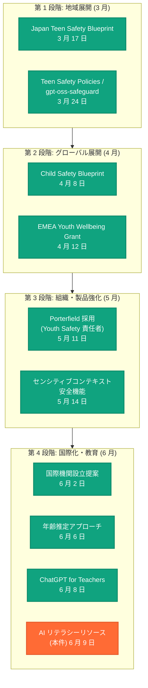

# AI リテラシーリソース — ティーン・保護者向けガイドの公開

## メタデータ

| 項目 | 内容 |
|------|------|
| 発表日 | 2026-06-09 |
| ソース | OpenAI News |
| カテゴリ | 安全性 |
| 公式リンク | [AI Literacy Resources for Teens and Parents](https://openai.com/index/ai-literacy-resources-for-teens-and-parents/) |

> **注記:** 本レポートは、OpenAI の公開情報および 2026 年を通じて展開された一連の青少年安全施策の文脈に基づいて作成されている。記事全文はアクセス制限 (HTTP 403) により直接取得できなかったため、公開概要と関連情報を基に構成している。正確な詳細については公式ページを参照されたい。

## 概要

OpenAI は 2026 年 6 月 9 日、ティーンエイジャー (13-17 歳) およびその保護者を対象とした AI リテラシーリソースを公開した。本リソースは、AI 技術が若年層の日常生活に急速に浸透する中、安全かつ責任ある AI の利用を促進するための教育ガイドとして設計されている。

本発表は、OpenAI が 2026 年前半から体系的に構築してきた青少年安全戦略の教育面での具体的成果物であり、技術的セーフガード (年齢推定、コンテンツフィルタリング) と政策的枠組み (Child Safety Blueprint、国際機関設立提案) を補完する、ユーザー教育という第三の柱を強化するものである。前日 (6 月 8 日) に発表された「ChatGPT for Teachers」と合わせ、AI 教育エコシステムの包括的整備が進んでいることを示している。

## 主な内容

### AI リテラシーリソースの構成

OpenAI が公開した AI リテラシーリソースは、ティーンと保護者それぞれの視点に合わせたガイダンスを提供するものである。

**ティーン向けリソース (想定される内容):**

| トピック | 内容 | 目的 |
|---------|------|------|
| AI の仕組み | 大規模言語モデルの基本原理、ChatGPT の動作メカニズム | 技術への正しい理解を促進 |
| 責任ある利用 | ChatGPT の適切な活用方法、学業での使い方のガイドライン | 倫理的な利用習慣の形成 |
| プライバシー保護 | 個人情報を AI に共有するリスク、データの取り扱い | 自己情報の保護意識の醸成 |
| 批判的思考 | AI 出力の正確性の検証方法、ハルシネーションの理解 | AI への過信を防止 |
| AI 生成コンテンツの識別 | AI が作成したテキスト・画像の見分け方 | 情報リテラシーの強化 |

**保護者向けリソース (想定される内容):**

| トピック | 内容 | 目的 |
|---------|------|------|
| AI の基礎知識 | ChatGPT とは何か、子どもがどのように使っているか | 世代間の知識ギャップの解消 |
| 家庭での対話ガイド | AI について子どもと話し合うための具体的な質問例 | 建設的な親子対話の促進 |
| リスクと対策 | 想定されるリスクシナリオと対処法 | 保護者としての適切な関与 |
| 設定と管理 | 年齢制限機能、ファミリー設定の活用方法 | 技術的な保護手段の理解 |
| デジタルウェルビーイング | 利用時間の目安、健全な AI 利用の習慣形成 | バランスの取れた利用の促進 |

### OpenAI の包括的青少年安全戦略における位置づけ

本リソースは、OpenAI が 2026 年に段階的に展開してきた青少年安全施策の一環であり、教育・啓発の領域を担う重要な取り組みである。

**2026 年青少年安全施策タイムライン:**

### 教育リソースの設計原則

AI リテラシーリソースは、以下の設計原則に基づいて構成されていると考えられる。

**年齢に応じた段階的アプローチ:**

- **13-14 歳向け:** AI の基本概念、安全な利用の基礎、個人情報を共有しないルール
- **15-17 歳向け:** より深い技術理解、学術的利用のベストプラクティス、AI 倫理の概念
- **保護者向け:** 子どもの発達段階に応じた関与の方法、技術的な管理ツールの活用

**多言語・多文化対応:**

OpenAI は Japan Teen Safety Blueprint (3 月 17 日) を皮切りに地域特化型の施策を展開してきた経緯から、本リソースも英語のみならず複数言語での提供が想定される。日本語版についても、既存の日本向け施策との整合性を保ちつつ提供される可能性が高い。

### 社会的背景と訴訟対応

本リソースの公開は、OpenAI が直面する社会的・法的課題への対応としても重要な意味を持つ。

**法的環境:**

| 日付 | 事案 | 内容 |
|------|------|------|
| 2026 年 5 月 3 日 | 7 家族による集団訴訟 | AI による子どもへの有害な影響を主張 |
| 2026 年 5 月 14 日 | 不法行為訴訟 | AI との対話に関連する深刻な事案 |

これらの訴訟は、AI 企業が未成年者の安全に対して十分な措置を講じていないとする主張に基づいている。AI リテラシーリソースの公開は、OpenAI がユーザー教育を通じて積極的にリスク軽減に取り組んでいることを示す具体的な証拠となる。

**IPO に向けた信頼構築:**

OpenAI は 2026 年 6 月 8 日に S-1 の非公開申請を行っており、上場に向けた準備を進めている。青少年安全に対する包括的な取り組みは、規制リスクの軽減と社会的責任の遂行を投資家に示すものであり、企業価値の向上に直結する。

## 開発者への影響

本リソースは直接的に API 仕様を変更するものではないが、開発者に以下の間接的な影響をもたらす。

- **ユーザー教育の設計指針:** AI リテラシーリソースの構成は、開発者が自社プロダクトにおけるユーザーオンボーディングやヘルプ資料を設計する際のベストプラクティスとなる
- **年齢確認フローの強化:** リソースの公開に伴い、API レベルでの年齢関連機能 (年齢推定、ファミリー設定 API) の拡充が予想される
- **教育向け API の充実:** 前日発表の「ChatGPT for Teachers」と連動し、教育現場向けの API 機能や SDK が今後提供される可能性がある
- **コンプライアンス要件の参照:** AI リテラシーリソースで示されるガイドラインは、サードパーティ開発者が青少年向けアプリケーションを構築する際の事実上の基準となる可能性がある
- **gpt-oss-safeguard との連携:** 開発者向けセーフティツール gpt-oss-safeguard (3 月 24 日公開) と組み合わせることで、アプリ内に AI リテラシー教育コンテンツを統合する方法が標準化される見通し

## 関連リンク

- [AI Literacy Resources for Teens and Parents (本件)](https://openai.com/index/ai-literacy-resources-for-teens-and-parents/)
- [ChatGPT for Teachers (2026-06-08)](https://openai.com/index/chatgpt-for-teachers/)
- [Our Approach to Age Prediction (2026-06-06)](https://openai.com/index/our-approach-to-age-prediction/)
- [Advancing Youth Safety Global Leadership (2026-06-02)](https://openai.com/index/advancing-youth-safety-and-opportunity-through-global-leadership)
- [ChatGPT Sensitive Context Safety (2026-05-14)](https://openai.com/index/chatgpt-sensitive-context-safety)
- [OpenAI Hires Porterfield for Youth Safety (2026-05-11)](https://openai.com/index/openai-hires-porterfield-youth-safety)
- [EMEA Youth and Wellbeing Grant (2026-04-12)](https://openai.com/index/emea-youth-wellbeing-grant)
- [Introducing Child Safety Blueprint (2026-04-08)](https://openai.com/index/introducing-child-safety-blueprint)
- [Teen Safety Policies / gpt-oss-safeguard (2026-03-24)](https://openai.com/index/teen-safety-policies-gpt-oss-safeguard)
- [Japan Teen Safety Blueprint (2026-03-17)](https://openai.com/index/japan-teen-safety-blueprint)

## まとめ

OpenAI が 2026 年 6 月 9 日に公開した AI リテラシーリソースは、ティーンエイジャーとその保護者が AI を安全かつ効果的に活用するための教育ガイドである。AI の仕組みの理解、責任ある利用方法、プライバシー保護、批判的思考、AI 生成コンテンツの識別といった重要トピックを網羅し、年齢と立場に応じた実践的なガイダンスを提供する。

本リソースは、2026 年 3 月の Japan Teen Safety Blueprint から始まった OpenAI の包括的青少年安全戦略における教育・啓発の柱を強化するものであり、技術的セーフガード (年齢推定、コンテンツフィルタリング)、政策的枠組み (Child Safety Blueprint、国際機関設立提案)、組織強化 (Youth Safety 専任責任者の採用) と並ぶ第四の柱として位置づけられる。

前日の「ChatGPT for Teachers」と合わせ、OpenAI は AI 教育エコシステムの包括的整備を進めており、訴訟リスクへの対応と IPO に向けた社会的信頼の構築を同時に推進している。AI が若年層の学習・生活に深く組み込まれる時代において、技術的な保護だけでなく、ユーザー自身のリテラシー向上を通じた自律的な安全確保を目指すアプローチは、業界全体にとっての模範となるだろう。
