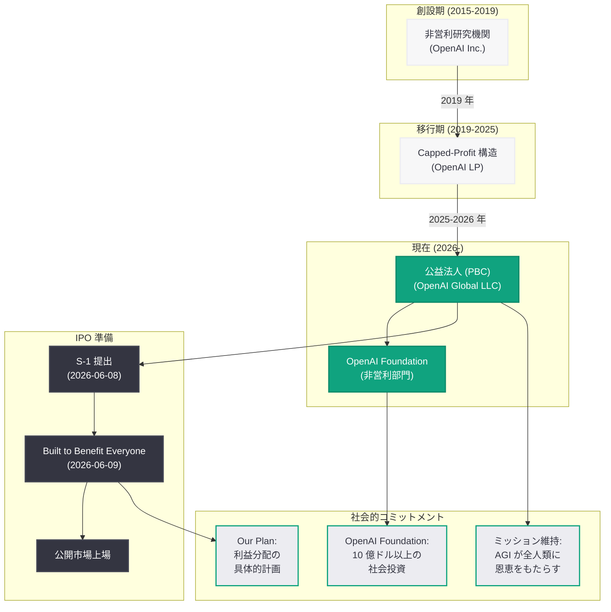

# OpenAI「Built to Benefit Everyone」— 全人類への利益を目指す企業方針

## メタデータ

| 項目 | 内容 |
|------|------|
| 発表日 | 2026-06-09 |
| ソース | OpenAI News |
| カテゴリ | 企業方針 |
| 公式リンク | [Built to Benefit Everyone](https://openai.com/index/built-to-benefit-everyone/) |

> **注記:** 本レポートは OpenAI 公式ブログの公開情報、関連する公式発表 (OpenAI Foundation アップデート、非営利委員会レポート等)、および複数の報道機関の報道に基づいて作成されている。元記事の全文はアクセス制限により取得できなかったため、公開されている情報と文脈に基づく内容となっている。正確な詳細については公式ページを参照されたい。

## 概要

2026 年 6 月 9 日、OpenAI は公式ブログにて「Built to Benefit Everyone (全員に恩恵をもたらすよう設計されている)」と題した記事を公開した。本記事は、OpenAI が非営利研究機関から公益法人 (Public Benefit Corporation: PBC) への企業構造転換を経て、IPO (新規株式公開) に向かう中で、自社のミッションと企業方針を改めて明確に示すものである。

公開の前日である 6 月 8 日に OpenAI が機密の S-1 (上場申請書) を SEC に提出したことを踏まえると、本記事は IPO に向けたナラティブ構築の一環として位置づけられる。OpenAI の創設以来の使命である「汎用人工知能 (AGI) が全人類に恩恵をもたらすことを確実にする」という理念が、営利企業としての成長と矛盾しないことを投資家・社会・規制当局に対して説明する狙いがあると考えられる。

また、同時に公開されたコンパニオンページ「Built to Benefit Everyone — Our Plan」(https://openai.com/index/built-to-benefit-everyone-our-plan/) では、利益分配に関する具体的なコミットメントが示されていると見られる。

## 主な内容

### 背景: 非営利から営利への転換

OpenAI は 2015 年に非営利の AI 研究機関として設立された。その後、2019 年に「capped-profit」構造を導入し、2025 年から 2026 年にかけて PBC (公益法人) への完全な転換を進めてきた。この過程で以下の重要なマイルストーンがあった。

| 時期 | 出来事 |
|------|--------|
| 2015 年 | OpenAI を非営利 AI 研究機関として設立 |
| 2019 年 | Capped-profit 構造の導入 |
| 2024 年 | 非営利から営利への転換検討が本格化 |
| 2025 年 | 企業構造転換の正式発表 |
| 2026 年 3 月 | OpenAI Foundation のアップデート (10 億ドル以上の社会投資計画) |
| 2026 年 4 月 | 非営利委員会レポートの公開 |
| 2026 年 5 月 | Musk 対 OpenAI 裁判の結審 |
| 2026 年 6 月 8 日 | 機密 S-1 の SEC への提出 |
| 2026 年 6 月 9 日 | 「Built to Benefit Everyone」公開 |

### ミッションの再確認

OpenAI の公式ミッションは「to ensure that artificial general intelligence benefits all of humanity (汎用人工知能が全人類に恩恵をもたらすことを確実にする)」である。本記事は、PBC への転換と IPO を控える中でもこのミッションが企業活動の中心に据えられていることを強調するものと見られる。

PBC (公益法人) という法人格は、株主利益の最大化のみならず、公共の利益を企業の意思決定に反映することを法的に義務づけるものであり、OpenAI のミッション維持と商業的成長の両立を制度的に担保する仕組みとして選択されたものである。

### S-1 提出と IPO 準備の文脈

OpenAI が 6 月 8 日に機密の S-1 を SEC に提出したことは、IPO プロセスが実質的に開始されたことを意味する。S-1 は企業の財務状況、事業モデル、リスク要因、ガバナンス構造等を詳細に開示する文書であり、通常は公開審査を経て IPO に至る。

本記事「Built to Benefit Everyone」は、S-1 提出の翌日というタイミングで公開されており、以下の目的が推測される。

- **投資家向け:** PBC としての社会的ミッションが長期的な企業価値と矛盾しないことの説明
- **規制当局向け:** 非営利から営利への転換が公共の利益を損なわないことの保証
- **社会全般向け:** AI の恩恵を広く分配するための具体的な計画の提示
- **従業員向け:** 企業のミッションが IPO 後も変わらないことの確認

### コンパニオンページ「Our Plan」

同時に公開された「Built to Benefit Everyone — Our Plan」(https://openai.com/index/built-to-benefit-everyone-our-plan/) は、利益分配や社会還元に関する具体的なコミットメントを示すページと考えられる。これは 2026 年 3 月に発表された OpenAI Foundation の 10 億ドル以上の社会投資計画や、トランプ政権との間で議論されている公共富裕基金 (Public Wealth Fund) 構想とも関連するものと推測される。

### 法的環境の変化

本記事の公開は、OpenAI を取り巻く法的環境が安定化しつつあるタイミングでもある。

- **Musk 対 OpenAI 裁判:** 2026 年 4 月から 5 月にかけて行われた裁判は 5 月に結審し、Musk 側の主要な請求 (詐欺請求) は裁判中に取り下げられた。この裁判は OpenAI の非営利から営利への転換の正当性が争われた象徴的な事件であった
- **非営利委員会レポート:** 2026 年 4 月に公開された独立委員会のレポートは、OpenAI の構造転換に関する審査結果を示したものと見られる

## アーキテクチャ

### OpenAI の企業構造転換の全体像

## 開発者への影響

「Built to Benefit Everyone」は直接的な API 変更を伴うものではないが、OpenAI の IPO と PBC 化が開発者エコシステムに及ぼす影響は以下の通りである。

### プラットフォームの安定性と成長

- **資本調達の加速:** IPO による資金調達は、API インフラの拡充、新モデルの開発、コンピュートリソースの拡大を加速させる。開発者にとってはサービスの安定性向上とレイテンシ改善が期待できる
- **長期的なプラットフォームコミットメント:** PBC としてのミッション維持が法的に義務づけられることで、短期的な利益追求によるプラットフォーム方針の急変リスクが軽減される

### 料金とアクセス

- **公共利益の考慮:** PBC として公共利益を意思決定に反映する義務があることから、API 料金の設定において教育機関や非営利団体向けの優遇措置が維持・拡大される可能性がある
- **グローバルアクセスの拡大:** ミッションとして「全人類への恩恵」を掲げることから、新興国市場への API 提供拡大やローカライゼーションの強化が期待される

### ガバナンスと透明性

- **上場企業としての情報開示:** IPO 後は四半期ごとの財務報告や年次報告書の公開が義務づけられ、プラットフォームの方向性に関する透明性が高まる
- **モデル安全性への投資継続:** PBC の枠組みの中で AI 安全性研究への投資が継続されることで、開発者が構築するアプリケーションの信頼性基盤が維持される

### 推奨アクション

- OpenAI の IPO 関連文書 (S-1 の公開版) が利用可能になった際には、プラットフォーム戦略やリスク要因のセクションを確認する
- 「Our Plan」ページで示される具体的なコミットメントの中に、開発者向けの施策 (API クレジット、教育プログラム等) が含まれるかを注視する
- IPO 後のガバナンス変更がサービス利用規約や API ポリシーに影響する可能性を考慮し、重要な変更通知の受信設定を確認する

## 関連リンク

- [Built to Benefit Everyone - OpenAI](https://openai.com/index/built-to-benefit-everyone/)
- [Built to Benefit Everyone — Our Plan - OpenAI](https://openai.com/index/built-to-benefit-everyone-our-plan/)
- [Update on the OpenAI Foundation - OpenAI](https://openai.com/index/update-on-the-openai-foundation)
- [OpenAI News](https://openai.com/news)
- [OpenAI About](https://openai.com/about)

## まとめ

OpenAI が S-1 提出の翌日に公開した「Built to Benefit Everyone」は、非営利研究機関から PBC への転換と IPO を控える中で、「AGI が全人類に恩恵をもたらす」という創設以来のミッションを改めて宣言する企業方針文書である。主要なポイントは以下の通り。

1. **IPO ナラティブの構築:** S-1 の機密提出 (6 月 8 日) の翌日に公開されたタイミングから、投資家・規制当局・社会に対してミッション維持を示す IPO 準備の一環である
2. **PBC としての法的枠組み:** 公益法人格の採用により、株主利益と公共利益のバランスを制度的に担保する仕組みを構築している
3. **具体的な計画の提示:** コンパニオンページ「Our Plan」を通じて、利益分配や社会還元に関する具体的なコミットメントを示している
4. **法的環境の安定化:** Musk 裁判の結審、非営利委員会レポートの公開を経て、企業構造転換に対する法的な不確実性が低減した状態での発表である
5. **OpenAI Foundation との連携:** 2026 年 3 月に発表された 10 億ドル以上の社会投資計画と合わせて、非営利活動を Foundation が継続する体制が整備されている

本記事は OpenAI の歴史における重要な転換点を象徴するものであり、AI 産業全体における「商業的成功と社会的責任の両立」というテーマに対する 1 つの回答を示している。IPO 後の具体的な施策や、「Our Plan」で示されるコミットメントの実行状況を継続的に注視する必要がある。
