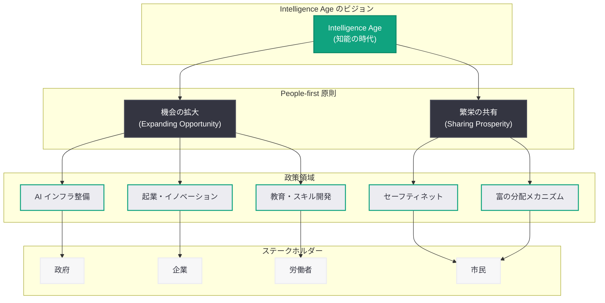
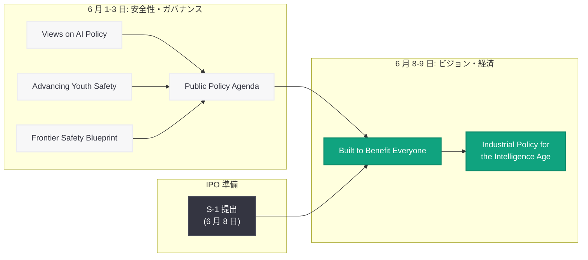

# OpenAI「Intelligence Age の産業政策」-- 人間中心の AI 時代における経済政策ビジョンを提示

## メタデータ

| 項目 | 内容 |
|------|------|
| 発表日 | 2026-06-09 |
| ソース | OpenAI News |
| カテゴリ | 政策提言 |
| 公式リンク | [Industrial policy for the Intelligence Age](https://openai.com/index/industrial-policy-for-the-intelligence-age) |

> **注記:** 本レポートは OpenAI 公式ブログの公開情報、同時期に発表された一連の政策提言文書、および関連する報道に基づいて作成している。元記事の全文は Cloudflare によるアクセス保護のため取得できなかったため、公開されている情報と文脈に基づく内容となっている。正確な詳細については公式ページを参照されたい。

## 概要

2026 年 6 月 9 日、OpenAI は公式ブログにて「Industrial policy for the Intelligence Age (Intelligence Age のための産業政策)」と題した政策提言記事を公開した。本記事は、AI がもたらす新しい経済時代 -- OpenAI が「Intelligence Age (知能の時代)」と呼ぶ時代 -- において、各国政府がどのような産業政策を採るべきかについてのビジョンを示す思想的リーダーシップ文書 (thought leadership piece) である。

記事の核心は「People-first (人間中心)」のアプローチにあり、AI による経済的恩恵を一部の企業や富裕層に集中させるのではなく、機会の拡大 (expanding opportunity) と繁栄の共有 (sharing prosperity) を通じて社会全体に分配するための具体的な政策アイデアを提案している。

本記事は、2026 年 6 月初旬から OpenAI が展開してきた政策提言シリーズの一環であり、同社の IPO 準備とも密接に関連する戦略的コミュニケーションの一部として位置づけられる。

## 主な内容

### 「Intelligence Age」とは何か

OpenAI が提唱する「Intelligence Age」は、AI の能力が人間社会のあらゆる領域に浸透し、経済構造そのものが根本的に変容する時代を指す概念である。Sam Altman CEO は 2024 年に同名のブログ記事を公開しており、以下のような特徴を持つ時代として描かれている。

- **知的労働の自動化:** これまで人間にしかできなかった知的作業が AI によって効率化・代替される
- **生産性の飛躍的向上:** AI ツールの活用により、個人や組織の生産性が桁違いに向上する
- **新たな産業の創出:** AI を基盤とした全く新しいビジネスモデルや産業が生まれる
- **富の集中リスク:** 技術を持つ企業や個人に富が集中する傾向が加速する可能性がある

この時代においては、産業革命期と同様に、技術進歩の恩恵をいかに広く分配するかが政策上の最重要課題となる。本記事はその課題に対する OpenAI なりの回答を提示するものである。

### People-first アプローチ: 人間中心の経済政策

「People-first (人間中心)」の産業政策とは、技術や企業の成長を目的とするのではなく、人々の生活向上と機会の拡大を最優先とする政策設計思想である。具体的には以下の原則が想定される。

| 原則 | 内容 |
|------|------|
| 包摂性 | AI の恩恵が地域・年齢・所得水準を問わず全ての人に届くこと |
| アクセシビリティ | AI ツールや教育へのアクセスが広く開かれていること |
| セーフティネット | AI による経済的変化の影響を受ける人々への支援が充実していること |
| 参加 | 政策決定プロセスに市民の声が反映されること |
| 持続可能性 | 短期的な経済成長だけでなく長期的な社会の安定を重視すること |

これは従来の産業政策が「どの産業を育成するか」「どの企業に投資するか」という供給側の論理に偏りがちであったのに対し、「人々の生活がどう良くなるか」「誰が取り残されるリスクがあるか」という需要側・社会側の視点を中心に据えるアプローチである。

### 機会の拡大 (Expanding Opportunity)

AI 時代における機会の拡大は、以下の複数の次元で構想されていると考えられる。

**教育とスキル開発:**

- AI リテラシー教育の全国的な普及
- 職業訓練プログラムへの AI カリキュラムの統合
- 生涯学習を支援するための公的投資の拡大
- AI ツールを活用した個別最適化学習の推進

**起業とイノベーション:**

- AI を活用した中小企業の生産性向上支援
- スタートアップエコシステムへの AI 基盤技術の民主化
- 地方部におけるデジタルインフラの整備
- AI 研究開発への公的資金投入の増額

**雇用の質の向上:**

- AI による単純作業の自動化を受けた高付加価値労働へのシフト支援
- 労働者が AI ツールを活用するためのスキルアップ機会の提供
- 新しい職種の創出を促進するための規制緩和
- AI と人間の協働モデルの研究と実践

### 繁栄の共有 (Sharing Prosperity)

AI 時代における富の分配は、本記事の最も重要なテーマの一つと考えられる。技術進歩がもたらす富が一部に集中することを防ぎ、社会全体で繁栄を共有するための仕組みとして、以下のような政策方向性が想定される。

**富の分配メカニズム:**

- AI 企業の利益の一部を社会に還元する仕組みの構築
- 公共富裕基金 (Public Wealth Fund) のような新たな制度の検討
- AI がもたらす生産性向上の果実を労働者に還元するための仕組み
- ユニバーサルベーシックインカム (UBI) や類似の所得保障制度の検討

**インフラとしての AI:**

- AI を公共インフラとして位置付け、広くアクセス可能にする
- 医療、教育、行政サービスにおける AI 活用による公共サービスの質の向上
- デジタルデバイドの解消に向けた政策的介入
- AI の恩恵を受けられない地域・コミュニティへの重点投資

### OpenAI の一連の政策提言における位置づけ

本記事は、2026 年 6 月初旬から OpenAI が展開してきた政策提言シリーズの中で、経済政策に特化した位置づけを持つ。

| 日付 | 文書 | 焦点 |
|------|------|------|
| 2026-06-01 | Views on AI Policy | AI 政策全般に関する基本的見解 |
| 2026-06-02 | Advancing Youth Safety | 青少年の安全性保護 |
| 2026-06-03 | Public Policy Agenda | 4 本柱の包括的政策提言 |
| 2026-06-03 | Frontier Safety Blueprint | 民主的ガバナンスの制度設計 |
| 2026-06-08 | Built to Benefit Everyone | 企業ミッションの再確認 |
| **2026-06-09** | **Industrial Policy for the Intelligence Age** | **AI 時代の経済・産業政策** |

この時系列を見ると、OpenAI は安全性・ガバナンス (6 月 1-3 日) から企業ミッション (6 月 8 日) へ、そして経済政策ビジョン (6 月 9 日) へと段階的にテーマを広げていることがわかる。最終的に「Intelligence Age の産業政策」という包括的なビジョンに到達することで、AI が社会にもたらす変化の全体像を描き出そうとしている。

### IPO 準備との関連性

本記事の公開は、OpenAI が 2026 年 6 月 8 日に機密 S-1 を SEC に提出した翌日というタイミングであり、IPO 戦略との関連性は明白である。

**投資家へのメッセージ:**

- AI 産業の成長ポテンシャルが社会全体の繁栄につながることを示すことで、AI への公的投資と規制環境の安定化を促進し、長期的な事業環境の予見可能性を高める
- 「人間中心」の産業政策を主張することで、OpenAI が単なる利益追求企業ではなく、社会的使命を持つ PBC (公益法人) としての正統性を強調する

**規制当局へのメッセージ:**

- AI 企業として積極的に規制の枠組み作りに貢献する姿勢を示すことで、過度に制限的な規制の回避を図る
- 産業政策の設計パートナーとして自らを位置づけ、政策議論における影響力を確保する

**社会へのメッセージ:**

- AI の恩恵を広く分配するという約束は、AI に対する社会不安を緩和し、技術発展への支持を得るためのコミュニケーションである
- 「繁栄の共有」というテーマは、AI による雇用喪失や格差拡大への懸念に直接応えるものである

### 政府および企業への含意

**政府に対する提言:**

本記事は、各国政府が AI 時代の産業政策を設計する際の指針を示すものであり、以下の政策分野への影響が想定される。

1. **産業育成政策の再設計:** 従来の特定産業支援型から、人材育成・インフラ整備・機会創出型への転換
2. **社会保障制度の見直し:** AI による雇用構造の変化に対応した新たなセーフティネットの設計
3. **税制の再検討:** AI がもたらす富の集中に対応した課税の仕組みの検討
4. **国際協力の枠組み:** AI 産業政策に関する国際的な調整メカニズムの構築
5. **公共投資の優先順位:** AI インフラ、教育、研究開発への投資配分の見直し

**企業に対する含意:**

- AI 企業は技術開発だけでなく、社会的インパクトの説明責任を負う方向に向かう
- 「人間中心」の価値観に沿った製品・サービス設計が競争優位性となる
- 政府との対話・協力関係の構築が事業戦略上の重要事項となる
- ESG (環境・社会・ガバナンス) の文脈で AI の社会的貢献が評価される時代になる

## アーキテクチャ

### Intelligence Age の産業政策フレームワーク

### OpenAI の政策提言シリーズ全体像

## 開発者への影響

本記事は直接的な API 変更や技術的アップデートを伴うものではないが、OpenAI が示す産業政策ビジョンは中長期的に開発者エコシステムに以下の影響を与える可能性がある。

### AI アクセスの民主化

- **API 料金政策への影響:** 「機会の拡大」の理念に基づき、教育機関、非営利団体、中小企業向けの優遇料金やクレジットプログラムが拡充される可能性がある
- **グローバルアクセスの拡大:** 新興国や地方部での AI 活用を促進するため、低コストモデルやオフラインモデルの提供が拡大する方向性

### 開発者教育プログラム

- **公的資金との連携:** 政府の AI 人材育成プログラムと OpenAI の開発者教育が連携し、より多くの人が AI 開発に参入する環境が整備される
- **スキルアップ支援:** AI ツールを活用した開発者のスキルアップを支援するプログラムが増加する可能性

### 規制環境の変化

- **コンプライアンス要件:** 産業政策の具体化に伴い、AI アプリケーションの開発・提供に際して新たなコンプライアンス要件が生じる可能性がある
- **社会的インパクト評価:** AI アプリケーションの社会的影響を評価・報告する仕組みが制度化される方向性
- **公共調達基準:** 政府向け AI ソリューションの開発において、「人間中心」の設計基準が調達要件に組み込まれる可能性

### 推奨アクション

- OpenAI の政策提言シリーズ全体を通読し、自社の事業や開発プロジェクトに影響する可能性のある政策方向性を把握する
- AI アプリケーションの社会的インパクトを意識した設計を心がけ、「人間中心」のアプローチを実践する
- 各国の AI 産業政策の動向を継続的にモニタリングし、規制変更への早期対応を準備する
- 教育・人材育成関連の公的プログラムに注目し、開発者コミュニティとして参画する機会を探る

## 関連リンク

- [Industrial policy for the Intelligence Age - OpenAI](https://openai.com/index/industrial-policy-for-the-intelligence-age)
- [Built to Benefit Everyone - OpenAI (2026-06-09)](https://openai.com/index/built-to-benefit-everyone/)
- [Public Policy Agenda - OpenAI (2026-06-03)](https://openai.com/index/public-policy-agenda)
- [A Blueprint for Democratic Governance of Frontier AI (2026-06-03)](https://openai.com/index/frontier-safety-blueprint)
- [OpenAI Foundation Update (2026-03)](https://openai.com/index/update-on-the-openai-foundation)
- [AI Jobs Transition Framework (2026-04-16)](https://openai.com/index/ai-jobs-transition-framework)
- [OpenAI News](https://openai.com/news)

## まとめ

OpenAI が 2026 年 6 月 9 日に公開した「Industrial policy for the Intelligence Age」は、AI がもたらす新しい経済時代における産業政策のあり方を「People-first (人間中心)」の視点から提言する思想的リーダーシップ文書である。主要なポイントは以下の通り。

1. **Intelligence Age の定義:** AI が社会の全領域に浸透し経済構造を根本的に変える時代として「Intelligence Age」を位置づけ、この時代に適した産業政策の必要性を主張している
2. **人間中心のアプローチ:** 従来の供給側重視の産業政策から、人々の生活向上と機会の拡大を最優先とする政策設計思想への転換を提案している
3. **機会の拡大と繁栄の共有:** 教育・スキル開発、起業支援、雇用の質の向上による機会の拡大と、富の分配メカニズムやセーフティネットの充実による繁栄の共有を二本柱として提示している
4. **IPO 戦略の一環:** S-1 提出翌日の公開というタイミングから、投資家・規制当局・社会に対して OpenAI の社会的使命を示す IPO ナラティブの一部である
5. **政策提言シリーズの集大成:** 6 月初旬から展開してきた安全性・ガバナンス・企業ミッションに関する一連の発表の延長線上にあり、経済政策ビジョンという最も包括的なテーマで締めくくる構成となっている

本記事は、AI 企業が単なる技術提供者ではなく、社会制度の設計にも積極的に関与する時代が到来していることを象徴するものである。今後、各国政府が AI 産業政策を具体化する過程で、OpenAI が示したフレームワークがどの程度影響力を持つかを注視する必要がある。
