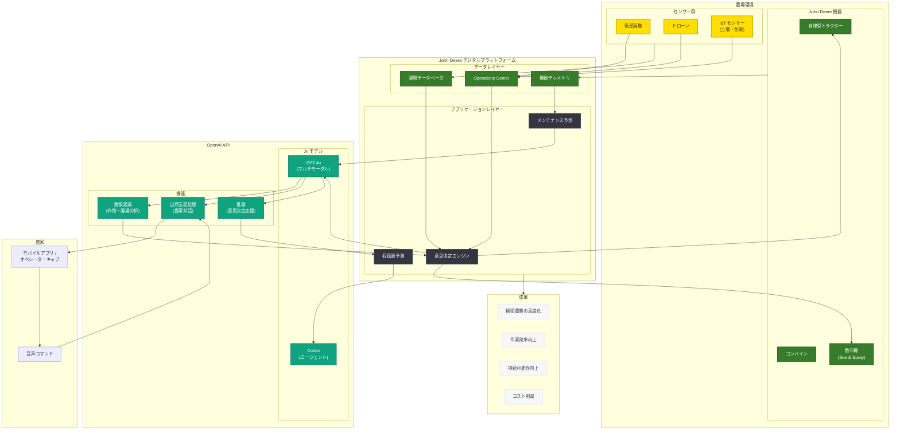

# John Deere × OpenAI — 農業 AI の新たなフロンティア

## メタデータ

| 項目 | 内容 |
|------|------|
| 発表日 | 2026-06-09 |
| ソース | OpenAI News |
| カテゴリ | パートナーシップ |
| 公式リンク | [John Deere - Justin Rose](https://openai.com/index/john-deere-justin-rose/) |

> **注:** 本レポートは OpenAI 公式ブログの公開情報、URL 構造、および関連する公開情報に基づいて作成している。記事本文へのアクセスは制限されたため、公開されている情報と業界文脈に基づく内容となっている。正確な詳細については公式ページを参照されたい。

## 概要

2026 年 6 月 9 日、OpenAI は公式ブログの API ブランドストーリーセクションにおいて、世界最大の農業機械メーカーである John Deere との戦略的パートナーシップに関する記事を公開した。記事タイトルには Justin Rose の名前が含まれており、John Deere のテクノロジー部門を率いるリーダーとして、OpenAI の AI 技術を農業分野に導入する取り組みについて語っているものと考えられる。

本パートナーシップは、OpenAI がテクノロジー業界を超えて産業・製造業分野への展開を加速していることを示す重要な事例である。John Deere は農業テクノロジーのパイオニアとして、GPS ガイダンスシステムや自律走行トラクターなど先進技術の農業応用を牽引してきた企業であり、OpenAI の AI 技術との統合は精密農業の新たな段階を切り開くものと位置づけられる。

## 主な内容

### John Deere のテクノロジー戦略と AI 活用

John Deere は単なる農業機械メーカーではなく、近年は「スマート産業テクノロジー企業」としての転換を進めている。同社は過去数年間にわたり以下の技術投資を行ってきた。

| 分野 | 取り組み |
|------|----------|
| 自律走行 | 完全自律型トラクターの商用展開 (2022 年 CES 発表) |
| コンピュータビジョン | See & Spray 技術による雑草個別散布 |
| データプラットフォーム | John Deere Operations Center によるフィールドデータ管理 |
| 衛星・センサー | リアルタイム作物モニタリングシステム |
| マシンラーニング | 収穫量予測と最適化エンジン |

OpenAI の大規模言語モデル (LLM) や Codex などのエージェンティック AI 技術をこれらの既存プラットフォームに統合することで、農業における意思決定支援の質とスピードを大幅に向上させることが期待される。

### 想定されるユースケース

#### 1. AI パワード精密農業

OpenAI の技術を活用することで、以下のような精密農業の高度化が可能になる。

- **フィールドコンディション分析:** 衛星画像、ドローンデータ、地上センサーからの情報を統合し、自然言語で圃場状態のレポートを生成
- **リアルタイム意思決定支援:** 天候データ、土壌状態、作物成長段階を統合的に分析し、最適な農作業タイミングを提案
- **異常検知と早期警告:** 病害虫の早期発見と対処方法の自動提案

#### 2. 自律型農業機械の高度化

- **マルチモーダル環境認識:** GPT-4o のビジョン能力を活用した高度な環境認識と判断
- **自然言語によるミッション設定:** 農家が口頭で作業指示を出し、機械が自律的に実行計画を策定
- **適応的作業計画:** リアルタイムの環境変化に応じた作業計画の動的調整

#### 3. 機器メンテナンス予測

- **故障予兆検知:** 機器センサーデータのパターン分析による故障予測
- **メンテナンスガイド生成:** 状況に応じた修理手順の自然言語による説明
- **部品在庫最適化:** 予測に基づくサプライチェーンの事前調整

#### 4. 農家向け意思決定支援システム

- **会話型農業アドバイザー:** 農家が自然言語で質問し、データに基づくアドバイスを受け取る
- **経営分析レポート:** 収穫量データ、市場価格、コスト情報を統合した経営判断支援
- **規制対応支援:** 各国の農業規制・補助金制度に関する情報提供

#### 5. サプライチェーン最適化

- **需要予測:** 市場データと気象予測を組み合わせた収穫量・需要の予測
- **物流最適化:** 収穫から流通までのサプライチェーン全体の効率化
- **在庫管理:** 種子、肥料、農薬の最適在庫レベルの算出

### Justin Rose の役割

URL 構造から、Justin Rose は John Deere におけるテクノロジー戦略またはデジタルトランスフォーメーションを統括する幹部であると推定される。OpenAI のブランドストーリーシリーズでは、パートナー企業のリーダーが自社での AI 活用について語る形式が採用されており (例: Wayfair の Fiona Tan)、Rose 氏も同様に John Deere における OpenAI 技術の導入経緯や成果について述べているものと考えられる。

### OpenAI エンタープライズパートナーシップの拡大

本パートナーシップは、OpenAI が 2026 年に入り急速に拡大しているエンタープライズパートナーシップの一環である。

| 発表日 | パートナー | 分野 |
|--------|-----------|------|
| 2026 年 3 月 | Rakuten | E コマース / フィンテック |
| 2026 年 4 月 | Hyatt | ホスピタリティ |
| 2026 年 5 月 | Dell | IT インフラ / エンタープライズ |
| 2026 年 5 月 | Cisco | ネットワーキング / セキュリティ |
| 2026 年 6 月 | John Deere | 農業 / 製造業 |

この流れは、OpenAI が純粋なテクノロジー企業を超えて、農業、製造業、ホスピタリティなど伝統的産業への AI 浸透を推進していることを明確に示している。

## 技術的な詳細

### 農業 AI プラットフォームの想定アーキテクチャ

John Deere が OpenAI の API を農業プラットフォームに統合する場合、以下のような実装パターンが考えられる。

```python
from openai import OpenAI

client = OpenAI()

# 精密農業における圃場分析の例
def analyze_field_condition(field_data: dict, weather_forecast: dict) -> dict:
    """
    圃場データと天候予測を統合し、
    農業意思決定のための分析レポートを生成する。
    """
    analysis_prompt = f"""
    以下の圃場データと天候予測を分析し、
    最適な農作業推奨を日本語で生成してください:

    圃場情報:
    - 作物: {field_data['crop_type']}
    - 成長段階: {field_data['growth_stage']}
    - 土壌水分: {field_data['soil_moisture']}%
    - 窒素レベル: {field_data['nitrogen_level']} ppm
    - 最終施肥日: {field_data['last_fertilization']}

    天候予測 (7 日間):
    - 降水確率: {weather_forecast['precipitation']}
    - 気温範囲: {weather_forecast['temp_range']}
    - 風速: {weather_forecast['wind_speed']}

    以下を含むレポートを生成:
    1. 現在の圃場状態の評価
    2. 今後 7 日間の推奨作業
    3. リスク要因と対策
    4. 収穫量予測への影響
    """

    response = client.chat.completions.create(
        model="gpt-4o",
        messages=[
            {
                "role": "system",
                "content": "あなたは精密農業の専門家 AI です。"
                           "データに基づいた科学的根拠のある"
                           "農業アドバイスを提供します。"
            },
            {"role": "user", "content": analysis_prompt}
        ]
    )

    return {
        "analysis": response.choices[0].message.content,
        "field_id": field_data['field_id'],
        "timestamp": field_data['timestamp']
    }


# 機器メンテナンス予測の例
def predict_equipment_maintenance(sensor_data: dict) -> dict:
    """
    農業機器のセンサーデータを分析し、
    メンテナンス必要性を予測する。
    """
    maintenance_prompt = f"""
    以下の農業機器センサーデータを分析し、
    メンテナンス推奨を生成してください:

    機器: {sensor_data['equipment_model']}
    稼働時間: {sensor_data['operating_hours']} 時間
    エンジン温度: {sensor_data['engine_temp']}°C
    油圧: {sensor_data['hydraulic_pressure']} PSI
    振動レベル: {sensor_data['vibration_level']}
    最終メンテナンス: {sensor_data['last_maintenance']}

    分析結果を以下の形式で出力:
    1. 各コンポーネントの状態評価
    2. 故障リスクスコア (0-100)
    3. 推奨メンテナンス項目
    4. 推奨実施時期
    """

    response = client.chat.completions.create(
        model="gpt-4o",
        messages=[
            {
                "role": "system",
                "content": "あなたは農業機械の"
                           "メンテナンス予測エキスパートです。"
            },
            {"role": "user", "content": maintenance_prompt}
        ]
    )

    return {
        "prediction": response.choices[0].message.content,
        "equipment_id": sensor_data['equipment_id'],
        "risk_assessment": "generated"
    }
```

## アーキテクチャ



## 開発者への影響

- **農業 AI アプリケーションの新市場:** John Deere のような大手農業プラットフォームが OpenAI API を採用することで、農業テクノロジー (AgTech) 分野における AI アプリケーション開発の需要が急増する。サードパーティ開発者にとって新たなビジネス機会が生まれる
- **マルチモーダル AI の産業応用事例:** 衛星画像、センサーデータ、気象情報など多様なデータソースを GPT-4o のマルチモーダル能力で処理する手法は、他の産業分野 (建設、鉱業、エネルギーなど) にも応用可能なパターンを提供する
- **エッジ AI とクラウド AI の統合パターン:** 農場のような通信環境が制約される環境でのクラウド AI 活用は、エッジコンピューティングとの効率的な統合アーキテクチャの開発を促進する。低レイテンシが求められる自律走行制御とクラウドベースの分析・計画の使い分けが重要なデザインパターンとなる
- **ドメイン特化型 AI エージェントの設計:** 農業という専門性の高い領域で AI エージェントを構築するためのプラクティスは、医療、法律、金融など他の専門分野への AI 適用にも参考となる知見を提供する
- **IoT データと LLM の統合:** 大量のセンサーデータストリームを LLM で解釈し、アクショナブルなインサイトに変換する統合パターンは、製造業全般に応用可能な技術的フレームワークとなる

## 関連リンク

- [John Deere × OpenAI (公式)](https://openai.com/index/john-deere-justin-rose/)
- [OpenAI API Platform](https://platform.openai.com/docs)
- [John Deere Technology](https://www.deere.com/en/technology/)
- [John Deere Operations Center](https://www.deere.com/en/technology/operations-center/)
- [Cisco と OpenAI のパートナーシップ](https://openai.com/index/cisco)
- [Dell と OpenAI のパートナーシップ](https://openai.com/index/dell-technologies-michael-dell/)
- [OpenAI News](https://openai.com/news)

## まとめ

John Deere と OpenAI のパートナーシップは、AI 技術が伝統的な農業・製造業分野に本格的に浸透する転換点を象徴する出来事である。主要なポイントは以下の通り。

1. **産業 AI の本格展開:** OpenAI がテクノロジー企業を超えて、農業という実体経済の根幹をなす産業に AI 技術を提供することで、AI の社会実装が新たな段階に入った
2. **精密農業の高度化:** GPS ガイダンスや自律走行など、John Deere がこれまで蓄積してきた農業テクノロジー基盤に LLM のマルチモーダル能力と推論能力が加わることで、精密農業のレベルが飛躍的に向上する可能性がある
3. **エンタープライズ AI の多様化:** Rakuten、Dell、Cisco、Hyatt に続く John Deere の参画は、OpenAI のエンタープライズ顧客基盤が IT 業界を超えて多様な産業に広がっていることを示している
4. **持続可能性への貢献:** AI による農業の効率化は、食料安全保障や環境負荷低減といったグローバルな課題への貢献にもつながる。水資源の最適利用、農薬使用量の削減、収穫ロスの低減など、持続可能な農業の実現に AI が重要な役割を果たす
5. **今後の展望:** 農業 AI 市場は急成長が予測されており、John Deere と OpenAI のパートナーシップは、この市場における技術標準を定める可能性がある。開発者にとっては、AgTech 分野での AI アプリケーション開発という新たな機会が広がっている
