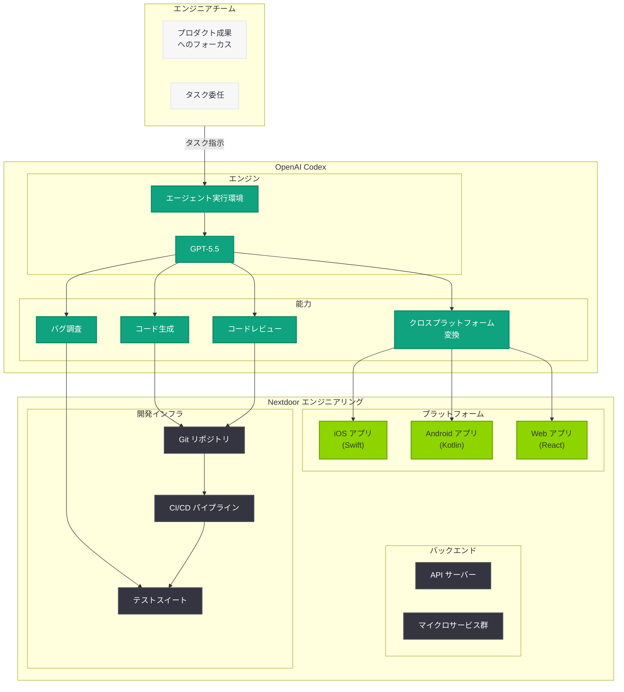

# Nextdoor のエンジニアが Codex を活用し制約なき開発を実現

## メタデータ

| 項目 | 内容 |
|------|------|
| 発表日 | 2026-06-09 |
| ソース | OpenAI News |
| カテゴリ | ケーススタディ |
| 公式リンク | [How engineers at Nextdoor use Codex to build without limits](https://openai.com/index/nextdoor) |

> **注:** 本レポートは OpenAI 公式ブログの公開情報、URL 構造、および関連する公開情報に基づいて作成している。記事本文へのアクセスは Cloudflare 保護により制限されたため、公開されている情報と業界文脈に基づく内容となっている。正確な詳細については公式ページを参照されたい。

## 概要

2026 年 6 月 9 日、OpenAI は公式ブログにおいて、近隣コミュニティ向けソーシャルネットワーキングアプリ Nextdoor のエンジニアリングチームが OpenAI Codex を活用して開発の生産性を飛躍的に向上させている事例を公開した。記事タイトル "How engineers at Nextdoor use Codex to build without limits" が示す通り、Codex と GPT-5.5 の組み合わせにより、エンジニアが従来の技術的制約を超えて開発に取り組めるようになった取り組みが紹介されている。

Nextdoor のエンジニアチームは、Codex を活用することで再現困難なバグの調査、クロスプラットフォーム開発の効率化、そしてプロダクト成果にフォーカスしたエンジニアリングへの転換を実現しており、AI コーディングツールの実践的な導入事例として注目に値する内容である。

## 主な内容

### Nextdoor について

Nextdoor は、近隣住民をつなぐソーシャルネットワーキングプラットフォームである。ユーザーは自身の居住地域に基づいたコミュニティに参加し、地域の情報共有、推薦、助け合い、地元ビジネスの発見などを行うことができる。

| 項目 | 詳細 |
|------|------|
| サービス形態 | 近隣コミュニティ向け SNS |
| 対象地域 | 米国を中心にグローバル展開 |
| プラットフォーム | iOS、Android、Web |
| 主な機能 | 地域情報共有、レコメンド、マーケットプレイス |
| 技術的課題 | マルチプラットフォーム対応、リアルタイム通信、位置情報処理 |

Nextdoor のように複数のプラットフォームにまたがるアプリケーションを開発するエンジニアリングチームにとって、AI コーディングアシスタントの導入は開発効率の大幅な改善をもたらす可能性が高い。

### Codex と GPT-5.5 の活用

Nextdoor のエンジニアチームは、OpenAI Codex のクラウドベースのソフトウェアエンジニアリングエージェントを GPT-5.5 モデルと組み合わせて活用している。Codex は単なるコード補完ツールではなく、コードベースを理解し、タスクを自律的に実行できるエージェンティックな AI コーディングツールである。

GPT-5.5 は OpenAI の最新モデルとして高度な推論能力とコーディング能力を持ち、以下の特徴を備えている。

- **深い文脈理解:** 大規模なコードベースの構造と依存関係を把握し、適切なコード生成・修正を行う
- **マルチステップ推論:** 複雑な問題を段階的に分解し、体系的に解決策を導き出す
- **クロスランゲージ対応:** 異なるプログラミング言語やフレームワーク間の変換を正確に実行する

### 再現困難な問題の調査

ソフトウェア開発において、再現が困難なバグは最も時間とリソースを消費する課題の一つである。特にモバイルアプリケーションでは、デバイスの多様性、ネットワーク状態、OS バージョンの組み合わせにより、特定条件下でのみ発生する問題が頻繁に生じる。

Nextdoor のエンジニアは Codex を活用して、以下のようなアプローチで再現困難な問題に取り組んでいる。

- **ログ分析の自動化:** 大量のログデータから異常パターンを特定し、問題の根本原因に関する仮説を自動生成
- **コードパス分析:** 問題が発生する可能性のあるコードパスを網羅的に調査し、エッジケースを特定
- **テストケース生成:** 仮説に基づく再現テストケースを自動的に生成し、問題の再現と検証を支援
- **コンテキスト統合:** スタックトレース、ユーザーレポート、デバイス情報を統合的に分析し、パターンを発見

従来、こうした問題の調査には数日から数週間を要することがあったが、Codex の活用により調査時間を大幅に短縮できるようになったと考えられる。

### クロスプラットフォーム開発の効率化

Nextdoor は iOS、Android、Web の 3 つのプラットフォームでサービスを提供しており、各プラットフォーム間での機能パリティの維持は大きな課題である。Codex の活用により、以下のような効率化が実現されている。

- **プラットフォーム間のコード変換:** 一つのプラットフォームで実装した機能を、他のプラットフォーム向けに変換する際の支援
- **統一的なビジネスロジック:** プラットフォーム固有の実装の差異を吸収しつつ、ビジネスロジックの一貫性を維持
- **UI コンポーネントの移植:** デザインシステムに準拠した各プラットフォーム向け UI コンポーネントの生成支援
- **API 統合の標準化:** バックエンドとの通信レイヤーの実装パターンを標準化

### プロダクト成果へのフォーカス

Codex の導入による最も重要な変化は、エンジニアの時間とエネルギーの使い方の転換である。定型的なコーディング作業や調査作業を AI に委任することで、エンジニアはプロダクトの成果により集中できるようになっている。

| 従来のアプローチ | Codex 活用後 |
|----------------|-------------|
| ボイラープレートコードの手動作成 | AI による自動生成とカスタマイズ |
| 複雑なバグの手動調査 (数日) | AI 支援による迅速な特定 (数時間) |
| プラットフォームごとの個別実装 | AI による変換と統一性確保 |
| 技術的負債への対応に時間消費 | AI がリファクタリングを支援 |
| インフラ設定に時間消費 | プロダクト機能開発に注力 |

この転換は "build without limits" というタイトルが示す通り、エンジニアが技術的制約に縛られず、ユーザーに価値を届けるプロダクト開発に集中できる環境を構築したことを意味している。

## 技術的な詳細

### Codex のアーキテクチャと利用パターン

OpenAI Codex はクラウドベースのソフトウェアエンジニアリングエージェントとして、以下のような技術的特徴を持つ。

- **サンドボックス環境:** 各タスクが独立したサンドボックス内で実行され、コードベースのクローン、依存関係のインストール、テスト実行が可能
- **エージェンティック実行:** 単発のコード生成ではなく、複数ステップの作業を自律的に計画・実行
- **Git 統合:** プルリクエストの作成、コードレビューへの対応、ブランチ管理を自動化
- **テスト駆動:** コード変更に伴うテストの自動生成・実行により品質を担保

### Nextdoor での活用パターン例

```python
# Codex を活用したクロスプラットフォーム開発の概念例
# iOS で実装された機能を Android 向けに変換するタスク

# Codex へのタスク指示例:
# "iOS の NeighborhoodFeedViewController にある
#  リアルタイム更新機能を Android の Kotlin 実装に変換し、
#  既存のアーキテクチャパターン (MVVM + Coroutines) に従うこと"

# Codex は以下を自律的に実行:
# 1. iOS コードベースの該当ファイルを分析
# 2. Android プロジェクトの既存アーキテクチャを把握
# 3. Kotlin での実装を生成
# 4. 単体テストを作成
# 5. プルリクエストを作成
```

### 再現困難なバグ調査の支援パターン

```python
# Codex によるバグ調査支援の概念例
# タスク: 特定のデバイスでのみ発生するクラッシュの原因調査

# Codex へのタスク指示例:
# "以下のクラッシュレポートを分析し、根本原因の仮説を立て、
#  再現テストケースを作成せよ:
#  - Crash: NSInternalInconsistencyException
#  - Device: iPhone 12, iOS 17.4
#  - Occurrence: 0.3% of sessions
#  - Stack trace: [添付]"

# Codex は以下を自律的に実行:
# 1. スタックトレースの該当コードを特定
# 2. 関連するコードパスを分析
# 3. レースコンディションやメモリ管理の問題を特定
# 4. 再現可能なテストケースを生成
# 5. 修正案をプルリクエストとして提出
```

## アーキテクチャ



## 開発者への影響

- **AI コーディングツールの実践的導入モデル:** Nextdoor の事例は、エンタープライズ規模のエンジニアリングチームが Codex をどのように日常的なワークフローに統合できるかの具体的な参考事例を提供する。特にマルチプラットフォーム開発を行うチームにとって有益な知見となる

- **エンジニアリング文化の転換:** AI ツールの導入は単なる生産性向上だけでなく、エンジニアの役割そのものを変革する。低レベルな実装作業から解放されたエンジニアは、アーキテクチャ設計やプロダクト戦略により時間を割けるようになる

- **GPT-5.5 のコーディング能力の実証:** 実際のプロダクション環境で GPT-5.5 ベースの Codex が活用されている事例は、最新モデルのコーディング能力の実力を示すベンチマークとなる。開発者はモデル選択の判断材料として参考にできる

- **再現困難なバグへのアプローチの変革:** AI を活用したバグ調査手法は、QA チームやサポートエンジニアの作業効率を根本的に変える可能性がある。特にモバイルアプリ開発やマイクロサービスアーキテクチャにおいて、その効果が大きい

- **クロスプラットフォーム開発の新たな選択肢:** Flutter や React Native といったクロスプラットフォームフレームワークを採用せずとも、AI の支援によりネイティブ実装を効率的に行う新たなアプローチが示された。各プラットフォームの最適なパフォーマンスを維持しながら開発効率を向上させることが可能になる

- **プロダクトマネジメントとの協働強化:** エンジニアが技術的制約から解放されることで、プロダクトマネージャーとの協働がより創造的なものになる。"build without limits" の理念は、プロダクト開発全体のアジリティ向上に寄与する

## 関連リンク

- [How engineers at Nextdoor use Codex to build without limits (公式)](https://openai.com/index/nextdoor)
- [OpenAI Codex](https://openai.com/index/codex)
- [OpenAI GPT-5.5](https://openai.com/index/gpt-5-5)
- [Nextdoor 公式サイト](https://nextdoor.com)
- [OpenAI API Platform](https://platform.openai.com/docs)
- [OpenAI News](https://openai.com/news)

## まとめ

Nextdoor のエンジニアリングチームによる Codex 活用事例は、AI コーディングツールが実際のプロダクション環境でどのように価値を発揮するかを示す重要なケーススタディである。主要なポイントは以下の通り。

1. **GPT-5.5 搭載 Codex の実力:** 最新モデル GPT-5.5 と組み合わせた Codex は、単なるコード補完を超えて、複雑な調査や設計判断を含むエージェンティックな開発タスクを遂行できることが実証された

2. **再現困難な問題の解決加速:** 従来数日かかっていた再現困難なバグの調査を、AI の網羅的なコード分析とパターン認識により大幅に短縮できる可能性が示された

3. **クロスプラットフォーム開発の新パラダイム:** ネイティブ実装を維持しつつ AI による変換・支援を活用する新たなアプローチは、パフォーマンスと開発効率の両立を実現する

4. **プロダクト成果へのシフト:** AI ツールの導入により、エンジニアは技術的なボイラープレート作業から解放され、ユーザー体験やプロダクト価値の創出に集中できるようになった

5. **エンジニアリングチームへの示唆:** 本事例は、AI コーディングツールの導入を検討するエンジニアリングチームにとって、実践的な導入モデルと期待される成果の指標を提供する。特にマルチプラットフォーム開発を行うチームにとって、Codex の活用は競争力向上の重要な手段となりうる
