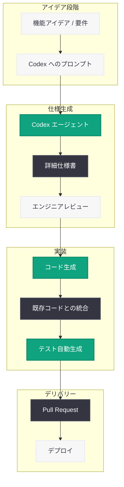
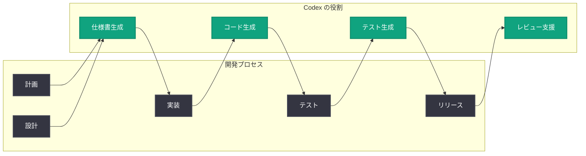

# Notion が Codex で実現する「ワンショット仕様書」と少人数チームのエンジニアリング革命

## メタデータ

| 項目 | 内容 |
|------|------|
| 発表日 | 2026-06-09 |
| ソース | OpenAI News |
| カテゴリ | ケーススタディ |
| 公式リンク | [What Codex unlocks for Notion](https://openai.com/index/notion) |

> **注記:** 本レポートは公式ページが Cloudflare の保護により直接アクセスできなかったため、公開されている情報および記事のタイトル・概要に基づいて作成している。正確な詳細については公式ページを参照されたい。

## 概要

2026 年 6 月 9 日、OpenAI は公式ブログにおいて、人気のオールインワンワークスペースアプリ Notion が Codex を活用してエンジニアリングプロセスを変革している事例を紹介する記事「What Codex unlocks for Notion」を公開した。

本記事では、Notion のエンジニアリングチームが Codex を活用して、仕様書をワンショット (一発のプロンプト) で作成し、Web 向け AI 音声入力機能を構築し、少人数チームのエンジニアリング能力を大幅に拡張している事例が紹介されている。これは、Codex が単なるコード生成ツールを超えて、プロダクト開発ワークフロー全体を変革するエージェンティック AI として機能していることを示す重要なケーススタディである。

## 主な内容

### Notion について

Notion は、ノート、ドキュメント、プロジェクト管理、Wiki、データベースなどの機能を統合したオールインワンのワークスペースアプリケーションである。世界中で数千万人のユーザーに利用されており、個人の生産性ツールからエンタープライズ向けのナレッジマネジメントプラットフォームまで幅広い用途で使われている。

| 項目 | 詳細 |
|------|------|
| カテゴリ | プロダクティビティ / コラボレーション |
| ユーザー規模 | 数千万人 (グローバル) |
| 主な機能 | ドキュメント、Wiki、プロジェクト管理、データベース、AI 機能 |
| 開発チーム | 少人数の高密度エンジニアリングチーム |
| AI 戦略 | Notion AI を通じた AI 機能のプロダクト統合 |

Notion は「少人数の優れたエンジニアで大きな成果を出す」という開発哲学を持つことで知られており、限られたリソースで多機能なプラットフォームを維持・発展させるために、効率化への取り組みが常に重要課題となっている。

### エンジニアリング上の課題

Notion のような急成長するプロダクトを少人数で開発・運用するチームは、以下のような課題に直面している。

| 課題 | 詳細 |
|------|------|
| 仕様策定の負荷 | 新機能のアイデアから詳細仕様書を作成するまでに大きな時間を要する |
| プロトタイピング速度 | アイデアの検証からプロトタイプ実装までのリードタイムが長い |
| クロスプラットフォーム対応 | Web、デスクトップ、モバイルなど複数プラットフォームへの同時開発 |
| 機能の多様性 | ドキュメント、データベース、AI 機能など多岐にわたる機能の並行開発 |
| チームスケーリング | 人員を大幅に増やさずにアウトプットを拡大する必要性 |

### ワンショット仕様書 — アイデアから仕様書を一発で生成

Codex の最も革新的な活用法の一つが「ワンショット仕様書 (one-shotting specs)」である。これは、エンジニアやプロダクトマネージャーがアイデアを一つのプロンプトとして Codex に入力するだけで、実装可能な詳細仕様書が生成されるワークフローを指す。

#### 従来のワークフロー

1. アイデアの発案
2. 関係者との議論・ブレインストーミング
3. 要件定義の作成
4. 技術仕様書のドラフト作成
5. レビューと修正の反復
6. 最終仕様書の確定

#### Codex によるワークフロー

1. アイデアをプロンプトとして Codex に入力
2. Codex が包括的な仕様書を一発で生成
3. エンジニアが仕様書をレビュー・調整
4. 実装開始

この変革により、従来数日から数週間を要していた仕様策定プロセスが、数分から数時間に短縮される。エンジニアは仕様書の「作成者」から「レビュアー」へと役割がシフトし、より創造的な判断や意思決定に集中できるようになる。

#### 仕様書のワンショット生成が有効な理由

- **コンテキストの統合:** Codex はコードベース全体を理解した上で、既存のアーキテクチャやパターンに整合する仕様を生成できる
- **一貫性の確保:** チーム全体で統一されたフォーマットと品質水準の仕様書が自動的に生成される
- **反復の高速化:** 仕様書のバリエーションを素早く生成し、複数のアプローチを検討できる

### AI Voice Input for the Web の構築

Notion が Codex を活用して構築した具体的な機能として、Web 版の AI 音声入力 (AI Voice Input) が挙げられている。この機能は、ユーザーが音声でテキストを入力し、AI がそれを適切なフォーマットに整形してドキュメントに反映するものである。

#### AI Voice Input の技術的要素

| コンポーネント | 役割 |
|---------------|------|
| 音声認識 | ブラウザの Web Speech API またはカスタム音声認識モデル |
| テキスト整形 | 音声テキストの文脈に応じた構造化・フォーマッティング |
| Notion ブロック変換 | 整形されたテキストを Notion のブロック構造に変換 |
| リアルタイムコラボレーション | 複数ユーザーの同時編集との整合性確保 |

Codex は、この機能の設計から実装に至るまでのプロセスを加速した。少人数のチームが、複雑な音声入力機能をフルスクラッチで実装する代わりに、Codex をエージェントとして活用することで、以下を実現したと考えられる。

- **プロトタイプの迅速な構築:** 音声入力パイプラインのプロトタイプを短期間で作成
- **エッジケースの網羅:** 多言語対応、句読点処理、コマンド認識など複雑なロジックの実装
- **テストの自動化:** 各種入力パターンに対するテストケースの自動生成
- **既存システムとの統合:** Notion のリアルタイムコラボレーション基盤との適切な統合

### 少人数チームのエンジニアリング能力を倍増

Codex がもたらす最も本質的な価値は、少人数のエンジニアリングチームが「人数以上のアウトプット」を生み出せるようになることである。

#### チームダイナミクスの変化

**従来のモデル:**
- 1 人のエンジニア = 1 人分のアウトプット
- チームの生産性はヘッドカウントに比例
- スケーリングには採用が不可欠

**Codex 活用モデル:**
- 1 人のエンジニア + Codex = 複数人分のアウトプット
- チームの生産性はエンジニアの判断力・方向性設定能力に比例
- スケーリングは AI エージェントの活用度に依存

#### 具体的な生産性向上の領域

| 領域 | Codex による効果 |
|------|-----------------|
| 仕様策定 | アイデアから仕様書への変換時間を大幅短縮 |
| コード実装 | ボイラープレートや定型的なコードの自動生成 |
| コードレビュー | 変更の影響範囲分析とレビュー支援 |
| テスト作成 | 包括的なテストケースの自動生成 |
| バグ修正 | 問題の特定から修正案の提示まで |
| ドキュメント | コードに基づく自動ドキュメント生成 |
| リファクタリング | 大規模なコード改善の計画と実行 |

### Notion における Codex 活用のワークフロー

Notion のエンジニアリングチームが Codex を日常的にどのように活用しているかの想定ワークフローを以下に示す。



## 技術的な詳細

### Codex のエージェンティック能力

Codex は単なるコード補完ツールではなく、エージェンティック AI として以下の能力を持つ。

| 能力 | 説明 |
|------|------|
| コードベース理解 | リポジトリ全体の構造・パターン・依存関係を把握 |
| タスク分解 | 大きな目標を実行可能な小さなタスクに分解 |
| 自律実行 | コードの作成・修正・テストを自律的に実行 |
| コンテキスト維持 | 長いタスクチェーンにわたってコンテキストを保持 |
| 品質保証 | 生成コードのテスト実行と検証 |

### Notion のようなプロダクトでの活用パターン

Notion のような複雑なプロダクトでは、以下のような Codex 活用パターンが考えられる。

#### パターン 1: 新機能のフルサイクル開発

```
プロンプト例:
「Web 版 Notion に音声入力機能を追加する。
ユーザーがマイクボタンをクリックすると音声認識が開始され、
認識されたテキストがリアルタイムで現在のブロックに挿入される。
多言語対応とし、句読点の自動挿入を行う。
既存のリアルタイムコラボレーション機能と矛盾しないこと。」
```

Codex はこのプロンプトから以下を生成する。
- 技術仕様書 (アーキテクチャ、API 設計、データフロー)
- 実装コード (フロントエンド、バックエンド)
- テストコード (ユニットテスト、インテグレーションテスト)
- ドキュメント (API リファレンス、使用方法)

#### パターン 2: クロスプラットフォーム一貫性の確保

Web 版で実装された機能をデスクトップアプリやモバイルアプリに展開する際、Codex がプラットフォーム固有の実装を自動生成する。

#### パターン 3: パフォーマンス最適化

既存コードの分析からボトルネックを特定し、最適化された代替実装を提案・実行する。

### 開発プロセスへの統合

Codex が Notion のような企業の開発プロセスに統合される典型的なパターンは以下の通りである。



## 開発者への影響

### 1. プロダクト開発ワークフローの根本的変革

Notion の事例は、Codex が単なるコーディング支援ツールではなく、プロダクト開発プロセス全体を変革するツールであることを示している。仕様策定からテストまで、開発ライフサイクルの全段階で AI エージェントが活用できる時代が到来した。

### 2. 少人数チームの競争力向上

Codex を活用することで、5-10 人のエンジニアリングチームが従来の 50-100 人規模のチームに匹敵するアウトプットを生み出せる可能性がある。これは、スタートアップや少人数チームにとって大きな競争優位性をもたらす。

### 3. エンジニアの役割シフト

エンジニアの価値が「コードを書く能力」から「正しい方向性を設定し、AI の出力を評価・改善する能力」へとシフトしている。アーキテクチャの判断力、プロダクトセンス、品質基準の設定がより重要になる。

### 4. AI ファースト開発の標準化

Notion のような著名なプロダクト企業が Codex を開発プロセスの中核に据えていることは、AI ファースト開発が業界標準になりつつあることを示している。他の企業も同様のアプローチを検討すべきタイミングに来ている。

### 5. 音声インターフェースの普及加速

Notion が Codex を使って AI Voice Input を構築した事例は、音声入力やマルチモーダルインターフェースの開発が AI エージェントによって大幅に容易になることを示している。より多くのアプリケーションに音声機能が搭載される流れが加速すると予想される。

## 関連リンク

- [What Codex unlocks for Notion (公式)](https://openai.com/index/notion)
- [OpenAI Codex](https://openai.com/codex)
- [Notion 公式サイト](https://www.notion.so)
- [OpenAI API Platform](https://platform.openai.com/docs)
- [OpenAI News](https://openai.com/news)

## まとめ

Notion が Codex を活用してエンジニアリングプロセスを変革している事例は、AI エージェントがソフトウェア開発の未来を形作る重要な指標である。主要なポイントは以下の通り。

1. **ワンショット仕様書の実現:** アイデアから詳細仕様書への変換が一発のプロンプトで可能になり、プロダクト開発の初期段階が劇的に加速した
2. **具体的な機能構築への活用:** AI Voice Input for the Web という複雑な機能を、Codex をフル活用して少人数チームで構築した事例は、Codex の実用性を証明している
3. **チーム生産性の乗数効果:** Codex は個々のエンジニアの生産性を単純に向上させるだけでなく、チーム全体の能力を倍増させる乗数効果をもたらす
4. **開発文化の転換:** エンジニアが「作成者」から「方向性の設定者・レビュアー」へと役割がシフトし、より高次の判断に集中できるようになった
5. **業界へのインパクト:** Notion のような影響力のあるプロダクト企業による Codex 採用は、AI ファースト開発の標準化を促進し、他の企業にも波及効果をもたらすと考えられる
