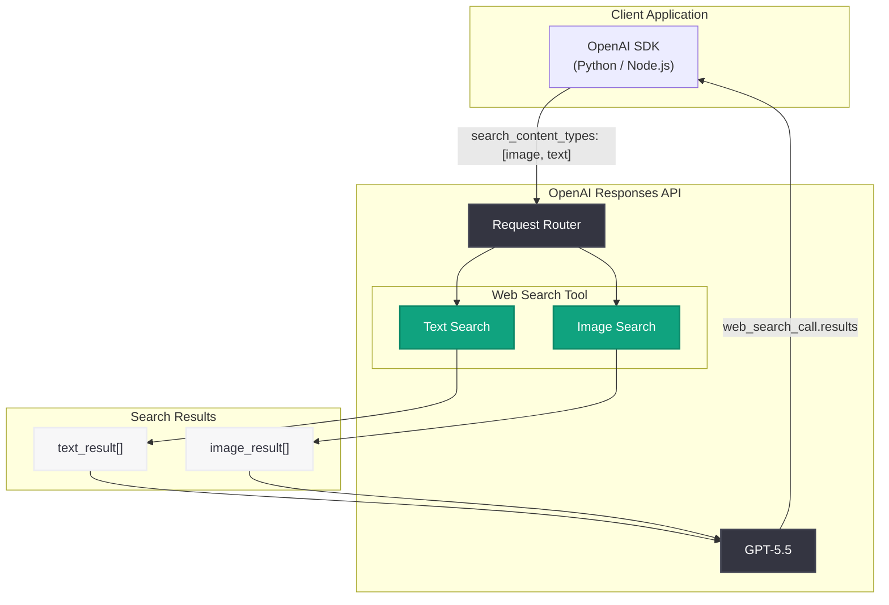

# Web Search で画像検索結果が返却可能に

## メタデータ

| 項目 | 内容 |
|------|------|
| 発表日 | 2026-06-09 |
| ソース | API Changelog |
| カテゴリ | API 更新 |
| 公式リンク | [Web search image results](https://developers.openai.com/api/docs/guides/tools-web-search) |

## 概要

OpenAI の Responses API における `web_search` ツールが、従来のテキスト検索結果に加えて画像検索結果を返却できるようになった。これにより、商品写真、ランドマーク、イベント、ビジュアルリファレンスなど、視覚的な情報が必要なクエリに対してリッチな応答を構築できる。

この機能強化は、既存の Web Search ツールへの拡張として提供され、`search_content_types` パラメータに `"image"` を追加するだけで利用可能となる。マルチモーダルな検索体験を構築する開発者にとって重要なアップデートである。

## 主な内容

### 画像検索結果の追加

Web Search ツールが返却するコンテンツタイプに `image_result` が新たに追加された。テキスト検索結果と画像検索結果を同時に取得することで、ユーザーのクエリに対してより包括的な情報を提供できる。

### 主なユースケース

- **商品写真**: EC サイトやレビューアプリで、商品の外観を検索結果として表示
- **ランドマーク・場所**: 旅行アプリや地図サービスで、観光地のビジュアルを提供
- **イベント**: ニュースやイベント情報に関連する画像を自動取得
- **ビジュアルリファレンス**: 技術ドキュメントやチュートリアルに視覚的な補足情報を追加

### Before / After 比較

| 項目 | Before (従来) | After (今回のアップデート) |
|------|---------------|--------------------------|
| 検索結果タイプ | テキストのみ | テキスト + 画像 |
| ビジュアル情報 | 非対応 | `image_result` で画像 URL、サムネイル、キャプション取得可能 |
| コンテンツタイプ指定 | なし | `search_content_types` で `"image"` / `"text"` を選択 |
| 画像設定 | なし | `image_settings` で `max_results` と `caption` を制御 |

## 技術的な詳細

### 新しいパラメータ

#### `search_content_types`

検索結果に含めるコンテンツタイプを配列で指定する。

- `"text"`: テキスト検索結果 (従来と同様)
- `"image"`: 画像検索結果 (新規追加)

#### `image_settings`

画像検索の動作を制御するオブジェクト。

| パラメータ | 型 | 説明 |
|-----------|------|------|
| `max_results` | number | 取得する画像結果の最大数 |
| `caption` | boolean | `true` の場合、利用可能な画像にキャプションを付与 |

#### `include` パラメータ

画像検索結果を直接参照するには、`include` 配列に `"web_search_call.results"` を追加する。画像結果はアシスタントメッセージ内ではなく、`web_search_call` アイテムの `results` 配列に格納される。

### レスポンス構造

各 `image_result` オブジェクトには以下のフィールドが含まれる。

| フィールド | 説明 |
|-----------|------|
| `type` | `"image_result"` (固定値) |
| `image_url` | 画像の正規 URL |
| `source_website_url` | 画像が掲載されているソースページの URL |
| `thumbnail_url` | サムネイル URL (利用可能な場合) |
| `caption` | 画像のキャプション (利用可能な場合) |

### コードサンプル

#### Python

```python
from openai import OpenAI

client = OpenAI()

response = client.responses.create(
    model="gpt-5.5",
    tools=[
        {
            "type": "web_search",
            "search_content_types": ["image", "text"],
            "image_settings": {
                "max_results": 3,
                "caption": True,
            },
        }
    ],
    include=["web_search_call.results"],
    input="Show me photos of the Eiffel Tower at night",
)

# レスポンスから画像結果を取得
for item in response.output:
    if item.type == "web_search_call":
        for result in item.results:
            if result.type == "image_result":
                print(f"Image: {result.image_url}")
                print(f"Caption: {result.caption}")
                print(f"Source: {result.source_website_url}")
                print("---")
```

#### JavaScript

```javascript
import OpenAI from "openai";

const client = new OpenAI();

const response = await client.responses.create({
    model: "gpt-5.5",
    tools: [
        {
            type: "web_search",
            search_content_types: ["image", "text"],
            image_settings: {
                max_results: 3,
                caption: true,
            },
        },
    ],
    include: ["web_search_call.results"],
    input: "Search for recent images of the Golden Gate Bridge at sunset.",
});

console.log(response.output);
```

### レスポンス例

```json
{
  "output": [
    {
      "type": "web_search_call",
      "status": "completed",
      "results": [
        {
          "type": "image_result",
          "image_url": "https://cdn.example/eiffel-tower-night.jpg",
          "thumbnail_url": "https://cdn.example/eiffel-tower-night-thumb.jpg",
          "source_website_url": "https://example.com/paris-guide",
          "caption": "Eiffel Tower illuminated at night"
        }
      ]
    },
    {
      "type": "message",
      "role": "assistant",
      "content": [...]
    }
  ]
}
```

## アーキテクチャ



## 開発者への影響

- **マルチモーダル検索体験の構築が容易に**: テキストと画像を組み合わせた検索アプリケーションを、単一の API コールで実現できるようになった
- **既存実装への影響が最小限**: `search_content_types` を追加するだけで画像検索を有効化でき、既存のテキスト検索実装を壊さない
- **レスポンス解析の変更が必要**: 画像結果は `web_search_call.results` に格納されるため、レスポンスのパース処理を更新する必要がある
- **UI/UX の拡張機会**: 画像サムネイルやキャプションを活用した、よりリッチなユーザーインターフェースを構築可能
- **コスト考慮**: 画像検索結果の取得が API 利用量に影響する可能性があるため、`max_results` を適切に設定することを推奨

## 関連リンク

- [Web Search ツール公式ガイド](https://developers.openai.com/api/docs/guides/tools-web-search)
- [OpenAI API Changelog](https://platform.openai.com/docs/changelog)
- [Responses API リファレンス](https://platform.openai.com/docs/api-reference/responses)
- [OpenAI SDK (Python)](https://github.com/openai/openai-python)
- [OpenAI SDK (Node.js)](https://github.com/openai/openai-node)

## まとめ

OpenAI の Web Search ツールに画像検索結果の返却機能が追加された。`search_content_types` に `"image"` を指定し、`image_settings` で結果数やキャプションの有無を制御することで、テキストと画像を組み合わせたマルチモーダルな検索体験を構築できる。既存の Web Search 実装への影響は最小限であり、パラメータの追加だけで新機能を活用可能である。商品検索、観光情報、ニュースなど、ビジュアル要素が重要なアプリケーションにおいて特に有用なアップデートとなる。
