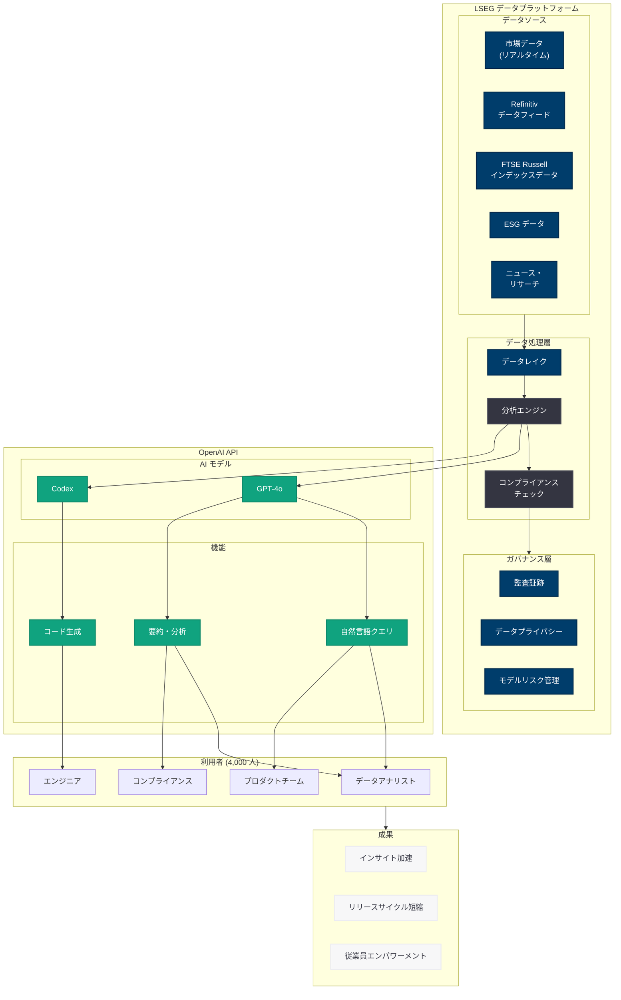

# LSEG が OpenAI で「信頼される AI」をスケーリング -- データから意思決定へ

## メタデータ

| 項目 | 内容 |
|------|------|
| 発表日 | 2026-06-10 |
| ソース | OpenAI News |
| カテゴリ | ケーススタディ |
| 公式リンク | [From data to decisions: how LSEG is scaling trusted AI](https://openai.com/index/lseg) |

> **注:** 本レポートは OpenAI 公式ブログの公開情報、URL 構造、および関連する公開情報に基づいて作成している。記事本文へのアクセスは Cloudflare の保護により制限されたため、公開されている情報と業界文脈に基づく内容となっている。正確な詳細については公式ページを参照されたい。

## 概要

2026 年 6 月 10 日、OpenAI は公式ブログにおいて、LSEG (London Stock Exchange Group) が OpenAI の技術を活用して「信頼される AI」をスケーリングしている事例を公開した。記事タイトル「From data to decisions: how LSEG is scaling trusted AI」が示す通り、金融データから意思決定への変換を AI が加速するという、金融サービス業界における AI 活用の最前線を紹介する内容である。

LSEG は世界有数の金融データ・テクノロジー企業であり、Refinitiv (旧 Thomson Reuters Financial & Risk 部門) や FTSE Russell などのブランドを傘下に持つ。同社は 4,000 人以上の従業員を AI ツールで支援し、インサイトの獲得を加速させ、リリースサイクルを短縮するという成果を上げている。

## 主な内容

### LSEG について -- 金融データとテクノロジーの巨人

LSEG は単なる証券取引所の運営企業ではなく、グローバルな金融インフラとデータサービスを提供する総合的な金融テクノロジー企業である。

| 事業セグメント | 内容 |
|---------------|------|
| データ & アナリティクス | Refinitiv プラットフォームによる金融データ配信 |
| インデックス | FTSE Russell による株価指数算出・管理 |
| キャピタルマーケット | ロンドン証券取引所の運営 |
| ポストトレード | LCH (清算機関) による決済サービス |
| テクノロジー | 金融機関向けトレーディングシステム |

従業員数は約 25,000 人規模であり、190 以上の国と地域にサービスを提供している。膨大な金融データを保有し、40,000 以上の顧客にリアルタイムデータと分析ツールを提供していることが、AI 導入の大きな基盤となっている。

### OpenAI 技術による金融データ分析の変革

LSEG が保有するデータの規模は圧倒的である。数十年にわたる市場データ、企業財務情報、ESG データ、ニュースフィード、リサーチレポートなど、構造化・非構造化を含む膨大なデータ資産を有している。OpenAI の技術は、これらのデータからインサイトを抽出し、意思決定を支援するプロセスを根本的に変革している。

想定される活用領域は以下の通り。

- **リサーチレポートの自動要約・分析:** 数千ページに及ぶアナリストレポートを瞬時に要約し、キーインサイトを抽出
- **市場データの自然言語クエリ:** トレーダーやアナリストが自然言語で複雑なデータ照会を実行
- **リスク評価の自動化:** 企業の財務データ、ニュース、規制情報を統合したリスクスコアリング
- **ESG データの解析:** 非構造化テキストから ESG 関連情報を自動抽出・分類
- **規制コンプライアンス支援:** 各国の金融規制文書の解析と適用判断の支援

### インサイト獲得の加速

「From data to decisions」というタイトルが象徴するように、LSEG における AI 活用の核心は「データからインサイトへの変換速度」の劇的な改善にある。金融業界では、情報の速度が競争優位に直結する。

従来のワークフローでは、アナリストが手動でデータを収集・分析し、レポートを作成するまでに数時間から数日を要していた。OpenAI の技術を活用することで、このプロセスが大幅に短縮され、より迅速な意思決定が可能になっている。

| プロセス | 従来 | AI 活用後 |
|---------|------|-----------|
| 市場レポート分析 | 数時間 | 数分 |
| データ統合・クロスリファレンス | 手動で半日以上 | リアルタイム |
| 規制文書の解釈 | 法務チームが数日 | 初期分析を即座に生成 |
| 顧客向けインサイト作成 | 1-2 日 | 数十分 |

### 4,000 人の従業員をエンパワーメント

LSEG が 4,000 人の従業員に AI ツールを展開しているという事実は、単なる技術実証 (PoC) ではなく、本番環境での大規模展開を実現していることを示している。これは金融サービス業界における AI 導入として極めて大規模なものである。

展開の対象となる職種は以下のように推定される。

- **データアナリスト:** データの検索・分析・可視化の効率化
- **プロダクト開発チーム:** 新しいデータプロダクトの設計・開発の加速
- **カスタマーサポート:** 顧客からの技術的な問い合わせへの対応品質向上
- **コンプライアンスチーム:** 規制対応業務の効率化
- **ソフトウェアエンジニア:** コード生成・レビュー・デバッグの支援

4,000 人規模の展開を成功させるには、段階的なロールアウト、適切なトレーニング、ガバナンスフレームワークの整備が不可欠であり、LSEG がこれらを体系的に実施していることが窺える。

### リリースサイクルの短縮

金融テクノロジー企業にとって、プロダクトのリリースサイクルの短縮は直接的な競争力強化につながる。LSEG が OpenAI の技術を活用してリリースサイクルを「shrinking (短縮)」している背景には、以下のような AI 活用が考えられる。

- **コード生成・レビューの自動化:** Codex やエージェント型 AI による開発プロセスの効率化
- **テスト自動化:** AI によるテストケース生成とバグ検出
- **ドキュメント生成:** API ドキュメントや変更ログの自動生成
- **デプロイメント支援:** 設定ファイルの生成やインフラ構成の最適化提案
- **コードレビューの高速化:** AI による自動コードレビューと改善提案

### 信頼とガバナンス -- 金融サービスにおける AI の要件

金融サービス業界で AI を大規模に展開するには、「信頼 (Trust)」が最も重要な要素である。LSEG が「trusted AI」を強調している背景には、金融業界特有の厳格な要件がある。

#### 規制コンプライアンス

金融サービスは世界で最も厳しく規制される産業の一つであり、AI 活用には以下の規制への準拠が求められる。

- **FCA (英国金融行動監視機構):** AI を含むアルゴリズム取引の監視要件
- **MiFID II:** 取引の透明性と報告義務
- **GDPR:** 個人データの処理に関する規制
- **EU AI Act:** AI システムのリスク分類と遵守要件
- **Basel III/IV:** リスク管理モデルの検証要件

#### ガバナンスフレームワーク

LSEG が構築していると推定されるガバナンスフレームワークには、以下の要素が含まれる。

- **モデルリスク管理:** AI モデルの精度監視と定期的な検証
- **データリネージ:** AI の出力がどのデータに基づいているかの追跡可能性
- **監査証跡:** AI による意思決定プロセスの記録と再現性
- **バイアス検出:** 金融判断における AI バイアスの継続的モニタリング
- **人間による監視 (Human-in-the-Loop):** 重要な意思決定における人間の最終判断の維持

## 技術的な詳細

### 金融データ分析における AI 活用の想定アーキテクチャ

LSEG のような金融データ企業が OpenAI API を統合する場合、以下のようなアーキテクチャパターンが考えられる。

```python
from openai import OpenAI

client = OpenAI()

# 金融データ分析のためのインサイト生成例
def generate_market_insight(market_data: dict, context: str) -> dict:
    """
    市場データとコンテキストを統合し、
    投資判断に役立つインサイトを生成する。
    """
    response = client.chat.completions.create(
        model="gpt-4o",
        messages=[
            {
                "role": "system",
                "content": (
                    "あなたは金融市場の専門アナリストです。"
                    "データに基づいた客観的な分析を提供します。"
                    "投資助言は行わず、事実に基づく分析のみを行います。"
                )
            },
            {
                "role": "user",
                "content": f"""
以下の市場データを分析し、主要なインサイトを抽出してください:

セクター: {market_data['sector']}
期間: {market_data['period']}
主要指標:
- 出来高変動: {market_data['volume_change']}%
- ボラティリティ: {market_data['volatility']}
- セクターパフォーマンス: {market_data['performance']}%

追加コンテキスト: {context}

以下の形式で分析結果を出力してください:
1. 主要トレンドの要約
2. 注目すべき異常値
3. 関連するマクロ経済要因
4. データの信頼性に関する注記
"""
            }
        ]
    )

    return {
        "insight": response.choices[0].message.content,
        "sector": market_data['sector'],
        "generated_at": "2026-06-10T00:00:00Z"
    }
```

### アーキテクチャ



## 開発者への影響

- **金融 AI アプリケーションの新たなベンチマーク:** LSEG のような大規模金融データ企業が OpenAI を採用することで、金融サービス業界全体における AI 導入のハードルが下がり、フィンテック開発者にとっての新たな市場機会が生まれる
- **信頼性とガバナンスのパターン確立:** 高度に規制された環境での AI 展開事例として、ガバナンスフレームワークや監査証跡の実装パターンが業界標準として参照される可能性がある
- **大規模展開のベストプラクティス:** 4,000 人規模の AI ツール展開は、エンタープライズにおける AI 導入の段階的アプローチのモデルケースとなる
- **金融データ API と AI の統合:** 金融データフィードと LLM を統合するアーキテクチャパターンは、他の金融テクノロジー企業にとっても参考となる実装例を提供する
- **規制対応と AI のバランス:** EU AI Act や各国金融規制に準拠しながら AI を活用するフレームワークは、グローバルに展開する企業にとって重要な先行事例である

## 関連リンク

- [From data to decisions: how LSEG is scaling trusted AI (公式)](https://openai.com/index/lseg)
- [LSEG 公式サイト](https://www.lseg.com/)
- [Refinitiv (LSEG Data & Analytics)](https://www.refinitiv.com/)
- [FTSE Russell](https://www.ftserussell.com/)
- [OpenAI エンタープライズ](https://openai.com/enterprise)
- [OpenAI API Platform](https://platform.openai.com/docs)
- [OpenAI News](https://openai.com/news)

## まとめ

LSEG と OpenAI の協業は、金融サービス業界における AI 活用の重要なマイルストーンである。主要なポイントは以下の通り。

1. **データから意思決定への変革:** 世界有数の金融データ企業が OpenAI 技術を活用し、膨大なデータ資産からのインサイト抽出を劇的に加速している
2. **大規模な従業員エンパワーメント:** 4,000 人の従業員に AI ツールを展開し、組織全体の生産性向上を実現している点は、エンタープライズ AI 導入のモデルケースとなる
3. **信頼とガバナンスの両立:** 金融業界特有の厳格な規制要件を満たしながら AI を大規模展開する「trusted AI」アプローチは、他の規制産業にとっても重要な参考事例である
4. **リリースサイクルの短縮:** AI による開発プロセスの効率化が、金融テクノロジー企業の競争力強化に直結することを実証している
5. **OpenAI のエンタープライズ戦略:** MUFG、PwC、Singular Bank に続く金融業界でのパートナーシップ事例であり、OpenAI が金融サービス分野への浸透を加速していることを示している
