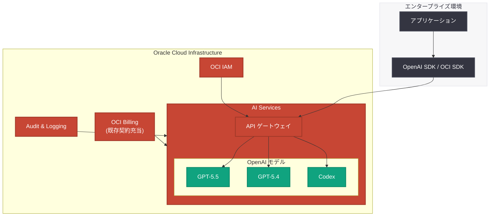

# OpenAI モデルと Codex が Oracle Cloud で利用可能に -- 既存クラウド契約を活用した AI 導入

## メタデータ

| 項目 | 内容 |
|------|------|
| 発表日 | 2026-06-10 |
| ソース | OpenAI News |
| カテゴリ | パートナーシップ |
| 公式リンク | [Access OpenAI models and Codex through your Oracle cloud commitment](https://openai.com/index/openai-on-oracle-cloud) |

## 概要

2026 年 6 月 10 日、OpenAI は Oracle Cloud Infrastructure (OCI) を通じて、OpenAI モデルおよび Codex が利用可能になったことを発表した。企業は既存の Oracle Cloud 契約 (コミットメント) を活用して OpenAI の AI モデルにアクセスでき、追加の契約手続きなしに AI 導入を加速できる。

本発表は、OpenAI のマルチクラウド戦略における重要なマイルストーンである。2026 年 6 月 1 日の Amazon Bedrock 対応に続き、Oracle Cloud への展開によって、エンタープライズ顧客がより柔軟にクラウドプロバイダーを選択しながら OpenAI の最先端 AI モデルを利用できる環境が整った。

> **注記:** 本記事の詳細ページは Cloudflare の保護により全文を取得できなかったため、公開されたタイトル、URL、および関連情報に基づいて構成している。

## 主な内容

### OpenAI と Oracle のパートナーシップ

OpenAI と Oracle の提携により、Oracle Cloud Infrastructure 上で OpenAI のフロンティアモデルと Codex が直接利用可能となった。これにより、Oracle Cloud を主要インフラとして利用している企業は、既存のクラウド契約の枠内で OpenAI のモデルを導入できる。

主なパートナーシップの特徴は以下の通りである。

- **既存契約の活用:** Oracle Cloud の既存コミットメント (年間契約額) を OpenAI モデルの利用に充当可能
- **統合課金:** Oracle Cloud の請求体系に OpenAI モデル利用料が統合される
- **エンタープライズグレードのサポート:** Oracle のエンタープライズサポート体制と組み合わせた AI 導入支援

### 利用可能なモデル

Oracle Cloud を通じて提供される主要モデルには以下が含まれると考えられる。

| モデル | 説明 |
|--------|------|
| GPT-5.5 | OpenAI 最新フラッグシップモデル。高度な推論能力と広範なコンテキストウィンドウ |
| GPT-5.4 | 高性能推論モデル。コスト効率と性能のバランスに優れる |
| Codex | ソフトウェア開発支援に特化した AI エージェント。コード生成、レビュー、デバッグに対応 |

### セキュリティとガバナンス

エンタープライズ利用において最重要視されるセキュリティとガバナンスの観点で、Oracle Cloud 統合は以下の機能を提供する。

- **Oracle Cloud のセキュリティフレームワーク:** OCI のネイティブセキュリティ機能 (IAM、ネットワーク分離、暗号化) との統合
- **データレジデンシー:** Oracle Cloud のリージョン内でデータ処理が完結し、データ主権要件を満たす
- **コンプライアンス:** Oracle Cloud の各種コンプライアンス認証 (SOC 2、ISO 27001、HIPAA 等) の活用
- **アクセス制御:** Oracle Cloud のポリシーベースのアクセス管理による細粒度のモデル利用権限設定
- **監査ログ:** AI モデルの利用状況を Oracle Cloud の監査機能で一元管理

## 技術的な詳細

### Oracle Cloud Infrastructure との統合アーキテクチャ

Oracle Cloud を通じた OpenAI モデルへのアクセスは、OCI のマネージドサービスとして提供される。既存の Amazon Bedrock 統合と同様に、OpenAI SDK の互換クライアントを通じてアクセスする方式が想定される。



### 想定される利用方法

既存の OpenAI SDK をベースとした統合が想定される。Amazon Bedrock 統合の前例に基づくと、以下のようなクライアント初期化パターンが考えられる。

```python
# Oracle Cloud 経由での OpenAI モデル利用 (想定)
from openai import OracleCloudOpenAI

client = OracleCloudOpenAI(
    oci_region="us-ashburn-1",
    # OCI 認証情報は環境変数または OCI Config から自動取得
)

response = client.responses.create(
    model="openai.gpt-5.5",
    input="Analyze the quarterly financial report and summarize key trends.",
)

print(response.output_text)
```

### マルチクラウド対応状況

OpenAI モデルのクラウドプラットフォーム対応状況をまとめると以下の通りである。

| クラウドプロバイダー | 対応開始日 | 主な統合方式 |
|---------------------|-----------|-------------|
| Microsoft Azure | 2023 年〜 | Azure OpenAI Service |
| Amazon Web Services | 2026-06-01 | Amazon Bedrock |
| Oracle Cloud | 2026-06-10 | OCI AI Services |

## 開発者への影響

### 既存 Oracle Cloud ユーザーへのメリット

Oracle Cloud を主要インフラとして利用している開発者およびエンタープライズチームにとって、本統合は以下の利点をもたらす。

- **即座に利用開始可能:** 新規契約不要で、既存の OCI アカウントから OpenAI モデルにアクセス可能
- **予算の柔軟な運用:** 既存の Oracle Cloud コミットメント (未使用枠) を AI モデル利用に振り替えることで、追加予算確保の手間を削減
- **統一的なガバナンス:** 既存の OCI セキュリティポリシー、監査ログ、コンプライアンスフレームワークの中で AI を運用可能
- **調達プロセスの簡素化:** 新規ベンダー登録や調達承認プロセスが不要

### エンタープライズ AI 導入の加速

多くの大企業は複数年のクラウド契約をクラウドプロバイダーと締結している。これまで OpenAI モデルを利用するには別途 OpenAI との直接契約が必要であったが、Oracle Cloud 統合により、既存の IT 予算枠内で AI 導入を進められるようになる。

これは特に以下のような組織にとって重要である。

- **金融機関:** Oracle Database を中核システムとして利用し、厳格なベンダー管理を求める組織
- **政府・公共機関:** 調達プロセスが複雑で、既存契約の枠組み内での調達を優先する機関
- **製造業:** Oracle ERP/SCM を利用し、OCI 上でデータ分析基盤を構築している企業

### マルチクラウド戦略の選択肢拡大

開発者は、ワークロードの特性や組織のクラウド戦略に応じて、最適なプラットフォーム経由で OpenAI モデルにアクセスできるようになった。

| 利用シナリオ | 推奨プラットフォーム |
|-------------|-------------------|
| Azure エコシステムとの統合 | Azure OpenAI Service |
| AWS ワークロードとの統合 | Amazon Bedrock |
| Oracle DB/ERP との統合 | Oracle Cloud |
| 最新機能の即時利用 | OpenAI 直接 API |

## 関連リンク

- [Access OpenAI models and Codex through your Oracle cloud commitment (公式)](https://openai.com/index/openai-on-oracle-cloud)
- [OpenAI フロンティアモデルと Codex が AWS で利用可能に](https://openai.com/index/openai-frontier-models-and-codex-are-now-available-on-aws/)
- [Amazon Bedrock 統合ガイド](https://developers.openai.com/api/docs/guides/amazon-bedrock)
- [Oracle Cloud Infrastructure 公式](https://www.oracle.com/cloud/)
- [OpenAI API ドキュメント](https://platform.openai.com/docs)

### 関連レポート

- [OpenAI モデルと Codex が Amazon Bedrock で利用可能に](2026-06-01-openai-models-amazon-bedrock.md) -- AWS Bedrock 統合
- [OpenAI GPT-5.5 と Codex が Databricks 上で利用可能に](2026-05-01-gpt-5-5-codex-on-databricks.md) -- Databricks プラットフォーム統合
- [OpenAI モデル、Codex、Managed Agents が AWS で利用可能に](2026-04-28-openai-models-codex-managed-agents-aws.md) -- AWS マネージドエージェント

## まとめ

OpenAI モデルと Codex の Oracle Cloud 対応は、OpenAI のマルチクラウド戦略における新たな拡張である。Azure、AWS に続き Oracle Cloud が加わったことで、主要 3 大クラウドプラットフォーム全てで OpenAI のフロンティアモデルが利用可能な環境が整った。

特に注目すべきは「既存クラウド契約の活用」というアプローチである。企業が AI 導入に際して直面する最大の障壁の一つは予算確保と調達プロセスであるが、既存の Oracle Cloud コミットメントを充当できることで、この障壁が大幅に低減される。

エンタープライズ AI の普及において、技術的な課題だけでなく組織的・商務的な障壁を取り除くこのアプローチは、OpenAI がエンタープライズ市場での浸透を本格的に加速させていることを示している。Oracle Cloud のエンタープライズ顧客基盤 (金融、政府、製造業など) へのリーチにより、OpenAI モデルの利用層がさらに拡大することが期待される。
