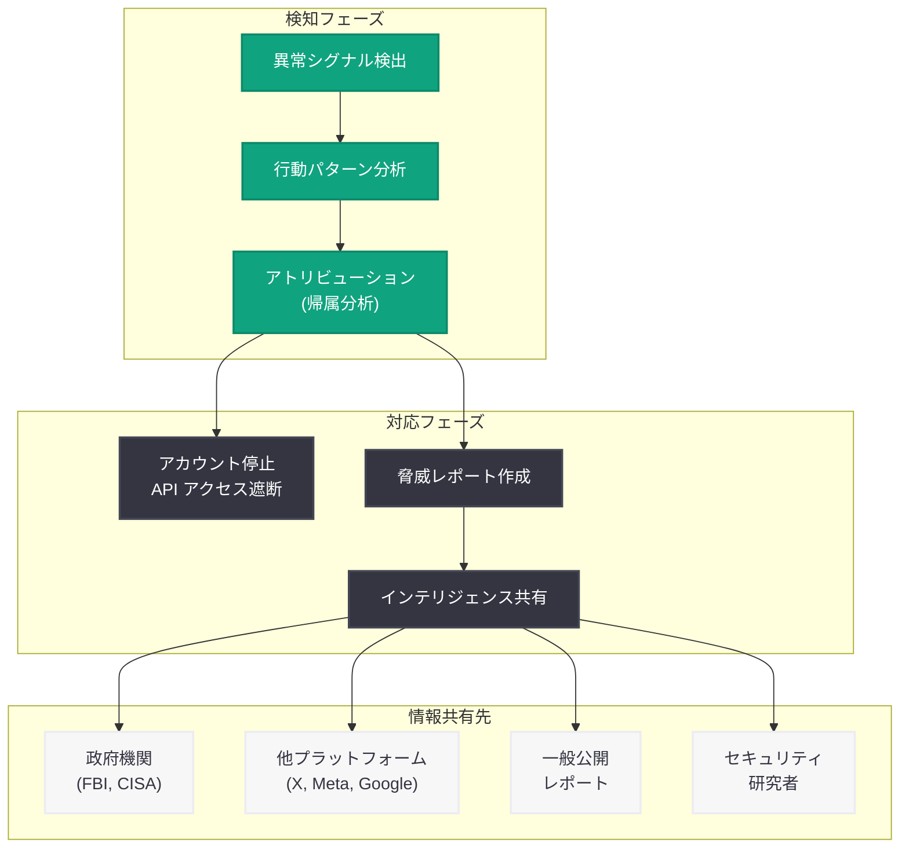

# 中国 (PRC) に関連する影響工作が米国の AI 政策議論を標的に

## メタデータ

| 項目 | 内容 |
|------|------|
| 発表日 | 2026-06-10 |
| ソース | OpenAI News |
| カテゴリ | セキュリティ・安全性 |
| 公式リンク | [PRC-linked influence operations are targeting AI debates in the US](https://openai.com/index/prc-linked-influence-operations-ai-debates) |

> **注記:** 本レポートは、OpenAI 公式ブログの公開メタデータおよび関連する公開情報に基づいて作成している。元記事の全文は Cloudflare によるアクセス保護のため取得できなかったため、記事タイトル、OpenAI の過去の脅威インテリジェンスレポート、および関連する公開情報をもとに内容を構成している。正確な詳細については公式ページを参照されたい。

## 概要

OpenAI は 2026 年 6 月 10 日、中華人民共和国 (PRC) に関連する影響工作 (influence operations) が米国内の AI 政策議論を標的にしているとする脅威インテリジェンスレポートを公開した。本レポートは、AI を活用した情報操作キャンペーンが米国のテクノロジー政策、特にデータセンター建設、貿易関税、AI 規制に関する世論を操作しようとする組織的な活動を特定・分析したものである。

OpenAI はこれまでにも、イラン、ロシア、中国などの国家関連アクターによる影響工作を検知・報告する脅威インテリジェンスレポートを複数公開してきた。本レポートはその最新版であり、AI 技術そのものが地政学的競争の焦点となる中で、AI に関する民主的な議論を外国の影響工作から保護することの重要性を提起している。

## 主な内容

### 影響工作の概要と目的

本レポートで特定された PRC 関連の影響工作は、米国内の AI 政策議論に介入し、中国にとって有利な方向に世論を誘導することを目的としている。具体的には以下の戦略目標が推定される。

- **米国の AI 開発投資への反対世論の醸成:** データセンター建設に対する地域住民の反対感情を煽り、米国の AI インフラ拡張を遅延させる
- **AI 規制の厳格化推進:** 米国における過度な AI 規制を促すことで、中国との技術競争における米国の競争力を低下させる
- **貿易政策への影響:** AI 関連の半導体輸出規制や関税政策に対する世論を操作し、規制緩和の方向へ誘導する
- **米国内の分断の深化:** AI の安全性、雇用への影響、エネルギー消費などに関する既存の対立を増幅させる

### 標的となっている 3 つの政策領域

#### 1. データセンター建設に関するナラティブ

PRC 関連の影響工作は、米国各地で計画・建設中のデータセンターに対する反対運動を増幅させている。

**操作されたナラティブの例:**

- データセンターの電力消費が地域の電力供給を脅かすという過度な懸念の拡散
- 冷却水の使用による水資源枯渇の誇張
- 地域社会への経済的メリットの過小評価
- 環境への悪影響に関する誤情報の流布

これらのナラティブは、米国の AI インフラ整備 (Stargate プロジェクトなど大規模データセンター計画) を遅延させることで、中国が AI 計算基盤の面で相対的優位を確保する戦略と合致する。

#### 2. 貿易・関税政策

AI チップの輸出規制や半導体関連の関税政策に関して、以下のような影響工作が行われていると考えられる。

- 半導体輸出規制が米国企業に与える経済的損失を強調するコンテンツの拡散
- 規制が「冷戦的思考」であるとする論調の組織的展開
- 関税政策が消費者物価に与える影響を誇張するキャンペーン
- 「技術的デカップリングは不可能」というナラティブの推進

#### 3. AI 政策・規制

AI の安全性と規制に関する米国内の議論において、以下のような操作が行われている可能性がある。

- オープンソース AI の無制限な規制緩和を主張するコンテンツの拡散
- 米国の AI 安全性研究を「イノベーションの阻害」として攻撃するナラティブ
- AI の軍事利用に関する過度な懸念を煽り、米国の防衛的 AI 開発を遅延させる論調
- 競争力維持のために安全性基準を緩和すべきだという偽のコンセンサスの構築

### 使用された手法

PRC 関連の影響工作で使用されたとされる主要な手法は以下の通りである。

#### AI 生成コンテンツの活用

- **大規模言語モデルによるテキスト生成:** 記事、コメント、ソーシャルメディア投稿を AI で大量生成し、有機的な世論のように見せかける
- **翻訳・ローカライズ:** 中国語で作成された原文を自然な英語に翻訳し、米国人による発言のように偽装する
- **多様なペルソナの作成:** 異なる政治的立場、地域、専門性を持つ架空のオンラインアイデンティティを AI で生成する
- **画像・動画の生成:** AI を使用して説得力のある視覚コンテンツを作成し、拡散力を高める

#### ソーシャルメディアの組織的操作

- **ボットネットワークの運用:** 大量の偽アカウントを使用して特定のメッセージを増幅する
- **エンゲージメント操作:** いいね、リツイート、コメントを人為的に増加させ、コンテンツのリーチを拡大する
- **プラットフォーム横断の調整:** 複数のソーシャルメディアプラットフォームで同時に活動を展開し、有機的なバズのように見せかける
- **コミュニティへの浸透:** 既存のオンラインコミュニティに偽アカウントで参加し、内部から議論を誘導する

#### その他の戦術

- **ニュースサイトの偽装:** 正規のニュースメディアを模倣したウェブサイトを作成し、信頼性のある情報源を装う
- **インフルエンサーの利用:** 知らず知らずのうちに工作のナラティブを拡散するインフルエンサーを特定し、彼らのコンテンツを増幅する
- **シードコンテンツ戦略:** 小規模なプラットフォームでコンテンツを「種まき」し、大手プラットフォームに波及させる
- **タイミングの悪用:** 米国の政策決定の節目 (議会公聴会、規制案のパブリックコメント期間など) に合わせてキャンペーンを強化する

## 技術的な詳細

### OpenAI の検知・対応メカニズム

OpenAI は自社のプラットフォーム上で影響工作を検知・阻止するための多層的なシステムを運用している。

**検知手法:**

| 検知レイヤー | 技術的手法 | 目的 |
|-------------|-----------|------|
| 行動分析 | アカウントの使用パターン、API コールの頻度・タイミングの異常検出 | 組織的活動の特定 |
| コンテンツ分析 | 生成テキストの言語的特徴、翻訳痕跡、テンプレートパターンの検出 | AI 生成コンテンツの識別 |
| ネットワーク分析 | アカウント間の関連性、IP アドレス、インフラの共有パターンの解析 | ネットワーク構造の解明 |
| クロスプラットフォーム追跡 | 複数プラットフォームにわたる同一キャンペーンの相関分析 | キャンペーン規模の把握 |

**対応フロー:**

### 影響工作における AI 悪用の技術的特徴

PRC 関連アクターが AI を悪用する際の技術的パターンとして、以下が挙げられる。

- **プロンプトエンジニアリングの高度化:** 特定の政治的メッセージを自然なトーンで生成するための巧妙なプロンプト設計
- **出力の多様化:** 同一のメッセージを異なる文体、語彙、構造で再生成し、同一ソースからの出力であることを隠蔽
- **メタデータの操作:** 生成コンテンツのタイムスタンプ、位置情報、デバイス情報を偽装して自然な投稿のように見せる
- **A/B テスト的アプローチ:** 複数のナラティブバリエーションを同時に展開し、エンゲージメントの高いものを増幅する手法

### 過去の脅威レポートとの関連

OpenAI は過去に以下の影響工作を検知・報告しており、本レポートはこの系譜上に位置づけられる。

- **2024 年:** イラン関連の影響工作 (IRGC 系) の検知と公開
- **2024 年:** ロシア関連の影響工作 (選挙介入) の検知と公開
- **2025 年:** 中国関連の Spamouflage ネットワークの検知
- **2026 年:** 本レポート (PRC 関連、AI 政策議論の標的)

## 開発者への影響

### AI プラットフォーム運営者への示唆

- **利用規約の強化:** AI サービスの利用規約において、影響工作目的の利用を明確に禁止し、違反時のアカウント停止・法的措置の根拠を整備する必要がある
- **異常検知システムの実装:** API 利用パターンの監視において、組織的なコンテンツ生成を示唆する異常パターン (同一トピックへの集中的リクエスト、不自然な時間帯の大量リクエストなど) を検知するシステムの実装が推奨される
- **KYC (Know Your Customer) の強化:** 特に大規模な API 利用者に対する身元確認プロセスの厳格化

### コンテンツモデレーション開発者への影響

- **AI 生成コンテンツの検出精度向上:** 影響工作で使用される AI 生成テキストを高精度で検出するためのモデル開発が急務となる
- **多言語対応:** 中国語から英語への翻訳を介した影響工作を検出するための、クロスリンガル分析能力の構築
- **コーディネート行動の検出:** 個別コンテンツの真偽だけでなく、複数アカウントにまたがる組織的な行動パターンを検出するシステムの開発

### AI 安全性研究への貢献

- **レッドチーミングの拡張:** AI モデルの安全性評価において、影響工作シナリオをテストケースに組み込むことの重要性が再確認される
- **出所証明 (Provenance) 技術:** AI 生成コンテンツの出所を追跡可能にする技術 (C2PA、コンテンツ認証イニシアチブなど) の開発・普及が加速する可能性がある
- **耐性評価:** AI モデルが影響工作に悪用されることへの耐性を評価するフレームワークの整備

### 政策・コンプライアンスへの影響

本レポートの公開は、AI 開発企業に対する以下の規制・政策的要請を強化する可能性がある。

- **透明性報告の義務化:** AI プラットフォームにおける影響工作の検知・対応に関する定期報告の義務化
- **政府機関との情報共有:** CISA (Cybersecurity and Infrastructure Security Agency) や FBI との脅威インテリジェンス共有の制度化
- **選挙期間中の特別措置:** 選挙期間中の AI サービスの利用監視強化と追加的な安全措置の実装
- **国際的な規範形成:** AI を使用した影響工作に対する国際的な行動規範の策定

## 関連リンク

- [PRC-linked influence operations are targeting AI debates in the US (公式)](https://openai.com/index/prc-linked-influence-operations-ai-debates)
- [OpenAI Safety](https://openai.com/safety)
- [OpenAI - Disrupting deceptive uses of AI (2024 年の影響工作レポート)](https://openai.com/index/disrupting-deceptive-uses-of-ai-by-covert-influence-operations)
- [CISA - Foreign Influence Operations](https://www.cisa.gov/topics/election-security/foreign-influence-operations-and-disinformation)
- [Stanford Internet Observatory - Influence Operations](https://cyber.fsi.stanford.edu/io)
- [OpenAI Usage Policies](https://openai.com/policies/usage-policies)
- [Cybersecurity in the Intelligence Age](https://openai.com/index/cybersecurity-in-the-intelligence-age)

## まとめ

OpenAI が公開した本脅威インテリジェンスレポートは、中華人民共和国に関連する影響工作が、米国内の AI 政策議論という極めて戦略的な領域を標的にしていることを明らかにした。データセンター建設への反対世論の煽動、貿易・関税政策への介入、AI 規制を巡る議論の操作という 3 つの領域において、AI 生成コンテンツやソーシャルメディアの組織的操作を活用した情報操作が確認されている。

本レポートの意義は、AI が地政学的競争のツールであると同時に、その競争の対象でもあるという二重の構造を浮き彫りにした点にある。AI 技術そのものの発展方向を巡る民主的な議論が外国の影響工作によって歪められるリスクは、AI の安全性に関する新たな脅威カテゴリとして認識されるべきである。

OpenAI がこのような脅威インテリジェンスレポートを継続的に公開していることは、AI 企業が技術開発だけでなく、自社技術の悪用に対する監視・対応を社会的責任として引き受けていることを示している。AI 開発者、政策立案者、一般市民は、AI に関する議論に参加する際に、情報の出所と信頼性を批判的に評価するリテラシーがこれまで以上に重要になっている。
