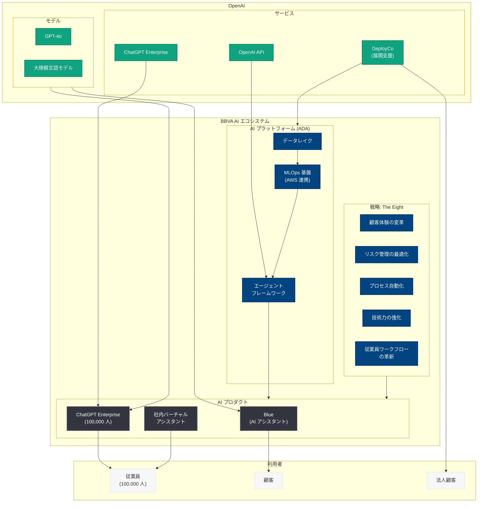

# BBVA が OpenAI と連携し AI を銀行業務の中核に据える

## メタデータ

| 項目 | 内容 |
|------|------|
| 発表日 | 2026-06-11 |
| ソース | OpenAI News |
| カテゴリ | ケーススタディ / エンタープライズ AI |
| 公式リンク | [BBVA puts AI at the core of banking with OpenAI](https://openai.com/index/bbva) |

> **注:** 本レポートは OpenAI 公式ブログの RSS フィード情報、BBVA 公式サイトの公開情報、および関連する業界情報に基づいて作成している。記事本文へのアクセスは Cloudflare の保護により制限されたため、公開されている情報と業界文脈に基づく内容となっている。正確な詳細については公式ページを参照されたい。

## 概要

2026 年 6 月 11 日、OpenAI は公式ブログにおいて、スペインの大手多国籍銀行 BBVA (Banco Bilbao Vizcaya Argentaria) が ChatGPT Enterprise を 100,000 人の従業員に展開し、OpenAI とのパートナーシップを通じて AI を活用した銀行業務の変革をグローバルに加速させている事例を公開した。

BBVA は 2025 年末に OpenAI との戦略的パートナーシップを締結し、金融業界初となる大規模な AI 導入プログラムを推進してきた。本記事はその成果を示すケーススタディであり、120,000 人の全従業員のうち 100,000 人が実際に ChatGPT Enterprise を活用している現状を報告している。この導入規模は、金融機関における生成 AI 展開の中で世界最大級のものである。

## 主な内容

### BBVA について -- グローバルに展開する金融グループ

BBVA はスペインに本拠を置く世界有数の金融グループであり、ヨーロッパ、中南米、トルコなど多数の国と地域で事業を展開している。

| 項目 | 内容 |
|------|------|
| 正式名称 | Banco Bilbao Vizcaya Argentaria, S.A. |
| 本社 | スペイン・ビルバオ |
| 従業員数 | 約 120,000 人 |
| 展開地域 | スペイン、メキシコ、トルコ、南米、ドイツ、イタリア等 |
| 特徴 | デジタルバンキングのリーダー企業 |

BBVA はデジタル変革に早期から取り組んできた金融機関として知られており、AI 活用においても業界の最前線に位置している。

### OpenAI との戦略的パートナーシップの経緯

BBVA と OpenAI の協業は段階的に深化してきた。

| 時期 | 出来事 |
|------|--------|
| 2025 年末 | OpenAI との戦略的パートナーシップ締結 (金融業界初) |
| 2026 年 5 月 | The Banker 誌「Best Bank-Fintech Partnership」受賞 |
| 2026 年 5 月 | OpenAI Deployment Company (DeployCo) の創設パートナーに参画 |
| 2026 年 5 月 | AI Transformation 部門を新設 (Antonio Bravo が統括) |
| 2026 年 6 月 | ChatGPT Enterprise の 100,000 人展開を達成 |

この協業は単なるツール導入ではなく、「deep co-creation (深い共創)」として位置づけられており、OpenAI のエンジニアと BBVA のチームが共同で AI ソリューションを開発するという、前例のない形態をとっている。

### ChatGPT Enterprise の大規模展開

BBVA は全 120,000 人の従業員のうち 100,000 人に ChatGPT Enterprise を展開し、組織全体の業務効率化を実現している。

#### 導入規模と利用状況

| 指標 | 数値 |
|------|------|
| ChatGPT Enterprise 利用者数 | 100,000 人 |
| 月次利用率 | 従業員の 70% が月次で AI ツールを利用 |
| 週次利用率 | 半数以上が週次で利用 |
| 平均利用頻度 | 月 12 日 (ChatGPT) |
| 時間節約効果 | 従業員 1 人あたり週 2-3 時間 |
| 特定された活用事例 | 8,000 件以上 |
| 戦略的重要事例 | 約 700 件 |

#### 主要な活用領域

- **データ分析:** 金融データの解析・可視化の効率化
- **マーケティング:** コンテンツ作成、キャンペーン企画の支援
- **テクノロジー開発:** コード生成、レビュー、ドキュメント作成
- **ドキュメント管理:** 膨大な文書の要約・整理・検索

### AI アシスタント「Blue」の展開

BBVA は OpenAI の言語モデルを統合した独自の AI アシスタント「Blue」を新アプリに搭載している。

- 150 以上のオペレーション機能を自然言語で操作可能
- Bizum 決済などのトランザクション実行に対応
- 顧客向けサービスとして ChatGPT 内に BBVA の対話型アプリを統合 (ドイツ・イタリア)

### 定量的な成果

BBVA の AI 導入は具体的なビジネス成果をもたらしている。

| 領域 | 改善内容 | 効果 |
|------|---------|------|
| メキシコでの顧客クレーム処理 | 解決時間の短縮 | 30% 削減 |
| 新決済プラットフォーム開発 | 開発時間の短縮 | 50% 削減 |
| 反復作業の自動化 | 従業員の時間節約 | 週約 3 時間/人 |
| Talent & Culture 部門 | バーチャルアシスタント | 月 34,000 件以上の問い合わせ処理 |

### AI 人材育成と組織変革

BBVA は技術導入と並行して大規模な人材育成プログラムを実施している。

- **AI トレーニング時間:** 2025 年に 280,000 時間以上を達成
- **トレーニング参加者:** 105,000 人以上
- **内部推進者ネットワーク (Wizards):** 約 750 人のカタリストが各部門での AI 活用を推進
- **実践コミュニティ:** 90,000 人以上が参加
- **グローバルイベント:** ブートキャンプ、ミートアップ、メンタリング等 20 回以上開催

### OpenAI Deployment Company (DeployCo) への参画

2026 年 5 月、BBVA は OpenAI が設立した Deployment Company の創設パートナー兼株主として参画した。総投資額は 40 億ドル以上であり、TPG、Advent、Bain Capital、Brookfield などの大手投資ファームやコンサルティング企業と共に名を連ねている。

BBVA は DeployCo の能力を活用し、自社の法人顧客に対しても AI トランスフォーメーション支援を提供する計画である。

## 技術的な詳細

### エンタープライズ AI アーキテクチャ

BBVA の AI 戦略「The Eight」は、銀行業務の全領域にわたる AI 活用ロードマップである。同社は共通のコンポーネントと再利用可能なインフラを基盤とした「AI エージェントのエコシステム」を構築し、エージェント作成を数ヶ月から数週間に短縮することを目指している。

### エージェント型 AI の展開構想

BBVA は AI エージェントを「タスクの自動化、推論、意思決定、人間とのインタラクション、そしてエンドツーエンドのプロセスを自律的に実行するために互いに協力できるスマートシステム」と定義しており、OpenAI のモデルを基盤としたエージェント型アーキテクチャの構築を進めている。

## 開発者への影響

- **金融エンタープライズ AI の新基準:** 100,000 人規模の ChatGPT Enterprise 展開は、金融機関における生成 AI 導入の新たなベンチマークとなる。フィンテック開発者にとって、同様の大規模展開を支援するソリューション開発の市場機会が拡大する
- **エージェント型アーキテクチャの先行事例:** BBVA が構築する AI エージェントのエコシステムは、金融サービス向けのエージェント開発における設計パターンの参考となる
- **DeployCo を通じたエコシステム拡大:** OpenAI Deployment Company の設立により、大規模企業への AI 展開を支援する新たなパートナーエコシステムが形成されつつあり、システムインテグレーターや開発者にとって新たなビジネス機会が生まれる
- **多言語・多地域展開のモデルケース:** BBVA のグローバル展開 (スペイン語、英語、トルコ語、ドイツ語、イタリア語等) は、多言語環境における AI ソリューション構築の実践的な参考事例となる
- **金融規制対応と AI の両立:** 高度に規制された金融環境で AI を大規模展開するガバナンスフレームワークは、他の規制産業に携わる開発者にとっても重要な先行事例である

## 関連リンク

- [BBVA puts AI at the core of banking with OpenAI (公式)](https://openai.com/index/bbva)
- [BBVA 公式サイト](https://www.bbva.com/en/)
- [BBVA AI Transformation 戦略](https://www.bbva.com/en/innovation/bbva-accelerates-its-artificial-intelligence-strategy-with-a-global-area-ai-transformation/)
- [BBVA と DeployCo](https://www.bbva.com/en/innovation/bbva-joins-deployco-openais-new-company-to-accelerate-ai-enterprise-transformation/)
- [The Banker による BBVA-OpenAI パートナーシップ評価](https://www.bbva.com/en/innovation/the-banker-names-bbva-best-technology-bank-in-western-europe-and-best-bank-fintech-partnership-for-its-strategic-agreement-with-openai/)
- [BBVA の AI 人材育成](https://www.bbva.com/en/innovation/bbva-drives-ai-adoption-through-talent/)
- [OpenAI エンタープライズ](https://openai.com/enterprise)
- [OpenAI News](https://openai.com/news)

## まとめ

BBVA と OpenAI の協業事例は、金融業界における生成 AI 活用の最先端を示すものであり、以下の点で重要な意義を持つ。

1. **世界最大級の金融機関 AI 展開:** 100,000 人への ChatGPT Enterprise 展開は、金融業界における生成 AI 導入の規模として類を見ないものであり、大規模組織での AI 活用が実現可能であることを実証している
2. **深い共創モデルの確立:** 単なるツール導入ではなく、OpenAI との共同開発チームによる「深い共創」という新たな協業形態を確立し、金融機関とテクノロジー企業のパートナーシップの在り方を再定義している
3. **定量的な業務改善効果:** 従業員 1 人あたり週 2-3 時間の節約、クレーム処理時間の 30% 削減、開発時間の 50% 短縮など、具体的なビジネス成果を実証している
4. **組織全体の変革:** 技術導入と人材育成を並行して推進し、750 人の内部推進者ネットワークや 280,000 時間のトレーニングプログラムを通じて、組織文化そのものを変革している
5. **エコシステムへの貢献:** DeployCo への参画を通じて自社の知見を他企業にも展開する構想は、金融 AI エコシステム全体の発展に寄与するものである
