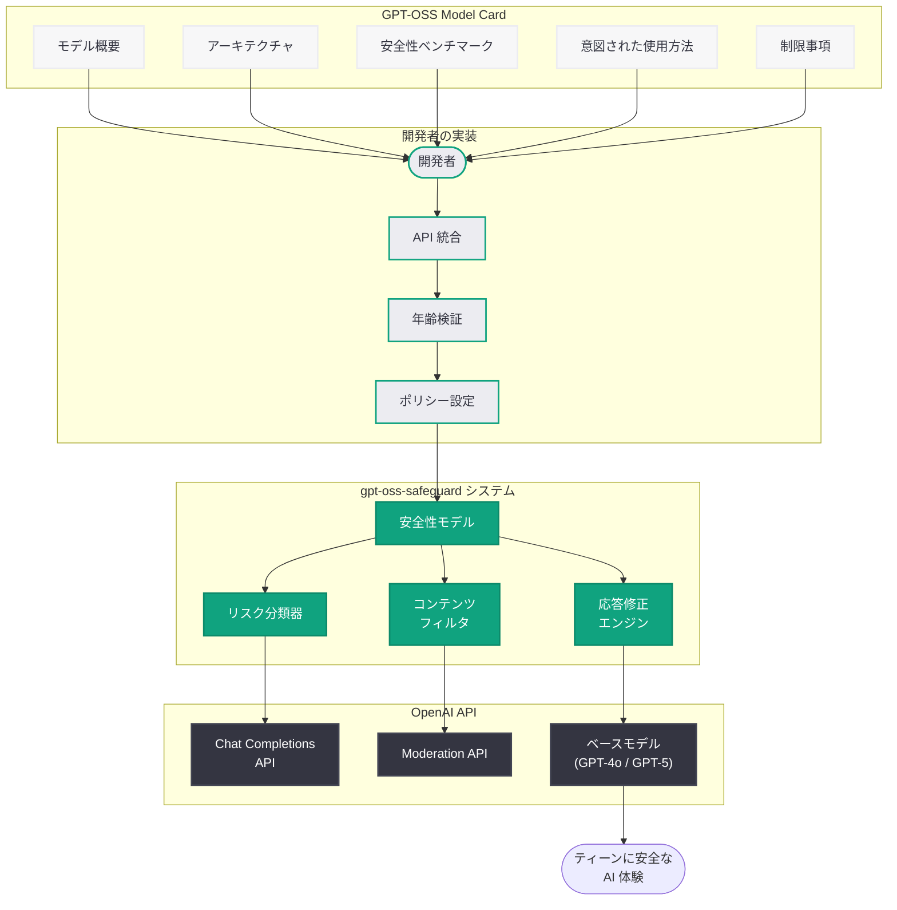

# GPT-OSS Model Card: オープンソース安全モデル gpt-oss-safeguard の公式モデルカード

## メタデータ

| 項目 | 内容 |
|------|------|
| 発表日 | 2026-06-11 |
| ソース | OpenAI Research / Release |
| カテゴリ | Publication / Release / Safety |
| 公式リンク | [openai.com](https://openai.com/index/gpt-oss-model-card/) |

> **注記:** 本レポートは、記事ページが Cloudflare により保護されており直接アクセスできなかったため、サイトマップのメタデータおよび関連する公開情報 (gpt-oss-safeguard の発表記事、既存のシステムカード公開パターン) に基づいて作成されている。正式な記事内容とは異なる可能性がある。

## 概要

OpenAI は 2026 年 6 月 11 日、オープンソースのティーン安全モデル「gpt-oss-safeguard」の公式モデルカードを公開した。モデルカードは、機械学習モデルの能力、制限、意図された使用方法、安全性評価を標準化された形式で文書化するものであり、開発者がモデルを正しく理解し適切に実装するための重要な参考資料となる。

gpt-oss-safeguard は 2026 年 3 月 24 日にプロンプトベースのティーン安全ポリシーとして初めて発表されたシステムであり、開発者が AI アプリケーションにおいて 10 代ユーザー向けの年齢固有のリスクモデレーションを実装するためのツールである。今回のモデルカード公開は、同システムの成熟と正式な文書化を示すものであり、同日付近に公開された「gpt-oss-safeguard Technical Report」と合わせて、開発者向けの包括的な技術文書が整備されたことになる。

## 主な内容

### モデルカードとは

モデルカードは、Google Research が 2019 年に提唱した機械学習モデルの文書化フレームワークであり、以下の情報を標準的な形式で提供する。

- **モデルの概要:** モデルの種類、アーキテクチャ、バージョン情報
- **意図された使用方法:** 推奨されるユースケースと対象ユーザー
- **適用範囲外の使用:** モデルが意図していない使用方法
- **性能指標:** ベンチマーク結果と評価メトリクス
- **訓練データ:** 使用されたデータセットの概要
- **倫理的考慮事項:** バイアス、公平性、安全性に関する評価
- **制限事項:** 既知の制約と失敗モード

### GPT-OSS Model Card の位置づけ

OpenAI は近年、主要モデルの公開時にシステムカードまたはモデルカードを発行する慣行を確立している。GPT-5 System Card、GPT-5.3 Instant System Card、GPT-5.4 Thinking System Card、GPT-5.5 System Card、ChatGPT Images 2.0 System Card など、一連のシステムカードが体系的に公開されてきた。

GPT-OSS Model Card は、これらの系譜に連なるものであるが、以下の点で特徴的である。

- **オープンソースモデルの文書化:** 従来のシステムカードは OpenAI のプロプライエタリなモデルを対象としていたが、GPT-OSS は初のオープンソースモデルに対するモデルカードである
- **安全性特化モデル:** 汎用モデルではなく、ティーン安全ポリシーの実装に特化した目的限定型モデルの文書化である
- **開発者向け実装ガイドとしての機能:** モデルカードが単なる透明性文書にとどまらず、開発者が gpt-oss-safeguard を正しく統合するための実践的なガイドとしても機能する

### 想定される記載内容

GPT-OSS Model Card には、以下のような情報が記載されていると推定される。

#### モデルアーキテクチャと設計

- gpt-oss-safeguard のモデルアーキテクチャの概要
- プロンプトベースの安全ポリシーとして動作する仕組み
- ベースモデルとの関係性 (ファインチューニング手法、知識蒸留等)

#### 安全性ベンチマーク

- ティーン向けリスクカテゴリ (性的コンテンツ、自傷行為、暴力、薬物等) に対する検出精度
- False positive / False negative の割合
- 多言語環境での性能評価
- 敵対的攻撃に対する耐性評価結果

#### 意図された使用方法

- OpenAI API を利用したティーン向けアプリケーションへの統合
- システムプロンプトへの組み込み方法
- 年齢検証メカニズムとの連携パターン

#### 制限事項と既知の課題

- 検出精度の限界 (特に文脈依存的なリスク判定)
- 言語・文化圏による性能差
- 新種のリスクパターンへの対応遅延
- プロンプトインジェクションによるバイパスの可能性

## 技術的な詳細

### gpt-oss-safeguard の技術的概要

gpt-oss-safeguard は、プロンプトベースのアプローチにより、以下のような安全性機能を提供するシステムである。

| 機能 | 説明 |
|------|------|
| リスク分類 | ティーンに有害なコンテンツカテゴリの自動分類 |
| コンテンツフィルタリング | 年齢に不適切なコンテンツの検出と遮断 |
| 応答修正 | リスクの程度に応じた応答の調整 |
| リダイレクト機能 | メンタルヘルス危機時の相談窓口への誘導 |
| 個人情報保護 | ティーンの個人情報共有を防止するガード |

### コードサンプル

```python
from openai import OpenAI

client = OpenAI()

# gpt-oss-safeguard モデルカードに基づく実装例
# ティーン向け安全ポリシーの適用
response = client.chat.completions.create(
    model="gpt-4o",
    messages=[
        {
            "role": "system",
            "content": (
                "You are an AI assistant serving a teen user (age 13-17). "
                "Apply gpt-oss-safeguard policies:\n"
                "- Block sexually explicit or gratuitously violent content\n"
                "- Do not provide self-harm or dangerous activity instructions\n"
                "- Redirect mental health crises to helplines\n"
                "- Prevent sharing of personal identifying information\n"
                "- Maintain age-appropriate language and topics"
            )
        },
        {"role": "user", "content": "Can you help me with my science project?"}
    ]
)
print(response.choices[0].message.content)
```

### 安全性評価メトリクスの想定

モデルカードには以下のようなベンチマーク結果が含まれていると考えられる。

```
リスクカテゴリ別検出率 (想定):
- 性的コンテンツ: 検出率 / False positive 率
- 自傷行為関連: 検出率 / False positive 率
- 暴力コンテンツ: 検出率 / False positive 率
- 薬物・アルコール: 検出率 / False positive 率
- 個人情報漏洩: 検出率 / False positive 率
```

## アーキテクチャ



## 開発者への影響

GPT-OSS Model Card の公開は、gpt-oss-safeguard を利用する開発者に以下のような影響を与える。

- **実装の明確化:** モデルカードにより、gpt-oss-safeguard の正確な能力と制限が明文化されるため、開発者は適切な期待値を持ってシステムを導入できる
- **安全性設計の透明性向上:** 安全性ベンチマークの公開により、開発者は自身のアプリケーションにおけるリスク許容度と gpt-oss-safeguard の性能を比較検討し、追加対策の要否を判断できる
- **コンプライアンス対応の基盤:** 各国の未成年者保護規制 (米国 COPPA、EU GDPR、日本の青少年インターネット環境整備法) への準拠を証明する際に、モデルカードを根拠文書として活用できる
- **オープンソースコミュニティへの貢献:** モデルカードがオープンに公開されることで、研究者やセキュリティ専門家による独立した評価と改善提案が促進される
- **多層防御の推奨:** モデルカードの制限事項セクションにより、gpt-oss-safeguard 単体に依存せず、アプリケーションレベルでの追加的な安全対策の必要性が明確化される
- **Technical Report との連携:** 同時期に公開された gpt-oss-safeguard Technical Report と合わせて参照することで、より深い技術的理解に基づいた実装が可能になる

## 関連リンク

- [GPT-OSS Model Card](https://openai.com/index/gpt-oss-model-card/)
- [Teen Safety Policies: gpt-oss-safeguard](https://openai.com/index/teen-safety-policies-gpt-oss-safeguard)
- [gpt-oss-safeguard Technical Report](https://openai.com/index/gpt-oss-safeguard-technical-report/)
- [Japan Teen Safety Blueprint](https://openai.com/index/japan-teen-safety-blueprint/)
- [OpenAI 公式ドキュメント](https://platform.openai.com/docs)
- [OpenAI API リファレンス](https://platform.openai.com/docs/api-reference)
- [OpenAI Safety](https://openai.com/safety)

## まとめ

GPT-OSS Model Card は、OpenAI のオープンソース安全モデル gpt-oss-safeguard に対する公式の文書化であり、モデルのアーキテクチャ、安全性ベンチマーク、意図された使用方法、制限事項を標準化された形式で開発者に提供するものである。2026 年 3 月の初回発表から約 3 か月を経て、Technical Report と合わせてモデルカードが公開されたことは、gpt-oss-safeguard が実験的段階から本格的な運用フェーズに移行したことを示している。

OpenAI がプロプライエタリモデルだけでなくオープンソースの安全モデルに対してもモデルカードを発行したことは、AI 安全性における透明性とアカウンタビリティへのコミットメントを強化するものである。開発者はこのモデルカードを活用することで、ティーン向け AI アプリケーションにおける安全性設計の品質を向上させ、規制対応の基盤を確立することが可能となる。
